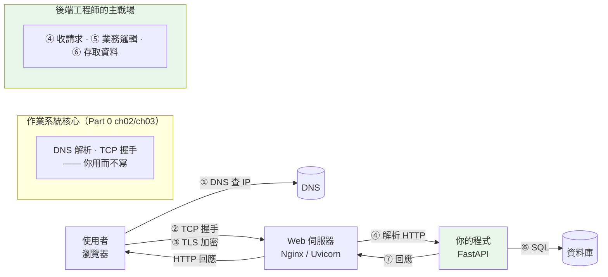

# 後端在做什麼:一個請求的完整旅程

> 你按下「送出」到看到結果的這 0.2 秒裡,一個請求穿過了 DNS、TCP、TLS、伺服器、資料庫再回來。看懂這條旅程,本書後面所有章節才有一張可以掛東西的地圖。

## 💡 白話導讀（建議先讀）

先問一個最樸素的問題:**你在瀏覽器按下「登入」,到畫面顯示「歡迎回來」,中間到底發生了什麼?**

多數教學會直接跳到「寫一個 API」,但那是**旅程的中段**。
如果你不知道請求是怎麼「送到」你的程式、回應又是怎麼「送回」使用者,
後面學連線池、優雅關閉、asyncio 時,就只能死背——因為你不知道它們在解決旅程上的哪一段。

所以我們先把整條路走一遍。用一個生活比喻:**寄一封限時掛號信**。

1. **你只知道收件人的名字(網域),不知道地址** → 先查通訊錄把名字換成地址(**DNS**)。
2. **建立一條可靠的通道** → 你和郵局先確認「我要寄、你準備收」的握手(**TCP 三次握手**)。
3. **信件內容要保密** → 裝進只有收件人拆得開的加密信封(**TLS**)。
4. **信送到對方的收發室** → 一台程式(**Web 伺服器**)在門口收信,拆開,交給對的部門。
5. **部門處理、可能要查檔案** → 你的程式跑業務邏輯,可能去**資料庫**撈資料。
6. **回信原路送回** → 沿著同一條通道把結果送回你眼前。

**這一整條路,就是「後端」的舞台。** 而「後端工程師」負責的,主要是第 4~6 段
(收信的伺服器、處理的程式、查的資料庫),但**你必須懂前三段**,
否則你會不知道為什麼「連線很貴所以要連線池」、為什麼「HTTPS 要憑證」、
為什麼「服務關閉前要先把在途的信送完」。

這一章把整條旅程講清楚,並用一段**可以實際執行**的程式,
讓你親眼看到「一個 HTTP 請求」骨子裡就是**一段純文字,透過 socket 送出去、再收回來**。

## Why（為什麼）

因為**沒有這張地圖,後面的知識會變成一堆漂浮的名詞**。

本書後面會反覆用到這些概念,但都預設你已經懂:

- [Part 15 連線池](../15-database/15-connection-pool.md) 說「建立連線很貴」——貴在哪?貴在旅程的第 2 段(TCP 握手)。
- [Part 19 優雅關閉](../19-cloud-native/07-graceful-shutdown.md) 說「收到 `SIGTERM` 要把在途請求做完」——「在途」是旅程的哪裡?
- [Part 9 asyncio](../09-concurrency/README.md) 說「等 I/O 時把 CPU 讓出來」——在「等」什麼?等旅程上某一段的回覆。
- [Part 14 Web](../14-web/README.md) 教你寫 API——但 API 只是旅程的第 4~5 段。

**先把整條旅程走一遍,這些「為什麼」才有地方掛。** 這一章的目標不是教你寫什麼,
而是給你一張**心智地圖**——之後每學一個新主題,你都能指著地圖說:「喔,它在解決這一段。」

## Theory（理論：一個請求經過的七站）

以「使用者在瀏覽器打開 `https://api.example.com/tasks`」為例,完整旅程如下:

```text
使用者(Client)                                            伺服器端
    │
    │ ① DNS 解析:api.example.com → 203.0.113.10
    │    （問「網域對應哪個 IP」，像查通訊錄）
    │
    │ ② TCP 三次握手:建立可靠的雙向通道
    │    SYN → SYN-ACK → ACK（我要連 / 好，我準備好了 / 確認）
    │
    │ ③ TLS 握手:協商加密、驗證伺服器身分（憑證）
    │    （之後的內容都被加密，中間人看不到）
    │
    │ ④ 送出 HTTP 請求 ────────────────────────────►  Web 伺服器（Nginx / Uvicorn）
    │    GET /tasks HTTP/1.1                              收下、可能做反向代理
    │    Host: api.example.com                                    │
    │                                                             ▼
    │                                                  ⑤ 應用程式（你的 FastAPI）
    │                                                     路由 → 驗證 → 業務邏輯
    │                                                             │
    │                                                             ▼
    │                                                  ⑥ 資料庫（PostgreSQL）
    │                                                     SELECT ... FROM tasks
    │                                                             │
    │ ⑦ HTTP 回應 ◄───────────────────────────────────────────────┘
    │    HTTP/1.1 200 OK                              沿原路（同一條 TCP 連線）送回
    │    [ { "id": 1, "title": ... } ]
    ▼
  畫面更新
```

**幾個關鍵觀念,現在先建立起來(後面各章會逐一深入)**:

- **①~③ 是「建立連線」的成本。** 一次 DNS + TCP + TLS 可能要數十到上百毫秒。
  這就是為什麼**連線要「重複使用」**(keep-alive、連線池)——不然每個請求都重來一遍太貴。
- **④ 的「HTTP 請求」本質是一段純文字。** 沒有魔法——就是 `方法 路徑 版本` 加一堆 header,
  透過 TCP 這條通道送過去。下面的程式會讓你親眼看到。
- **⑤ 才是「你寫的程式」。** 前面 Nginx/Uvicorn 是「收發室」,把原始的 HTTP 位元組
  解析成你在 FastAPI 裡拿到的 `request` 物件(這就是 [WSGI/ASGI](../14-web/01-wsgi-asgi.md) 的工作)。
- **⑥ 資料庫在另一台機器上。** 你的程式連資料庫,又是一次「旅程」(只是通常在內網、沒有 TLS)。
- **整條路是雙向、有狀態的一條 TCP 連線**,回應沿原路送回。

**後端工程師主要負責 ④~⑥**,但 ①~③ 決定了你的服務**快不快、安不安全、擴不擴得動**。

## Specification（規範：每一站是誰的責任）

把旅程對應到「實際的技術與角色」,你才知道遇到問題該找哪一層:

| 站 | 技術 / 協定 | 誰負責 | 本書對應 |
|----|------------|--------|----------|
| ① DNS 解析 | DNS(UDP 53) | 作業系統 / DNS 伺服器 | Part 0 ch03 |
| ② 建立連線 | TCP(三次握手) | 作業系統核心 | Part 0 ch02 |
| ③ 加密 | TLS(HTTPS) | TLS 函式庫 / 憑證 | Part 0 ch05 |
| ④ 收請求 | HTTP | Web 伺服器(Nginx / Uvicorn / Gunicorn) | Part 14、Part 19 |
| ⑤ 處理 | 你的程式 | **後端工程師(你)** | Part 14 Web |
| ⑥ 存取資料 | SQL / TCP | 資料庫 | Part 15 |
| ⑦ 回應 | HTTP | 原路返回 | Part 0 ch04 |

**分層的意義**:每一層只跟上下相鄰的層打交道。
你的 FastAPI 程式**不需要知道 TCP 握手怎麼做**——那是作業系統的事;
但你**需要知道它存在**,才懂「連線很貴」這件事。這正是本書「由底層往上」的理由:
先看清底下有什麼,上面的抽象才不神秘。

## Implementation（底層:一個 HTTP 請求就是 socket 上的一段位元組）

「HTTP 請求」聽起來很高階,但**它底下就是 socket API 的幾個呼叫**:

- `socket()` — 建立一個通訊端點(還沒連線)。
- `connect()` — 連到對方的 IP:Port(核心在此完成 **TCP 三次握手**)。
- `sendall()` — 把 HTTP 請求那段**純文字位元組**送出去。
- `recv()` — 收回對方送來的**回應位元組**。
- `close()` — 關閉連線。

平常你用 `requests.get(url)` 或 FastAPI,這些細節都被包起來了。
但**只要把包裝拆開,底下就是這幾個 socket 呼叫**——下面的程式會親手做一遍。

## Code Example（可執行的 Python 範例）

這支程式在本機起一個**最小 HTTP 伺服器**,再用**裸 socket** 當客戶端,
一步步走完 DNS → TCP → 送請求 → 收回應。**全程在 `localhost`,不需要外部網路。**

```python
# request_journey.py —— 用裸 socket 手動走一遍 HTTP 請求的旅程
from __future__ import annotations

import socket
import threading


def tiny_server(host: str, port: int, ready: threading.Event) -> None:
    """最小 HTTP 伺服器:accept 一個連線、讀請求、回一段固定回應。"""
    srv = socket.socket(socket.AF_INET, socket.SOCK_STREAM)
    srv.setsockopt(socket.SOL_SOCKET, socket.SO_REUSEADDR, 1)  # 方便重跑,避免 port 被佔
    srv.bind((host, port))
    srv.listen(1)
    ready.set()                              # 通知客戶端:伺服器準備好了
    conn, _addr = srv.accept()               # 阻塞,直到有人連進來
    with conn:
        _ = conn.recv(4096)                  # 讀取請求(此處不解析)
        body = "Hello from backend!"
        response = (
            "HTTP/1.1 200 OK\r\n"
            "Content-Type: text/plain; charset=utf-8\r\n"
            f"Content-Length: {len(body.encode())}\r\n"
            "\r\n"                            # 空行 = header 結束、body 開始
            f"{body}"
        )
        conn.sendall(response.encode())
    srv.close()


def client_journey(host: str, port: int) -> None:
    """客戶端:一步步走完一個請求,把每一層印出來。"""
    print("① DNS 解析:把主機名變成 IP")
    ip = socket.gethostbyname(host)          # localhost → 127.0.0.1
    print(f"   {host} → {ip}")

    print("\n② 建立 TCP 連線(socket → connect,背後是三次握手)")
    sock = socket.socket(socket.AF_INET, socket.SOCK_STREAM)
    sock.connect((ip, port))                 # 核心在此完成三次握手
    local = sock.getsockname()
    print(f"   已連線:本機 {local[0]}:{local[1]} → 伺服器 {ip}:{port}")

    print("\n③ 送出 HTTP 請求(就是一段純文字 bytes)")
    request = f"GET / HTTP/1.1\r\nHost: {host}\r\nConnection: close\r\n\r\n"
    sock.sendall(request.encode())
    for line in request.rstrip().splitlines():
        print(f"   > {line}")

    print("\n④ 收回 HTTP 回應")
    raw = b""
    while chunk := sock.recv(4096):          # 一直收到對方關閉連線為止
        raw += chunk
    sock.close()

    head, _, body = raw.partition(b"\r\n\r\n")   # 用空行切開 header 與 body
    status_line = head.split(b"\r\n")[0].decode()
    print(f"   < {status_line}")
    print(f"   < (body) {body.decode()}")

    print("\n⑤ 連線關閉。這就是「按下按鈕」到「看到回應」的骨架。")


def main() -> None:
    host, port = "localhost", 8123
    ready = threading.Event()
    server = threading.Thread(target=tiny_server, args=(host, port, ready), daemon=True)
    server.start()
    ready.wait(timeout=2)                    # 等伺服器起來再連
    client_journey(host, port)
    server.join(timeout=2)


if __name__ == "__main__":
    main()
```

**預期輸出**（本機的 port 號會不同）：

```pycon
$ python request_journey.py
① DNS 解析:把主機名變成 IP
   localhost → 127.0.0.1

② 建立 TCP 連線(socket → connect,背後是三次握手)
   已連線:本機 127.0.0.1:54427 → 伺服器 127.0.0.1:8123

③ 送出 HTTP 請求(就是一段純文字 bytes)
   > GET / HTTP/1.1
   > Host: localhost
   > Connection: close

④ 收回 HTTP 回應
   < HTTP/1.1 200 OK
   < (body) Hello from backend!

⑤ 連線關閉。這就是「按下按鈕」到「看到回應」的骨架。
```

**這段輸出戳破了三個「以為很高階」的東西**:

- **「HTTP 請求」就是一段文字**:`GET / HTTP/1.1\r\nHost: ...\r\n\r\n`——
  沒有魔法,你可以手打。`requests`、瀏覽器、FastAPI 底下送的都是這個。
- **「連線」是雙方各有一個 IP:Port 的通道**:客戶端本機拿到一個隨機 port(54427),
  連到伺服器的固定 port(8123)。這一對 `(本機IP:port, 對方IP:port)` 就唯一標識一條連線。
- **`\r\n\r\n` 那個空行是分界**:它把「header」和「body」切開——
  這是 HTTP 報文的基本結構([ch04](README.md) 會細講)。

你剛剛做的,正是 Uvicorn 幫你做的事:**在 socket 上收發位元組**。
差別只在它把位元組**解析成 FastAPI 的 `request` 物件**,再把你的回傳值**組回位元組**。

## Diagram（圖解:旅程與各站責任）



## Best Practice（最佳實踐）

- **心裡永遠有這張地圖。** 遇到效能問題,先問「慢在哪一站」——是 DNS?TLS 握手?
  應用邏輯?還是資料庫?**不同站的優化手段完全不同**(對照 [Part 18 先量測](../18-performance/01-profiling.md))。
- **連線是昂貴資源,要重複使用。** ①~③ 每次都做很貴,所以 HTTP 有 keep-alive、
  資料庫有[連線池](../15-database/15-connection-pool.md)、HTTP 客戶端要重用 session。
- **分層思考,別跨層。** 你的業務程式不該關心 TCP 細節;但**要知道它存在**,
  才懂上層抽象的成本與限制。
- **「你的程式」只是旅程的一小段。** 很多線上問題其實出在你程式**之外**
  (DNS、憑證過期、反向代理設定、資料庫連線數用盡)——排查時把整條旅程都納入視野。

## Common Mistakes（常見誤解）

- **「HTTP 是一種很複雜的東西」。** 不是。HTTP 報文就是**純文字**(HTTP/1.1),
  你剛剛用 `sendall` 手打了一個。複雜的是**上面蓋的東西**(框架、中介層),不是協定本身。
- **「後端就是寫 API」。** API 只是旅程的第 4~5 段。
  資深後端的差距,恰恰在**框架之外**——網路、資料庫、部署、可靠性(這也是本書後半的重點)。
- **「連線建立不用錢」。** 每次 DNS + TCP + TLS 可能上百毫秒。
  忽略這件事,你會寫出「每個請求都新建連線」的慢程式。
- **「localhost 和 127.0.0.1 是不同的東西」。** `localhost` 是**名字**,
  要先經過 DNS(或 hosts 檔)解析成 IP `127.0.0.1` 才能連——你在輸出的第 ① 步看到了這個轉換。

## Interview Notes（面試重點）

- **「在瀏覽器輸入網址按 Enter,到看到頁面,發生了什麼?」**(超經典題)
  完整回答要能講出:**DNS 解析 → TCP 三次握手 →(HTTPS 則)TLS 握手 → 送出 HTTP 請求 →
  伺服器處理(反向代理 → 應用 → 資料庫)→ HTTP 回應沿原路返回 → 瀏覽器渲染**。
  能講到「連線建立的成本 → 所以有 keep-alive / 連線池」是加分。
- **「HTTP 請求長什麼樣子?」**
  「一段純文字:第一行是 `方法 路徑 版本`(`GET /tasks HTTP/1.1`),接著是一堆
  `Key: Value` 的 header,一個空行,然後(POST 才有的)body。底層透過 TCP 送出。」
- **「一條 TCP 連線怎麼被唯一識別?」**
  「四元組:**來源 IP、來源 Port、目的 IP、目的 Port**。所以同一台機器可以同時開很多條連線
  (每條的來源 Port 不同)。」
- **「Nginx / Uvicorn 在整條旅程的角色?」**
  「它是『收發室』:在 socket 上收原始 HTTP 位元組,解析後交給應用程式
  (透過 WSGI/ASGI),再把應用的回傳組回位元組送出。它也常兼做反向代理、TLS 終止、負載平衡。」

---

➡️ 下一章：[TCP / UDP 與可靠傳輸](02-tcp-udp.md)

[⬆️ 回 Part 0 索引](README.md)
