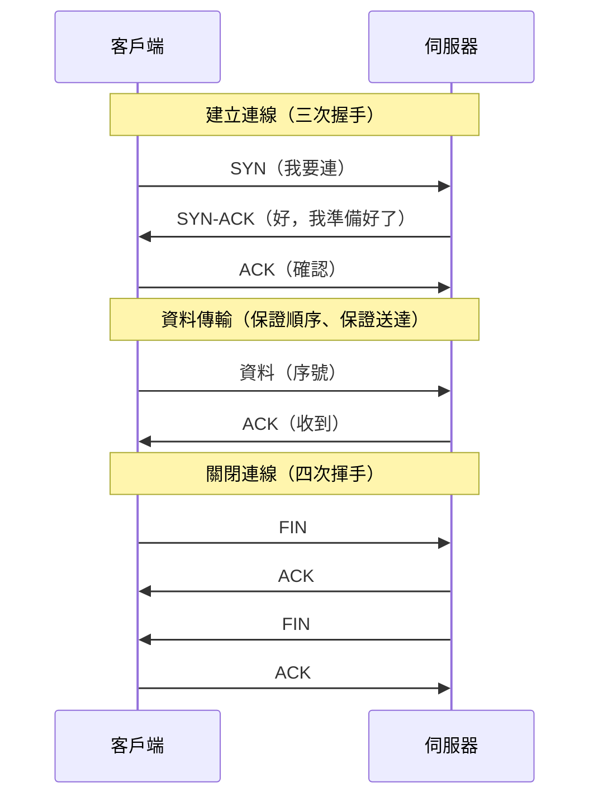

# TCP / UDP 與可靠傳輸

> 傳資料前為什麼要先「握手」?這章真正要問的,不是「TCP 可不可靠」這種課本結論——**是那次握手要花多少錢**,以及為什麼這個成本,正是連線池與 keep-alive 存在的唯一理由。

## 💡 白話導讀（建議先讀）

[上一章](01-request-journey.md)的旅程裡,第 ② 站是「建立 TCP 連線」。這一章把它拆開看。

先建立一個核心對比,用兩種寄東西的方式:

**TCP＝打電話。**
你撥號 → 對方接起來說「喂?」→ 你說「我聽得到,開始吧」——**這三句就是「三次握手」**。
接通之後,這條線一直開著,你講的每句話**保證按順序、不漏字**地傳到對方耳朵。
講完再互道再見掛掉。

**UDP＝寄明信片。**
你寫好、投進郵筒、走人——**沒有握手、沒有確認、不知道對方收到沒**。
可能會遺失、可能後寄的先到,但**極快、極省**(不用維護一條「線」)。

為什麼後端工程師要懂這個?因為它解釋了本書後面一大串「為什麼」:

- **為什麼「建立連線很貴」?** 因為 TCP 每次都要**先握手**(來回至少一趟),
  HTTPS 還要再加 TLS 握手——這就是[連線池](../15-database/15-connection-pool.md)存在的理由:
  握手一次、重複用,別每個請求都重撥一次電話。
- **為什麼優雅關閉要「等在途請求做完」?** 因為 TCP 是**有狀態的一條線**,
  半路掛掉,對方會收到殘缺的資料。
- **為什麼 DNS、影音串流用 UDP?** 因為它們「掉一點沒關係、但要快」——
  查詢重問一次就好、影片掉一格眼睛也看不出來。

但這章真正的重點,不是「TCP 比較可靠」這句課本結論。**是那三次握手要花多少錢。**

因為「撥號→喂?→我聽得到」這一來一回,是要**時間**的。對方在同機房,也許零點幾毫秒;
對方在美國,光跑一趟來回就是一百多毫秒——**而這一百多毫秒,你連正事都還沒開始做。**

那問題來了:如果你每送一個請求,都要先重撥一次電話、重講一次那三句廢話,一天下來要浪費多少時間?
答案是:**多到會拖垮你的服務。** 這不是「優化一點點」的微調,在跨區呼叫下,它是「服務能用」與「服務不能用」的差別。

解法直覺到不行——**打完電話不要掛。** 講完一件事,線留著,下次直接講(這就是 keep-alive);
甚至**先撥好一排電話擺著等你用**(這就是連線池,見 [Part 15](../15-database/15-connection-pool.md))。

這一章先用一段**可以實際執行**的程式,讓你親眼看到那條「線」的存在:
同一句 `hello`,TCP 送出去有**回音**、有一條**連線**;UDP 送出去就**石沉大海、沒有下文**。

## 🎯 什麼時候會用到

- 你的 API 要呼叫第三方,要決定 HTTP client 的逾時、連線池怎麼設。
- 服務在高流量下變慢,而且慢得莫名其妙——CPU 很閒,但每個請求都要好幾百毫秒(八成是每次重新握手)。
- 你在調資料庫連線池的 `max` / `pool_size`,想知道那些數字到底在控制什麼(見 [Part 15](../15-database/15-connection-pool.md))。
- 你收到 `Connection reset` / `ECONNRESET`,想搞清楚是誰把連線掐掉的。
- 面試被問:「**TCP 三次握手,為什麼是三次、不是兩次?**」

## Why（為什麼）

因為 **TCP 的「可靠」不是免費的,它的成本正是後端很多設計的起點。**

你寫 `requests.get()`、連資料庫、開 Redis——**底下全是 TCP**。
而 TCP 為了「保證送到、保證順序」,付出了三個代價:

1. **要先握手**(建立連線的延遲)。
2. **要維護連線狀態**(雙方核心各記著這條連線的序號、視窗等)。
3. **要確認與重傳**(對方沒回 ACK 就重送)。

理解這三個成本,你才懂:
連線池為什麼能加速([第 1 個成本](../15-database/15-connection-pool.md))、
為什麼一台機器的連線數有上限([第 2 個成本](../21-microservices/README.md))、
為什麼網路不穩時延遲會爆增(第 3 個成本)。
**不懂 TCP,這些都只能背;懂了,它們是同一個東西的推論。**

## Theory（理論：可靠傳輸怎麼做到）

### 三次握手（建立連線）

TCP 連線建立要來回三次,確保**雙方都確認「我能送、你能收」**:

```text
客戶端                                      伺服器
   │  ──────── SYN(我要連,序號=x)────────►  │
   │  ◄──── SYN-ACK(好,我準備好了,序號=y)── │
   │  ──────── ACK(確認,收到你的了)────────►  │
   │                                          │
   │  ═══════ 連線建立,開始傳資料 ═══════════ │
```

**為什麼要三次、不是兩次?** 因為要確認**雙向都通**:
第 1、2 次確認「客戶端能送、伺服器能收也能送」,第 3 次確認「伺服器能收」。
少一次,就有一方不確定對方到底收到沒。

### 可靠傳輸的三個機制

握手完之後,TCP 用三招保證「可靠」:

- **序號(sequence number)**:每個位元組都有編號,對方**照編號重組**——所以**保證順序**。
- **確認與重傳(ACK + retransmission)**:收到就回 ACK;送方沒收到 ACK 就**重送**——所以**保證送到**。
- **流量控制與壅塞控制(window)**:依對方的處理能力與網路狀況**調整送多快**——避免壓垮對方或塞爆網路。

### 四次揮手（關閉連線）

關閉比建立多一次,因為**兩個方向要各自關**(你講完了,對方可能還沒):

```text
FIN → / ← ACK  （我這邊講完了 / 知道了）
      ← FIN / ACK →  （我這邊也講完了 / 知道了）
```

這解釋了 [優雅關閉](../19-cloud-native/07-graceful-shutdown.md):
服務要關閉時,不能直接拔線(對方會收到殘缺資料),要**好好走完揮手、把在途的資料送完**。

### TCP vs UDP 對照

| | TCP | UDP |
|---|-----|-----|
| 比喻 | 打電話 | 寄明信片 |
| 連線 | 有(要三次握手) | 無(射後不理) |
| 可靠 | 保證送到、保證順序 | 都不保證 |
| 速度 | 較慢(要握手、確認) | 快 |
| 成本 | 要維護連線狀態 | 幾乎沒有 |
| 用在 | HTTP、資料庫、Redis、gRPC | DNS、影音串流、遊戲、QUIC/HTTP3 |

## Specification（規範:Python 裡怎麼開 TCP / UDP socket）

Python 的 `socket` 模組直接對應作業系統的 socket API:

```python
import socket

# TCP：SOCK_STREAM（串流，像一條連續的水管）
tcp = socket.socket(socket.AF_INET, socket.SOCK_STREAM)
tcp.connect(("example.com", 80))     # ← connect 這一步做三次握手
tcp.sendall(b"...")                  # 送（保證順序送達）
tcp.recv(1024)                       # 收
tcp.close()

# UDP：SOCK_DGRAM（資料報，一封一封獨立的信）
udp = socket.socket(socket.AF_INET, socket.SOCK_DGRAM)
udp.sendto(b"...", ("example.com", 53))   # ← 沒有 connect！直接指定收件人送出
data, addr = udp.recvfrom(1024)           # 收（可能永遠收不到）
udp.close()
```

**關鍵差異在型別**:
- `SOCK_STREAM`(TCP)：**有 `connect`**(要先建立連線),之後 `send`/`recv`。
- `SOCK_DGRAM`(UDP)：**沒有 `connect`**,每次 `sendto` 直接指定收件人——因為它無連線。

## Implementation（底層:連線是核心維護的一張表）

「TCP 連線」不是一個實體的東西,而是**作業系統核心裡的一筆狀態**。
每條連線由**四元組(4-tuple)** 唯一識別:

```text
(來源 IP, 來源 Port, 目的 IP, 目的 Port)
```

這解釋了幾件事:

- **一台伺服器的 80 port 能同時服務上萬個客戶端**——因為每個客戶端的「來源 IP:Port」不同,
  四元組就不同,是不同的連線。
- **連線是有成本的資源**:核心要為每條連線維護緩衝區、序號、視窗等狀態。
  連線開太多會吃光記憶體與檔案描述符(見 [ch07](README.md))——這是「連線數上限」的由來。
- **`TIME_WAIT`**:連線關閉後不會立刻消失,會停留一段時間確保尾端封包處理完——
  高並發短連線的服務可能累積大量 `TIME_WAIT`,這也是為什麼**長連線(keep-alive)更好**。

下面的程式會印出這個四元組,讓你親眼看到「一條連線」長什麼樣。

## Code Example（可執行的 Python 範例）

在本機各開一個 TCP 與 UDP 伺服器,對比兩者的行為。**全在 localhost。**

```python
# tcp_vs_udp.py —— TCP（打電話）vs UDP（寄明信片）
from __future__ import annotations

import socket
import threading
import time


def tcp_echo_server(port: int, ready: threading.Event) -> None:
    """TCP 伺服器：收到什麼就回大寫（證明有收到、有回應）。"""
    srv = socket.socket(socket.AF_INET, socket.SOCK_STREAM)
    srv.setsockopt(socket.SOL_SOCKET, socket.SO_REUSEADDR, 1)
    srv.bind(("localhost", port))
    srv.listen(1)
    ready.set()
    conn, _ = srv.accept()               # 阻塞等待「握手」完成的連線
    with conn:
        while data := conn.recv(1024):
            conn.sendall(data.upper())
    srv.close()


def udp_server(port: int, ready: threading.Event, box: list[bytes]) -> None:
    """UDP 伺服器：收到什麼就記下來（不回覆——射後不理）。"""
    srv = socket.socket(socket.AF_INET, socket.SOCK_DGRAM)
    srv.bind(("localhost", port))
    ready.set()
    srv.settimeout(1.0)
    try:
        while True:
            data, _ = srv.recvfrom(1024)
            box.append(data)
    except TimeoutError:
        pass
    srv.close()


def demo() -> None:
    print("【TCP】連線導向、保序、可靠（三次握手後，像一條電話線）")
    port = 9101
    ready = threading.Event()
    threading.Thread(target=tcp_echo_server, args=(port, ready), daemon=True).start()
    ready.wait(1)
    client = socket.socket(socket.AF_INET, socket.SOCK_STREAM)
    client.connect(("localhost", port))              # ← 三次握手在這一步
    local = client.getsockname()
    print(f"   連線四元組: 本機 {local[0]}:{local[1]} ↔ 伺服器 127.0.0.1:{port}")
    for msg in [b"hello", b"world"]:
        client.sendall(msg)
        print(f"   送 {msg!r} → 收回 {client.recv(1024)!r}")   # 有來有回
    client.close()

    print("\n【UDP】無連線、射後不理（像寄明信片，不保證到、不保證順序）")
    uport = 9102
    ready2 = threading.Event()
    box: list[bytes] = []
    threading.Thread(target=udp_server, args=(uport, ready2, box), daemon=True).start()
    ready2.wait(1)
    uclient = socket.socket(socket.AF_INET, socket.SOCK_DGRAM)
    for msg in [b"packet-1", b"packet-2", b"packet-3"]:
        uclient.sendto(msg, ("localhost", uport))    # 送完就走，沒有握手、沒有回覆
        print(f"   送出 {msg!r}（不等確認）")
    uclient.close()
    time.sleep(1.1)
    print(f"   伺服器實際收到: {box}")

    print("\n → TCP 有連線狀態（要握手、要維護），所以「建立連線」貴 → 才需要連線池。")
    print("   UDP 沒有連線，快但不可靠 → 用在 DNS、影音串流這種「掉一點沒關係」的場景。")


if __name__ == "__main__":
    demo()
```

**預期輸出**（本機 port 號會不同；UDP 在 localhost 幾乎不會掉，真實網路才會）：

```pycon
$ python tcp_vs_udp.py
【TCP】連線導向、保序、可靠（三次握手後，像一條電話線）
   連線四元組: 本機 127.0.0.1:54947 ↔ 伺服器 127.0.0.1:9101
   送 b'hello' → 收回 b'HELLO'
   送 b'world' → 收回 b'WORLD'

【UDP】無連線、射後不理（像寄明信片，不保證到、不保證順序）
   送出 b'packet-1'（不等確認）
   送出 b'packet-2'（不等確認）
   送出 b'packet-3'（不等確認）
   伺服器實際收到: [b'packet-1', b'packet-2', b'packet-3']

 → TCP 有連線狀態（要握手、要維護），所以「建立連線」貴 → 才需要連線池。
   UDP 沒有連線，快但不可靠 → 用在 DNS、影音串流這種「掉一點沒關係」的場景。
```

**兩段輸出的對比,就是 TCP 與 UDP 的本質**:

- **TCP 有「四元組」與「來有回」**:你看到一條明確的連線(本機 port ↔ 伺服器 port),
  每次送都收到回覆(`hello`→`HELLO`)——這是「一條電話線」。
- **UDP 只有「送出」沒有「回覆」**:客戶端 `sendto` 完就結束,不知道對方收到沒。
  (在 localhost 這種完美環境下三封都到了,但**真實網路上 UDP 隨時會掉封包、亂序**——
  它不保證,只是這裡剛好沒掉。)

## Diagram（圖解:三次握手與四次揮手）



## Best Practice（最佳實踐）

- **重用連線,別重複握手。** HTTP 用 keep-alive、資料庫用[連線池](../15-database/15-connection-pool.md)、
  `httpx`/`requests` 重用 `Session`/`Client`——**每次新建連線都要付一次握手成本**。
- **知道你的服務底下是 TCP。** 逾時、重試、連線數上限、`TIME_WAIT` 累積,
  這些線上問題都源自 TCP 的連線本質。
- **不確定就用 TCP。** 後端 99% 用 TCP(HTTP、DB、Redis、gRPC)。
  UDP 只在「要極低延遲、且能容忍遺失」時才選(DNS、即時影音、遊戲)。
- **HTTP/3 是個例外**:它跑在 **QUIC(基於 UDP)** 上——用 UDP + 應用層自己做可靠性,
  來避開 TCP 的一些包袱(如隊頭阻塞)。知道這件事即可,細節超出後端日常。

## Common Mistakes（常見誤解）

- **「UDP 比較差」。** 不是差,是**取捨不同**。UDP 用「不保證」換「快與省」——
  DNS 用 UDP 正是因為「重問一次就好,不值得為它握手」。
- **「連線建立不用成本」。** 每條 TCP 連線都要握手(來回一趟)+ 核心維護狀態。
  忽略它,你會寫出「每個請求都新建連線」的慢服務。
- **「一個 port 只能服務一個人」。** 錯。伺服器的 80 port 能同時服務上萬人——
  因為連線由**四元組**識別,每個客戶端的來源 IP:Port 不同。
- **「TCP 保證我的『訊息』不會被切開」。** 錯。TCP 是**位元組串流**,不保留「訊息邊界」——
  你送兩次 `send`,對方可能一次 `recv` 就全收到(黏包)。所以應用層要自己定界
  (HTTP 用 `Content-Length` / 空行、其他用長度前綴)。

## Interview Notes（面試重點）

- **「TCP 和 UDP 差在哪?」**
  「TCP **連線導向、可靠、保序**(三次握手、序號、ACK 重傳),但有握手與維護成本;
  UDP **無連線、不可靠、不保序**,但快又省。TCP 用於 HTTP/DB/gRPC,UDP 用於 DNS/影音串流。」
- **「為什麼是三次握手,不是兩次?」**
  「要確認**雙向都通**。三次才能讓雙方都確認『對方能收、也能送』。兩次的話,伺服器無法確認客戶端收到了它的回應。」
- **「一條 TCP 連線怎麼被唯一識別?」**
  「**四元組:來源 IP、來源 Port、目的 IP、目的 Port**。所以一個伺服器 port 能服務大量客戶端。」
- **「什麼是黏包(TCP 的訊息邊界問題)?」**
  「TCP 是**位元組串流**,不保留應用層的『訊息』邊界。多次 `send` 可能被合併、一次 `send` 可能被拆分。
  應用層要自己定界——HTTP 用 `Content-Length` 或空行,自訂協定常用『長度前綴』。」
- **「為什麼建立連線很貴,這對後端有什麼影響?」**
  「每條 TCP 連線要三次握手(HTTPS 再加 TLS 握手),還要核心維護狀態。所以要**重用連線**:
  HTTP keep-alive、資料庫連線池、HTTP 客戶端重用 session。這是後端效能的基本功。」

---

➡️ 下一章：[DNS 與 IP / Port](03-dns-ip-port.md)

[⬆️ 回 Part 0 索引](README.md)
