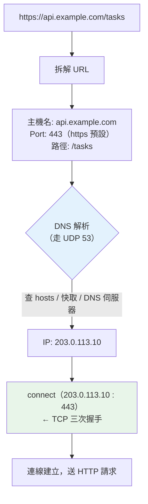

# DNS 與 IP / Port

> DNS 是網路的通訊錄——把好記的名字（`api.example.com`）換成機器能用的地址（IP）。IP 找到「哪台機器」，Port 找到「機器上的哪個服務」。這章講清楚「一個網址怎麼變成一條連線」。

## 💡 白話導讀（建議先讀）

[第 1 章的旅程](01-request-journey.md)第 ① 站是「DNS 解析」。這章把它講透,順帶講清 IP 與 Port。

用一個生活場景:**你要打電話給「台北市政府」。**

1. 你只知道**名字**(台北市政府),不知道**號碼**。於是你查 **114 查號台**——
   這就是 **DNS**:把「名字」換成「號碼」。
2. 查到總機號碼(**IP**)——它對應「哪一棟大樓、哪一台總機」。
3. 但你要找的是「戶政事務所」,不是總機。你還要轉**分機**(**Port**)——
   同一棟大樓(IP)裡,不同分機(Port)接到不同部門(服務)。

翻成網路:

- **`api.example.com`(域名)＝名字** → 好記,但機器不認得。
- **`203.0.113.10`(IP)＝總機號碼** → 找到「哪台機器」。
- **`443`(Port)＝分機** → 找到「機器上的哪個服務」(443=HTTPS、5432=PostgreSQL…)。

所以「連到 `https://api.example.com`」實際上是:
**DNS 把域名解析成 IP → 連到 `IP:443`**。

為什麼後端要懂?因為這解釋了三個你天天會遇到的東西:

- **為什麼容器/雲上要綁 `0.0.0.0` 不是 `127.0.0.1`?**(綁哪個位址,決定誰連得到你)
- **為什麼一台機器能同時跑 web(80)、資料庫(5432)、Redis(6379)?**(靠 Port 區分)
- **「連不到服務」時第一個要問什麼?**(是 DNS 解不到?還是 IP 通但 Port 沒開?)

這一章用 `socket` 實際做一次 DNS 解析、示範 Port 綁定,讓這些不再抽象。

## Why（為什麼）

因為 **「連不上」的線上問題,九成出在 DNS、IP 或 Port 其中一層**,而它們是三個不同的層次。

想像你的服務連不上資料庫,可能的原因分屬三層:

1. **DNS 層**:資料庫的主機名解析不到 IP(DNS 設定錯、內網 DNS 掛了)。
2. **IP / 網路層**:IP 解到了,但**網路不通**(防火牆擋、不同 VPC、路由問題)。
3. **Port / 服務層**:IP 通了,但**那個 port 沒有服務在聽**(資料庫沒啟動、綁錯位址、port 打錯)。

**能分清這三層,你才排得動 bug**——否則只會盯著程式碼看,但問題根本不在程式裡。
這也是為什麼後端工程師要懂這一層:很多事故不在「你的程式」,而在「怎麼連到你的程式」。

## Theory（理論：域名如何變成一條連線）

### DNS 解析（名字 → IP）

當你連 `api.example.com`,作業系統依序查:

```text
1. hosts 檔（/etc/hosts）    ← localhost、手動設定的對應寫在這
2. 本機 DNS 快取             ← 之前查過的，直接用（有 TTL）
3. 遞迴 DNS 伺服器（如 8.8.8.8）
      → 根 DNS → .com 的 DNS → example.com 的 DNS
      → 回傳 A 記錄：api.example.com = 203.0.113.10
```

幾個關鍵:

- **DNS 走 UDP(port 53)**——因為查詢小、要快、掉了重問就好(呼應 [ch02](02-tcp-udp.md) UDP 的定位)。
- **有 TTL 快取**——所以改了 DNS 記錄,不會立刻全球生效(要等舊快取過期)。
- **一個域名可對應多個 IP**(負載平衡、CDN)——`getaddrinfo` 可能回傳好幾個。
- **記錄類型**:`A`(→IPv4)、`AAAA`(→IPv6)、`CNAME`(別名)、`MX`(郵件)…

### IP：找到哪台機器

- **IPv4**:`203.0.113.10`,4 個位元組(0~255)。數量有限,已用盡。
- **IPv6**:`2001:db8::1`,更長,數量幾乎無限。
- **特殊位址**:
  - `127.0.0.1`(localhost)= **回送位址**,永遠指向本機,不出網卡。
  - `0.0.0.0` = **「所有位址」**,伺服器綁它表示「聽所有網卡」。
  - 私有網段(`10.x`、`192.168.x`、`172.16-31.x`)= 內網,不會出現在公網。

### Port：找到機器上的哪個服務

同一個 IP(一台機器)靠 **Port(0~65535)** 區分不同服務:

| Port | 服務 |
|------|------|
| 22 | SSH |
| 80 | HTTP |
| 443 | HTTPS |
| 5432 | PostgreSQL |
| 3306 | MySQL |
| 6379 | Redis |
| 27017 | MongoDB |

- **0~1023 是「知名 port」**,綁它們通常要 root 權限。
- **應用自己選的 port**(如 FastAPI 預設 8000)通常在 1024 以上。
- **Port 0 = 「請 OS 幫我挑一個空閒的」**——測試時常用(下面範例會示範)。

## Specification（規範:Python 裡做 DNS 與綁定）

```python
import socket

# DNS 正解：主機名 → IP
socket.gethostbyname("localhost")           # '127.0.0.1'（只回一個 IPv4）
socket.getaddrinfo("example.com", 443)      # 完整資訊，含多個 IP、IPv4/IPv6

# 綁定位址與 port（伺服器端）
srv = socket.socket(socket.AF_INET, socket.SOCK_STREAM)
srv.bind(("127.0.0.1", 8000))   # 只聽本機
srv.bind(("0.0.0.0", 8000))     # 聽所有網卡（對外服務、容器內必用）
srv.bind(("localhost", 0))      # port 0 → 由 OS 分配一個空閒 port
```

**綁定位址的選擇是常見坑**:
- 開發時綁 `127.0.0.1` — 只有本機連得到。
- **部署到容器/雲上一定要綁 `0.0.0.0`** — 否則容器外/別台機器**連不進來**
  (這是「本機好好的、上雲就連不到」的經典原因)。

## Implementation（底層:解析與連線的分工）

值得建立的一個心智模型:**DNS 解析和建立連線是「兩件事」**。

```text
socket.getaddrinfo("api.example.com", 443)   ← 這一步：只查 IP（走 DNS/UDP）
       ↓ 得到 203.0.113.10
sock.connect(("203.0.113.10", 443))          ← 這一步：才建立 TCP 連線（三次握手）
```

你平常寫 `httpx.get("https://api.example.com/x")`,函式庫**幫你把這兩步都做了**。
但它們是分開的——所以:

- **DNS 解析也有延遲**(尤其第一次、快取沒命中時),也可能失敗(`socket.gaierror`)。
- **連線用的是 IP,不是域名**——所以「DNS 改了但還連到舊機器」是因為**舊 IP 還在快取裡**。
- **高效能服務會快取 DNS 結果**,避免每個請求都重新解析。

## Code Example（可執行的 Python 範例）

實際做一次 DNS 解析、示範 Port 綁定與 `0.0.0.0` vs `127.0.0.1` 的差別。

```python
# dns_ip_port.py —— 域名如何變成 IP:Port
from __future__ import annotations

import socket


def resolve(host: str) -> list[str]:
    """DNS 正解：主機名 → 一或多個 IPv4（可能有多個：負載平衡 / CDN）。"""
    infos = socket.getaddrinfo(host, None, family=socket.AF_INET)
    return sorted({str(info[4][0]) for info in infos})


def free_port() -> int:
    """綁 port 0 → 讓 OS 分配一個空閒 port（測試常用手法）。"""
    with socket.socket(socket.AF_INET, socket.SOCK_STREAM) as sock:
        sock.bind(("localhost", 0))
        port: int = sock.getsockname()[1]
        return port


def demo() -> None:
    print("【DNS 正解】主機名 → IP")
    print(f"   localhost → {resolve('localhost')}   （走 hosts 檔，不需外網）")
    try:
        print(f"   example.com → {resolve('example.com')}   （可能多個 IP）")
    except socket.gaierror as exc:
        print(f"   example.com → 解析失敗（此環境無外網）: {exc}")

    print("\n【Port：同一 IP 靠 port 區分不同服務】")
    print("   80=HTTP  443=HTTPS  22=SSH  5432=PostgreSQL  6379=Redis")
    print(f"   bind(('localhost', 0)) → OS 分配了空閒 port {free_port()}")

    print("\n【綁定位址的差別】")
    print("   127.0.0.1 = 只聽本機（別台機器連不到）")
    print("   0.0.0.0   = 聽所有網卡（容器 / 雲上對外服務必用）")


if __name__ == "__main__":
    demo()
```

**預期輸出**（外網 IP、分配的 port 會不同；無外網時 example.com 那行顯示解析失敗）：

```pycon
$ python dns_ip_port.py
【DNS 正解】主機名 → IP
   localhost → ['127.0.0.1']   （走 hosts 檔，不需外網）
   example.com → ['104.20.23.154', '172.66.147.243']   （可能多個 IP）

【Port：同一 IP 靠 port 區分不同服務】
   80=HTTP  443=HTTPS  22=SSH  5432=PostgreSQL  6379=Redis
   bind(('localhost', 0)) → OS 分配了空閒 port 55149

【綁定位址的差別】
   127.0.0.1 = 只聽本機（別台機器連不到）
   0.0.0.0   = 聽所有網卡（容器 / 雲上對外服務必用）
```

**三個觀察**:

- **`localhost` 一定解析成 `127.0.0.1`,且不需外網**——因為它走 hosts 檔,不查 DNS 伺服器。
- **`example.com` 回傳「多個」IP**——這就是 DNS 層級的負載平衡 / CDN:
  同一個名字對到多台機器。
- **`bind(('localhost', 0))` 讓 OS 挑 port**——這是測試裡「找一個沒被佔用的 port」的標準做法
  ([ch02](02-tcp-udp.md) 的測試就用了它)。

## Diagram（圖解:一個網址變成連線）



## Best Practice（最佳實踐）

- **部署一定綁 `0.0.0.0`**（容器/雲上對外服務）。開發綁 `127.0.0.1` 沒問題,
  但別把它帶到生產——會變成「本機好好的、上雲連不到」。
- **排查「連不上」分三層問**:DNS 解得到 IP 嗎(`nslookup`/`dig`)?IP 通嗎(`ping`)?
  Port 開著嗎(`telnet host port` / `nc`)?**別一開始就盯程式碼**。
- **理解 DNS 有 TTL**:改了 DNS 記錄不會立刻生效,要等快取過期。這影響切換服務、災難復原。
- **內部服務用服務名,別寫死 IP**:K8s 裡打 Service 名(`http://db-service`)、
  容器用容器名——因為 IP 會變([Part 21 服務發現](../21-microservices/04-service-discovery.md))。

## Common Mistakes（常見誤解）

- **「localhost 和 IP 是同一件事」。** `localhost` 是**名字**,要經過解析
  (hosts 檔)才變成 `127.0.0.1`。你在輸出第一步看到這個轉換。
- **「綁 127.0.0.1 就好」。** 在容器/雲上這會讓外面**完全連不到**——對外服務要綁 `0.0.0.0`。
- **「DNS 改了應該立刻生效」。** 不會。有 **TTL 快取**,舊 IP 會被繼續用一段時間。
- **「一個域名只對一個 IP」。** 常常對多個(CDN、負載平衡),`getaddrinfo` 會回一串。
- **「port 隨便選都行」。** 0~1023 通常要 root;而且別和常見服務撞
  (別把 app 綁在 6379 —— 那是 Redis 的地盤)。

## Interview Notes（面試重點）

- **「輸入網址到連上,DNS 這段做了什麼?」**
  「先查 hosts 檔與本機快取,沒有才問遞迴 DNS 伺服器(根 → TLD → 權威),
  拿到 A 記錄(域名→IP)。走 **UDP 53**、有 **TTL 快取**、一個域名可對多個 IP(CDN/負載平衡)。」
- **「`127.0.0.1` 和 `0.0.0.0` 差在哪?」**
  「`127.0.0.1` 是回送位址,綁它只聽本機;`0.0.0.0` 表示『所有網卡』,綁它才能被外部連到。
  **容器/雲上對外服務必須綁 `0.0.0.0`**——這是超高頻的實務坑。」
- **「同一台機器怎麼跑很多服務?」**
  「靠 **Port**。IP 找到機器,Port 找到機器上的服務(80=HTTP、5432=PG、6379=Redis)。
  一條連線由四元組(來源/目的 各 IP:Port)唯一識別。」
- **「服務連不上資料庫,你怎麼查?」**
  「分三層:① DNS——主機名解得到 IP 嗎(`dig`)?② 網路——IP 通嗎(`ping`、防火牆/VPC)?
  ③ 服務——那個 port 有東西在聽嗎(`nc -zv host port`)?**先定位在哪一層,再動手。**」

---

➡️ 下一章：[HTTP 報文深入](04-http-messages.md)

[⬆️ 回 Part 0 索引](README.md)
