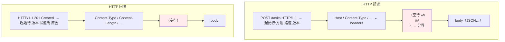

# HTTP 報文深入

> HTTP 沒有魔法——它就是一段有固定格式的**純文字**：一行「動作」、幾行「附註（header）」、一個空行、然後（可選的）內容。看懂這個結構，FastAPI 拿到的 `request`、回傳的 `response`，你都能還原成位元組。

## 💡 白話導讀（建議先讀）

[第 1 章](01-request-journey.md)你已經用裸 socket 送過一個 HTTP 請求了,親眼看到它就是一段文字。
這一章把這段文字的**格式**講清楚——因為你在 [Part 14 Web](../14-web/README.md) 拿到的每個
`request`、回傳的每個 `response`,底下都是這個格式。

用一個生活比喻:**一封公文**。

一封 HTTP 報文,結構就像一張標準公文:

```text
POST /tasks HTTP/1.1        ← ① 主旨行（我要做什麼:對 /tasks 做 POST）
Host: api.example.com       ← ② 附註欄（一堆 Key: Value 的 header）
Content-Type: application/json
Content-Length: 18
                            ← ③ 一個「空行」（附註結束的分隔線）
{"title":"買菜"}            ← ④ 正文（body，這次要送的資料）
```

四個部分,對號入座:

- **① 起始行**:請求是 `方法 路徑 版本`(`POST /tasks HTTP/1.1`);
  回應是 `版本 狀態碼 原因`(`HTTP/1.1 201 Created`)。
- **② headers**:一堆 `Key: Value`,是「關於這次請求/回應的附註」
  (內容型別、長度、認證 token、cookie…)。
- **③ 空行**:一個 `\r\n\r\n`——**這是 header 和 body 的分界線**,超重要。
- **④ body**:實際要傳的資料(POST 的 JSON、回應的內容)。GET 通常沒有 body。

為什麼後端要懂這個?因為:

- **你的 API 收到的每個欄位,都對應報文的某個位置**——
  路徑參數在起始行、query 在起始行的 `?` 後、認證在 header、資料在 body
  (這正是 [FastAPI 怎麼決定參數從哪來](../14-web/05-routing.md) 的底層)。
- **狀態碼是 API 的語言**——回 200 還是 201、400 還是 422,是設計決策,不是隨便。
- **「為什麼收到半個 JSON」之類的 bug**,常常是**沒照 `Content-Length` 讀完**。

這一章用程式**手動組一個請求、手動解析一個回應**,讓這個格式變成你能操控的東西。

## Why（為什麼）

因為 **框架把 HTTP 包得太好,好到你忘了它的存在——直到出事。**

平常你寫 `@app.post("/tasks")`,FastAPI 把原始報文解析成漂亮的 `request` 物件。
但這層抽象會漏,而漏的時候你需要看穿它:

- **CORS 錯誤、快取沒生效、認證失敗** → 得看**原始 header**(`Origin`、`Cache-Control`、`Authorization`)。
- **「上傳的中文變亂碼」** → 得懂 `Content-Type` 的 `charset`。
- **「PATCH 和 PUT 到底差在哪」** → 得懂 HTTP 方法的**語意**。
- **除錯時用 `curl -v` 或看瀏覽器 Network 分頁** → 你看到的就是原始報文,不懂格式就看不懂。

**懂報文結構,你才能在抽象漏掉時把它補起來。** 這是後端 debug 的基本功。

## Theory（理論：報文的結構與語意）

### 請求報文（Request）

```text
方法 路徑 版本                 ← 起始行（request line）
Header-Name: value            ← 0 到多個 header
...
                              ← 空行（\r\n\r\n）
[body]                        ← 可選的 body
```

### 回應報文（Response）

```text
版本 狀態碼 原因短語           ← 起始行（status line）
Header-Name: value            ← 0 到多個 header
...
                              ← 空行
[body]
```

### HTTP 方法（動詞）的語意

方法表達「**對這個資源做什麼**」,而且有兩個重要性質:

| 方法 | 語意 | 安全? | 冪等? |
|------|------|-------|-------|
| GET | 讀取 | ✅(不改狀態) | ✅ |
| POST | 新建 / 觸發動作 | ❌ | ❌(重送會建兩筆) |
| PUT | **整個**替換 | ❌ | ✅(替換 N 次 = 1 次) |
| PATCH | **部分**更新 | ❌ | 不一定 |
| DELETE | 刪除 | ❌ | ✅(刪已刪的還是不存在) |

- **安全(safe)**:不改變伺服器狀態(GET)。
- **冪等(idempotent)**:做一次和做多次效果相同(PUT/DELETE)——
  這直接關係到[重試能不能安全進行](../22-distributed-systems/06-idempotency.md)。

### 狀態碼（回應的結果）

用**開頭數字**分五類,記住分類比記個別碼重要:

| 類 | 意思 | 常見 |
|----|------|------|
| **1xx** | 資訊 | 100 Continue（少見） |
| **2xx** | 成功 | **200** OK、**201** Created、204 No Content |
| **3xx** | 轉址 | **301** 永久、302 暫時、304 Not Modified（快取） |
| **4xx** | **客戶端錯**（你送錯了） | **400** 請求錯、**401** 未認證、**403** 無權限、**404** 找不到、**422** 驗證失敗、429 太多請求 |
| **5xx** | **伺服器錯**（我壞了） | **500** 內部錯誤、502 閘道錯、503 服務不可用 |

**關鍵區分**:4xx 是「**你(客戶端)的錯**」,5xx 是「**我(伺服器)的錯**」——
這條界線決定了「該不該重試」(4xx 重試通常沒用,5xx 可能值得)。

### 常見 header

| Header | 作用 |
|--------|------|
| `Host` | 要連的主機（一台機器可託管多個網站） |
| `Content-Type` | body 的型別（`application/json`、含 `charset`） |
| `Content-Length` | body 的長度（**接收方靠它知道讀到哪**） |
| `Authorization` | 認證憑證（`Bearer <token>`） |
| `Cookie` / `Set-Cookie` | session/狀態 |
| `Cache-Control` | 快取策略 |
| `Accept` | 客戶端希望的回應格式 |

## Specification（規範:HTTP/1.1 的文字格式）

- **每行以 `\r\n`(CRLF)結尾**——不是只有 `\n`。
- **起始行與 header 之間、header 彼此之間**用 CRLF 分隔。
- **一個空行(`\r\n\r\n`)** 標示 header 結束、body 開始。
- **body 的長度**由 `Content-Length` 指定(或用 `Transfer-Encoding: chunked` 分塊)。
- **header 名稱不分大小寫**(`Content-Type` == `content-type`)。

```text
POST /tasks HTTP/1.1\r\n
Host: api.example.com\r\n
Content-Type: application/json\r\n
Content-Length: 18\r\n
\r\n                          ← 這個空行是關鍵分界
{"title":"買菜"}
```

> ⚠️ 上面是**格式示意**(標了 `\r\n`),不是可執行程式。

## Implementation（底層:Uvicorn 幫你做的解析）

當請求的位元組到達,ASGI 伺服器(Uvicorn)做的事,本質就是**解析這段文字**:

1. 讀到第一個 `\r\n` → 拆出**方法、路徑、版本**。
2. 一行一行讀 header,直到遇到**空行**。
3. 看 `Content-Length` → 知道還要再讀多少位元組當 **body**。
4. 把這些組成一個結構,透過 [ASGI](../14-web/01-wsgi-asgi.md) 交給你的 FastAPI。

你回傳的 `response`,Uvicorn 再**反向組回**這段文字送出。
**所以「HTTP 請求/回應物件」不是魔法,是這段解析/組裝的結果**——下面你親手做一遍。

## Code Example（可執行的 Python 範例）

手動**組一個請求報文**、**解析一個回應報文**,看清四個部分。

```python
# http_messages.py —— 手動組裝與解析 HTTP 報文
from __future__ import annotations


def build_request(method: str, path: str, host: str, body: str = "") -> bytes:
    """組一個 HTTP 請求報文（就是純文字 + CRLF）。"""
    lines = [f"{method} {path} HTTP/1.1", f"Host: {host}"]
    if body:
        lines.append("Content-Type: application/json")
        lines.append(f"Content-Length: {len(body.encode())}")   # body 的位元組長度
    lines.append("")        # 空行：header 結束
    lines.append(body)      # body
    return "\r\n".join(lines).encode()


def parse_response(raw: bytes) -> dict[str, object]:
    """解析 HTTP 回應報文 → 拆出 status、headers、body。"""
    head, _, body = raw.partition(b"\r\n\r\n")      # 用空行切開 head 與 body
    lines = head.decode().split("\r\n")
    version, status_code, *reason = lines[0].split(" ")   # 起始行
    headers = {}
    for line in lines[1:]:
        key, _, value = line.partition(": ")
        headers[key] = value
    return {
        "version": version,
        "status": int(status_code),
        "reason": " ".join(reason),
        "headers": headers,
        "body": body.decode(),
    }


def demo() -> None:
    print("【組一個 HTTP 請求】起始行 + headers + 空行 + body")
    req = build_request("POST", "/tasks", "api.example.com", '{"title":"買菜"}')
    # 把 \r\n 顯示成可見的 ⏎，看清結構
    print(req.decode().replace("\r\n", " ⏎\n"))

    print("\n【解析一個 HTTP 回應】")
    raw = (
        b"HTTP/1.1 201 Created\r\n"
        b"Content-Type: application/json\r\n"
        b"Content-Length: 21\r\n"
        b"\r\n"
        b'{"id":1,"done":false}'
    )
    parsed = parse_response(raw)
    print(f"   狀態: {parsed['status']} {parsed['reason']}")
    print(f"   headers: {parsed['headers']}")
    print(f"   body: {parsed['body']}")

    print("\n【狀態碼分類：開頭數字最重要】")
    for code, meaning in [
        (200, "OK"), (201, "Created"), (301, "永久轉址"),
        (400, "請求錯誤"), (401, "未認證"), (403, "無權限"),
        (404, "找不到"), (422, "驗證失敗"), (500, "伺服器錯誤"),
    ]:
        side = "客戶端錯" if 400 <= code < 500 else "伺服器錯" if code >= 500 else ""
        print(f"   {code} {code // 100}xx {meaning:8s} {side}")


if __name__ == "__main__":
    demo()
```

**預期輸出**：

```pycon
$ python http_messages.py
【組一個 HTTP 請求】起始行 + headers + 空行 + body
POST /tasks HTTP/1.1 ⏎
Host: api.example.com ⏎
Content-Type: application/json ⏎
Content-Length: 18 ⏎
 ⏎
{"title":"買菜"}

【解析一個 HTTP 回應】
   狀態: 201 Created
   headers: {'Content-Type': 'application/json', 'Content-Length': '21'}
   body: {"id":1,"done":false}

【狀態碼分類：開頭數字最重要】
   200 2xx OK       
   201 2xx Created  
   301 3xx 永久轉址   
   400 4xx 請求錯誤   客戶端錯
   401 4xx 未認證    客戶端錯
   403 4xx 無權限    客戶端錯
   404 4xx 找不到    客戶端錯
   422 4xx 驗證失敗   客戶端錯
   500 5xx 伺服器錯誤  伺服器錯
```

**這段輸出戳破的東西**:

- **請求就是四塊拼起來的文字**:那個 ` ⏎` 標出每個 `\r\n`;
  你看到**空行**(單獨一個 ` ⏎`)把 header 和 body 分開——這就是 `\r\n\r\n`。
- **解析就是「照分界切開」**:`partition(b"\r\n\r\n")` 一刀切出 head 和 body,
  再拆起始行和 header。Uvicorn 做的就是這件事(只是更嚴謹)。
- **`Content-Length: 18`** 是「買菜」那段 JSON 的**位元組**長度(中文 UTF-8 一字 3 bytes)——
  接收方靠它知道「body 要讀 18 個 byte」,少讀就是半個 JSON。
- **狀態碼的開頭數字**就分好了「誰的錯」:4xx 客戶端、5xx 伺服器。

## Diagram（圖解:HTTP 報文結構）



## Best Practice（最佳實踐）

- **用對狀態碼**:建立回 **201**、驗證失敗回 **422**、無權限回 **403**、找不到回 **404**——
  **別永遠回 200 把錯誤塞在 body**(呼應 [Part 14 REST 設計](../14-web/08-rest-api.md))。
- **分清 4xx vs 5xx**:是客戶端送錯(4xx,別重試)還是伺服器壞了(5xx,可能值得重試)——
  這條界線是[重試策略](../21-microservices/07-rate-limit-circuit-breaker.md)的依據。
- **善用 `curl -v` / 瀏覽器 Network 分頁**:debug 時直接看**原始報文**,
  比猜框架行為快得多。
- **`Content-Type` 一定帶 `charset`**:`application/json` 預設 UTF-8,但別的型別要明確標,
  否則中文可能亂碼(呼應 [Part 2 編碼](../02-fundamentals/16-encoding-bytes.md))。

## Common Mistakes（常見誤解）

- **「HTTP 很複雜」。** 協定本身是**純文字、四塊結構**,你剛剛手打了一個。
  複雜的是上面蓋的框架與中介層。
- **「POST 和 PUT 一樣」。** POST **新建**(不冪等,重送建兩筆);PUT **整個替換**(冪等)。
  這差別在「重試安不安全」上很關鍵。
- **「200 就是成功、其他都是失敗」。** 太粗。**201**(建立)、**204**(成功但無內容)、
  **304**(快取沒變)都不是 200,但都不是錯。
- **「header 大小寫有差」。** 沒有,HTTP header 名稱**不分大小寫**。
- **「Content-Length 可有可無」。** 有 body 時它很重要——接收方靠它知道讀到哪。
  少了它(又沒 chunked),接收方不知道 body 何時結束。

## Interview Notes（面試重點）

- **「HTTP 報文的結構?」**
  「四部分:**起始行**(請求是 `方法 路徑 版本`、回應是 `版本 狀態碼 原因`)、
  **headers**(`Key: Value`)、**空行**(`\r\n\r\n` 分界)、**body**。純文字,每行 CRLF 結尾。」
- **「GET vs POST vs PUT vs PATCH?」**
  「GET 讀取(安全、冪等);POST 新建/觸發(不冪等);PUT **整個**替換(冪等);
  PATCH **部分**更新。**安全**=不改狀態,**冪等**=做多次=做一次——後者決定重試安不安全。」
- **「4xx 和 5xx 差在哪?」**
  「**4xx 是客戶端的錯**(400 格式錯、401 未認證、403 無權限、404 找不到、422 驗證失敗);
  **5xx 是伺服器的錯**(500 內部錯、503 不可用)。這條界線決定該不該重試:4xx 重試沒用,5xx 可能值得。」
- **「201 和 200 的差別?什麼時候用 204?」**
  「**201 Created** 專門給『成功建立了資源』(POST 後);**200 OK** 是一般成功;
  **204 No Content** 是『成功了但沒有回傳內容』(如 DELETE 成功)。用對狀態碼讓 API 自我說明。」
- **「Content-Length 的作用?」**
  「告訴接收方 **body 有幾個位元組**,接收方才知道讀到哪裡結束。少了它(且非 chunked),
  接收方無法判斷 body 邊界——這也和 [TCP 沒有訊息邊界](02-tcp-udp.md)(黏包)呼應:HTTP 靠它自己定界。」

---

➡️ 下一章：HTTPS 與 TLS（撰寫中，先回索引）

[⬆️ 回 Part 0 索引](README.md)
