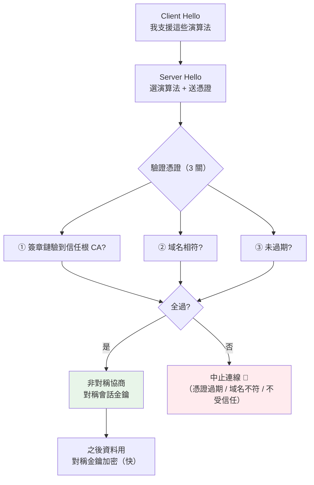

# HTTPS 與 TLS

> HTTPS 就是「HTTP + 一層加密信封」。這層信封解決兩個問題：**別人看不到**（加密）、**你確定對方是本尊**（憑證）。搞懂 TLS 的三塊積木——雜湊、簽章、對稱/非對稱加密——你就懂了為什麼要憑證、為什麼握手很貴。

## 💡 白話導讀（建議先讀）

[第 4 章](04-http-messages.md)的 HTTP 報文是**純文字**——這代表**中間任何人都看得到**你送的密碼、token。
`https://` 的那個 `s`(secure)就是在解決這件事:在 HTTP 外面套一層 **TLS 加密**。

TLS 要同時解決**兩個**問題,別搞混:

1. **保密**:內容加密,中間人(咖啡廳 WiFi、ISP、駭客)看到的是亂碼。
2. **身分**:你連的 `api.bank.com` **真的是銀行**,不是有人假冒的釣魚站。

第二個問題其實更難、也更重要——**光加密沒用,如果你加密後把密碼送給了假冒的銀行**。

用一個生活比喻理解 TLS 怎麼做到「身分」:**身分證與發證機關**。

- 你懷疑對方是不是本人,你看他的**身分證**(伺服器的**憑證 certificate**)。
- 但身分證會不會是偽造的?看上面有沒有**內政部的鋼印/防偽**
  (**CA 憑證機構的數位簽章**)——只有內政部蓋得出那個章。
- 你的瀏覽器/OS 內建了「**我信任哪些發證機關**」的名單(信任根)。
  對方的憑證由名單上的機關簽發、且沒被竄改 → 你才信任他。

這就是為什麼:**HTTPS 需要憑證、憑證要花錢/申請、憑證會過期**。
它不是為了加密(加密是另一塊),而是為了**證明「你是你」**。

這一章用 stdlib 把 TLS 的三塊積木**實際跑一遍**:
雜湊(指紋)、數位簽章(驗證憑證有沒有被竄改)、對稱/非對稱(握手為何貴)。

## Why（為什麼）

因為 **HTTPS 是現在的預設,而它的成本與坑,你天天都會碰到。**

- **憑證過期 → 全站掛掉**:最常見的線上事故之一。不懂憑證,你不知道要監控它的到期日。
- **「本機 https 一直警告不安全」**:因為你用的是自簽憑證,不在信任名單裡——懂原理才知道這正常。
- **TLS 握手很貴 → 影響延遲**:每條新 HTTPS 連線都要多幾趟握手,
  這是[連線重用/keep-alive](02-tcp-udp.md)更重要的原因(HTTPS 比純 HTTP 更該重用連線)。
- **「TLS 終止」放哪**:負載平衡器?反向代理?應用自己?這是部署架構的常見決策。
- **[密碼雜湊](../20-security-system-design/08-password-hashing.md)、[JWT 簽章](../20-security-system-design/04-jwt.md)、
  [webhook HMAC 驗證](../14-web/README.md)** ——全都用到這章的積木(雜湊、簽章)。

**不懂 TLS,你會把「安全」當成一個黑盒開關;懂了,你知道它保證了什麼、沒保證什麼。**

## Theory（理論：TLS 的三塊積木）

### 積木一:雜湊（Hash）——單向指紋

雜湊函式(如 SHA-256)把任意資料變成**固定長度的指紋**,有三個性質:

- **單向**:能算指紋,**不能從指紋還原**原文。
- **敏感**:原文改**一個位元**,指紋**完全不同**(雪崩效應)。
- **確定**:同輸入永遠同輸出。

用途:**驗證「內容沒被竄改」**。傳來的資料重算指紋,和聲稱的指紋一比,不同就是被動過。

### 積木二:對稱 vs 非對稱加密

| | 對稱加密 | 非對稱加密 |
|---|---------|-----------|
| 金鑰 | **一把**(加解密同一把) | **一對**(公鑰加密、私鑰解密) |
| 速度 | **快** | **慢**(數十~百倍) |
| 難題 | 「怎麼把金鑰安全地給對方?」 | 公鑰可公開,沒有交換難題 |
| 比喻 | 一把共用鑰匙 | 公開的信箱投遞口(誰都能投)+ 只有你有的信箱鑰匙(只有你能拿) |

**關鍵取捨**:對稱快但要先安全地交換金鑰;非對稱解決了交換問題但慢。
**TLS 的聰明之處:用非對稱「安全地交換一把對稱金鑰」,之後用對稱加密傳資料。**
——兩者的優點都拿到:安全交換 + 快速傳輸。

### 積木三:數位簽章與憑證

**數位簽章**:用**私鑰**對資料簽名,任何人用對應的**公鑰**驗簽——
證明「這份資料確實出自私鑰持有者,且沒被竄改」。

**憑證(certificate)** 就是一份「**被 CA 簽章的身分文件**」,內容包含:
伺服器的域名、**伺服器的公鑰**、有效期,以及 **CA 的數位簽章**。

**憑證鏈與信任根**:

```text
你的憑證  ←簽發─  中繼 CA  ←簽發─  根 CA（Root CA）
                                      ↑
                          瀏覽器/OS 內建「我信任這些根 CA」
```

驗證流程:瀏覽器沿著鏈往上驗每一層的簽章,直到某個**內建信任的根 CA**——
全部驗過 + 域名相符 + 沒過期 → 信任。**這就是「綠色鎖頭」背後的事。**

### TLS 握手（把三塊積木組起來）

簡化版流程:

```text
1. Client Hello   → 我支援這些加密演算法
2. Server Hello   → 選定演算法 + 送出「伺服器憑證」
3. 客戶端驗憑證    → 沿憑證鏈驗簽 + 檢查域名/有效期（積木三）
4. 金鑰交換        → 用非對稱安全地協商出一把「對稱會話金鑰」（積木二）
5. 之後的資料      → 全部用這把對稱金鑰加密（快）
```

**所以 TLS 握手要多花幾趟來回**——這是 HTTPS 比 HTTP 慢一點、且**更該重用連線**的原因。

## Specification（規範:Python 裡的 TLS 與加密積木）

```python
import hashlib   # 雜湊
import hmac      # 訊息驗證碼（帶金鑰的雜湊）
import secrets   # 密碼學安全的隨機（金鑰、token）
import ssl       # TLS

# 雜湊：單向指紋
hashlib.sha256(b"data").hexdigest()

# HTTPS 客戶端會自動驗憑證（用系統信任根）
import urllib.request
urllib.request.urlopen("https://example.com")   # 憑證無效會拋 ssl.SSLCertVerificationError

# 建立一個帶預設驗證的 TLS context
ctx = ssl.create_default_context()   # 預設會驗憑證、驗域名——別關掉它！
```

> ⚠️ **絕不要為了「方便」關掉憑證驗證**(`verify=False` / `ssl._create_unverified_context`)——
> 那等於把 HTTPS 的「身分」保證整個丟掉,中間人就能冒充。

## Implementation（底層:憑證驗證在驗什麼）

當你 `httpx.get("https://api.example.com")`,底層做的驗證有三關:

1. **簽章鏈**:憑證的簽章,能不能沿鏈驗到一個**系統信任的根 CA**?
2. **域名相符**:憑證上的域名(CN / SAN)是不是就是你要連的 `api.example.com`?
   (防止「拿 A 網站的合法憑證冒充 B 網站」)
3. **有效期**:現在在憑證的有效期內嗎?(過期 → 拒絕,這就是「憑證過期全站掛」)

三關全過才建立加密連線。**任一關失敗,連線就中止**——這是刻意的:
寧可連不上,也不要連到冒充者。

下面的程式用 stdlib 把「雜湊」和「簽章驗證」的邏輯跑一遍,讓你看到它們怎麼擋下竄改。

## Code Example（可執行的 Python 範例）

用 `hashlib`/`hmac`/`secrets` 示範 TLS 的三塊積木。

```python
# tls_building_blocks.py —— TLS 的三塊積木：雜湊、簽章、對稱/非對稱
from __future__ import annotations

import hashlib
import hmac
import secrets


def fingerprint(data: bytes) -> str:
    """積木一 雜湊：單向指紋。同輸入同輸出、改一點全變、無法還原。"""
    return hashlib.sha256(data).hexdigest()


# ── 積木三：用 HMAC 示意「憑證簽章與驗章」的邏輯 ──
# 註：真實 TLS 用「非對稱簽章」（私鑰簽、公鑰驗）；這裡用 HMAC（共享密鑰）
#     示範「驗章」的核心邏輯——竄改就驗不過。
def ca_sign(ca_secret: bytes, cert: str) -> str:
    """CA 用自己的金鑰，對憑證內容蓋章。"""
    return hmac.new(ca_secret, cert.encode(), hashlib.sha256).hexdigest()


def verify_cert(ca_secret: bytes, cert: str, signature: str) -> bool:
    """客戶端驗章：憑證有沒有被竄改？"""
    expected = hmac.new(ca_secret, cert.encode(), hashlib.sha256).hexdigest()
    return hmac.compare_digest(expected, signature)   # 定時比較，防時序攻擊


def demo() -> None:
    print("【積木1 雜湊】單向指紋 —— 保證「內容沒被改」")
    print(f"   'hello'  → {fingerprint(b'hello')[:32]}...")
    print(f"   'hellp'  → {fingerprint(b'hellp')[:32]}...  ← 只改一個字母，指紋全變")

    print("\n【積木3 數位簽章與憑證】（此處用 HMAC 示意驗章邏輯）")
    ca_secret = secrets.token_bytes(32)          # 真實世界：CA 的私鑰
    cert = "CN=api.example.com; pubkey=ABC123; 有效期=2027"
    signature = ca_sign(ca_secret, cert)
    print(f"   憑證內容: {cert}")
    print(f"   CA 簽章:  {signature[:32]}...")
    print(f"   客戶端驗章（未竄改）: {verify_cert(ca_secret, cert, signature)}  ← 信任這台伺服器")

    tampered = cert.replace("api.example.com", "evil.com")   # 中間人把域名換掉
    ok = verify_cert(ca_secret, tampered, signature)
    print(f"   竄改成 evil.com 後驗章: {ok}  ← 驗不過！擋下冒充攻擊")

    print("\n【積木2 對稱 vs 非對稱】TLS 握手的核心取捨")
    print("   非對稱（慢）：用來『安全地交換一把對稱金鑰』+ 驗證伺服器身分")
    session_key = secrets.token_bytes(32)        # 握手後協商出的會話金鑰
    print(f"   → 握手後產生的『會話對稱金鑰』: {session_key.hex()[:32]}...")
    print("   對稱（快）：之後所有資料都用這把金鑰加密 —— 快，適合大量資料")


if __name__ == "__main__":
    demo()
```

**預期輸出**（雜湊值固定；隨機金鑰每次不同）：

```pycon
$ python tls_building_blocks.py
【積木1 雜湊】單向指紋 —— 保證「內容沒被改」
   'hello'  → 2cf24dba5fb0a30e26e83b2ac5b9e29e...
   'hellp'  → fdd7585e08c4e2afd71dcabdb4636c89...  ← 只改一個字母，指紋全變

【積木3 數位簽章與憑證】（此處用 HMAC 示意驗章邏輯）
   憑證內容: CN=api.example.com; pubkey=ABC123; 有效期=2027
   CA 簽章:  3d48862be22d58672bdd5507d31c84c3...
   客戶端驗章（未竄改）: True  ← 信任這台伺服器
   竄改成 evil.com 後驗章: False  ← 驗不過！擋下冒充攻擊

【積木2 對稱 vs 非對稱】TLS 握手的核心取捨
   非對稱（慢）：用來『安全地交換一把對稱金鑰』+ 驗證伺服器身分
   → 握手後產生的『會話對稱金鑰』: f30115f19437455e0534a3765b0ecc14...
   對稱（快）：之後所有資料都用這把金鑰加密 —— 快，適合大量資料
```

**三段輸出對應 TLS 的三塊積木**:

- **雜湊**:`hello` 改成 `hellp`(一個字母)指紋**完全不同**——這就是「竄改偵測」的基礎:
  傳來的資料重算指紋一比就知道有沒有被動過。
- **簽章驗證**:憑證原封不動時驗章 `True`(信任);
  中間人把域名偷偷改成 `evil.com` 後,**驗章立刻變 `False`**——攻擊被擋下。
  這正是瀏覽器驗憑證時做的事(真實用非對稱簽章,邏輯相同)。
- **對稱/非對稱**:握手用非對稱(慢)協商出一把**會話金鑰**,之後用對稱(快)加密——
  這解釋了「為什麼 TLS 握手要多花幾趟、為什麼該重用連線」。

## Diagram（圖解:TLS 握手與信任鏈）



## Best Practice（最佳實踐）

- **監控憑證到期日**:憑證過期 = 全站掛。用自動續期(Let's Encrypt / cert-manager)+ 到期告警。
- **絕不關閉憑證驗證**:`verify=False` 只該出現在「你完全掌控的測試環境」,
  **絕不能進生產**——關掉它,HTTPS 的身分保證就沒了。
- **HTTPS 更該重用連線**:握手比 HTTP 貴,keep-alive / 連線池的收益更大。
- **TLS 終止的位置要想清楚**:常在**反向代理 / 負載平衡器**(Nginx、雲端 LB)做 TLS 終止,
  內網再走明文(或 mTLS)——你的 FastAPI 通常不直接處理 TLS。
- **敏感操作全走 HTTPS**:登入、付款、任何帶 token 的請求。純 HTTP 等於明信片。

## Common Mistakes（常見誤解）

- **「HTTPS 只是加密」。** 它同時做**加密**和**身分驗證(憑證)**——
  而身分往往更重要:加密後送給冒充者一樣完蛋。
- **「加密就用非對稱」。** 非對稱**慢**,只用來**交換對稱金鑰**與**驗身分**;
  大量資料傳輸用**對稱**(快)。TLS 兩者並用。
- **「自簽憑證的警告是 bug」。** 不是。自簽憑證不在系統信任根裡,瀏覽器警告是**正確行為**
  (它無法確認簽發者)。本機開發用它沒問題,對外服務要用受信任 CA 簽發的。
- **「憑證是拿來加密的」。** 憑證的主要作用是**證明身分 + 提供伺服器公鑰**;加密用的是握手後協商的會話金鑰。
- **「關掉 verify 比較方便」。** 這是最危險的偷懶——等於邀請中間人攻擊。寧可正確設定憑證。

## Interview Notes（面試重點）

- **「HTTPS 比 HTTP 多了什麼?」**
  「多了 **TLS 層**,提供兩件事:**加密**(中間人看不到內容)與**身分驗證**(憑證證明伺服器是本尊)。
  代價是握手要多幾趟來回,所以更該重用連線。」
- **「TLS 握手大致流程?」**
  「Client Hello(支援的演算法)→ Server Hello + **送憑證** → 客戶端**驗憑證**
  (簽章鏈到信任根、域名相符、未過期)→ 用**非對稱**協商出**對稱會話金鑰** → 之後資料用對稱加密。」
- **「為什麼要對稱和非對稱一起用?」**
  「非對稱解決了『金鑰交換』的難題(公鑰可公開),但**慢**;對稱**快**但要先安全地交換金鑰。
  所以用非對稱『安全地交換一把對稱金鑰』,再用對稱傳大量資料——**兩者的優點都拿到**。」
- **「憑證怎麼被信任的?」**
  「憑證由 **CA 用私鑰簽章**。瀏覽器/OS 內建**信任的根 CA** 清單,沿**憑證鏈**往上驗每層簽章,
  驗到信任根 + 域名相符 + 未過期 → 信任。這就是綠色鎖頭背後的驗證。」
- **「數位簽章保證什麼?和加密差在哪?」**
  「**加密**保證『別人看不到』;**簽章**保證『確實出自這個私鑰持有者,且內容沒被竄改』——
  是兩件不同的事。憑證用簽章證明身分,通訊內容用加密保護。」

---

➡️ 下一章：[Linux process 與 thread](06-process-thread.md)

[⬆️ 回 Part 0 索引](README.md)
