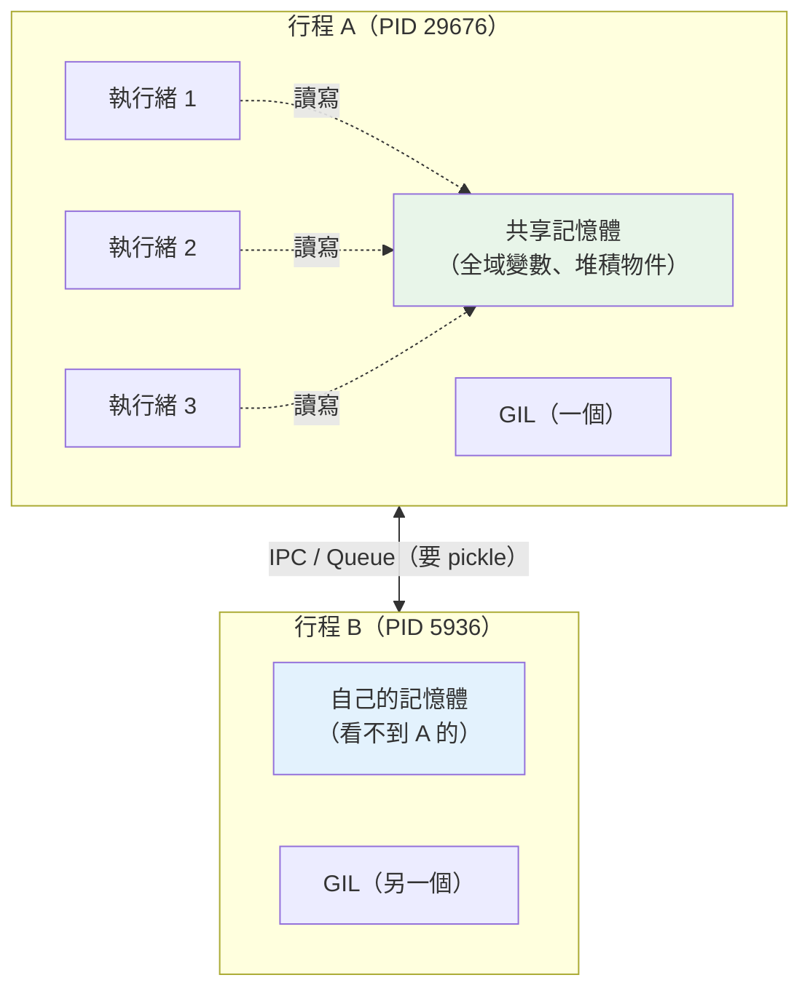

# Linux process 與 thread

> Process（行程）是「一間有自己房間的公司」，thread（執行緒）是「同一間公司裡的員工」。行程之間記憶體隔離，執行緒之間共享記憶體——這一個差別，就是 Part 9 併發模型的整個地基。

## 💡 白話導讀（建議先讀）

前面五章講網路(請求怎麼「送到」你的程式);這章換一個方向——
**你的程式在作業系統裡,到底是「什麼」?** 答案是:一個 **process(行程)**。

先建立兩個核心概念,用「公司」的比喻:

**Process（行程）＝一間獨立的公司。**
你 `python app.py`,作業系統就開了一間公司(一個行程),給它:
- **自己的辦公室(獨立記憶體)**——別間公司看不到、也動不到裡面的東西。
- **一個員工編號(PID)**——作業系統用它管理這間公司。
- **自己的檔案、連線**(檔案描述符,下一章講)。

**Thread（執行緒）＝公司裡的員工。**
一間公司(行程)可以請很多員工(執行緒)。他們:
- **共用同一間辦公室(共享記憶體)**——一個員工改了白板,其他員工都看得到。
- 但共用也有風險:兩個員工同時改同一塊白板,會**打架(race condition)**——所以要**排隊(鎖)**。

這個「行程隔離、執行緒共享」的差別,直接推導出 [Part 9 併發](../09-concurrency/README.md)的一切:

- **執行緒共享記憶體** → 溝通快,但要**鎖**、且受 **GIL** 限制(CPU 密集沒用)。
- **行程各自記憶體** → 能**繞過 GIL、真正並行**,但溝通要**序列化**傳資料(貴)。

所以 [Part 9 說「CPU 密集用 multiprocessing」](../09-concurrency/05-multiprocessing.md)——
現在你懂為什麼了:因為只有「開新公司(行程)」才有「自己的辦公室(繞過 GIL)」。

這一章用程式**親眼看到**:執行緒改得到主程式的 list、子行程動不到。

## Why（為什麼）

因為 **「你的服務跑幾個 process、每個幾個 thread」是部署的核心決策**,而它的依據就在這章。

- **`gunicorn -w 4`** 為什麼開 4 個 **worker**?每個 worker 是一個**行程**——
  多開幾個行程來**繞過 GIL、吃滿多核**(呼應 [Part 19](../19-cloud-native/03-gunicorn-uvicorn.md))。
- **為什麼多執行緒對 CPU 密集沒用**?因為執行緒共享一個直譯器、受 [GIL](../09-concurrency/02-gil.md) 限制——
  同一時刻只有一個能跑 Python。
- **為什麼行程間傳資料要 pickle**?因為記憶體隔離,得把資料**序列化**才能跨行程送。
- **記憶體用量**:100 個 worker 行程 vs 100 個執行緒,記憶體差很多(行程各自一份)。

**這一章決定你怎麼「配置」你的服務**——不懂它,`-w` 開幾個就只能瞎猜。

## Theory（理論：process 與 thread）

### Process（行程）

一個執行中的程式。作業系統給每個行程:

- **獨立的虛擬記憶體空間**——行程 A 看不到行程 B 的變數(隔離、安全)。
- **PID(process ID)**——唯一編號;`PPID` 是「父行程」的 PID。
- **自己的檔案描述符表、環境變數**。

### fork / exec（行程怎麼被生出來，Linux）

Linux 用兩個系統呼叫組合來啟動新程式:

- **`fork()`**:複製當前行程,得到一個幾乎一樣的**子行程**(copy-on-write,不是真的立刻複製整份記憶體)。
- **`exec()`**:把行程的內容**替換成另一個程式**。
- **典型組合**:shell 執行 `python app.py` = `fork()` 出一個子行程 → 在子行程裡 `exec("python")`。

> Windows 沒有 `fork`,用 `spawn`(從頭啟動新行程並重新 import)。這是為什麼 Python
> multiprocessing 的程式**一定要 `if __name__ == "__main__":` 保護**——否則 Windows 上會無限遞迴開行程。

### Thread（執行緒）

行程內的執行單元。一個行程可有多個執行緒,它們:

- **共享行程的記憶體**(全域變數、堆積上的物件)——所以溝通快,但要**同步(鎖)**。
- 各有自己的**呼叫堆疊**與程式計數器。

### 兩者對照

| | Process（行程） | Thread（執行緒） |
|---|-----------------|------------------|
| 記憶體 | **獨立**(隔離) | **共享** |
| 溝通 | 要序列化(IPC / pickle,貴) | 直接讀寫共享變數(快,但要鎖) |
| 建立成本 | 高 | 低 |
| 一個崩潰 | 不影響其他行程 | **可能拖垮整個行程** |
| Python 的 GIL | 各自有 GIL → **能並行** | 共享一個 GIL → CPU 密集**不能並行** |
| 適合 | CPU 密集([multiprocessing](../09-concurrency/05-multiprocessing.md)) | I/O 密集([threading](../09-concurrency/03-threading.md)) |

## Specification（規範:Python 裡開行程與執行緒）

```python
import os
import threading
import multiprocessing

os.getpid()      # 當前行程的 PID
os.getppid()     # 父行程的 PID

# 執行緒（共享記憶體）
t = threading.Thread(target=func, args=(shared_list,))
t.start(); t.join()

# 行程（獨立記憶體）——Windows 需要 __main__ 保護 + freeze_support
if __name__ == "__main__":
    p = multiprocessing.Process(target=func, args=(...,))
    p.start(); p.join()
    # 行程間傳資料要用 Queue / Pipe（背後會 pickle 序列化）
    q: multiprocessing.Queue = multiprocessing.Queue()
```

## Implementation（底層:為什麼「共享 vs 隔離」是 GIL 的前提）

把記憶體模型和 [Part 10 一切皆物件](../10-cpython-internals/01-everything-is-object.md) 接起來:

- **執行緒共享記憶體 → 共享同一批 Python 物件 → 共享同一個直譯器狀態(含引用計數)。**
  而引用計數要保護(多執行緒同時改會 race)——這正是 [GIL 存在的理由](../10-cpython-internals/08-gil-internals.md)。
  所以**執行緒受 GIL 限制、CPU 密集不能並行**。
- **行程隔離記憶體 → 各自一個 Python 直譯器 → 各自一個 GIL。**
  所以 **multiprocessing 能真正並行**(每個行程一顆 CPU 全速跑),
  但代價是「傳資料要 pickle 序列化 + 走 IPC」——因為記憶體不共享。

**一句話**:GIL 的問題只存在於「執行緒」(共享直譯器);開「行程」就每人一個 GIL,自然繞過。
下面的程式讓你親眼看到這個「共享 vs 隔離」。

## Code Example（可執行的 Python 範例）

同時用執行緒和行程,對比「共享記憶體」與「獨立記憶體」。

```python
# process_vs_thread.py —— 執行緒共享記憶體、行程各自記憶體
from __future__ import annotations

import multiprocessing
import os
import threading


def thread_worker(shared: list[int]) -> None:
    """執行緒：和主程式「共享」同一份記憶體 → 改得到。"""
    shared.append(threading.get_ident() % 1000)


def process_worker(queue: "multiprocessing.Queue[dict[str, object]]") -> None:
    """行程：有「自己」的記憶體與 PID → 改不到父行程的東西。"""
    local = [999]                    # 這是「子行程自己的」list
    local.append(123)
    queue.put({"child_pid": os.getpid(), "child_list": local})


def demo() -> None:
    print(f"【主程式】PID={os.getpid()}")

    print("\n【執行緒：共享記憶體】")
    shared: list[int] = []
    threads = [threading.Thread(target=thread_worker, args=(shared,)) for _ in range(3)]
    for t in threads:
        t.start()
    for t in threads:
        t.join()
    print(f"   3 個執行緒各 append 一個值 → 主程式的 list 變成: {shared}")
    print("   ← 執行緒改得到主程式的 list（同一份記憶體）")

    print("\n【行程：獨立記憶體】")
    parent_list = [1, 2, 3]
    queue: multiprocessing.Queue[dict[str, object]] = multiprocessing.Queue()
    proc = multiprocessing.Process(target=process_worker, args=(queue,))
    proc.start()
    result = queue.get()
    proc.join()
    print(f"   子行程 PID={result['child_pid']}（和主程式 {os.getpid()} 不同）")
    print(f"   子行程改了它自己的 list: {result['child_list']}")
    print(f"   主程式的 parent_list 仍是: {parent_list}  ← 子行程動不到（各自記憶體）")

    print("\n → 這就是 Part 9 的地基：")
    print("   執行緒共享記憶體 → 快、但要鎖 + 受 GIL 限制（CPU 密集沒用）")
    print("   行程各自記憶體 → 繞過 GIL、能並行，但要序列化才能傳資料（貴）")


if __name__ == "__main__":       # ← Windows 的 spawn 一定要這個保護
    multiprocessing.freeze_support()
    demo()
```

**預期輸出**（PID 與執行緒值每次不同）：

```pycon
$ python process_vs_thread.py
【主程式】PID=29676

【執行緒：共享記憶體】
   3 個執行緒各 append 一個值 → 主程式的 list 變成: [792, 544, 648]
   ← 執行緒改得到主程式的 list（同一份記憶體）

【行程：獨立記憶體】
   子行程 PID=5936（和主程式 29676 不同）
   子行程改了它自己的 list: [999, 123]
   主程式的 parent_list 仍是: [1, 2, 3]  ← 子行程動不到（各自記憶體）

 → 這就是 Part 9 的地基：
   執行緒共享記憶體 → 快、但要鎖 + 受 GIL 限制（CPU 密集沒用）
   行程各自記憶體 → 繞過 GIL、能並行，但要序列化才能傳資料（貴）
```

**兩段輸出的對比就是整章的重點**:

- **執行緒**:三個執行緒 append 進去,主程式的 `shared` 就**真的變成** `[792, 544, 648]`——
  因為它們**共享同一份記憶體**(同一個 list 物件)。
- **行程**:子行程的 PID **不同**(是另一間公司),它改了 `local` 變成 `[999, 123]`,
  但主程式的 `parent_list` **紋風不動**——因為**記憶體隔離**,子行程根本碰不到父行程的變數。
  它們只能透過 `Queue`(背後 pickle 序列化)**傳訊息**。

這正是 [Part 9](../09-concurrency/14-summary.md) 那句「**在算還是在等**」的物理基礎:
CPU 密集要並行 → 得開行程(各自 GIL);I/O 密集用執行緒就好(等待時會放掉 GIL)。

## Diagram（圖解:process 與 thread 的記憶體）



## Best Practice（最佳實踐）

- **多 worker 用行程**:`gunicorn -w N` 開 N 個行程吃滿多核(繞過 GIL);
  每 worker 內若是 I/O 密集,再用 async / 執行緒。
- **CPU 密集 → 行程,I/O 密集 → 執行緒/async**(見 [Part 9 決策](../09-concurrency/13-choosing-concurrency-model.md))。
- **multiprocessing 的程式一定加 `if __name__ == "__main__":`**——否則 Windows(spawn)會無限遞迴。
- **行程間別傳巨大物件**:要 pickle 序列化 + 複製,很貴;傳「指標式」的小資料或用共享記憶體。
- **worker 數量看核心數與工作型別**:CPU 密集約等於核心數;I/O 密集可以更多(它們大多在等)。

## Common Mistakes（常見誤解）

- **「多執行緒就會用滿多核」。** 在 CPython 不會——執行緒共享一個 **GIL**,
  CPU 密集時同一刻只有一個能跑。要吃滿多核用**多行程**。
- **「行程和執行緒差不多」。** 差很多:**記憶體隔離 vs 共享**是本質差異,
  它決定了溝通成本、崩潰影響範圍、以及能不能繞過 GIL。
- **「子行程能直接改父行程的變數」。** 不能。記憶體隔離,子行程拿到的是**複本**;
  要傳回結果得用 `Queue`/`Pipe`/共享記憶體。
- **「執行緒共享記憶體所以很方便」。** 方便也危險:兩個執行緒同時改同一個變數會 **race condition**,
  要用鎖([Part 9](../09-concurrency/04-thread-sync.md))——而鎖用錯會死鎖。
- **「開越多 worker/thread 越快」。** 超過某個點(核心數、連線數),
  上下文切換與資源競爭反而拖慢。要量測([Part 18](../18-performance/01-profiling.md))。

## Interview Notes（面試重點）

- **「process 和 thread 差在哪?」**
  「**行程有獨立記憶體**(隔離、崩潰不互相影響、要 IPC 溝通);
  **執行緒共享行程的記憶體**(溝通快、但要同步、一個崩潰可能拖垮整個行程)。
  建立行程比執行緒貴。」
- **「為什麼 Python 多執行緒不能利用多核?」**
  「因為執行緒**共享一個直譯器與 GIL**,GIL 保護引用計數等狀態,同一刻只有一個執行緒能執行 bytecode。
  要真正並行用 **multiprocessing**——每個行程有自己的 GIL。」
- **「fork 和 exec?」**
  「`fork()` 複製當前行程成子行程(copy-on-write);`exec()` 把行程內容替換成另一個程式。
  shell 跑一個指令 = fork 出子行程 → 在子行程 exec 那個程式。Windows 沒 fork,用 spawn。」
- **「gunicorn 的 worker 是行程還是執行緒?為什麼?」**
  「預設是**行程**(`-w N` 開 N 個)。因為要**繞過 GIL、吃滿多核**——每個 worker 行程各自有 GIL,
  能真正並行處理請求。每個 worker 內部再視情況用 async(如 UvicornWorker)處理 I/O 並發。」
- **「行程間怎麼溝通?為什麼比執行緒麻煩?」**
  「因為記憶體隔離,要用 **IPC**:Queue、Pipe、共享記憶體、socket——資料通常要**序列化(pickle)**
  才能跨行程傳。執行緒直接讀寫共享變數就好(但要鎖)。這是『隔離 vs 共享』的代價與好處。」

---

➡️ 下一章：檔案描述符與 I/O（撰寫中，先回索引）

[⬆️ 回 Part 0 索引](README.md)
