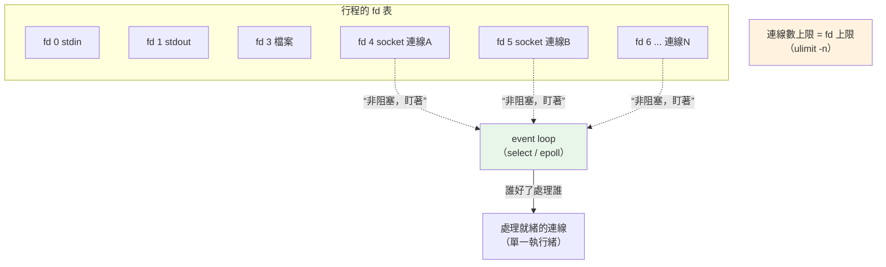

# 檔案描述符與 I/O

> 在 Unix，「一切皆檔案」——檔案、socket、管線，作業系統都用一個小小的整數（檔案描述符 fd）來代表。看懂 fd，你就懂了「連線數上限」是什麼、以及 asyncio 憑什麼能用一個執行緒撐上千個連線。

## 💡 白話導讀（建議先讀）

[上一章](06-process-thread.md)說每個行程有「自己的檔案描述符表」。這章講清楚 **fd 是什麼**。

先建立一個 Unix 的核心哲學:**一切皆檔案。**

聽起來玄,其實很實用。作業系統對「開啟的東西」——不管是磁碟上的檔案、網路 socket、
還是行程間的管線——**一律發一張號碼牌**,叫 **檔案描述符(file descriptor,fd)**,就是一個**小整數**。

用一個生活比喻:**餐廳的取餐號碼牌。**

- 你點餐(開一個檔案 / 開一個 socket),櫃檯給你一個**號碼牌**(fd)。
- 之後你要拿餐、加點,都報這個號碼——**櫃檯不在乎你點的是牛排還是咖啡,只認號碼牌**。
- 對 OS 也一樣:不管 fd 背後是檔案還是網路連線,**都用同一套 `read()` / `write()` 操作**。

有三個號碼牌是**永遠佔著的**:`fd 0`=標準輸入、`fd 1`=標準輸出、`fd 2`=標準錯誤。
(這就是為什麼 `2>&1` 是「把 fd 2 導到 fd 1」——把錯誤和輸出合流。)

為什麼後端要懂這個?因為它解釋兩件超重要的事:

- **「連線數上限」其實是「fd 數上限」**。每條網路連線佔一個 fd,而一個行程能開的 fd 有上限
  (`ulimit -n`)。高並發服務爆 `Too many open files`,就是 fd 用光了。
- **asyncio 憑什麼一個執行緒撐上千連線?** 靠「**非阻塞 fd + 一個迴圈盯著上千個 fd**」——
  這一章會讓你看到這個機制的雛形。

這一章用程式讓你**親眼看到**:檔案、socket、pipe 都拿到 fd 號碼牌;
以及「阻塞」和「非阻塞」的 I/O 差在哪。

## Why（為什麼）

因為 **fd 是「連線數」「asyncio」「檔案洩漏」這三個後端主題的共同底層。**

- **`Too many open files`**:高並發下的經典錯誤。根因是 fd 用光——
  可能是連線沒關(洩漏)、或 `ulimit` 設太低。不懂 fd,你不知道往哪查。
- **asyncio 的原理**:[Part 9](../09-concurrency/07-asyncio-basics.md) 說 event loop「等 I/O 時去做別的」——
  它怎麼「等」?就是把一堆 fd 設成非阻塞,用 `select`/`epoll` 一次盯著全部,誰好了處理誰。
- **檔案/連線一定要關**:每個沒關的 fd 都佔著一個號碼牌——
  這是 [Part 6 用 `with` 保證關閉](../06-error-handling/06-context-manager.md) 的實際理由。
- **`2>&1`、管線 `|`**:shell 的重導與管線,本質都是在操作 fd(下一章的 shell 會用到)。

## Theory（理論：fd 與 I/O 模型）

### 檔案描述符（fd）

- 一個**非負整數**,代表「行程開啟的某個資源」。
- 每個行程有**自己的一張 fd 表**(呼應[上一章](06-process-thread.md)行程隔離)。
- `0`/`1`/`2` = stdin/stdout/stderr,行程一啟動就開好。
- 你 `open()` 一個檔案、`socket()` 一個連線、`os.pipe()` 一個管線——都拿到新的 fd。

### 「一切皆檔案」的意義

檔案、socket、pipe、終端機……對 OS 都是「可讀寫的 fd」,共用同一套系統呼叫:

```text
open() / socket() / pipe()   → 拿到 fd
read(fd) / write(fd)          → 讀寫（不管背後是什麼）
close(fd)                     → 歸還號碼牌
```

**好處**:一套 API 統管所有 I/O,這也是為什麼 Python 的 `socket` 和檔案物件用起來很像。

### 阻塞 vs 非阻塞 I/O

這是理解 asyncio 的關鍵區分:

| | 阻塞（blocking，預設） | 非阻塞（non-blocking） |
|---|----------------------|----------------------|
| 沒資料時 | **卡住等**(執行緒停在那) | **立刻返回**(拋 `BlockingIOError` 或回空) |
| 一個執行緒 | 一次只能等一件事 | 可以輪流問很多件事「好了沒」 |
| 適合 | 簡單、單一連線 | 高並發(一個執行緒管很多連線) |

### I/O 多工（asyncio 的核心）

一個執行緒要同時「等」上千個連線,不可能對每個都阻塞等。解法是 **I/O 多工(multiplexing)**:

```text
把上千個 fd 都設成「非阻塞」
    ↓
用一個系統呼叫（select / poll / epoll / kqueue）
「同時盯著這上千個 fd，告訴我『哪些好了』」
    ↓
只處理好了的那幾個，其餘繼續等
    ↓
迴圈
```

**這就是 event loop**。asyncio 底層(透過 libuv 之於 Node、selectors 之於 Python)就在做這件事——
所以它能**用單一執行緒服務上千連線**:因為它從不「卡著等某一個」,而是「盯著全部,誰好處理誰」。

## Specification（規範:Python 裡操作 fd）

```python
import os
import socket

# 每個開啟的資源都有 fd
f = open("file.txt")
f.fileno()          # 這個檔案的 fd（一個小整數）

s = socket.socket()
s.fileno()          # 這個 socket 的 fd

r, w = os.pipe()    # 管線：回傳（讀端 fd, 寫端 fd）

# 設定非阻塞
s.setblocking(False)   # 之後的 recv/accept 沒資料就立刻拋 BlockingIOError

# 標準串流的 fd 是固定的
import sys
sys.stdin.fileno()    # 0
sys.stdout.fileno()   # 1
sys.stderr.fileno()   # 2
```

> Python 高階的 `selectors` 模組就是對 `select`/`epoll` 的封裝,asyncio 底層用它。

## Implementation（底層:一個連線 = 一個 fd）

把 fd 和前面幾章接起來,你會看到一條完整的線:

- [ch02](02-tcp-udp.md) 說「TCP 連線是核心維護的狀態」——**在你的行程這一端,那條連線就是一個 fd**。
- 所以「這台伺服器能同時服務多少連線」= 「這個行程能開多少 fd」= `ulimit -n`(常見預設 1024,生產調高)。
- **連線沒關 = fd 沒歸還**:累積到上限就 `Too many open files`,新連線建不了。
  這是為什麼 [`with`](../06-error-handling/06-context-manager.md) 這麼重要——它保證 fd 被歸還。
- **asyncio 的 event loop** 把這些 fd 設成非阻塞,用 selectors 一次盯著全部——
  這就是「單執行緒高並發」的物理基礎。

下面的程式讓你親眼看到 fd 號碼牌,以及阻塞/非阻塞的差別。

## Code Example（可執行的 Python 範例）

```python
# file_descriptor.py —— 一切皆 fd + 阻塞 vs 非阻塞
from __future__ import annotations

import os
import socket
import sys
import tempfile


def show_fds() -> None:
    """檔案、socket、pipe 都拿到一個 fd 號碼牌。"""
    print("【一切皆檔案描述符（fd）】")
    print(f"   stdin=fd {sys.stdin.fileno()}, "
          f"stdout=fd {sys.stdout.fileno()}, "
          f"stderr=fd {sys.stderr.fileno()}  （三個永遠開著）")

    with tempfile.NamedTemporaryFile(delete=False) as tmp:
        path = tmp.name
    file = open(path, "w", encoding="utf-8")
    print(f"   開一個檔案    → fd {file.fileno()}")

    sock = socket.socket(socket.AF_INET, socket.SOCK_STREAM)
    print(f"   開一個 socket → fd {sock.fileno()}  ← 網路連線也是『檔案』")

    read_fd, write_fd = os.pipe()
    print(f"   開一個 pipe   → 讀端 fd {read_fd}, 寫端 fd {write_fd}")

    print("   → 檔案、socket、pipe 對 OS 都是『可讀寫的 fd』，用同一套 read/write。")
    print("     所以「連線數上限」其實是「fd 數上限」（ulimit -n）——每條連線佔一個 fd。")

    # 歸還所有 fd（不關就是洩漏）
    file.close()
    sock.close()
    os.close(read_fd)
    os.close(write_fd)
    os.unlink(path)


def show_blocking() -> None:
    """阻塞 vs 非阻塞 I/O —— asyncio 的地基。"""
    print("\n【阻塞 vs 非阻塞 I/O】")
    srv = socket.socket(socket.AF_INET, socket.SOCK_STREAM)
    srv.setsockopt(socket.SOL_SOCKET, socket.SO_REUSEADDR, 1)
    srv.bind(("localhost", 0))
    srv.listen(1)
    srv.setblocking(False)                 # 設成非阻塞
    try:
        srv.accept()                       # 沒人連 → 立刻拋例外，不卡住
    except BlockingIOError:
        print("   非阻塞 accept()：沒人連 → 立刻拋 BlockingIOError，不卡住")
    print("   阻塞 accept()（預設）：沒人連 → 執行緒會『卡在這裡等』")
    print("   → asyncio 的祕密：一堆非阻塞 fd + 一個迴圈（select/epoll）盯著全部，")
    print("     誰好了處理誰 —— 單執行緒服務上千連線的原理。")
    srv.close()


def demo() -> None:
    show_fds()
    show_blocking()


if __name__ == "__main__":
    demo()
```

**預期輸出**（fd 號碼依系統而異；Linux 上通常是連續小整數，Windows 的 socket fd 會是大數字）：

```pycon
$ python file_descriptor.py
【一切皆檔案描述符（fd）】
   stdin=fd 0, stdout=fd 1, stderr=fd 2  （三個永遠開著）
   開一個檔案    → fd 3
   開一個 socket → fd 4  ← 網路連線也是『檔案』
   開一個 pipe   → 讀端 fd 5, 寫端 fd 6
   → 檔案、socket、pipe 對 OS 都是『可讀寫的 fd』，用同一套 read/write。
     所以「連線數上限」其實是「fd 數上限」（ulimit -n）——每條連線佔一個 fd。

【阻塞 vs 非阻塞 I/O】
   非阻塞 accept()：沒人連 → 立刻拋 BlockingIOError，不卡住
   阻塞 accept()（預設）：沒人連 → 執行緒會『卡在這裡等』
   → asyncio 的祕密：一堆非阻塞 fd + 一個迴圈（select/epoll）盯著全部，
     誰好了處理誰 —— 單執行緒服務上千連線的原理。
```

**兩段輸出串起本章**:

- **fd 號碼牌**:stdin/out/err 佔了 0/1/2,接著開的檔案(3)、socket(4)、pipe(5/6)
  各拿一個號碼——**對 OS 全是「可讀寫的 fd」**,不分是檔案還是連線。
  所以「一台伺服器能撐多少連線」= 「能開多少 fd」。
- **非阻塞 `accept()` 立刻拋例外、不卡住**——這就是 asyncio 的原料:
  不阻塞地問「好了沒」,把「等」這件事交給一個迴圈統一盯著上千個 fd。

## Diagram（圖解:fd 與 event loop）



## Best Practice（最佳實踐）

- **開了一定關**:每個檔案、socket、連線都佔 fd。用 [`with`](../06-error-handling/06-context-manager.md)
  或連線池確保歸還——**fd 洩漏是高並發服務掛掉的常見原因**。
- **高並發服務調高 `ulimit -n`**:預設常是 1024,對接上萬連線的服務不夠。
- **I/O 密集用 asyncio**:它的本質是「非阻塞 fd + event loop」,一個執行緒撐大量連線
  (見 [Part 9](../09-concurrency/07-asyncio-basics.md))。
- **別在 async 裡做阻塞 I/O**:阻塞的 `open()`/`requests` 會卡住整個 event loop——
  這正是 [Part 9 的頭號殺手](../09-concurrency/11-blocking-in-async.md),
  用 fd 的角度看:你讓那個「盯著全部的迴圈」停下來了。

## Common Mistakes（常見誤解）

- **「fd 是檔案專用的」。** 不是。**socket、pipe、終端機都是 fd**——Unix「一切皆檔案」。
- **「連線用完不關沒差」。** 每個沒關的連線佔一個 fd,累積到上限就 `Too many open files`。
- **「`Too many open files` 是磁碟問題」。** 不是,是 **fd 用光**(常是 socket 連線洩漏 + `ulimit` 太低)。
- **「非阻塞 = 比較快」。** 不是更快,是**不卡住**——它讓一個執行緒能同時照顧很多 fd,
  提升的是**並發**,不是單一操作的速度。
- **「asyncio 是多執行緒」。** 不是。它是**單執行緒 + 非阻塞 fd + event loop**——
  靠「盯著全部、誰好處理誰」達到高並發,不是靠多開執行緒。

## Interview Notes（面試重點）

- **「什麼是檔案描述符?」**
  「作業系統給每個『開啟的資源』(檔案、socket、pipe)的一個**非負整數**代號。
  Unix『一切皆檔案』——都用同一套 `read`/`write`/`close`。`0`/`1`/`2` 是 stdin/out/err。」
- **「`Too many open files` 怎麼來的、怎麼查?」**
  「**fd 用光了**。每條連線/每個開啟的檔案佔一個 fd,一個行程有上限(`ulimit -n`)。
  常見原因:**連線/檔案沒關(洩漏)** 或 `ulimit` 設太低。查:`lsof -p <pid>` 看開了哪些 fd。」
- **「asyncio 怎麼用一個執行緒撐上千連線?」**
  「靠 **I/O 多工**:把所有連線的 fd 設成**非阻塞**,用一個系統呼叫(`epoll`/`select`)
  **同時盯著全部**,只處理『就緒』的那幾個,其餘繼續等——這就是 event loop。
  它從不『卡著等某一個』,所以單執行緒也能高並發。」
- **「阻塞和非阻塞 I/O 差在哪?」**
  「阻塞:沒資料時**執行緒卡住等**;非阻塞:**立刻返回**(拋 `BlockingIOError` 或回空),
  讓執行緒能去問別的 fd。非阻塞是 event loop 的前提。」
- **「為什麼 async 裡不能用阻塞 I/O?」**
  「event loop 是**單執行緒**;一個阻塞呼叫會讓那個『盯著全部 fd 的迴圈』停下來,
  於是**所有連線都卡住**。要用 async 版本,或把阻塞工作丟到執行緒
  ([Part 9](../09-concurrency/11-blocking-in-async.md))。」

---

➡️ 下一章：[訊號與程序生命週期](08-signals-lifecycle.md)

[⬆️ 回 Part 0 索引](README.md)
