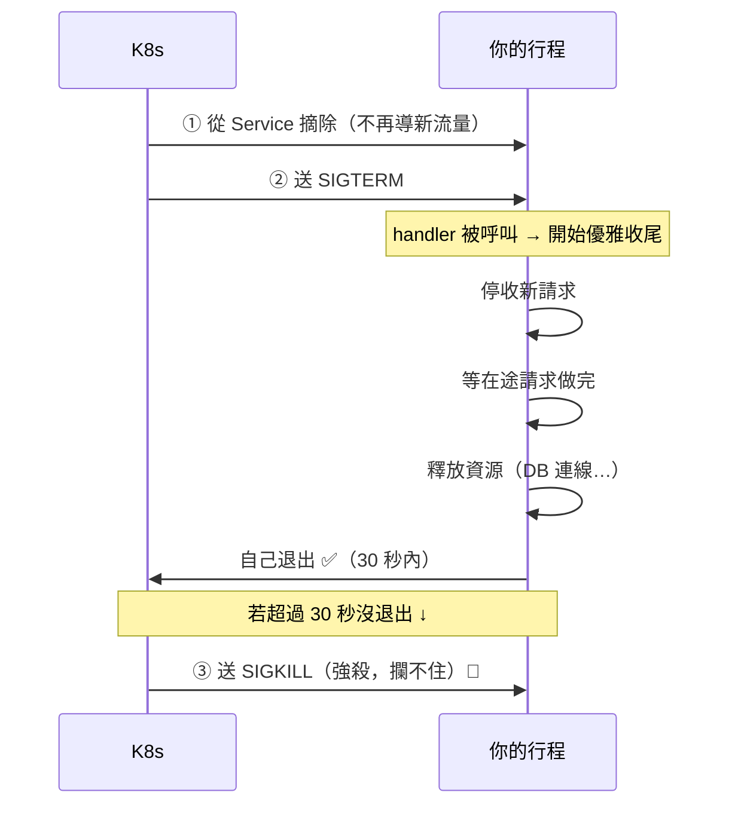

# 訊號與程序生命週期

> 訊號（signal）是作業系統「戳」一個行程的方式。其中最重要的是 `SIGTERM`——它是「請你優雅地關閉」的禮貌通知，而不是「立刻斷電」。這一章，終於把 Part 19「優雅關閉」用到的 `SIGTERM` 從頭講清楚。

## 💡 白話導讀（建議先讀）

你在 [Part 19 優雅關閉](../19-cloud-native/07-graceful-shutdown.md) 看過 `SIGTERM`,
但那時只知道「要攔截它」。這一章補上它的地基:**訊號到底是什麼。**

**訊號 = 作業系統戳你一下。**

作業系統(或別的行程、或你按 Ctrl+C)想通知一個正在跑的行程「發生了某件事」,
就送它一個**訊號**——一個很簡短的通知,像**拍一下你的肩膀**。

不同的「拍法」代表不同的意思:

- **`SIGTERM`(15)= 禮貌地說「準備打烊囉」。**
  這是 K8s、Docker、`kill` 預設送的訊號。**它可以被攔截、也應該被攔截**——
  你收到後,可以**從容地收尾**(把手上的客人服務完、鎖門、關燈)再退出。
- **`SIGKILL`(9)= 直接拔插頭。**
  **攔不住、救不了**——行程當場死亡,手上的事全部中斷。
  K8s 送出 SIGTERM 後,若你**30 秒內沒自己退出**,才會用它強殺。
- **`SIGINT`(2)= 你按了 Ctrl+C。** 開發時最常見,通常也觸發優雅關閉。

用一個生活比喻:**餐廳打烊。**

- `SIGTERM` 就像老闆說「準備打烊」——你**掛出「暫停營業」的牌子**(不再收新客人)、
  **讓在座的客人吃完**、**收拾廚房、關瓦斯**,然後鎖門。這是有 SOP 的。
- `SIGKILL` 就像直接**跳電**——客人吃到一半、瓦斯還開著、門也沒鎖。一團亂。

所以「優雅關閉」的全部意義,就是:**在 SIGTERM 到 SIGKILL 之間的 30 秒,把打烊 SOP 走完。**

這一章用程式**實際攔截一個 SIGTERM**,演示這個優雅關閉的流程。

## Why（為什麼）

因為 **「換版部署時使用者收到 502」的頭號原因,就是沒處理好 SIGTERM。**

雲原生時代,你的服務**隨時會被關閉再重啟**(換版、縮容、搬機器)。每次關閉,
K8s 都送 `SIGTERM`。如果你的程式:

- **沒攔截 SIGTERM** → 走預設行為(直接終止)→ **在途的請求被硬生生切斷** → 使用者看到 502。
- **攔截了但收尾太慢**(超過寬限期)→ 被 `SIGKILL` 強殺 → 一樣切斷請求。

反之,正確處理 SIGTERM 的服務,換版時**使用者完全無感**——這是[零停機部署](../19-cloud-native/07-graceful-shutdown.md)的基礎。

而且這不只 web 服務:背景 worker、消費訊息佇列的程式、排程任務——
**任何長時間執行的行程,都該優雅地回應關閉訊號**,否則可能在「處理到一半」時被砍,造成資料不一致。

## Theory（理論：訊號與生命週期）

### 常見訊號

| 訊號 | 編號 | 意思 | 可攔截? | 典型場景 |
|------|------|------|---------|----------|
| **SIGTERM** | 15 | 「請優雅關閉」 | ✅ **應該攔** | K8s/Docker/`kill` 預設 |
| **SIGKILL** | 9 | 「立刻強制終止」 | ❌ **攔不住** | 寬限期後強殺、`kill -9` |
| **SIGINT** | 2 | Ctrl+C 中斷 | ✅ | 開發時終端機 |
| SIGHUP | 1 | 終端關閉 / 重載設定 | ✅ | 常用於「重讀設定檔」 |
| SIGCHLD | 17 | 子行程結束 | ✅ | 父行程回收子行程 |

**關鍵區分**:`SIGTERM` 可攔截(給你機會收尾),`SIGKILL` 不可(最後手段)。

### 行程的生命週期

```text
建立（fork/spawn）→ 執行 → 收到訊號 →（可能）處理 → 結束
                                    │
                    SIGTERM: 攔截 → 優雅收尾 → 自己退出
                    SIGKILL: 無法攔截 → 當場死亡
```

### K8s 關閉一個 Pod 的完整流程

這是 Part 19 那張圖的底層,現在你有訊號的概念可以看懂:

```text
1. K8s 決定關閉 Pod
2. 把 Pod 從 Service 摘除（不再導新流量進來）——但有傳播延遲
3. 送 SIGTERM 給你的行程 ────► 你的 handler 被呼叫
4. （你的責任）優雅收尾：停收新請求 → 等在途做完 → 釋放資源 → 退出
5. 若 grace period（預設 30 秒）內沒退出 → 送 SIGKILL 強殺
```

**所以你的程式要做的,就是攔截第 3 步的 SIGTERM,在第 5 步的大限之前把第 4 步做完。**

## Specification（規範:Python 裡處理訊號）

```python
import signal

def handle_sigterm(signum: int, frame) -> None:
    # 收到 SIGTERM 時執行這裡：開始優雅收尾
    ...

# 註冊：把預設行為換成自訂 handler
signal.signal(signal.SIGTERM, handle_sigterm)
signal.signal(signal.SIGINT, handle_sigterm)   # Ctrl+C 也一起處理

# 對自己發訊號（測試用）
signal.raise_signal(signal.SIGTERM)   # Python 3.8+
```

**限制**:
- **SIGKILL 無法註冊 handler**——`signal.signal(signal.SIGKILL, ...)` 會報錯。這是刻意的。
- **訊號 handler 要快、要簡單**:它可能在任何時刻打斷主程式,別在裡面做複雜的事——
  通常只是「設一個旗標」,讓主迴圈自己去收尾。
- Windows 對訊號的支援較有限(SIGTERM/SIGINT 可用,但不像 Unix 完整)。

## Implementation（底層:handler 怎麼打斷你的程式）

訊號是**非同步**的——它可能在你的程式執行到**任何一行**時到達。作業系統會:

1. 暫停你的行程當前的執行。
2. 跳去執行你註冊的 handler。
3. handler 返回後,回到原本被打斷的地方繼續。

這帶來一個重要限制:**handler 裡不能做太多事**(尤其不能做不可重入的操作)。
所以慣例是:**handler 只設一個旗標**(如 `self.running = False`),
主迴圈看到旗標變了,自己去做真正的收尾——這樣收尾在「正常的執行流」裡進行,安全。

FastAPI/Uvicorn、gunicorn 都內建了 SIGTERM 處理(透過 lifespan / worker 管理),
但**理解底下這個機制**,你才知道「為什麼 Docker 的 `CMD` 要用 exec 形式」
(見下方 Common Mistakes)、以及自己寫背景 worker 時該怎麼做。

下面的程式實際攔截一個 SIGTERM,演示優雅關閉。

## Code Example（可執行的 Python 範例）

```python
# graceful_shutdown.py —— 攔截 SIGTERM，走優雅關閉
from __future__ import annotations

import signal
from types import FrameType


class Server:
    """模擬一個服務：收到 SIGTERM 走優雅關閉，不是直接斷電。"""

    def __init__(self) -> None:
        self.running = True
        self.shutdown_log: list[str] = []

    def handle_sigterm(self, signum: int, frame: FrameType | None) -> None:
        """SIGTERM handler：準備打烊的 SOP（可攔截、應攔截）。"""
        name = signal.Signals(signum).name
        self.shutdown_log.append(f"收到 {name}（訊號 {signum}）")
        self.shutdown_log.append("1. 停止接受新請求")
        self.shutdown_log.append("2. 等在途請求做完")
        self.shutdown_log.append("3. 關閉 DB 連線、釋放資源")
        self.running = False        # 慣例：handler 只設旗標，讓主迴圈去收尾


def demo() -> None:
    server = Server()
    # 註冊：把預設行為（直接終止）換成我們的優雅關閉
    signal.signal(signal.SIGTERM, server.handle_sigterm)

    print("【服務執行中】running =", server.running)

    print("\n【K8s 送出 SIGTERM（準備打烊，不是斷電）】")
    signal.raise_signal(signal.SIGTERM)     # 對自己發 SIGTERM，觸發 handler

    for line in server.shutdown_log:
        print(f"   {line}")
    print(f"\n【關閉後】running = {server.running}  ← 優雅退場，沒有請求被硬切斷")

    print("\n【對照】訊號的兩種脾氣：")
    print("   SIGTERM(15)：可攔截 → 用來做優雅關閉的 SOP")
    print("   SIGKILL(9) ：攔不住、救不了 → K8s 寬限期（預設 30s）後才用它強殺")
    print("   SIGINT(2)  ：Ctrl+C，開發時常見，通常也觸發優雅關閉")


if __name__ == "__main__":
    demo()
```

**預期輸出**：

```pycon
$ python graceful_shutdown.py
【服務執行中】running = True

【K8s 送出 SIGTERM（準備打烊，不是斷電）】
   收到 SIGTERM（訊號 15）
   1. 停止接受新請求
   2. 等在途請求做完
   3. 關閉 DB 連線、釋放資源

【關閉後】running = False  ← 優雅退場，沒有請求被硬切斷

【對照】訊號的兩種脾氣：
   SIGTERM(15)：可攔截 → 用來做優雅關閉的 SOP
   SIGKILL(9) ：攔不住、救不了 → K8s 寬限期（預設 30s）後才用它強殺
   SIGINT(2)  ：Ctrl+C，開發時常見，通常也觸發優雅關閉
```

**這段輸出就是 [Part 19 優雅關閉](../19-cloud-native/07-graceful-shutdown.md) 的地基**:

- **`raise_signal(SIGTERM)` 觸發了 handler**——如果沒註冊,預設行為會直接終止行程
  (在途請求就被切斷)。攔截它,你才有機會走收尾 SOP。
- **收尾是有順序的**:先停收新請求(止血)→ 等在途做完 → 才釋放資源。
  順序錯了(例如先關 DB)會讓在途請求失敗。
- **`running` 從 `True` 變 `False`**——handler 只做了「設旗標」這件輕量的事,
  真正的收尾邏輯由主迴圈依這個旗標進行(這是訊號處理的安全慣例)。
- **SIGTERM vs SIGKILL**:一個給你機會收尾,一個直接拔電——這條界線就是「30 秒寬限期」的意義。

## Diagram（圖解:SIGTERM 到 SIGKILL 的關閉窗口）



## Best Practice（最佳實踐）

- **攔截 SIGTERM 做優雅關閉**:止血(停收新請求)→ 排空(等在途)→ 釋放(資源)→ 退出。
  web 服務靠 [FastAPI lifespan](../19-cloud-native/07-graceful-shutdown.md);背景 worker 自己處理。
- **handler 只做輕量的事**(設旗標),真正收尾交給主迴圈——訊號隨時會打斷,別在 handler 裡做複雜操作。
- **收尾要在寬限期內完成**(K8s 預設 30 秒)。收尾太久 → 被 SIGKILL 強殺,前功盡棄。
- **Docker 用 exec 形式的 CMD**:`CMD ["python", "app.py"]` 而非 `CMD python app.py`——
  否則訊號送給的是 shell(PID 1),你的 Python 收不到(見下)。
- **SIGKILL 是最後手段,不是常規**:如果你常需要 `kill -9`,代表你的優雅關閉沒做好。

## Common Mistakes（常見誤解）

- **「SIGTERM 就是直接終止」。** 不是——它是**可攔截的「請優雅關閉」通知**。
  直接終止(且攔不住)的是 **SIGKILL**。
- **「Docker 的 `CMD python app.py` 沒差」。** 差很大。**shell 形式**會讓 shell 當 PID 1,
  訊號送給 shell 而**不轉發給 Python**——你的 handler 根本收不到,30 秒後被 SIGKILL。
  用 **exec 形式** `CMD ["python", "app.py"]`,Python 才是 PID 1、才收得到訊號。
- **「在 handler 裡做完所有收尾」。** 危險。handler 可能打斷任何操作,
  複雜工作應該只「設旗標」,讓主迴圈安全地收尾。
- **「優雅關閉只有 web 服務要做」。** 背景 worker、佇列消費者、排程任務**都要**——
  否則可能在「處理到一半」被砍,造成資料不一致。
- **「readiness 摘除後就能立刻關」。** K8s 摘除 Service 有**傳播延遲**,
  收到 SIGTERM 後最好**先小睡幾秒**再開始關,避免還有零星請求正在進來。

## Interview Notes（面試重點）

- **「SIGTERM 和 SIGKILL 差在哪?」**
  「**SIGTERM(15)可攔截**,是『請優雅關閉』的禮貌通知——你可以收尾再退出。
  **SIGKILL(9)攔不住、救不了**,行程當場死亡。K8s 先送 SIGTERM,**寬限期(預設 30s)內沒退出才送 SIGKILL**。」
- **「優雅關閉(graceful shutdown)怎麼做?」**
  「攔截 SIGTERM,依序:① **停收新請求**(readiness 轉紅,先止血)→ ② **等在途請求做完** →
  ③ **釋放資源**(DB 連線、背景任務)→ ④ 自己退出。全部要在寬限期內完成。」
- **「為什麼 Docker 的 CMD 要用 exec 形式?」**
  「shell 形式(`CMD python app.py`)會讓 **shell 當 PID 1**,訊號送給 shell 但**不轉發給 Python**,
  於是你的 SIGTERM handler 收不到,30 秒後被強殺。exec 形式(`CMD ["python","app.py"]`)
  讓 **Python 直接當 PID 1**,才收得到訊號。」
- **「訊號 handler 裡該做什麼、不該做什麼?」**
  「**該做**:設一個旗標(如 `running=False`)。**不該做**:複雜或不可重入的操作——
  因為訊號可能在**任何一行**打斷主程式,handler 裡做太多有風險。真正的收尾交給主迴圈看旗標處理。」
- **「除了 web 服務,還有什麼要處理關閉訊號?」**
  「**所有長時間執行的行程**:背景 worker、訊息佇列消費者、排程任務。否則可能在『處理到一半』
  被砍,造成資料不一致(如訊息已消費但沒 ack、交易做一半)。」

---

➡️ 下一章：[shell、環境變數與常用診斷](09-shell-env-diagnostics.md)

[⬆️ 回 Part 0 索引](README.md)
