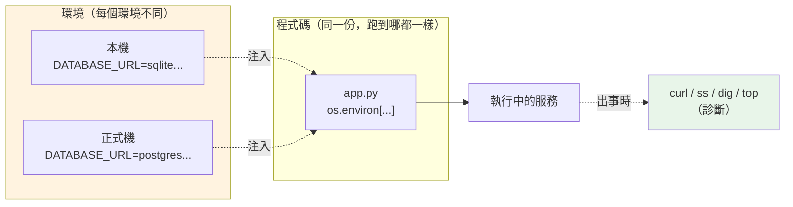

# shell、環境變數與常用診斷

> 你的程式不是活在真空裡——它被一個 shell 啟動、從環境變數讀設定、在出事時要靠幾個指令查清楚「到底卡在哪」。這章補齊這層「程式與作業系統之間的介面」,讓你能把前八章學到的東西真的**部署起來、出事時查得動**。

## 💡 白話導讀（建議先讀）

前面八章講的是「網路與 OS 怎麼運作」。這一章講**你這個 Python 後端工程師每天實際會敲的東西**:
啟動程式的那行指令、餵給程式的設定、以及「線上出事了怎麼查」。

先講三個最常搞混的角色。

**1. shell 是什麼?** 就是你打開終端機後,那個**等你打指令的程式**(Windows 的
PowerShell、Mac/Linux 的 bash / zsh)。你敲 `python app.py`,是 shell 幫你:
找到 `python` 這支程式 → 開一個新行程 → 把 `app.py` 當參數傳進去。
[ch06](06-process-thread.md) 說「程式要跑起來得先 fork+exec」——**按下 Enter 的那個 shell,就是那個 fork+exec 的人**。

**2. 環境變數是什麼?** 想成**「貼在行程身上的便條」**。shell 啟動你的程式時,會順手把一疊
key=value 的便條塞給它;程式裡用 `os.environ["DATABASE_URL"]` 就能讀。
為什麼不直接寫在程式碼裡?因為**同一份程式碼要跑在很多環境**——你的筆電、測試機、正式機,
資料庫位址、密碼、開不開 debug 全都不同。把這些「會變的東西」抽成環境變數,
程式碼一個字都不用改,換台機器只要換便條。這就是業界說的 **12-factor**「設定與程式碼分離」。

**3. 常用診斷是什麼?** 線上服務半夜掛了,你 SSH 上去,不可能重開 IDE 慢慢 debug。
你會敲幾個「一句話看真相」的指令:這個 port 有人在聽嗎?這台連得到那台嗎?
CPU/記憶體爆了嗎?這章把這幾把「救火用的瑞士刀」一次교給你,並對照它們背後正是前幾章的觀念。

一個生活比喻串起來:

- **shell** = 餐廳的**帶位員**:你(使用者)說要幾位,他帶你入座、把你交給服務生(啟動行程)。
- **環境變數** = 貼在桌上的**點餐備註**(「不要香菜、加辣」):同一套廚房流程(程式碼),
  靠備註(設定)服務不同客人(環境)。
- **診斷指令** = 出餐慢時,店長走進廚房問的那幾句:「哪一鍋卡住?爐子還開著嗎?」

這一章的可執行範例,會示範**如何正確地從環境變數讀設定**——包含「缺了必要設定就開機即失敗」
這個後端最重要的紀律。

## 🎯 什麼時候會用到

- **部署任何服務時**:資料庫連線字串、API 金鑰、`PORT`、`DEBUG`——全部走環境變數,
  絕不寫死在程式碼(更絕不 commit 進 git)。這是每一個 Dockerfile、每一份 K8s manifest 的日常。
- **同一份程式碼跑多環境**:本機用 SQLite、正式機用 Postgres,靠 `DATABASE_URL` 一個變數切換。
- **線上出事的第一個五分鐘**:`curl` 打健康檢查、`ss`/`netstat` 看 port、`ping`/`dig` 查連線與 DNS、
  `top`/`ps` 看資源、`tail -f` 追 log——救火全靠這幾把。
- **寫 Dockerfile / entrypoint**:`CMD`、`ENV`、`exec` 的行為(呼應 [ch08](08-signals-lifecycle.md)
  訊號能不能傳到)都是 shell 知識。

## Why（為什麼）

因為**「寫得出來」和「部署得起來、救得回來」是兩回事**,而後者靠的就是這章。

- **設定寫死 = 災難**。把資料庫密碼寫進程式碼,等於每換一個環境就要改碼+重新 build,
  還會把密碼 commit 進版控。環境變數讓「設定」與「程式碼」分家。
- **缺設定要「開機即失敗」**。最怕的是程式帶著半套設定啟動,跑到第一個請求才因為
  `DATABASE_URL` 是 `None` 炸掉。正確做法是**啟動時就檢查、缺了立刻退出**(fail fast),
  讓部署當下就發現,而不是半夜被叫起來。
- **不會診斷 = 只能重開機**。線上問題八成能靠幾個指令定位:是程式沒起來(port 沒人聽)?
  連不到 DB(網路/DNS)?還是資源爆了(OOM)?每一種對應前面某一章的觀念。

## Theory（理論：shell、環境、診斷三層）

### shell 做的三件事

你敲一行 `DEBUG=1 python app.py --port 8000`,shell 幫你:

```text
1. 解析這行：環境變數賦值（DEBUG=1）、程式（python）、參數（app.py --port 8000）
2. 設定環境：把 DEBUG=1 放進「即將啟動的行程」的環境
3. fork + exec：開新行程跑 python，argv = ["python", "app.py", "--port", "8000"]
```

第 3 步正是 [ch06](06-process-thread.md) 的 fork+exec;第 2 步塞的環境,程式用 `os.environ` 讀;
第 3 步的 argv,程式用 `sys.argv` 讀(這正是 [Part 11 argparse](../11-stdlib/10-argparse.md) 在解析的東西)。

### 環境變數:一疊繼承下去的便條

- 環境變數是**行程的屬性**,不是全域共享的。每個行程有自己的一份。
- **子行程繼承父行程的環境**(fork 時複製一份)。所以 shell `export` 了某個變數,
  之後從這個 shell 啟動的程式都看得到;但你在程式裡改 `os.environ`,**只影響你自己和你之後開的子行程**,
  改不到父 shell。
- 它永遠是**字串**。`PORT=8000` 讀出來是 `"8000"` 不是 `8000`,`DEBUG=false` 讀出來是
  非空字串 `"false"`(在 Python 裡 `bool("false")` 是 `True`!)——這是超常見的坑。

### 診斷:每個指令背後都是前面某一章

| 症狀 | 指令 | 背後的章 |
|------|------|---------|
| 服務有沒有起來 | `curl localhost:8000/health` | [ch01](01-request-journey.md) 請求旅程 |
| port 有沒有人聽 | `ss -tlnp` / `netstat -an` | [ch07](07-file-descriptor-io.md) 每個連線一個 fd |
| 連不連得到對方 | `ping`、`telnet host port` | [ch02](02-tcp-udp.md) TCP 三向交握 |
| 域名解析對不對 | `dig`、`nslookup` | [ch03](03-dns-ip-port.md) DNS |
| 憑證有沒有問題 | `openssl s_client` | [ch05](05-https-tls.md) TLS |
| 誰吃光了資源 | `top`、`ps`、`free` | [ch06](06-process-thread.md) process |
| 程式在等什麼 | `strace -p PID` | [ch07](07-file-descriptor-io.md) 系統呼叫 / fd |

## Specification（規範：Python 讀環境與參數）

```python
import os
import sys

# 讀環境變數
os.environ["PATH"]              # 沒有會 KeyError
os.getenv("DEBUG")              # 沒有回 None
os.getenv("PORT", "8000")       # 沒有回預設值（注意：是字串）

# 設定（只影響本行程與之後開的子行程）
os.environ["MY_FLAG"] = "1"

# 命令列參數
sys.argv                        # ['app.py', '--port', '8000']

# 執行外部指令、拿回輸出（診斷腳本常用）
import subprocess
r = subprocess.run(["python", "--version"], capture_output=True, text=True)
r.returncode                    # 0 = 成功
r.stdout                        # 標準輸出（字串，因為 text=True）
```

> ⚠️ `subprocess` 別用 `shell=True` 拼字串(注入風險);傳 list 讓 OS 直接 exec。

## Implementation（底層：從按 Enter 到 os.environ）

把整條線接起來,你會看到環境變數怎麼「流」進你的程式:

```text
你在 shell 打： DATABASE_URL=postgres://... python app.py
        │
        ▼
shell 把 DATABASE_URL 放進「要啟動的行程」的環境（[ch06] fork 時複製）
        │
        ▼
exec python → 新行程啟動，環境被 C runtime 收進 environ
        │
        ▼
Python 啟動時把它讀進 os.environ（一個 dict-like 物件）
        │
        ▼
你的程式： os.environ["DATABASE_URL"]  → 拿到那條字串
```

關鍵事實:**這是複製,不是共享**。程式啟動那一刻拿到的是一份快照,
之後 shell 再 `export` 別的,已啟動的程式**看不到**——這解釋了「為什麼改了設定要重啟服務」。

## Code Example（可執行的 Python 範例）

一個**正確從環境變數載入設定**的最小實作,示範三個後端紀律:預設值、型別轉換、缺必要值即失敗。

```python
# env_config.py —— 12-factor 的 config：設定來自環境，缺必要值就開機即失敗
from __future__ import annotations

import os
from collections.abc import Mapping
from dataclasses import dataclass


class ConfigError(Exception):
    """設定不合法：缺必要值，或型別轉不過去。"""


def _get_bool(env: Mapping[str, str], key: str, default: bool) -> bool:
    raw = env.get(key)
    if raw is None:
        return default
    # 環境變數永遠是字串，"false"/"0" 都是非空字串，不能直接當 bool 用
    return raw.strip().lower() in {"1", "true", "yes", "on"}


def _get_int(env: Mapping[str, str], key: str, default: int) -> int:
    raw = env.get(key)
    if raw is None:
        return default
    try:
        return int(raw)
    except ValueError as e:
        raise ConfigError(f"環境變數 {key}={raw!r} 不是合法整數") from e


@dataclass(frozen=True)
class Config:
    database_url: str
    port: int
    debug: bool


def load_config(env: Mapping[str, str] | None = None) -> Config:
    """從環境變數組出設定；缺 DATABASE_URL 直接開機失敗。"""
    env = os.environ if env is None else env
    url = env.get("DATABASE_URL")
    if not url:
        raise ConfigError("缺少必要環境變數 DATABASE_URL")
    return Config(
        database_url=url,
        port=_get_int(env, "PORT", 8000),
        debug=_get_bool(env, "DEBUG", False),
    )


def demo() -> None:
    fake_env = {"DATABASE_URL": "postgres://localhost/app", "PORT": "5432", "DEBUG": "true"}
    print("載入設定：", load_config(fake_env))
    for bad in ({}, {"DATABASE_URL": "x", "PORT": "abc"}):
        try:
            load_config(bad)
        except ConfigError as e:
            print("開機即失敗：", e)


if __name__ == "__main__":
    demo()
```

**預期輸出**：

```pycon
$ python env_config.py
載入設定： Config(database_url='postgres://localhost/app', port=5432, debug=True)
開機即失敗： 缺少必要環境變數 DATABASE_URL
開機即失敗： 環境變數 PORT='abc' 不是合法整數
```

**逐段解說**:

- `load_config` 接受一個 `env` 參數(預設用真的 `os.environ`)——**這樣才好測試**:
  測試時餵一個假的 dict 進去,不用真的去動系統環境變數。這是把「讀環境」和「組設定」解耦的小技巧。
- `_get_bool` 展示那個經典的坑:`"false"` 是非空字串,直接 `bool()` 會變 `True`。
  所以要用**白名單**判斷,只有 `1/true/yes/on` 才算真。
- `_get_int` 用 `raise ... from e` 把「值轉不過去」包成清楚的 `ConfigError`,
  訊息直接告訴你是哪個 key、什麼值錯了——線上排錯時這一行訊息能省你半小時。
- 缺 `DATABASE_URL` 直接 `raise`,而不是回一個帶 `None` 的 Config——**開機即失敗**,
  部署當下就爆,而不是跑到第一個查詢才炸。

## Diagram（圖解：設定與診斷的位置）



## Best Practice（最佳實踐）

- **設定全走環境變數**:連線字串、金鑰、旗標。本機開發用 `.env` 檔 + `python-dotenv` 載入,
  但 `.env` **絕不進 git**(放進 `.gitignore`)。
- **啟動時驗證設定,缺就 fail fast**:像範例那樣,缺必要值直接退出,別讓半套設定的程式上線。
- **秘密別進版控、別印進 log**:`git` 一旦記錄過密碼,歷史裡就洗不掉了;log 印出金鑰等於外洩。
- **`subprocess` 傳 list、不要 `shell=True`**:避免命令注入。
- **Docker 用 exec form 的 `CMD`**(`CMD ["python","app.py"]` 而非 `CMD python app.py`):
  這樣你的程式是 PID 1、能直接收到 `SIGTERM`(呼應 [ch08](08-signals-lifecycle.md) 優雅關閉)。
- **診斷從外到內**:先 `curl` 健康檢查(服務活著嗎)→ `ss` 看 port → `dig`/`ping` 看網路 →
  `top` 看資源 → log。一層層縮小範圍,別一開始就猜。

## Common Mistakes（常見誤解）

- **「環境變數是數字/布林」**。錯,**永遠是字串**。`PORT` 要 `int()`,`DEBUG=false`
  直接當 bool 是 `True`——要用白名單判斷。這是本章範例特意示範的坑。
- **「在程式裡 `os.environ[...]=...` 能改掉 shell 的變數」**。改不到。環境是**複製**下去的,
  你只改到自己這份和之後開的子行程,父 shell 不受影響。
- **「改了 `.env` / 環境變數,跑著的服務會自動生效」**。不會。行程啟動時讀的是快照,
  **要重啟才會重讀**。
- **「把設定寫死比較快」**。短期快,長期是災難:換環境要改碼重 build,密碼還會進版控。
- **「`subprocess` 用 `shell=True` 比較方便」**。方便但危險,使用者輸入拼進字串會被當指令執行
  (命令注入)。傳 list。
- **「診斷只會 `top`」**。`top` 只看資源。連線問題要 `ss`/`ping`/`dig`,程式卡住要 `strace`/看 log——
  對症下藥(見上面對照表)。

## Interview Notes（面試重點）

- **「為什麼設定要放環境變數,不寫在程式碼裡?」**
  面試官想聽:**設定與程式碼分離(12-factor)**。同一份 image 跑多環境,靠注入不同環境變數切換;
  秘密不進版控;改設定不用改碼重 build。加分:提到「缺必要設定要 fail fast」。

- **「環境變數讀出來是什麼型別?有什麼坑?」**
  永遠是**字串**。`PORT` 要自己 `int()`;`DEBUG=false` 直接 `bool()` 會是 `True`
  (非空字串皆真),要用白名單判斷真假值。

- **「線上服務沒回應,你怎麼查?」**
  展示分層思路:`curl` 健康檢查看服務活著沒 → `ss -tlnp` 看 port 有沒有在聽 →
  `ping`/`dig` 看網路與 DNS → `top`/`free` 看資源(OOM?)→ log/`strace` 看卡在哪。
  每一步都能連回底層(fd、TCP、DNS)——這正是 Part 0 前幾章的價值。

- **「`os.environ` 裡改了變數,會影響父行程嗎?」**
  不會。環境變數在 fork 時被**複製**,子行程改動不回寫父行程。這也是「改設定要重啟」的原因。

- **「Docker `CMD python app.py` 和 `CMD [\"python\",\"app.py\"]` 差在哪?」**
  前者(shell form)會多包一層 `/bin/sh -c`,你的程式不是 PID 1,`SIGTERM` 可能傳不到、
  優雅關閉失效;後者(exec form)直接 exec,程式就是 PID 1,能正確收訊號(接 [ch08](08-signals-lifecycle.md))。

---

➡️ 下一章：Part 0 統整:後端基礎知識地圖（撰寫中,先回索引）

[⬆️ 回 Part 0 索引](README.md)
