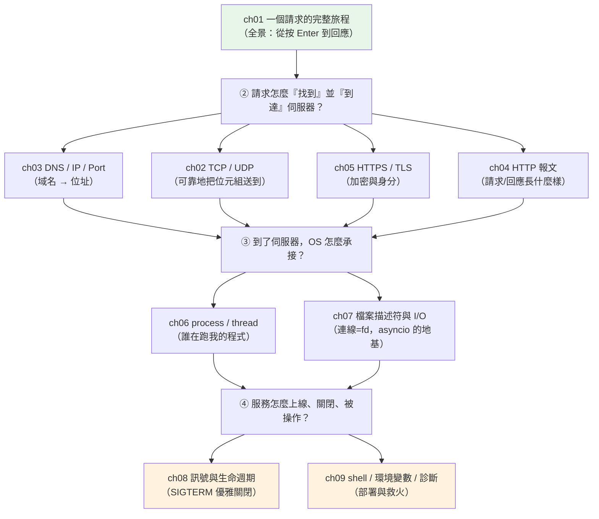

# Part 0 統整：後端基礎知識地圖

> 把這 9 章串成一張圖——讀完你該能說清楚：一個請求從瀏覽器到你的 Python 程式,中間每一層(DNS、TCP、TLS、行程、fd、訊號、環境)各做了什麼,以及出事時該從哪一層查起。

## 🗺️ 知識地圖（這 9 章怎麼串起來）

Part 0 其實在回答一個問題:**「一個請求怎麼從網路,一路走進你的 Python 程式,再走回去?」**



**一句話串起來**:
你先看到[一個請求的全景旅程](01-request-journey.md)(ch01);接著拆解它怎麼**找到**伺服器
——[DNS 把域名變成 IP](03-dns-ip-port.md)(ch03)、[TCP 可靠地把位元組送達](02-tcp-udp.md)(ch02)、
[TLS 加密並驗證身分](05-https-tls.md)(ch05)、[HTTP 報文承載內容](04-http-messages.md)(ch04)。
請求到站後,OS 用[行程/執行緒](06-process-thread.md)(ch06)承接、把每條連線
[記成一個 fd](07-file-descriptor-io.md)(ch07)——這正是 asyncio 單執行緒撐上千連線的地基。
最後,服務要能[優雅上下線](08-signals-lifecycle.md)(ch08)、能[從環境讀設定並在出事時查得動](09-shell-env-diagnostics.md)(ch09)。

## ⚡ 速查表（什麼情境用什麼 / 出事查哪裡）

| 情境 / 症狀 | 關鍵觀念 | 章節 |
|------|--------|------|
| 想講清楚「打開網頁到底發生什麼」 | DNS → TCP → TLS → HTTP → 伺服器處理 → 回應 | [ch01](01-request-journey.md) |
| 「要可靠、有序」vs「要快、可丟」 | TCP(三向交握、重傳)vs UDP(無連線) | [ch02](02-tcp-udp.md) |
| 網頁打不開、`Name or service not known` | DNS 解析失敗;用 `dig`/`nslookup` 查 | [ch03](03-dns-ip-port.md) |
| 要看 / 組 HTTP 請求 | 起始行 + headers + 空行 + body | [ch04](04-http-messages.md) |
| 「憑證錯誤」「連線不安全」 | TLS 交握、憑證鏈;`openssl s_client` 查 | [ch05](05-https-tls.md) |
| 要並行處理:多開行程還是多執行緒? | CPU 密集用 process、I/O 密集用 thread/async | [ch06](06-process-thread.md) |
| `Too many open files` | fd 用光(連線洩漏 / `ulimit` 太低) | [ch07](07-file-descriptor-io.md) |
| 部署後 `Ctrl+C` / `kill` 沒優雅關閉 | 攔 `SIGTERM` 做收尾;Docker 用 exec-form CMD | [ch08](08-signals-lifecycle.md) |
| 設定要跟著環境變、線上服務掛了要查 | 環境變數注入設定;`curl`/`ss`/`top`/log 診斷 | [ch09](09-shell-env-diagnostics.md) |

## 🔑 核心心智模型（帶得走的幾句話）

- **一個請求 = 一趟接力,每一棒都可能掉棒**。域名解析(DNS)、送達(TCP)、加密(TLS)、
  內容(HTTP)、承接(process)、連線(fd)——**出事時就是沿這條鏈一段段排除**,而不是瞎猜。
  這是 Part 0 最值錢的一課:你有了一張「往哪查」的地圖。
- **「連線數」的真身是「fd 數」**。每條 TCP 連線在你的行程裡就是一個檔案描述符;
  能開多少連線受 `ulimit -n` 限制,連線不關就洩漏 fd。理解這點,`Too many open files`
  和 asyncio「單執行緒高並發」就都通了。
- **並行選型看瓶頸**:CPU 密集(算)受 [GIL](../09-concurrency/README.md) 限制,要**多行程**;
  I/O 密集(等)適合**執行緒 / asyncio**——因為「等」的時候可以讓出去做別的。
  這條原則貫穿整個 [Part 9 併發](../09-concurrency/README.md)。
- **服務有生命週期,不是「開著就好」**:要能被 `SIGTERM` 通知「準備打烊」,
  做完在途請求、關好連線再退出(優雅關閉);設定從環境注入,缺必要值就開機即失敗。
  這是「能跑」和「能上生產」的分界。

## 🛠️ 小實作：一支後端連線自檢腳本

把整個 Part 0 用一支腳本收束:它會回報**我是誰(PID)、目標域名解析到哪個 IP、
那個 port 通不通**——正是你 SSH 上線救火時最先想知道的三件事。純標準庫、只打 localhost。

```python
# healthcheck.py —— 串起 Part 0：DNS(ch03)、TCP/fd(ch02/07)、環境(ch09)、行程(ch06)
from __future__ import annotations

import os
import socket


def resolve(host: str) -> list[str]:
    """ch03：把主機名解析成 IP（DNS）。"""
    infos = socket.getaddrinfo(host, None, family=socket.AF_INET)
    return sorted({str(info[4][0]) for info in infos})


def check_tcp_port(host: str, port: int, timeout: float = 0.5) -> bool:
    """ch02 / ch07：試著建一條 TCP 連線（佔一個 fd），能連上代表有人在聽。"""
    try:
        with socket.create_connection((host, port), timeout=timeout):
            return True
    except OSError:
        return False


def diagnose(host: str, port: int) -> dict[str, object]:
    """一次回報：我是誰（PID）、目標解析到哪、port 通不通。"""
    return {
        "pid": os.getpid(),
        "target": f"{host}:{port}",
        "resolved_ips": resolve(host),
        "port_open": check_tcp_port(host, port),
    }


def demo() -> None:
    srv = socket.socket()
    srv.bind(("localhost", 0))
    srv.listen(1)
    port = srv.getsockname()[1]
    print("有人聽的 port：", diagnose("localhost", port))
    srv.close()
    print("沒人聽的 port：", diagnose("localhost", port))


if __name__ == "__main__":
    demo()
```

**預期輸出**（port 號與 PID 每次不同）：

```pycon
$ python healthcheck.py
有人聽的 port： {'pid': 22036, 'target': 'localhost:53669', 'resolved_ips': ['127.0.0.1'], 'port_open': True}
沒人聽的 port： {'pid': 22036, 'target': 'localhost:53669', 'resolved_ips': ['127.0.0.1'], 'port_open': False}
```

**這支小腳本濃縮了整個 Part 0**:`resolve` 是 DNS(ch03)、`check_tcp_port` 建的那條連線就是一個
fd(ch07)並走 TCP(ch02)、`os.getpid()` 是行程(ch06)。而「同一個 port,監聽關掉後就從
`True` 變 `False`」——正是你線上判斷「服務到底有沒有起來」的最小動作。

## ✅ 自測清單（答不出來就回去讀）

- [ ] 從瀏覽器輸入網址到看到頁面,大致經過哪幾個階段?([ch01](01-request-journey.md))
- [ ] TCP 和 UDP 差在哪?各自適合什麼?TCP 三向交握在做什麼?([ch02](02-tcp-udp.md))
- [ ] DNS 解析失敗會看到什麼錯誤?怎麼用指令驗證?([ch03](03-dns-ip-port.md))
- [ ] 一個 HTTP 請求由哪幾個部分組成?([ch04](04-http-messages.md))
- [ ] TLS 交握為什麼能同時做到「加密」和「確認對方身分」?([ch05](05-https-tls.md))
- [ ] 要並行時,怎麼決定用多行程還是多執行緒 / asyncio?([ch06](06-process-thread.md))
- [ ] `Too many open files` 的根因是什麼?怎麼查、怎麼修?([ch07](07-file-descriptor-io.md))
- [ ] `SIGTERM` 和 `SIGKILL` 差在哪?為什麼優雅關閉要攔 `SIGTERM`?([ch08](08-signals-lifecycle.md))
- [ ] 為什麼設定要放環境變數?環境變數讀出來是什麼型別、有什麼坑?([ch09](09-shell-env-diagnostics.md))

## 🎯 面試速查

| 考點 | 面試官想聽到什麼 |
|------|------------------|
| **「在瀏覽器輸入網址,按下 Enter 之後發生什麼?」** | 這是經典題。分層答:**DNS 解析**域名→IP → **TCP 三向交握**建連線 → **TLS 交握**加密 → 送 **HTTP 請求** → 伺服器**行程**處理、查 DB → 回 **HTTP 回應** → 瀏覽器渲染。能講出每層在做什麼就贏過多數人([ch01](01-request-journey.md))。 |
| **「TCP 和 UDP 怎麼選?」** | 「要**可靠、有序**(網頁、API、檔案傳輸)用 TCP,它有交握、確認、重傳;要**快、可容忍丟包**(影音串流、遊戲、DNS 查詢)用 UDP。」([ch02](02-tcp-udp.md)) |
| **「`Too many open files` 怎麼回事?」** | 「**fd 用光了**。每條連線 / 每個開啟的檔案佔一個 fd,行程上限由 `ulimit -n` 決定。常見根因是**連線沒關(洩漏)**或上限設太低。用 `ss`/`lsof` 查、用 `with`/連線池確保歸還。」([ch07](07-file-descriptor-io.md)) |
| **「服務要下線 / 重新部署,怎麼不斷線?」** | 「攔 **`SIGTERM`** 做**優雅關閉**:停收新請求 → 等在途請求做完 → 關連線再退出。K8s 滾動更新就是先送 SIGTERM、寬限期後才 SIGKILL。Docker 要用 **exec-form CMD** 讓程式當 PID 1 收得到訊號。」([ch08](08-signals-lifecycle.md)) |
| **「設定要怎麼管理?」** | 「走**環境變數**(12-factor 設定與程式碼分離),同一份 image 跑多環境;秘密不進版控;**缺必要設定就開機即失敗**(fail fast)。注意環境變數讀出來**永遠是字串**,要自己轉型。」([ch09](09-shell-env-diagnostics.md)) |

---

🎉 **恭喜完成 Part 0!** 你已經有了一張「請求怎麼跑、出事怎麼查」的地圖——
這正是本書其餘部分「用而不教」的底層。接下來 [Part 1 入門](../01-getting-started/README.md)
回到 Python 本身:你將先搞清楚**執行你程式的那個「人」到底是誰**。

➡️ 下一 Part：[入門 Getting Started](../01-getting-started/README.md)

[⬆️ 回 Part 0 索引](README.md)
