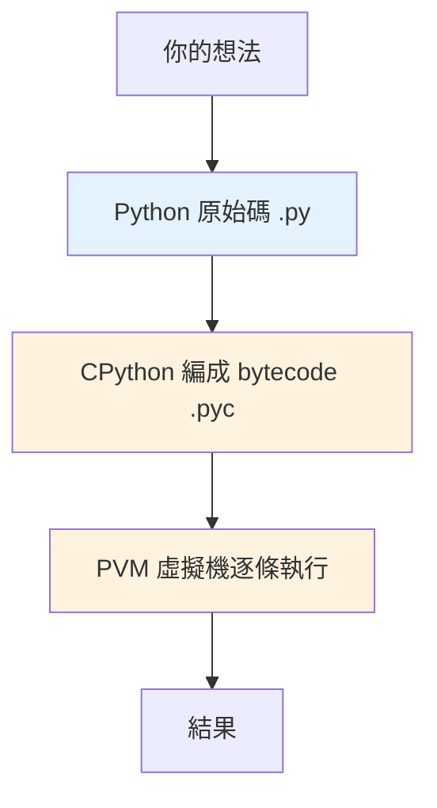

# 為什麼是 Python

> Python 用「可讀性」與「一切皆物件」兩個核心決策，換來了跨領域的通用性——理解它的設計取捨，才知道它適合什麼、不適合什麼。

## 💡 白話導讀（建議先讀）

挑程式語言像挑交通工具：跑車快但難開，腳踏車好上手但載不了貨。

Python 的定位是一台**自排休旅車**：不是最快的，但最好開、用途最廣——網站後端、資料分析、AI、自動化腳本，同一台車全能跑。它用兩個關鍵取捨換來這件事：

**取捨一：好讀優先。**
Python 的語法刻意設計得像英文、強制縮排——因為程式碼「被讀的次數」遠多於「被寫的次數」。代價是執行速度不如 C/Java（車好開，但引擎不是賽車級）。

**取捨二：型別晚點決定。**
變數不用先宣告型別，跑起來才知道——寫起來快、彈性大；代價是有些錯誤要等執行才爆（[Part 5 的型別註記](../05-typing/README.md)就是來補這塊的）。

另外先記兩句之後會反覆出現的話：

- 「**動態**型別」說的是**什麼時候**知道型別（執行期），「**強**型別」說的是**會不會亂轉型**（不會——`"1" + 1` 直接報錯）。Python 是動態＋強，兩件事別混。
- 「Python 是直譯語言」是**過度簡化**——它其實會先偷偷編譯（[第 12 章](12-how-python-runs.md)揭曉）。

這章帶你認識這台車的完整規格表，以及——它不適合做什麼。

## Why（為什麼）

學一門語言之前，先問一個常被跳過的問題：**這門語言為了解決什麼問題而存在？**

1989 年，Guido van Rossum 想要一門介於 shell script 與 C 之間的語言：比 shell 更能寫大型程式，又比 C 更好寫、不用管記憶體。當時的主流是 C（快但囉嗦、要自己管記憶體）與 Perl（強大但語法混亂、可讀性差）。Python 的賭注是：

> **開發者的時間比 CPU 的時間更貴。** 所以優先最佳化「人讀程式、寫程式的成本」，而不是「機器執行的速度」。

這個取捨解釋了 Python 幾乎所有的設計：強制縮排、動態型別、豐富的內建資料結構、龐大的標準庫。理解這個「為什麼」，你才不會拿「Python 好慢」去否定它——它本來就不是為了跑得快而設計的，而是為了讓你**更快地把想法變成能跑的程式**。

## Theory（理論：Python 是什麼樣的語言）

用幾個維度定位 Python——這台「休旅車」的規格表。每一項都會影響你之後怎麼寫程式：

| 維度 | Python 的選擇 | 意義 |
|------|---------------|------|
| 執行方式 | **直譯（interpreted）** | 原始碼先編成 bytecode，再由虛擬機逐條執行；不需獨立編譯步驟 |
| 型別檢查 | **動態型別（dynamically typed）** | 型別在**執行期**才確定，變數本身沒有型別，值才有 |
| 型別強度 | **強型別（strongly typed）** | 不會偷偷幫你把 `"1" + 1` 變成合法運算，會直接報錯 |
| 記憶體 | **自動管理** | 引用計數 + 循環 GC，不需手動 `malloc`/`free` |
| 典範 | **多重典範** | 同時支援程序式、物件導向、函數式 |
| 核心哲學 | **一切皆物件** | int、function、class、module 全都是物件 |

導讀提過的兩個易混觀念，正式講一次：

- **「動態型別」不等於「弱型別」。** 動態指「型別**何時**決定」（執行期）；弱/強指「會不會**自動轉型**」。Python 是「動態 + 強」——執行期才知道型別，但一旦知道就嚴格，不亂轉。
- **「直譯」不代表「沒有編譯」。** CPython 會先把原始碼編成 bytecode（`.pyc`），只是這步自動、隱形。詳見 [Python 如何執行](12-how-python-runs.md)。

## Specification（規範：Python 與 CPython）

有一個新手常忽略的區分：

- **Python** 是一份**語言規範（language specification）**，定義語法與語意。
- **CPython** 是這份規範用 C 寫成的**參考實作（reference implementation）**，也是你從 python.org 下載、絕大多數人用的那個。

同一份規範可以有多種實作：

| 實作 | 特點 |
|------|------|
| **CPython** | 官方參考實作，生態最完整，本書預設 |
| PyPy | 帶 JIT，純 Python 運算可快數倍 |
| Jython | 跑在 JVM 上 |
| MicroPython | 給微控制器的精簡實作 |

本書所有「底層如何運作」的討論（引用計數、GIL、bytecode）都以 **CPython** 為準，並以 **Python 3.12+** 為基準版本。談到 GIL、GC 這類底層機制時，我們指的是 CPython 的行為，不是語言規範強制的。

## Implementation（設計哲學如何體現在程式裡）

Python 的設計哲學不是抽象口號，它被寫進了直譯器裡。打開 REPL 輸入 `import this`，會印出 **The Zen of Python（Python 之禪）**：

```pycon
>>> import this
The Zen of Python, by Tim Peters

Beautiful is better than ugly.
Explicit is better than implicit.
Simple is better than complex.
...
There should be one-- and preferably only one --obvious way to do it.
...
```

其中最能代表 Python 個性的一句是 **「There should be one obvious way to do it」**（做一件事應該有一種、最好是唯一一種明顯的做法）——這和 Perl 的「There's more than one way to do it」正好相反，也是為什麼 Python 程式碼風格高度一致。

這個哲學的具體體現，就是**強制縮排**。其他語言用 `{}` 界定程式區塊，縮排只是給人看的；Python 直接讓縮排成為語法的一部分：

```python
# Python：縮排就是區塊，沒有大括號
def greet(name):
    if name:
        print(f"Hello, {name}")
    else:
        print("Hello, stranger")
```

這強迫「程式看起來的結構」＝「程式實際的結構」，消滅了「排版騙人」的可能。這是「可讀性優先」哲學最直接的產物。

## Code Example（可執行的 Python 範例）

用一個小例子感受「Python 換取的是開發速度」。同樣是「讀一個檔案、統計每個單字出現幾次、印出前三名」：

```python
# word_count.py — 完整、可執行
from collections import Counter


def top_words(text: str, n: int = 3) -> list[tuple[str, int]]:
    """回傳出現次數最多的 n 個單字。"""
    words = text.lower().split()
    return Counter(words).most_common(n)


if __name__ == "__main__":
    sample = "the quick brown fox the lazy dog the end"
    for word, count in top_words(sample):
        print(f"{word}: {count}")
```

執行與**預期輸出**：

```pycon
$ python word_count.py
the: 3
quick: 1
brown: 1
```

短短幾行就用到了：內建的 `str.split()`、`str.lower()`、標準庫的 `Counter`、型別註記、f-string。**同樣功能在 C 裡可能要幾十行**——這就是 Python 拿「執行速度」換來的「開發速度」。

逐段解說：

- `text.lower().split()`：先轉小寫（讓 `The` 和 `the` 算同一個字），再用空白切成 list。
- `Counter(words)`：標準庫直接幫你數好每個元素的次數，回傳一個像 dict 的物件。
- `.most_common(n)`：Counter 內建的方法，回傳前 n 名。
- `if __name__ == "__main__":`：只有「直接執行這支檔案」時才跑，被 import 時不跑（詳見 [REPL 與第一支程式](03-repl-and-first-program.md)）。

## Diagram（圖解：Python 的定位）



> 開發者只寫最上面那層；編 bytecode、跑虛擬機、管記憶體都由 CPython 自動處理——這就是 Python「省下開發者時間」的方式。細節見 [Python 如何執行](12-how-python-runs.md)。

## Best Practice（最佳實踐）

- **選對場景**：資料處理、Web 後端、腳本自動化、AI/ML、爬蟲、原型開發——Python 都是一流選擇。
- **需要極致效能的熱點**：用 C/C++/Rust 寫擴充，或用 numpy 向量化（見 [Part 17](../17-data-science/README.md)、[Part 18](../18-performance/README.md)），而不是硬用純 Python 迴圈。
- **善用「電池內建（batteries included）」**：標準庫非常龐大，動手造輪子前先看有沒有現成的（見 [Part 11 標準庫](../11-stdlib/README.md)）。
- **寫 Pythonic 的程式**：順著語言的慣例走（見 [PEP 8 與 Pythonic 風格](08-pep8-and-style.md)），而不是把其他語言的寫法硬搬過來。

## Common Mistakes（常見誤解）

- **「Python 很慢，所以不能用在正式環境」**：錯。大多數應用的瓶頸在 I/O（網路、資料庫）而非 CPU；且效能敏感的部分早已由 C 擴充處理（numpy、pandas）。Instagram、Dropbox、YouTube 都大量用 Python。
- **「動態型別 = 弱型別 = 不安全」**：混淆了兩件事。Python 是**強型別**，`"1" + 1` 會直接 `TypeError`，不會像 JavaScript 那樣默默變成 `"11"`。
- **「Python 沒有編譯」**：CPython 有編譯步驟（產生 bytecode），只是自動且隱形。
- **「Python 就是 CPython」**：Python 是規範，CPython 是最主流的實作之一，兩者不是同義詞。
- **「一切皆物件只是說說」**：這是實打實的——連 `int`、函式、class 都是物件，有 `id`、有 `type`、可以被賦值傳遞（見 [Part 10 一切皆物件](../10-cpython-internals/01-everything-is-object.md)）。

## Interview Notes（面試重點）

被問到「Python 是什麼樣的語言 / 為什麼選 Python」，面試官想聽到的完整回答應涵蓋：

1. **定位取捨**：Python 以「開發者時間 > 機器時間」為核心取捨，優先可讀性與開發效率。
2. **型別系統**：**動態 + 強型別**，並能講清楚兩者差異（動態＝型別執行期決定；強型別＝不自動亂轉型，`"1"+1` 會報錯）。
3. **執行模型**：直譯式，但 CPython 會先編成 bytecode 再由 PVM 執行——「直譯」不等於「沒編譯」。
4. **Python vs CPython**：規範 vs 參考實作；GIL、引用計數是 CPython 的實作細節，不是語言規範強制。
5. **適用與不適用**：I/O 密集、資料/AI、快速開發是強項；CPU 密集的純運算熱點需靠 C 擴充或向量化補足。
6. **一句總結**：「Python 用可讀性與豐富生態，換取開發速度；效能瓶頸靠 C 擴充與向量化解決。」

---

➡️ 下一章：[安裝 Python 與直譯器](02-install-and-interpreter.md)

[⬆️ 回 Part 1 索引](README.md)
