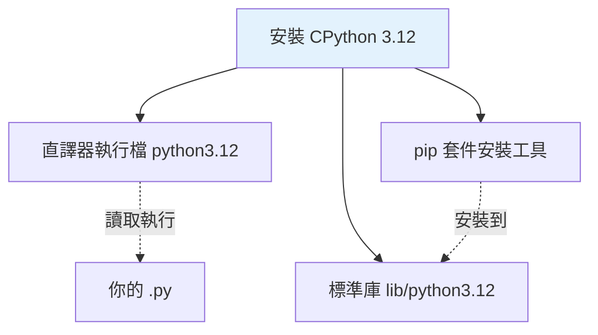

# 安裝 Python 與直譯器

> 「安裝 Python」其實是「安裝某個 Python 實作（通常是 CPython）」——搞懂實作、版本、與多版本共存，才不會被 `python` vs `python3` 這類問題卡住。

## Why（為什麼）

安裝看似瑣事，卻是無數新手第一天就卡關的地方：打了 `python` 卻說找不到、系統內建的 Python 動不得、專案要不同版本卻互相打架。這些問題的根源都是同一件事——**你電腦上可能同時存在多個 Python，而「`python` 這個指令指向誰」並不總是你以為的那個。**

把「實作 / 版本 / 指令指向誰」這三件事一次理清，後面所有環境問題都會變簡單。

## Theory（理論：你到底裝了什麼）

回顧上一章：**Python 是規範，你安裝的是某個實作。** 從 python.org 下載的官方安裝檔就是 **CPython**。

安裝一份 CPython，實際上會在系統放進三樣東西：

1. **直譯器執行檔**：`python`（或 `python3`、`python3.12`），就是那個會讀你的 `.py` 並執行的程式。
2. **標準庫**：一大包內建模組（`os`、`json`、`collections`…），放在安裝目錄的 `lib` 底下。
3. **pip**：套件安裝工具，用來從 PyPI 下載第三方套件（見 [pip 與套件管理](04-pip-and-packages.md)）。

理解這三者是「一整組綁在一起的」，就能理解為什麼「不同 Python 版本 = 不同的標準庫 + 不同的 pip + 不同的已裝套件」。

## Specification（規範：版本號與支援週期）

Python 版本號是 `主.次.修訂`（如 `3.12.4`）：

- **主版本（major）**：破壞性大改版。史上只有 2→3 一次，且極度痛苦（見 [Python 2 vs 3](10-python2-vs-3.md)）。
- **次版本（minor）**：每年一個新版（3.11、3.12、3.13…），加新功能、可能有小幅不相容。
- **修訂（micro/patch）**：只修 bug 與安全性，不加新功能。

每個次版本大約有 **5 年支援期**（約 1.5 年 bug 修復 + 之後只修安全性）。**選版原則**：正式專案選一個「還在支援、但不是剛出爐」的穩定版；本書以 **3.12** 為基準（3.13 亦可）。不要用已經 end-of-life 的版本（如 3.8 以下）。

## Implementation（各平台如何安裝 + 多版本共存）

### 各平台建議做法

| 平台 | 建議 | 說明 |
|------|------|------|
| Windows | python.org 官方安裝檔，或 `winget install Python.Python.3.12` | 安裝時**務必勾選 "Add python.exe to PATH"** |
| macOS | `brew install python@3.12` | 別動系統內建的 Python，另裝一份 |
| Linux | 發行版套件管理器，或 `pyenv` | 系統 Python 被 OS 依賴，別覆蓋它 |

### `python` vs `python3` 的坑

在 macOS / Linux，歷史因素讓 `python` 有時指向舊的 Python 2，`python3` 才是 3.x。**判斷指令指向誰**永遠靠 `--version`：

```bash
python --version      # 可能是 Python 2.7.x（舊系統），也可能沒這指令
python3 --version     # Python 3.12.4
```

在 Windows，官方安裝檔會裝一個 **py launcher**，可明確指定版本：

```bash
py --version          # 預設的 Python
py -3.12 --version    # 明確指定 3.12
py -0                 # 列出所有已安裝版本
```

### 「這個 python 到底是哪一個檔案」

當你不確定 `python` 指向哪個執行檔：

```bash
# macOS / Linux
which python3         # /usr/local/bin/python3

# Windows (PowerShell)
(Get-Command python).Source
```

或直接問直譯器自己：

```pycon
>>> import sys
>>> sys.executable
'/usr/local/bin/python3.12'
>>> sys.version
'3.12.4 (main, ...) [Clang ...]'
```

`sys.executable` 是**最可靠**的答案——它是「正在跑這段程式的那個直譯器」的真實路徑，繞過所有 PATH 的混淆。

### 多版本共存

真實開發常需同時有多個 Python 版本（A 專案用 3.11、B 專案用 3.12）。工具：

- **pyenv**（macOS/Linux）：管理多個 Python 版本，可設定每個目錄用哪一版。
- **py launcher**（Windows）：`py -3.11` / `py -3.12` 切換。
- **uv**（跨平台，新工具）：能順便幫你下載並管理多個 Python 版本（見 [Part 13](../13-tooling-packaging/03-uv-poetry.md)）。

⚠️ **不要用系統內建的 Python 裝專案套件**。系統（尤其 Linux/macOS）本身依賴那個 Python，亂裝套件可能弄壞作業系統工具。專案套件一律裝進**虛擬環境**（見 [虛擬環境 venv](05-venv.md)）。

## Code Example（用程式檢查你的環境）

寫一支小腳本，一次印出關鍵環境資訊——除錯環境問題時非常好用：

```python
# env_info.py — 檢查目前 Python 環境
import sys
import platform


def main() -> None:
    print(f"Python 版本   : {platform.python_version()}")
    print(f"實作          : {platform.python_implementation()}")  # CPython / PyPy...
    print(f"執行檔路徑    : {sys.executable}")
    print(f"作業系統      : {platform.system()} {platform.release()}")
    print(f"是否 64 位元  : {sys.maxsize > 2**32}")


if __name__ == "__main__":
    main()
```

**預期輸出**（依你的環境而異）：

```pycon
$ python env_info.py
Python 版本   : 3.12.4
實作          : CPython
執行檔路徑    : /usr/local/bin/python3.12
作業系統      : Darwin 23.5.0
是否 64 位元  : True
```

解說：`platform.python_implementation()` 回傳 `'CPython'`——印證上一章「你裝的是 CPython」。`sys.maxsize > 2**32` 是判斷 64/32 位元的慣用技巧（64 位元下 `sys.maxsize` 是 2⁶³−1）。

## Diagram（圖解：一次安裝帶來什麼）



## Best Practice（最佳實踐）

- **選穩定的次新版**：不用剛發布的最新版（生態套件可能還沒跟上），也不用 EOL 舊版。本書用 3.12。
- **Windows 安裝時勾選 Add to PATH**，並優先用 `py` launcher 管理版本。
- **絕不動系統 Python**：另外裝一份給開發用。
- **用 `sys.executable` 確認身分**：環境出問題時，先確認「跑的是哪個 python」，八成問題出在這。
- **多版本用工具管理**：pyenv / py launcher / uv，別靠手動改 PATH。

## Common Mistakes（常見誤解）

- **打 `python` 說找不到指令**：Windows 沒勾 Add to PATH，或該平台只有 `python3`。用 `py`（Windows）或 `python3`（macOS/Linux）。
- **裝了套件卻 import 不到**：極可能是「pip 裝到 A 版本，python 跑的是 B 版本」。用 `python -m pip install ...` 確保 pip 跟 python 同一個（見下一章與 [pip](04-pip-and-packages.md)）。
- **直接用 `sudo pip install` 裝到系統 Python**：可能弄壞系統工具，且日後難以清理。永遠用虛擬環境。
- **以為 `python --version` 顯示的就一定是待會執行的那個**：在複雜的 PATH / alias 環境下未必，`sys.executable` 才是鐵證。
- **把「版本」和「實作」搞混**：3.12 是版本，CPython 是實作；PyPy 也可以是 3.12。

## Interview Notes（面試重點）

- 能區分 **Python（規範）** 與 **CPython（實作）**，並知道自己平常用的是 CPython。
- 說得出「一次安裝 = 直譯器 + 標準庫 + pip 綁在一起」，因此不同版本各有各的套件。
- 知道 `python` 與 `python3` 的歷史差異，以及如何用 `--version`、`which`/`Get-Command`、`sys.executable` 確認實際指向。
- 知道版本號語意（major/minor/micro）與大致支援週期，選版有依據。
- 知道「不要污染系統 Python、專案套件裝進虛擬環境」是基本紀律。

---

➡️ 下一章：[REPL 與第一支程式](03-repl-and-first-program.md)

[⬆️ 回 Part 1 索引](README.md)
