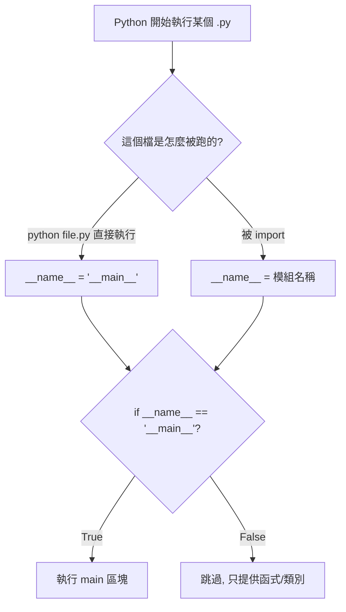

# REPL 與第一支程式

> Python 給你兩種執行方式：即時互動的 REPL 拿來探索、`.py` 檔拿來留存；而 `if __name__ == "__main__"` 是兩者之間最重要的一道開關。

## Why（為什麼）

大多數編譯語言只有一種節奏：寫檔 → 編譯 → 執行。Python 多給了一種**即時對話**的模式——你打一行、它立刻回一行。這對「學語言」與「試 API」是巨大的加速：不確定 `"abc".upper()` 回傳什麼？打進去馬上看到，不必開檔、存檔、跑整支程式。

但互動模式的東西關掉就沒了。真正的程式要寫進 `.py` 檔留存、重複執行、被別人 import。理解這兩種模式各自的定位，以及它們的交界（`__main__`），是寫出「既能被執行、又能被重用」的程式的第一步。

## Theory（理論：REPL 是什麼）

**REPL = Read–Eval–Print–Loop**，直譯器做的四件事不斷循環：

1. **Read**：讀你輸入的一行程式。
2. **Eval**：求值（執行它）。
3. **Print**：印出結果。
4. **Loop**：回到第一步。

關鍵在第 3 步：REPL 會**自動印出每個運算式的值**（透過該值的 `repr()`），這是 REPL 和「跑 `.py` 檔」最大的差異——在檔案裡，光寫 `1 + 1` 不會有任何輸出，你得 `print(1 + 1)`；在 REPL 裡，打 `1 + 1` 直接看到 `2`。

## Specification（規範：兩種提示字元與執行方式）

進入 REPL：

```pycon
$ python
Python 3.12.4 (main, ...)
>>> 
```

REPL 有兩種提示字元，一定要分清楚：

- `>>>` **主提示字元**：等你輸入一個新的敘述。
- `...` **續行提示字元**：你正在輸入一個尚未結束的多行結構（如 `def`、`if`、迴圈），需要繼續打或空一行結束。

```pycon
>>> def square(x):      # 打完冒號按 Enter，進入續行
...     return x * x    # 縮排的函式主體
...                     # 空一行結束定義
>>> square(5)
25
```

執行 `.py` 檔的幾種方式：

```bash
python hello.py           # 最常見：直接執行檔案
python -m mymodule        # 以模組方式執行（見 06 章）
python -c "print('hi')"   # 執行一行字串
python                    # 進入 REPL
```

## Implementation（`__name__` 與 `__main__` 的機制）

這是本章最重要的機制，很多新手到工作了還講不清楚。

**每個 Python 檔（模組）執行時，直譯器都會給它一個特殊變數 `__name__`。它的值取決於「這個檔是怎麼被跑起來的」：**

- 若這個檔是**被直接執行**的（`python hello.py`）→ `__name__` 的值是字串 `"__main__"`。
- 若這個檔是**被別的檔 import** 的 → `__name__` 的值是它的模組名稱（如 `"hello"`）。

於是就有了這個經典慣用法：

```python
if __name__ == "__main__":
    main()
```

它的意思是：「**只有當這支檔案被直接執行時，才跑 `main()`；被 import 時不要跑。**」

為什麼需要它？因為一個 `.py` 檔常常同時想扮演兩種角色：

1. 當**腳本**直接跑（做事）。
2. 當**模組**被別人 import（提供函式給人用）。

如果沒有這道開關，別人一 import 你的檔，你檔案裡所有頂層程式碼（包括那些「跑起來做事」的部分）都會立刻執行——這幾乎一定不是別人想要的。

## Code Example（可執行的 Python 範例）

### 範例一：第一支程式

```python
# hello.py
print("Hello, Python!")
```

```pycon
$ python hello.py
Hello, Python!
```

### 範例二：示範 `__name__` 的雙重身分

```python
# greeting.py
def greet(name: str) -> str:
    """回傳問候語（可被別人重用）。"""
    return f"Hello, {name}!"


def main() -> None:
    """直接執行時的進入點。"""
    print(greet("World"))
    print(f"我被執行了，__name__ = {__name__!r}")


if __name__ == "__main__":
    main()
```

**情境 A：直接執行**

```pycon
$ python greeting.py
Hello, World!
我被執行了，__name__ = '__main__'
```

**情境 B：被 import**（在 REPL 或另一支檔）

```pycon
>>> import greeting
>>> greeting.__name__
'greeting'
>>> greeting.greet("Alice")     # 重用它的函式，但 main() 沒被自動觸發
'Hello, Alice!'
```

注意情境 B：import 時**沒有**印出「我被執行了」——因為 `__name__` 是 `'greeting'` 而非 `'__main__'`，那道開關擋住了 `main()`。這正是我們要的：import 只拿到 `greet` 函式，不會誤觸副作用。

> `!r` 是 f-string 的轉換旗標，代表用 `repr()` 而非 `str()`，所以字串會帶引號印出。

## Diagram（圖解：`__name__` 的判斷）



## Best Practice（最佳實踐）

- **REPL 用來探索，程式寫進 `.py`**：試 API、查行為用 REPL；正式邏輯一定落檔。
- **可執行腳本都加 `if __name__ == "__main__":`**，並把實際工作包成 `main()` 函式，別讓邏輯散落在頂層。
- **善用 REPL 的 `help()` 與 `dir()`**：`help(str)` 看說明、`dir(obj)` 列出可用屬性方法，是最快的自學工具。
- **想要更好用的互動環境**：裝 IPython 或用 Jupyter，有語法高亮、自動補全、`?` 查文件（見 [Jupyter](../17-data-science/07-jupyter.md)）。
- **REPL 裡 `_` 是上一個結果**：`>>> 2 + 3` 後 `>>> _ * 10` 得 `50`，臨時計算很方便。

## Common Mistakes（常見誤解）

- **在 `.py` 檔裡以為寫 `1 + 1` 會有輸出**：不會。只有 REPL 會自動印運算式的值；檔案裡要 `print()`。
- **`if __name__ == "__main__"` 拼錯**：寫成 `"main"`（少了底線）或 `_name_`（單底線）都會失效且不報錯，`main()` 就永遠不執行或永遠執行。是**雙底線** `__main__` 與 `__name__`。
- **把邏輯直接寫在頂層而非包進 `main()`**：這樣被 import 時會立刻執行，產生意外副作用。
- **REPL 續行 `...` 卡住**：忘了多行結構要「空一行」才結束，或縮排不對。按 Enter 空行、或 `Ctrl-C` 取消當前輸入。
- **REPL 裡的變數關掉就沒了**：REPL 的狀態不持久，重要的東西要寫進檔案。

## Interview Notes（面試重點）

- 講得清楚 **REPL 的 R-E-P-L 四步**，特別是「會自動印出運算式的值」這點與跑檔案的差異。
- **`if __name__ == "__main__":` 是必考題**：要能說出「`__name__` 在直接執行時是 `'__main__'`、被 import 時是模組名；這道開關讓檔案能同時當腳本與模組，import 時不觸發腳本邏輯」。
- 知道 `python file.py`、`python -m module`、`python -c` 的差別（`-m` 見 [模組與 import](06-modules-and-import.md)）。
- 知道 `_` 在 REPL 代表上一個結果。

---

➡️ 下一章：[pip 與套件管理](04-pip-and-packages.md)

[⬆️ 回 Part 1 索引](README.md)
