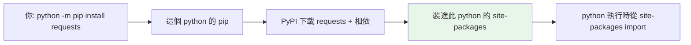

# pip 與套件管理

> pip 是 Python 的套件安裝器，從 PyPI 下載別人寫好的程式碼；而 `python -m pip` 這個寫法，能幫你避開新手最常踩的「裝到別的 Python」大坑。

## Why（為什麼）

Python 的殺手級優勢之一是它龐大的**第三方套件生態**：requests（HTTP）、numpy（數值）、fastapi（Web）……幾乎任何需求都有現成輪子。這些輪子放在 **PyPI（Python Package Index）**，而 **pip** 就是把它們抓下來、裝進你環境的工具。

但套件管理也是新手事故最多的地方：「明明裝了卻 import 不到」「版本衝突」「不小心污染了系統」。這些幾乎都源於同一個誤解——**不清楚 pip 到底把套件裝到哪個 Python 去了**。本章把這件事講透。

## Theory（理論：套件、PyPI、pip 的關係）

先厘清三個名詞：

- **module（模組）**：單一 `.py` 檔（見 [模組與 import](06-modules-and-import.md)）。
- **package（套件）**：一組相關模組打包在一起，可發佈、可安裝的單位（如 `requests`）。
- **PyPI**：官方的套件倉庫（[pypi.org](https://pypi.org)），全世界的人把 package 上傳到這裡。

pip 做的事：**去 PyPI 找到你要的 package → 下載 → 解析它自己還需要哪些其他 package（相依）→ 一併裝進「當前 Python 的 site-packages 目錄」。**

關鍵字是 **site-packages**：這是「第三方套件被裝進去的地方」。每個 Python 安裝、每個虛擬環境，都有**各自獨立**的 site-packages。這就是為什麼「裝到哪個 Python」如此重要。

## Specification（規範：常用 pip 指令）

```bash
python -m pip install requests            # 安裝最新版
python -m pip install "requests==2.31.0"  # 安裝指定版本
python -m pip install "requests>=2.28"    # 安裝符合版本條件的最新
python -m pip install --upgrade requests  # 升級
python -m pip uninstall requests          # 移除
python -m pip list                        # 列出已安裝套件
python -m pip show requests               # 看某套件的資訊（版本、位置、相依）
python -m pip freeze                      # 以可還原格式列出（給 requirements.txt）
```

**版本指定語法（version specifiers）**：

| 寫法 | 意義 |
|------|------|
| `requests` | 最新版 |
| `requests==2.31.0` | 剛好這個版本 |
| `requests>=2.28,<3.0` | 2.28 以上、3.0 以下 |
| `requests~=2.31.0` | 相容版本（`>=2.31.0,==2.31.*`） |

## Implementation（為什麼要寫 `python -m pip`）

新手最常見的災難：

```pycon
$ pip install requests      # 裝好了
$ python my_script.py       # ModuleNotFoundError: No module named 'requests'
```

明明裝了怎麼會找不到？因為**你電腦上有多個 Python，`pip` 這個指令和 `python` 這個指令可能指向不同的 Python**。`pip` 把 requests 裝進了 A 版本的 site-packages，但 `python` 跑的是 B 版本——B 當然找不到。

**解法：永遠用 `python -m pip` 而不是裸 `pip`。**

`python -m pip` 的意思是「用**這個** `python` 執行它自帶的 pip」。既然安裝和執行用的是同一個 `python`，就保證「裝到的地方」正是「執行時會找的地方」。這一個小習慣能消滅絕大多數「裝了卻 import 不到」的問題。

驗證這件事：

```pycon
>>> import requests
>>> requests.__file__
'/path/to/your/env/lib/python3.12/site-packages/requests/__init__.py'
```

`__file__` 會告訴你這個套件實際被載入的位置——如果它不在你以為的環境裡，問題就在這。

## Code Example（用 requirements.txt 記錄相依）

正式專案不會叫別人「自己一個一個 pip install」，而是把相依寫進檔案，讓別人一次裝齊、且版本一致。

`pip freeze` 產生「目前環境裝了什麼、什麼版本」的快照：

```bash
python -m pip freeze > requirements.txt
```

`requirements.txt` 內容長這樣（每行一個套件與其精確版本）：

```text
certifi==2024.7.4
charset-normalizer==3.3.2
idna==3.7
requests==2.31.0
urllib3==2.2.2
```

別人（或 CI、或部署伺服器）就能一鍵重現相同環境：

```bash
python -m pip install -r requirements.txt
```

寫一支腳本，程式化地列出已裝套件（示範 `importlib.metadata`，比呼叫外部 pip 更 Pythonic）：

```python
# list_packages.py — 列出已安裝套件與版本
from importlib.metadata import distributions


def main() -> None:
    packages = sorted(
        (dist.metadata["Name"], dist.version) for dist in distributions()
    )
    for name, version in packages:
        print(f"{name}=={version}")


if __name__ == "__main__":
    main()
```

**預期輸出**（依環境而異）：

```pycon
$ python list_packages.py
certifi==2024.7.4
pip==24.0
requests==2.31.0
...
```

## Diagram（圖解：pip 裝到哪去）



> 因為安裝與執行綁在同一個 `python`，所以「裝進去的地方」＝「import 時找的地方」。

## Best Practice（最佳實踐）

- **永遠用 `python -m pip`**，不要裸 `pip`——一勞永逸避免版本錯位。
- **永遠在虛擬環境裡裝套件**（見 [虛擬環境 venv](05-venv.md)），不要污染系統 Python，也讓每個專案的相依互相隔離。
- **正式專案釘住版本**：用 `requirements.txt`（或 `pyproject.toml`，見 [Part 13](../13-tooling-packaging/04-pyproject-toml.md)）記錄相依，確保「我這能跑、你那也能跑」。
- **裝之前先查套件可信度**：看 PyPI 上的下載量、維護狀況、GitHub star；小心名稱相近的惡意仿冒套件（typosquatting，見 [供應鏈安全](../20-security-system-design/06-supply-chain.md)）。
- **考慮更快的新工具**：`uv` 是近年的高速套件/環境管理器，可作為 pip + venv 的替代（見 [uv 與 poetry](../13-tooling-packaging/03-uv-poetry.md)）。

## Common Mistakes（常見誤解）

- **裸 `pip install` 導致裝錯 Python**：最經典的坑。改用 `python -m pip`。
- **`sudo pip install`**：把套件裝進系統 Python，可能弄壞作業系統工具。永遠別這樣，改用虛擬環境。
- **不釘版本，靠「最新版」**：某天套件出了不相容的新版，你的專案在別人機器上或半年後就突然壞掉。正式專案要鎖版本。
- **把 `pip list` 的輸出當 requirements**：`pip list` 是給人看的表格，格式不對；要用 `pip freeze` 產生可還原的清單。
- **以為 `requirements.txt` 會裝 Python 本身**：不會。它只裝套件；Python 版本另外管理（見 [安裝 Python](02-install-and-interpreter.md)）。
- **module 與 package 混用不分**：module 是單檔、package 是一組模組的可安裝單位；細節見 [package 與 __init__.py](07-packages-and-init.md)。

## Interview Notes（面試重點）

- 說得出 **pip / PyPI / package / module** 的關係，以及套件被裝進 **site-packages**。
- 能解釋「裝了卻 import 不到」的根因（pip 與 python 指向不同 Python），並知道 **`python -m pip`** 為何能解決。
- 知道用 **`requirements.txt` + `pip freeze` / `pip install -r`** 做環境可重現，且正式專案要**釘住版本**以保證可重現性。
- 知道不該污染系統 Python、套件要裝進虛擬環境，以及供應鏈風險（仿冒套件）。
- 加分：知道 `~=`（相容版本）語意，與 `uv` 等新一代工具。

---

➡️ 下一章：[虛擬環境 venv](05-venv.md)

[⬆️ 回 Part 1 索引](README.md)
