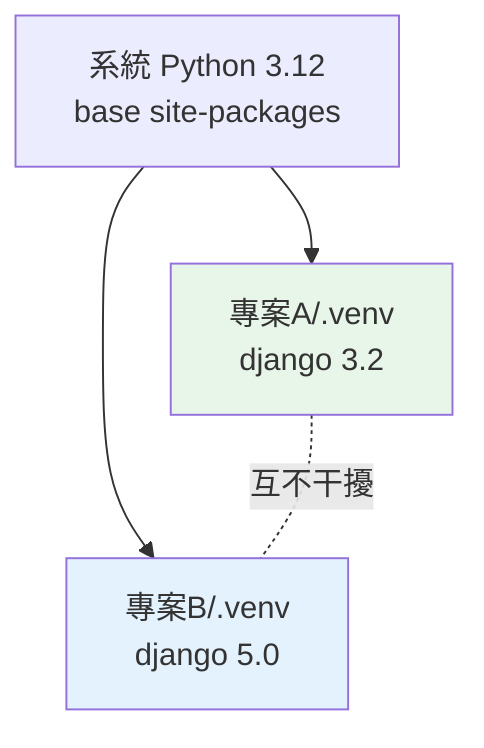

# 虛擬環境 venv

> venv 讓每個專案有一份獨立的 Python 套件空間——這不是可有可無的建議，而是專業 Python 開發的最低門檻。

## Why（為什麼）

想像你同時維護兩個專案：A 需要 `django==3.2`，B 需要 `django==5.0`。如果所有套件都裝在同一個地方（系統 Python 的 site-packages），這兩個版本無法共存——裝了新的就蓋掉舊的，於是必有一個專案壞掉。這叫 **相依地獄（dependency hell）**。

更糟的是，你可能不小心把專案套件裝進**系統 Python**，而作業系統本身（尤其 Linux/macOS）依賴那個 Python 跑系統工具，污染它可能讓系統指令出錯。

**虛擬環境（virtual environment）** 就是為了解決這兩個問題：給每個專案一個**獨立、隔離、拋棄式**的套件空間。這是 Python 開發的基本紀律，不是進階技巧。

## Theory（理論：虛擬環境是什麼）

一個虛擬環境本質上是一個**資料夾**，裡面有：

1. 一個指向某個 Python 直譯器的連結（或副本）。
2. **它自己專屬的 site-packages**（一開始幾乎是空的）。
3. 啟用/停用用的腳本。

「隔離」的原理很單純：**當你「啟用（activate）」一個虛擬環境，它會把自己的路徑塞到 PATH 最前面**，於是你打 `python` 和 `pip` 時，用到的就是這個環境裡的版本，`pip install` 也就裝進這個環境專屬的 site-packages。不同專案各有各的環境資料夾，套件互不干擾。刪掉那個資料夾，環境就乾乾淨淨地消失了。

`venv` 是 Python **標準庫內建**的虛擬環境工具（Python 3.3+），不需額外安裝。

## Specification（規範：venv 的完整生命週期）

```bash
# 1. 建立（在專案目錄下，慣例命名為 .venv）
python -m venv .venv

# 2. 啟用
source .venv/bin/activate          # macOS / Linux
.venv\Scripts\Activate.ps1         # Windows PowerShell
.venv\Scripts\activate.bat         # Windows cmd

# 啟用後提示字元會多出 (.venv) 前綴：
# (.venv) $

# 3. 在環境中工作（此時 python / pip 都指向環境內的版本）
python -m pip install requests
python my_script.py

# 4. 停用（回到系統環境）
deactivate
```

## Implementation（啟用做了什麼 + 免啟用用法）

### 「啟用」到底改了什麼

啟用腳本主要做兩件事：

1. 把 `.venv/bin`（Windows 是 `.venv\Scripts`）**加到 PATH 最前面**——於是 `python`、`pip` 優先命中環境內的。
2. 設定環境變數 `VIRTUAL_ENV` 並改提示字元加上 `(.venv)`，讓你知道現在在哪。

驗證你確實在環境裡：

```pycon
>>> import sys
>>> sys.prefix          # 啟用後指向 .venv，未啟用指向系統 Python
'/path/to/project/.venv'
>>> sys.executable
'/path/to/project/.venv/bin/python'
```

`sys.prefix` 指向虛擬環境目錄，就代表你成功在環境裡了。

### 不啟用也能用（推薦給腳本/CI）

其實「啟用」只是方便，本質上你也可以**直接呼叫環境裡的 python**，效果一樣：

```bash
.venv/bin/python my_script.py            # macOS / Linux
.venv\Scripts\python.exe my_script.py    # Windows
```

這在 CI、Docker、Makefile 裡很常見——不需 activate，直接用絕對/相對路徑指定環境的 python，更明確、更不會出錯。

## Code Example（一段完整的實務流程）

以下是開一個新專案的標準開場，逐步解說：

```bash
# 進到專案資料夾
cd my-project

# 建立虛擬環境（用當前 python 的版本）
python -m venv .venv

# 啟用（macOS/Linux）
source .venv/bin/activate

# 現在裝的套件都只在這個環境裡
python -m pip install requests

# 記錄相依，方便他人重現
python -m pip freeze > requirements.txt

# 把 .venv 加進 .gitignore（環境不進版控，requirements.txt 才進）
echo ".venv/" >> .gitignore
```

一支用來確認「我在正確環境」的檢查腳本：

```python
# check_venv.py — 確認是否在虛擬環境內
import sys


def in_virtualenv() -> bool:
    # 在 venv 裡，sys.prefix（環境）會不等於 sys.base_prefix（底層安裝）
    return sys.prefix != sys.base_prefix


def main() -> None:
    if in_virtualenv():
        print(f"✅ 在虛擬環境內: {sys.prefix}")
    else:
        print("⚠️  不在虛擬環境內（正用系統/全域 Python）")


if __name__ == "__main__":
    main()
```

**預期輸出**：

```pycon
(.venv) $ python check_venv.py
✅ 在虛擬環境內: /path/to/my-project/.venv
```

判斷原理：虛擬環境裡 `sys.prefix`（當前環境根目錄）會與 `sys.base_prefix`（建立此環境所依據的底層 Python）**不同**；沒在環境裡時兩者相同。這是官方推薦的偵測法。

## Diagram（圖解：隔離的套件空間）



> 兩個專案各自的 `.venv` 有獨立的 site-packages，同時裝不同版本的 django 也不衝突。

## Best Practice（最佳實踐）

- **每個專案一個 `.venv`**，命名統一為 `.venv`（多數工具與編輯器會自動辨識）。
- **`.venv/` 一定加進 `.gitignore`**：環境是拋棄式的、且體積大、含平台相依內容，不進版控。要進版控的是 `requirements.txt`／`pyproject.toml`。
- **一開新專案就先建環境**：養成「cd 進去 → 建 venv → 啟用 → 裝套件」的肌肉記憶。
- **CI/Docker 用免啟用寫法**：直接 `.venv/bin/python`，比 activate 更穩定明確。
- **環境壞了就刪掉重建**：`rm -rf .venv` 再重來，因為它本來就是拋棄式的——這也是為何相依要記在 `requirements.txt`。
- **考慮 uv**：`uv venv` + `uv pip install` 速度快很多，用法類似（見 [uv 與 poetry](../13-tooling-packaging/03-uv-poetry.md)）。

## Common Mistakes（常見誤解）

- **忘了啟用就 `pip install`**：套件裝進了系統 Python 或別的地方。裝之前先確認提示字元有 `(.venv)`，或用 `check_venv.py` / `sys.prefix` 確認。
- **把 `.venv` 提交進 git**：體積龐大、含絕對路徑與平台相依二進位檔，換台機器就壞。務必 gitignore。
- **在 Windows PowerShell 啟用被擋（執行原則）**：出現「無法載入指令碼」時，需 `Set-ExecutionPolicy -Scope CurrentUser RemoteSigned`，或改用 `.venv\Scripts\activate.bat`（cmd）。
- **搬動或改名專案資料夾後 venv 失效**：venv 內含絕對路徑，移動後常會壞。刪掉重建即可。
- **以為 venv 會複製一份完整 Python**：預設它多半是**連結**到底層直譯器，只獨立 site-packages；所以底層 Python 被移除，venv 也會壞。
- **多個環境同時 activate**：會混亂。先 `deactivate` 再啟用另一個。

## Interview Notes（面試重點）

- 說得出**為什麼需要虛擬環境**：隔離專案相依、避免版本衝突（相依地獄）、不污染系統 Python。
- 知道 venv 的原理：**獨立的 site-packages + 啟用時把自己塞進 PATH 最前**。
- 會用完整生命週期：`python -m venv` → activate → `python -m pip install` → `deactivate`。
- 知道 **`.venv` 不進版控、`requirements.txt` 才進**，以及為什麼（可重現、環境拋棄式）。
- 能用 `sys.prefix != sys.base_prefix` 判斷是否在環境內。
- 加分：知道免啟用直接呼叫 `.venv/bin/python` 的用法（CI/Docker 常用），與 uv 等新工具。

---

➡️ 下一章：[模組與 import 系統](06-modules-and-import.md)

[⬆️ 回 Part 1 索引](README.md)
