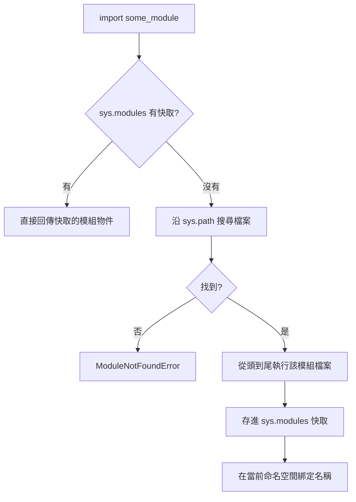

# 模組與 import 系統

> 每個 `.py` 檔都是一個模組，而 `import` 不只是「引入」——它會執行對方、快取結果、並依 `sys.path` 決定去哪裡找。看懂這條流程，才不會被 import 錯誤困住。

## 💡 白話導讀（建議先讀）

程式寫大了，不可能全塞在一個檔案。Python 的答案簡單到不行：

> **每一個 `.py` 檔，就是一個模組（module）。**

`math_utils.py` 這個檔，就是叫 `math_utils` 的模組。沒有任何額外儀式。

模組解決的第一個問題是**撞名**：你的 `math_utils.add` 和別人的 `string_utils.add` 是兩個不同的東西，各自住在自己的「命名空間」裡——像同名同姓的人住不同門牌，不會搞混。

再來是這章的核心，`import` 到底做了什麼？很多人以為它像 C 的 include「把文字貼過來」——**不是**。`import math_utils` 實際上是三步：

1. **找**：照一張搜尋路徑清單（`sys.path`）找 `math_utils.py` 在哪。
2. **執行**：**把那個檔案從頭到尾跑一遍**——對，import 會執行對方的程式碼！這就是為什麼被 import 的檔案裡若有 `print`，import 的瞬間就會印出來（也是上一章 `if __name__ == "__main__"` 存在的原因）。
3. **快取**：跑完的結果存起來（`sys.modules`）。**同一個模組再 import 一百次，也只執行第一次**。

新手兩大 import 錯誤，都能用這三步解釋：

- `ModuleNotFoundError` → 第 1 步失敗：搜尋路徑裡根本沒有它。
- 「我改了程式碼怎麼沒生效？」→ 第 3 步的快取：舊結果還在（重啟直譯器就好）。

帶著「找 → 執行 → 快取」三步走完這章。

## 🔗 前端對照

Python 的模組系統對應前端的 **ES modules**（`import` / `export`）——都是把程式碼拆檔、彼此引用:

| | Python | JavaScript（ESM） |
|---|--------|------------------|
| 匯入指定名稱 | `from math import sqrt` | `import { sqrt } from "..."` |
| 匯入整個模組 | `import math` → `math.sqrt` | `import * as math from "..."` |
| 匯出 | **不用宣告**,模組裡的名稱預設都可被 import | 要 `export`（沒 export 就抓不到） |
| 找檔規則 | 依 `sys.path` 搜尋 | 依相對/絕對路徑或 bundler 解析 |
| 執行時機 | import 時**執行整個模組一次**並快取 | 同樣執行一次並快取（單例） |

一句話:概念相同（拆檔、單例快取）,但 Python **不需要 `export`**——模組裡的東西預設都能被 import;
「哪些算公開」靠命名慣例（前底線 `_private`）而非語法強制。

## Why（為什麼）

程式一長，不可能全塞在一個檔案。把程式切成多個檔、彼此 import 重用，是任何真實專案的基本。但 `import` 背後其實做了不少事：它會**去哪裡找**這個模組？找到後**做什麼**？重複 import 會不會重複執行？

新手最常見的兩類錯誤——`ModuleNotFoundError`（找不到）與 import 造成的意外副作用——都源於不了解 import 的機制。這章把「import 到底發生什麼」拆開來看。

## Theory（理論：模組是什麼）

**模組（module）就是一個 `.py` 檔。** 檔名 `math_utils.py` 對應模組名 `math_utils`——沒有額外儀式。

模組是 Python 組織程式碼的基本單位，它提供**命名空間（namespace）**：
`math_utils` 裡的 `add` 和 `string_utils` 裡的 `add` 是兩個不同的東西（`math_utils.add` vs `string_utils.add`），不會撞名——同名同姓，但門牌不同。
這讓大型程式可以把功能分門別類，各自獨立。

`import` 的本質（導讀的三步中的第 2 步）值得再強調：

> 當你 `import` 一個模組，Python 會**執行那個檔案**，把裡面定義的名稱（函式、類別、變數）收進一個**模組物件**，你再透過這個物件取用。

是的——**模組本身也是物件**（呼應「一切皆物件」）。

## Specification（規範：import 的各種寫法）

```python
import math                    # 引入整個模組，用 math.pi 取用
import math as m               # 取別名，用 m.pi

from math import pi            # 只引入 pi 這個名稱，直接用 pi
from math import pi, sqrt      # 引入多個
from math import pi as PI      # 引入並改名

from math import *             # 引入模組裡所有公開名稱（不建議，見下）
```

各寫法的差異在於**引入什麼名稱到你當前的命名空間**：

| 寫法 | 你的命名空間多了什麼 | 取用方式 |
|------|---------------------|----------|
| `import math` | `math` | `math.pi` |
| `import math as m` | `m` | `m.pi` |
| `from math import pi` | `pi` | `pi` |
| `from math import *` | math 所有公開名稱 | 直接用（危險） |

## Implementation（import 實際發生的四件事）

`import some_module` 第一次執行時，Python 依序做：

1. **查快取**：先看 `sys.modules`（已載入模組的字典）裡有沒有 `some_module`。有的話直接拿來用，**不重新執行**。
2. **搜尋**：沒有的話，沿著 `sys.path` 列出的路徑逐一尋找對應的檔案。
3. **執行**：找到後，**從頭到尾執行整個模組檔案**（這步很關鍵，見下方副作用）。
4. **快取並綁定**：把產生的模組物件存進 `sys.modules`，並在你的命名空間綁上這個名稱。

### 關鍵一：import 會「執行」對方

`import` 不是只把名稱搬過來——它會**完整執行對方的檔案**。所以如果對方檔案頂層有 `print(...)` 或其他會做事的程式碼，import 的當下就會執行。這正是上一章 [`if __name__ == "__main__"`](03-repl-and-first-program.md) 存在的理由：把「執行時才做的事」擋在那道開關後面，避免被 import 時誤觸。

### 關鍵二：import 只執行一次

第 1 步的快取代表：同一個模組在整個程式生命週期中**只會被執行一次**。之後任何再次 `import` 都是從 `sys.modules` 直接拿快取。

```pycon
>>> import sys
>>> "math" in sys.modules
False
>>> import math          # 第一次：搜尋 + 執行 + 快取
>>> "math" in sys.modules
True
>>> import math          # 第二次：直接拿快取，不再執行
```

### 關鍵三：`sys.path` 決定「去哪找」

`sys.path` 是一個路徑清單，import 時 Python 從頭到尾照順序找：

```pycon
>>> import sys
>>> sys.path
['', '/usr/lib/python3.12', '.../site-packages', ...]
```

順序大致是：**執行腳本所在的目錄 → 標準庫 → site-packages（第三方套件）**。`ModuleNotFoundError` 幾乎都是因為「你要的模組不在 `sys.path` 的任何一個路徑裡」。

## Code Example（可執行的 Python 範例）

建立兩個檔案，示範跨模組 import：

```python
# calculator.py — 被 import 的模組
PI = 3.14159


def add(a: float, b: float) -> float:
    return a + b


def circle_area(radius: float) -> float:
    return PI * radius * radius


print(f"[calculator] 被載入了，__name__ = {__name__!r}")
```

```python
# main.py — 使用上面的模組
import calculator                       # 會觸發 calculator.py 頂層的 print
from calculator import circle_area      # 只把 circle_area 拉進來

print(calculator.add(2, 3))             # 透過模組物件取用
print(circle_area(10))                  # 直接用引入的名稱
print(calculator.PI)                    # 常數也能取
```

**預期輸出**：

```pycon
$ python main.py
[calculator] 被載入了，__name__ = 'calculator'
5
314.159
3.14159
```

逐步解說：

- 執行 `main.py` 時，遇到 `import calculator` → Python 找到並**執行** `calculator.py` 整個檔案 → 因此印出 `[calculator] 被載入了...`，且 `__name__` 是 `'calculator'`（被 import，非直接執行）。
- 第二行 `from calculator import circle_area` **不會**再次執行 `calculator.py`（已在 `sys.modules` 快取），只是多綁一個 `circle_area` 名稱。
- 之後 `calculator.add`、`circle_area`、`calculator.PI` 都能正常取用。

## Diagram（圖解：import 流程）



## Best Practice（最佳實踐）

- **優先用 `import module` 或 `from module import name`**，取用時保留來源（`calculator.add`）比一堆裸名稱更清楚。
- **避免 `from module import *`**：它會把一堆名稱倒進你的命名空間，容易撞名、也讓讀者看不出某個名字從哪來。
- **import 放在檔案頂端**，依「標準庫 → 第三方 → 自己的模組」分組（見 [PEP 8](08-pep8-and-style.md)），並讓工具（ruff/isort）自動排序。
- **模組頂層別放「會做事」的程式碼**：頂層應只有定義（函式、類別、常數）；要執行的邏輯包進函式並用 `if __name__ == "__main__"` 觸發。
- **遇到 `ModuleNotFoundError` 先查 `sys.path`**：確認你的模組所在目錄、或該第三方套件的 site-packages，有沒有在路徑裡（常和虛擬環境沒啟用、或執行目錄不對有關）。

## Common Mistakes（常見誤解）

- **`ModuleNotFoundError: No module named 'X'`**：X 不在 `sys.path`。若是第三方套件，多半是沒啟用虛擬環境或裝錯 Python（見 [pip](04-pip-and-packages.md)）；若是自己的模組，多半是執行的工作目錄不對。
- **以為重複 import 會重跑**：不會，只執行一次（`sys.modules` 快取）。想強制重載得用 `importlib.reload`，但這是特殊需求。
- **自己的檔案跟標準庫撞名**：把檔案取名 `random.py`、`json.py`、`math.py`，會遮蔽同名的標準庫，導致詭異錯誤。別用標準庫的名字命名自己的檔。
- **`from module import *` 造成名稱污染**：不知道引入了哪些名稱，也可能悄悄覆蓋你已有的變數。
- **循環 import（circular import）**：A import B、B 又 import A，可能因「執行到一半」而拿到不完整的模組。通常是模組職責劃分有問題的信號。
- **忘了 import 會執行對方頂層程式碼**：對方頂層若有副作用，import 當下就發生。

## Interview Notes（面試重點）

- 說得出 **import 的四步驟**：查 `sys.modules` 快取 → 沿 `sys.path` 搜尋 → **執行整個模組檔案** → 快取並綁定名稱。
- 強調兩個重點：**import 會執行對方**（所以要 `if __name__ == "__main__"`）、**只執行一次**（快取）。
- 知道 **`sys.path` 決定搜尋路徑**，`ModuleNotFoundError` 的根因就是「不在路徑裡」。
- 說得出 `import X` vs `from X import y` vs `from X import *` 的差異與各自對命名空間的影響，以及為何避免 `import *`。
- 知道循環 import 的成因與它通常代表的設計問題。
- 加分：module（單檔）與 package（一組模組，見 [下一章](07-packages-and-init.md)）的區別。

---

➡️ 下一章：[package 與 __init__.py](07-packages-and-init.md)

[⬆️ 回 Part 1 索引](README.md)
