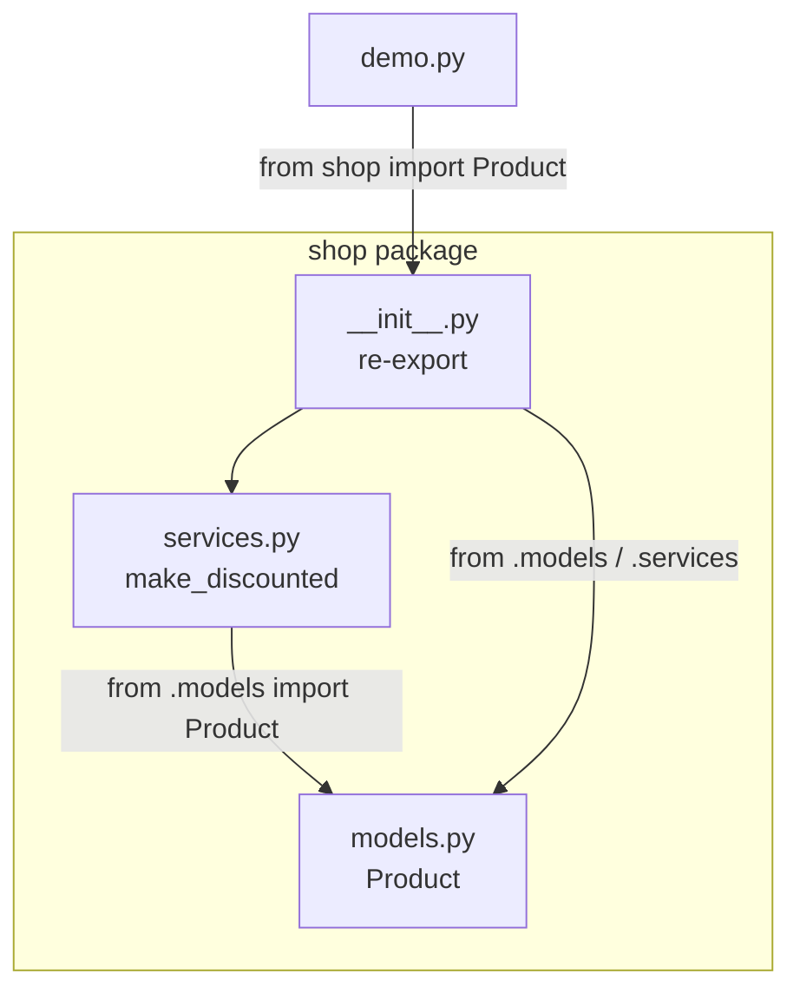

# package 與 __init__.py

> 當模組多到需要分資料夾管理，就需要 package——而 `__init__.py`、絕對 vs 相對 import，正是把資料夾變成「可 import 的套件」的關鍵。

## Why（為什麼）

上一章的模組是單一 `.py` 檔。但真實專案有幾十上百個模組，全平鋪在一個資料夾裡會亂成一團。你會想用資料夾把相關模組歸類：`models/`、`services/`、`api/`……

問題是：**Python 不會自動把「一個裝了 `.py` 的資料夾」當成可 import 的東西**——你得用 package 機制告訴它。搞懂 package、`__init__.py`、以及絕對/相對 import，你才能把程式組織成清爽的階層，而不是一堆散檔。

## Theory（理論：package 是「模組的資料夾」）

**package（套件）就是包含模組的資料夾**，讓你能寫出有階層的 import：

```python
import myapp.services.user       # myapp 資料夾 / services 資料夾 / user.py
from myapp.models import User    # myapp/models.py 裡的 User
```

每一層用 `.` 分隔，對應一層資料夾。這讓命名空間有了階層結構：`myapp.services.user` 和 `myapp.api.user` 是兩個不同模組，清楚不撞名。

package 有兩種：

- **regular package（一般套件）**：資料夾裡有 `__init__.py`。這是絕大多數情況該用的。
- **namespace package（命名空間套件）**：沒有 `__init__.py`（Python 3.3+ 支援），用於把分散在多處的同名 package 合併——進階需求，初學先用 regular package。

## Specification（規範：package 結構）

一個典型 package 結構：

```text
myapp/                    # package（因為有 __init__.py）
├── __init__.py           # 讓 myapp 成為 package；可為空
├── models.py             # 模組 myapp.models
├── services/             # 子 package
│   ├── __init__.py
│   └── user.py           # 模組 myapp.services.user
└── api/
    ├── __init__.py
    └── routes.py         # 模組 myapp.api.routes
```

對應的 import：

```python
import myapp.models
from myapp.models import User
from myapp.services.user import create_user
from myapp.api import routes
```

## Implementation（`__init__.py` 與兩種 import）

### `__init__.py` 做什麼

`__init__.py` 是「當這個 package 被 import 時會執行的檔案」。它有三個用途：

1. **標記這是 regular package**（傳統上；雖然 3.3+ 沒有它也能成 namespace package，但明確放一個更清楚、行為更可預期）。
2. **可為空**——很多時候它就是個空檔，只為了標記。
3. **可用來「拉平」對外介面**：在 `__init__.py` 裡 re-export 常用名稱，讓使用者少打字。

例如 `myapp/__init__.py`：

```python
# myapp/__init__.py
from myapp.models import User        # 於是使用者可以 from myapp import User
from myapp.services.user import create_user

__all__ = ["User", "create_user"]    # 定義 from myapp import * 會給出什麼
```

有了它，使用者能直接 `from myapp import User`，不必知道 `User` 其實藏在 `myapp.models` 裡——這是設計 API 的常見手法。

> `__init__.py` 也會在 package 首次被 import 時執行（一樣遵守「只執行一次」的快取規則）。別在裡面放昂貴或有副作用的程式碼。

### 絕對 import vs 相對 import

在 package 內部，模組之間互相引用有兩種寫法：

**絕對 import（absolute import）**——從 package 根寫完整路徑：

```python
# 在 myapp/services/user.py 裡
from myapp.models import User        # 絕對：從頂層 myapp 寫起
```

**相對 import（relative import）**——用 `.` 表示「相對於目前所在位置」：

```python
# 在 myapp/services/user.py 裡
from ..models import User            # .. 代表上一層（myapp），再進 models
from .helpers import validate        # .  代表同一層（services）
```

`.` 的規則：一個點 = 當前 package、兩個點 = 上一層、三個點 = 再上一層。

**該用哪個？** PEP 8 建議**優先用絕對 import**（清楚、不怕搬動時誤解）；相對 import 在大型 package 內部、想少寫前綴時可用，但別超過兩層點否則可讀性差。

## Code Example（可執行的 Python 範例）

建立一個小 package 實測。結構：

```text
shop/
├── __init__.py
├── models.py
└── services.py
```

```python
# shop/models.py
class Product:
    def __init__(self, name: str, price: float) -> None:
        self.name = name
        self.price = price

    def __repr__(self) -> str:
        return f"Product({self.name!r}, {self.price})"
```

```python
# shop/services.py
from .models import Product          # 相對 import：同一層的 models


def make_discounted(name: str, price: float, off: float) -> Product:
    """建立打折後的商品。"""
    return Product(name, round(price * (1 - off), 2))
```

```python
# shop/__init__.py
from .models import Product          # re-export，拉平對外介面
from .services import make_discounted

__all__ = ["Product", "make_discounted"]
```

在 `shop` 的**上一層**目錄執行：

```python
# demo.py（與 shop/ 同層）
from shop import Product, make_discounted    # 因為 __init__.py 已 re-export

p = Product("Book", 100.0)
d = make_discounted("Pen", 50.0, 0.2)
print(p)
print(d)
```

**預期輸出**：

```pycon
$ python demo.py
Product('Book', 100.0)
Product('Pen', 40.0)
```

解說：使用者只寫了 `from shop import Product, make_discounted`，完全不必知道它們分別住在 `shop.models` 和 `shop.services`——因為 `__init__.py` 幫忙 re-export 了。這就是 package 對外「拉平介面」的價值。

## Diagram（圖解：package 階層與 import）



## Best Practice（最佳實踐）

- **明確放 `__init__.py`**：即使空的，也讓 package 邊界清楚、行為可預期，勝過依賴 namespace package。
- **用 `__init__.py` 設計對外介面**：re-export 常用名稱 + 設定 `__all__`，讓使用者用起來簡潔，也能隱藏內部結構。
- **優先絕對 import**（PEP 8 建議）；相對 import 限用於 package 內部、且不要超過兩層點。
- **`__init__.py` 保持輕量**：只做 re-export，別放昂貴初始化或副作用，否則每次 import package 都要付代價。
- **搭配 src layout**（見 [專案結構](09-project-layout.md)）：把 package 放在 `src/` 下，避免「剛好在專案根目錄執行才 import 得到」的假象。

## Common Mistakes（常見誤解）

- **忘了放 `__init__.py` 卻預期是 regular package**：在某些執行情境下會變成 namespace package 或 import 行為不如預期；初學者統一放 `__init__.py` 最省事。
- **相對 import 報 `ImportError: attempted relative import with no known parent package`**：這是因為你**直接執行了 package 內的某個檔**（`python shop/services.py`），此時它的 `__name__` 是 `'__main__'`、沒有 parent package，相對 import 就失效。解法：改用 `python -m shop.services` 以模組方式執行，或改用絕對 import。
- **相對 import 點數搞錯**：`.` 是當前層、`..` 是上一層；記錯就 import 到錯的地方。
- **`__init__.py` 塞太多邏輯**：拖慢 import、製造循環 import 風險。
- **在 package 內用「直接執行單檔」測試相對 import**：如上所述會失敗，改用 `-m`。

## Interview Notes（面試重點）

- 說得清 **module（單檔）vs package（含模組的資料夾）** 的差別。
- 知道 **`__init__.py` 的作用**：標記 regular package、可為空、可 re-export 拉平對外介面、設定 `__all__`。
- 講得出**絕對 import vs 相對 import**的寫法與 `.`/`..` 語意，並知道 PEP 8 偏好絕對 import。
- 能解釋為什麼「直接執行 package 內的檔案」會讓相對 import 失敗（`__main__` 沒有 parent package），以及用 `python -m` 解決。
- 加分：知道 namespace package（無 `__init__.py`）的存在與適用場景。

---

➡️ 下一章：[PEP 8 與 Pythonic 風格](08-pep8-and-style.md)

[⬆️ 回 Part 1 索引](README.md)
