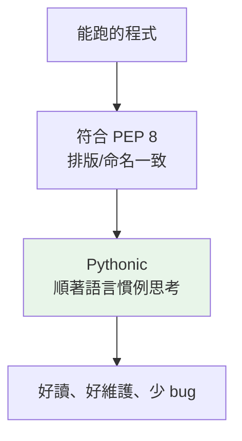

# PEP 8 與 Pythonic 風格

> PEP 8 讓所有 Python 程式看起來像同一個人寫的；而「Pythonic」比排版更深一層——它是順著語言設計去思考，而不是把別的語言硬翻過來。

## Why（為什麼）

程式碼被讀的次數遠多於被寫的次數。當一個團隊十個人各寫各的排版風格，光是讀彼此的程式就要不斷切換腦袋。Python 社群很早就決定：**與其爭論風格，不如全體遵循同一份約定。** 這份約定就是 **PEP 8**。

但風格不只是空格與命名。更重要的是**思維方式**：同一件事，「翻譯自 C/Java 的寫法」和「Pythonic 的寫法」可能天差地遠。學會 Pythonic，你的程式才會既好讀又不與語言作對。

## Theory（理論：PEP 是什麼、PEP 8 是什麼）

**PEP = Python Enhancement Proposal（Python 增強提案）**，是 Python 官方的設計文件流程。任何語言層級的改動、慣例、決策都以編號的 PEP 記錄。你會反覆遇到幾個重要的：

- **PEP 8**：程式碼風格指南（本章主角）。
- **PEP 20**：The Zen of Python（`import this`，見 [為什麼是 Python](01-why-python.md)）。
- **PEP 257**：docstring 慣例。
- **PEP 484**：type hints（見 [Part 5 型別系統](../05-typing/README.md)）。

PEP 8 由 Guido 等人撰寫，是**官方推薦的風格慣例**——不是語法強制（違反不會報錯），但整個社群、幾乎所有專案都遵循它。

## Specification（規範：PEP 8 核心規則）

### 縮排與行寬

- **縮排用 4 個空格**，不要用 Tab（混用 Tab 與空格在 Python 3 會直接報錯）。
- 每行建議不超過 **79 字元**（許多現代專案放寬到 88 或 100，由工具設定統一）。

### 命名慣例（最常考）

| 對象 | 慣例 | 範例 |
|------|------|------|
| 變數、函式、模組 | `snake_case`（小寫底線） | `user_name`、`get_user()` |
| 類別 | `PascalCase`（大駝峰） | `class UserAccount:` |
| 常數 | `UPPER_SNAKE_CASE` | `MAX_RETRIES = 3` |
| 「內部用」 | 前綴單底線 | `_internal_helper` |
| 避免名稱衝突（name mangling） | 前綴雙底線 | `__private`（見 [封裝](../04-oop/05-encapsulation.md)） |

### 空格

```python
x = 1                    # 運算子兩側各一空格
def f(a, b=0):           # 逗號後空格；預設值的 = 不加空格
    return a + b
items = [1, 2, 3]        # 逗號後空格；括號內側不加空格
d = {"key": "value"}     # 冒號後空格
```

### import 排序

```python
# 1. 標準庫
import os
import sys

# 2. 第三方套件
import requests

# 3. 自己的模組
from myapp import models
```

三組之間空一行，組內按字母排序（交給 ruff/isort 自動做）。

## Implementation（Pythonic：比排版更深一層）

PEP 8 管「長相」，**Pythonic 管「思路」**。以下是幾組「非 Pythonic vs Pythonic」對照，體會差異：

### 遍歷時要索引 → 用 `enumerate`

```python
# ❌ 從 C/Java 帶來的習慣
i = 0
for item in items:
    print(i, item)
    i += 1

# ✅ Pythonic
for i, item in enumerate(items):
    print(i, item)
```

### 同時遍歷兩個序列 → 用 `zip`

```python
# ❌
for i in range(len(names)):
    print(names[i], ages[i])

# ✅ Pythonic
for name, age in zip(names, ages):
    print(name, age)
```

### 檢查空容器 → 直接用 truthiness

```python
# ❌
if len(items) == 0:
    ...
if len(items) > 0:
    ...

# ✅ Pythonic（空容器為 falsy）
if not items:
    ...
if items:
    ...
```

### 建立列表 → 用推導式

```python
# ❌
squares = []
for x in range(10):
    squares.append(x * x)

# ✅ Pythonic
squares = [x * x for x in range(10)]
```

（推導式細節見 [推導式](../02-fundamentals/13-comprehensions.md)。）

### 交換變數 → 不需暫存變數

```python
# ❌
tmp = a
a = b
b = tmp

# ✅ Pythonic
a, b = b, a
```

這些不只是「比較短」，而是**更清楚表達意圖**、更不易出錯——這就是 Pythonic 的核心：讓程式讀起來像在描述你想做什麼。

## Code Example（風格前後對照）

同一段邏輯，非 Pythonic 版 vs Pythonic 版：

```python
# ❌ 非 Pythonic：像把 C 翻成 Python
def ProcessData(DataList):
    result=[]
    for i in range(len(DataList)):
        if DataList[i]!=None and DataList[i]>0:
            result.append(DataList[i]*2)
    return result
```

```python
# ✅ Pythonic：命名、空格、慣用法都對
def process_data(data: list[int | None]) -> list[int]:
    """把非 None 且為正的數字乘以 2。"""
    return [x * 2 for x in data if x is not None and x > 0]


if __name__ == "__main__":
    print(process_data([1, None, -3, 4]))
```

**預期輸出**：

```pycon
$ python process.py
[2, 8]
```

差異一次看清：函式/變數改 `snake_case`、運算子加空格、`== None` 改成 `is not None`（見下方常見錯誤）、迴圈+append 改推導式、加上型別註記與 docstring。

## Diagram（圖解：風格三層）



## Best Practice（最佳實踐）

- **交給工具自動化，別靠人腦記**：用 **ruff**（同時做 lint 與 format，速度極快）或 black + isort，一鍵格式化，團隊零爭論（見 [ruff 與 black](../13-tooling-packaging/06-ruff-black.md)）。
- **設定寫進 `pyproject.toml`**：統一行寬、規則，讓每個人與 CI 用同一套標準。
- **命名要說人話**：`n` 不如 `count`、`d` 不如 `user_by_id`；好名字是最好的註解。
- **寫 docstring**（PEP 257）：公開函式/類別用三引號說明用途，`help()` 就能查到。
- **一致性 > 個人偏好**：進到既有專案，先跟它的風格走，別堅持自己的。
- **先追求正確與清楚，再追求 Pythonic**：別為了炫技寫出一行看不懂的推導式。

## Common Mistakes（常見誤解）

- **Tab 與空格混用**：Python 3 會直接 `TabError`。統一用 4 空格，讓編輯器把 Tab 轉空格。
- **`== None` / `== True`**：判斷 None 要用 **`is None` / `is not None`**（身分比較，見 [物件模型](../10-cpython-internals/02-object-model.md)）；判斷布林直接 `if flag:`，別寫 `== True`。
- **把 PEP 8 當語法強制**：違反 PEP 8 程式照跑，它是慣例不是編譯規則；但團隊協作時該遵守。
- **過度追求「短」**：把三層邏輯硬塞成一行推導式反而難讀。Pythonic 是「清楚」，不是「最短」。
- **命名用 `PascalCase` 命名函式、`snake_case` 命名類別**：搞反了。函式/變數 snake_case、類別 PascalCase。
- **手動排 import、手動對齊空格**：浪費生命，交給 ruff。

## Interview Notes（面試重點）

- 知道 **PEP 是什麼**，並能點名幾個重要 PEP（8 風格、20 之禪、484 型別）。
- 背得出 PEP 8 **命名慣例**：函式/變數 `snake_case`、類別 `PascalCase`、常數 `UPPER_SNAKE_CASE`、內部用單底線前綴。
- 能舉出幾個 **Pythonic 慣用法**：`enumerate`、`zip`、truthiness 判空、推導式、`a, b = b, a`——並說出「為什麼比土法更好」（更清楚表達意圖、更少出錯）。
- 知道判 None 用 **`is None`** 而非 `==`，並能講出原因（身分 vs 相等）。
- 知道實務上**靠工具（ruff/black）自動化**，設定放 `pyproject.toml`，而非靠人工。

---

➡️ 下一章：[專案結構與 src layout](09-project-layout.md)

[⬆️ 回 Part 1 索引](README.md)
