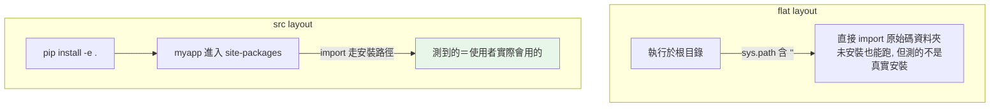

# 專案結構與 src layout

> 一個 Python 專案不只是「一堆 .py」——用 src layout 與 pyproject.toml 把它組織成「可安裝的套件」，才能避免「只有在專案根目錄才跑得起來」的假象。

## 💡 白話導讀（建議先讀）

寫了幾個 `.py` 檔之後，下一個問題是：**專案資料夾該怎麼擺？**

兩種主流擺法，差別只有一層資料夾：

- **flat layout**：套件直接放專案根目錄（`myproject/myapp/`）。
- **src layout**：套件多包一層 src（`myproject/src/myapp/`）。

看起來是小事，但 src layout 防住一個**很陰的 bug**：

flat layout 下，你在專案根目錄跑測試，`import myapp` 成功了——但它 import 到的是「**剛好躺在旁邊的原始碼資料夾**」，不是「正式安裝的套件」。
於是出現經典幻覺：**「在我電腦上能跑」**——換個目錄執行就掛、部署到別台機器就掛，因為別的地方沒有「剛好躺在旁邊」的資料夾。

src layout 多包的那層 src，就是**強迫你誠實**：想 import 就必須正式安裝（`pip install -e .`），跑得起來就代表在哪都跑得起來。

這章另一個主角是 **`pyproject.toml`**——專案的「身分證」：名字、版本、依賴哪些套件、怎麼安裝，全寫在這一個檔案裡。現代 Python 專案的標準配備。

一句話帶走：**src layout + pyproject.toml = 你的程式碼從「一堆檔案」升級成「可安裝的套件」**。

## Why（為什麼）

當你的專案從「一支腳本」長成「一個系統」，檔案怎麼擺就開始影響一切：測試放哪、套件怎麼被 import、能不能打包發佈、CI 怎麼跑。

一個常見的痛：程式在你的機器、你的資料夾、你的執行方式下能跑，換個目錄或裝到別人環境就 `ModuleNotFoundError`。這通常是**專案結構沒設計好**——特別是沒把程式碼當成「一個真正被安裝的套件」來對待。**src layout** 就是為了根除這類問題的業界標準做法。

## Theory（理論：flat layout vs src layout）

兩種主流的專案擺法：

**flat layout（平鋪）**——套件直接放在專案根目錄：

```text
myproject/
├── pyproject.toml
├── myapp/              # 套件直接在根目錄
│   ├── __init__.py
│   └── core.py
└── tests/
```

**src layout**——套件放在 `src/` 子資料夾裡：

```text
myproject/
├── pyproject.toml
├── src/
│   └── myapp/          # 套件在 src/ 底下
│       ├── __init__.py
│       └── core.py
└── tests/
```

差別看似只是多一層資料夾，影響卻很本質。關鍵問題是：

> **你 import 到的，是「正式安裝好的套件」，還是「剛好躺在旁邊的原始碼」？**

flat layout 容易發生後者——測試「碰巧」通過，於是有了「在我電腦上能跑」的幻覺。
src layout 強迫你正式安裝（`pip install -e .`）才 import 得到——誠實面對部署後的真實情況。

## Specification（規範：一個標準專案的骨架）

以 src layout 為例的完整結構：

```text
myproject/
├── README.md
├── pyproject.toml          # 專案元資料、相依、工具設定（見 Part 13）
├── .gitignore
├── src/
│   └── myapp/
│       ├── __init__.py
│       ├── __main__.py     # 讓 python -m myapp 可執行
│       ├── core.py
│       └── utils.py
└── tests/
    ├── __init__.py
    └── test_core.py
```

- `src/myapp/`：你的套件本體。
- `tests/`：測試，與套件平行（不放在套件內），避免把測試也打包發佈出去。
- `pyproject.toml`：定義套件名稱、版本、相依與工具設定（見 [pyproject.toml 全解析](../13-tooling-packaging/04-pyproject-toml.md)）。

## Implementation（src layout 為什麼更好）

核心在於**「當前目錄會被自動加進 `sys.path`」**這個行為（見 [模組與 import](06-modules-and-import.md)）。

**flat layout 的隱患**：因為套件 `myapp/` 就在你執行指令的根目錄，`sys.path` 裡的 `''`（當前目錄）讓你**不必安裝**就能 `import myapp`。聽起來方便，但這製造了一個假象——你測試的其實是「原始碼資料夾」，而不是「使用者實際會 `pip install` 裝到 site-packages 的那個套件」。結果：明明本地全綠，發佈出去卻少了檔案、或 import 路徑不對。

**src layout 的保護**：套件在 `src/myapp/`，而 `src/` **不會**被自動加進 `sys.path`。所以你**必須先安裝**（通常用「可編輯安裝」）才能 import：

```bash
python -m pip install -e .        # editable install：把套件以可編輯方式裝進環境
```

`-e`（editable）會把 `src/myapp` 連結進環境的 site-packages，於是：

1. 你 import 的路徑，和使用者裝好後 import 的路徑**完全一致**——測到的就是真實情況。
2. 改原始碼立即生效（因為是連結，不是複製），開發依然方便。
3. 打包時不會誤把根目錄的雜檔（測試、設定）一起包進去。

一句話：**src layout 強迫你「像使用者一樣安裝後再 import」，及早暴露打包/路徑問題。**

## Code Example（可執行的 Python 範例）

建立一個最小的 src layout 專案並跑起來。

`pyproject.toml`：

```toml
[project]
name = "myapp"
version = "0.1.0"
requires-python = ">=3.12"

[build-system]
requires = ["setuptools>=68"]
build-backend = "setuptools.build_meta"
```

`src/myapp/core.py`：

```python
def add(a: int, b: int) -> int:
    return a + b
```

`src/myapp/__main__.py`（讓 `python -m myapp` 能執行）：

```python
from myapp.core import add


def main() -> None:
    print(f"2 + 3 = {add(2, 3)}")


if __name__ == "__main__":
    main()
```

`tests/test_core.py`：

```python
from myapp.core import add


def test_add() -> None:
    assert add(2, 3) == 5
```

安裝並執行：

```bash
python -m venv .venv && source .venv/bin/activate
python -m pip install -e .          # 可編輯安裝
python -m myapp                     # 執行套件
pytest                              # 跑測試
```

**預期輸出**：

```pycon
(.venv) $ python -m myapp
2 + 3 = 5
(.venv) $ pytest
...
1 passed in 0.01s
```

關鍵：測試裡的 `from myapp.core import add` 之所以能成立，是因為我們**先 `pip install -e .` 把 myapp 裝進了環境**——這正是 src layout 想強制的「像使用者一樣」的路徑。

## Diagram（圖解：兩種 layout 的 import 來源）



## Best Practice（最佳實踐）

- **新專案優先用 src layout**：一開始就避免「只有本地能跑」的路徑陷阱，這是目前的社群共識。
- **開發時用 `pip install -e .`**（可編輯安裝）：一次安裝，之後改碼即時生效。
- **測試放在套件外的 `tests/`**：與套件平行，不打包進發佈物；測試透過「已安裝的套件」import，才測得準。
- **一切設定集中在 `pyproject.toml`**：專案元資料、相依、ruff/mypy/pytest 設定都放這（見 [Part 13](../13-tooling-packaging/04-pyproject-toml.md)）。
- **加 `__main__.py`** 讓套件能 `python -m myapp` 執行，是 CLI 工具的慣例。
- **`.venv/`、`__pycache__/`、`*.egg-info/` 進 `.gitignore`**。

## Common Mistakes（常見誤解）

- **flat layout 下「本地能跑、發佈就壞」**：因為本地是直接 import 原始碼資料夾，沒測到真正打包後的樣子。src layout + editable install 可提前抓到。
- **把 `tests/` 放進套件內並一起發佈**：使用者裝你的套件時不需要你的測試，徒增體積、還可能撞名。
- **忘了 `pip install -e .` 就在 src layout 下 import**：會 `ModuleNotFoundError`，因為 `src/` 不在 `sys.path`。這正是它的設計目的——逼你安裝。
- **靠「在特定資料夾執行」來讓 import 成立**：脆弱且換環境就壞。應以「安裝成套件」為前提。
- **專案名稱和套件名稱混淆**：專案（repo）可叫 `my-project`，套件（import 名）叫 `myapp`；發佈名（PyPI）又可不同。三者可各異。

## Interview Notes（面試重點）

- 說得出 **flat layout vs src layout** 的差別，以及 **src layout 為何是推薦做法**：強迫「安裝後再 import」，讓測試環境等同使用者環境，及早暴露打包/路徑問題。
- 知道其原理和 `sys.path` 有關（當前目錄會被加入 → flat layout 免安裝就能 import，反而是陷阱）。
- 知道 **`pip install -e .`（editable install）** 的作用與好處。
- 知道測試放套件外、設定集中在 `pyproject.toml`、`__main__.py` 的用途。
- 加分：能區分 repo 名 / import 套件名 / PyPI 發佈名三者可以不同。

---

➡️ 下一章：[Python 2 vs 3 與版本演進](10-python2-vs-3.md)

[⬆️ 回 Part 1 索引](README.md)
