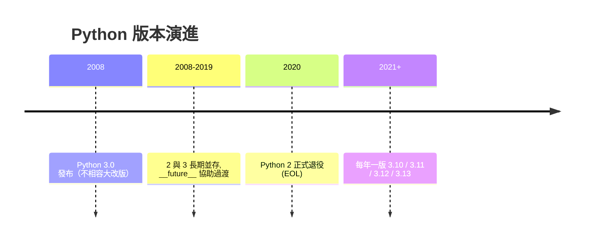

# Python 2 vs 3 與版本演進

> Python 2→3 是史上最痛的一次語言遷移，理解它不是為了寫 Python 2，而是為了看懂「為什麼有些教學是錯的」，以及 Python 如何用 `__future__` 與棄用機制管理演進。

## Why（為什麼）

你不會再寫 Python 2（它已於 2020 年正式退役），那為什麼要學這段歷史？三個實際理由：

1. **網路上仍有大量 Python 2 的教學與答案**，照抄會遇到 `print "x"` 這種在 Python 3 直接報錯的寫法。你要能一眼認出「這是 Python 2 的東西」。
2. **2→3 的痛，塑造了現代 Python 的演進哲學**：之後所有改動都力求平滑、可預警、可漸進採用。理解這點，你才懂 `__future__`、`DeprecationWarning` 這些機制為何存在。
3. **面試會問**：這是驗證「你是否理解 Python 生態歷史」的常見題。

## Theory（理論：為什麼 2→3 這麼痛）

Python 3（2008 年發布）是一次**刻意的、不向後相容**的大改版。Guido 決定「一次修好累積多年的設計錯誤」，代價是 Python 2 的程式碼不能直接在 Python 3 上跑。

最致命的一項改動是 **字串模型**。這不只是語法差異，而是資料模型的根本改變：

- **Python 2**：`str` 是**位元組（bytes）**，另有 `unicode` 型別處理文字。兩者混用時會發生惡名昭彰的隱式編碼/解碼，導致 `UnicodeDecodeError` 滿天飛。
- **Python 3**：`str` 是**Unicode 文字**，位元組是獨立的 `bytes` 型別，兩者**不會隱式互轉**。文字與位元組被清楚分開。

這個改變讓 Python 3 處理多語言文字變得正確而清爽，但也意味著幾乎每個碰到字串/檔案/網路的程式都需要修改——這是遷移之所以浩大的核心原因。

## Specification（規範：關鍵差異對照）

| 項目 | Python 2 | Python 3 |
|------|----------|----------|
| `print` | 敘述：`print "hi"` | 函式：`print("hi")` |
| 整數除法 | `5 / 2 == 2`（截斷） | `5 / 2 == 2.5`（真除法），整數除用 `5 // 2` |
| 字串 | `str`＝bytes，另有 `unicode` | `str`＝Unicode，另有 `bytes` |
| `range` | 回傳 list | 回傳惰性的 range 物件 |
| 輸入 | `raw_input()` | `input()` |
| 例外語法 | `except Exc, e:` | `except Exc as e:` |
| 除法/迭代 | 多回傳 list（`dict.keys()` 等） | 多回傳 view/iterator（惰性） |

一眼認出 Python 2 的信號：`print "..."`（無括號）、`except X, e`、`raw_input`、`5/2` 期待得到 `2`。

## Implementation（`__future__` 與演進機制）

### `from __future__` —— 在舊版預先啟用新行為

在 Python 2 的遷移年代，`__future__` 模組讓你能**在 Python 2 裡提前採用 Python 3 的行為**，逐步過渡：

```python
# 在 Python 2 檔案頂端
from __future__ import print_function   # 讓 print 變成函式
from __future__ import division         # 讓 / 變成真除法

print("hello")     # 現在需要括號了
print(5 / 2)       # 得到 2.5 而非 2
```

`__future__` 體現了 Python 演進的核心理念：**重大改動先以「可選」形式提供，讓人漸進採用，而非一夕強迫。** 這正是從 2→3 慘痛經驗學到的教訓。（今天寫 Python 3 幾乎用不到它，但看到它就知道那是過渡期的產物或很舊的程式。）

### 棄用機制：DeprecationWarning

Python 3 內部的演進遵守「先警告、再移除」的節奏：一個功能要被移除前，會先在數個版本間發出 `DeprecationWarning`，給生態時間調整。

```python
import warnings

warnings.warn("old_api 已棄用，請改用 new_api", DeprecationWarning, stacklevel=2)
```

跑測試時開啟 `-W error::DeprecationWarning` 能把警告變成錯誤，提前發現自己用了將被移除的東西。

### 版本演進節奏（回顧）

Python 3 之後採**年度發布**：每年 10 月一個新次版本（3.11、3.12、3.13…），各有約 5 年支援期（見 [安裝 Python](02-install-and-interpreter.md)）。每版帶來新語法糖與效能提升，例如：3.10 的 `match`、3.11 的顯著提速與更精準的錯誤訊息、3.12 的型別語法改進。

## Code Example（新舊寫法對照）

同一段邏輯的 Python 2 寫法（**在 Python 3 會報錯**）與 Python 3 寫法：

```python
# ❌ Python 2 風格（在 Python 3 執行會 SyntaxError / 行為不同）
# print "Enter name:",
# name = raw_input()
# print "Half:", 5 / 2          # Python 2 得到 2
```

```python
# ✅ Python 3
def main() -> None:
    name = input("Enter name: ")
    print(f"Hello, {name}")
    print(f"Half of 5: {5 / 2}")      # 2.5（真除法）
    print(f"Floor div: {5 // 2}")     # 2（整數除法）


if __name__ == "__main__":
    main()
```

**預期輸出**（輸入 `Alice`）：

```pycon
$ python demo.py
Enter name: Alice
Hello, Alice
Half of 5: 2.5
Floor div: 2
```

重點對照：`raw_input`→`input`、`print` 敘述→函式、`5/2` 從 `2` 變 `2.5`（要整數結果改用 `//`）。這三點是踩雷率最高的差異。

## Diagram（圖解：Python 演進與過渡機制）



## Best Practice（最佳實踐）

- **一律寫 Python 3**（3.12+）。今天沒有理由寫新的 Python 2 程式碼。
- **看教學先確認版本**：出現 `print "..."`、`raw_input`、`except X, e` 就是 Python 2 素材，需自行轉換或另找 Python 3 資料。
- **除法要清醒**：需要浮點結果用 `/`、需要整數結果用 `//`；別假設 `/` 會截斷（那是 Python 2 的行為）。
- **文字與位元組分清**：`str` 是文字、`bytes` 是位元組，讀寫檔案/網路時明確處理編碼（`encode`/`decode`），別依賴隱式轉換。
- **CI 開啟棄用警告**：把 `DeprecationWarning` 當回事，提前處理未來會被移除的用法，讓升級 Python 版本更順。

## Common Mistakes（常見誤解）

- **照抄網路上的 Python 2 範例**：`print "x"` 在 Python 3 是 `SyntaxError`；`5/2` 期待 `2` 卻得到 `2.5`。
- **以為 `/` 會做整數除法**：Python 3 的 `/` 永遠是真除法（回浮點），整數除是 `//`。
- **混用 `str` 與 `bytes`**：Python 3 不會幫你隱式轉換，`"abc" + b"def"` 會 `TypeError`；需明確 `encode`/`decode`。
- **以為 `range`/`dict.keys()` 回傳 list**：Python 3 回傳惰性物件，要 list 得 `list(range(10))`。
- **想「相容 2 和 3」而付出巨大成本**：除非維護超舊系統，否則不值得。專注 Python 3。
- **把 `__future__` 當成 Python 3 的新功能**：它是**過渡期**工具，讓 Python 2 預用 3 的行為；在純 Python 3 幾乎用不到。

## Interview Notes（面試重點）

- 說得出 2→3 **最核心的改變是字串模型**（`str` 從 bytes 變 Unicode、bytes 獨立、不再隱式互轉），以及為何這讓遷移浩大。
- 背得出幾個高頻差異：`print` 敘述→函式、`5/2` 真除法（`//` 才截斷）、`raw_input`→`input`、`range`/`dict.keys()` 變惰性。
- 知道 **`from __future__ import` 的角色**：讓舊版預先採用新行為，體現「漸進、可選」的演進哲學。
- 知道 Python 2 已於 **2020 年 EOL**，以及 Python 3 的**年度發布**節奏。
- 知道 **DeprecationWarning「先警告再移除」** 的演進紀律，是 2→3 慘痛經驗的產物。

---

➡️ 下一章：[編輯器與工具鏈設定](11-editor-and-tooling-setup.md)

[⬆️ 回 Part 1 索引](README.md)
