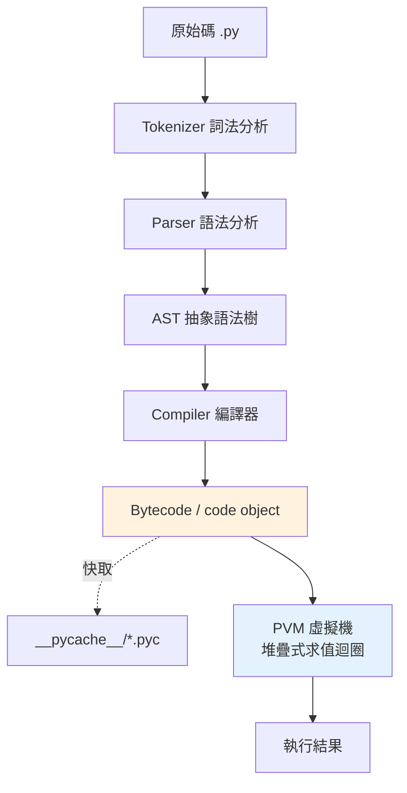

# Python 如何執行：source → bytecode → PVM

> 「直譯式語言」是個過度簡化的說法——CPython 其實先把你的原始碼編成 bytecode，再交給一台虛擬機逐條執行。看懂這條管線，是理解後面所有底層章節的鑰匙。

## Why（為什麼）

到目前為止，你都把 `python hello.py` 當黑盒子：丟進去、跑出來。但這個黑盒子裡發生的事，決定了本書後半段幾乎所有「為什麼」——為什麼有 GIL、為什麼引用計數能運作、為什麼 Python 比 C 慢、為什麼會有 `.pyc` 檔。

這一章把黑盒子打開，看清 CPython 執行你的程式的完整管線。它是 Part 1 的收尾，也是通往 [Part 10 CPython 內部](../10-cpython-internals/README.md) 的橋樑。理解了它，你對 Python 的認識就從「使用者」升級成「知道它怎麼跑」。

## Theory（理論：兩段式，不是純直譯）

上一次我們提到「直譯不等於沒編譯」（見 [為什麼是 Python](01-why-python.md)）。現在講清楚完整流程。CPython 執行程式是**兩段式**的：

1. **編譯（compile）**：把原始碼 `.py` 編譯成 **bytecode（位元組碼）**——一種平台無關的中間指令。
2. **執行（interpret）**：由 **PVM（Python Virtual Machine，Python 虛擬機）** 逐條讀取並執行這些 bytecode 指令。

所以 Python 既不是純編譯（不像 C 直接編成機器碼），也不是純直譯（不是一行行讀原始碼執行）——它是**「先編成 bytecode、再由虛擬機直譯 bytecode」**。這和 Java（編成 bytecode 給 JVM）在架構上是類似的。

## Specification（規範：完整管線的每一步）

```text
你的 .py 原始碼
    │  ① 詞法分析 (tokenize)：切成 token
    ▼
tokens
    │  ② 語法分析 (parse)：建成 AST（抽象語法樹）
    ▼
AST
    │  ③ 編譯 (compile)：走訪 AST 產生 bytecode
    ▼
bytecode（存在 code object 裡，可快取成 .pyc）
    │  ④ 執行：PVM 逐條執行 bytecode 指令
    ▼
結果
```

- **token**：程式的最小單位（關鍵字、識別字、運算子、字面值）。
- **AST（Abstract Syntax Tree）**：程式結構的樹狀表示，`ast` 模組可檢視。
- **bytecode**：低階指令序列，存在 **code object** 裡。
- **PVM**：一個基於**堆疊（stack-based）** 的求值迴圈，逐條執行 bytecode。

## Implementation（親手拆開來看）

### `.pyc` 檔：被快取的 bytecode

當一個**模組被 import** 時，CPython 會把它編出的 bytecode 存進 `__pycache__/` 資料夾裡的 `.pyc` 檔。下次再 import，若原始碼沒改，就直接載入 `.pyc`，**跳過編譯步驟**加速啟動。

```text
myproject/
├── utils.py
└── __pycache__/
    └── utils.cpython-312.pyc     # utils.py 編譯後的 bytecode 快取
```

注意：**只有被 import 的模組會產生 `.pyc`**；你用 `python main.py` 直接執行的那個主檔通常不會留下 `.pyc`（它每次都重新編）。`.pyc` 只是**啟動最佳化的快取**，刪掉它程式照跑（會重新編一次）。這也是為什麼 `.pyc` 和 `__pycache__/` 該進 `.gitignore`（見 [虛擬環境](05-venv.md)）。

### 用 `dis` 看 bytecode

`dis` 模組（disassembler）能把函式反組譯成人類可讀的 bytecode。這是本書之後反覆使用的利器：

```python
# show_bytecode.py
import dis


def add(a, b):
    return a + b


dis.dis(add)
```

**預期輸出**（版本間指令名稱可能略有差異）：

```pycon
$ python show_bytecode.py
  5           RESUME                   0

  6           LOAD_FAST                0 (a)
              LOAD_FAST                1 (b)
              BINARY_OP                0 (+)
              RETURN_VALUE
```

逐條解讀，感受 PVM 的「堆疊機器」本質：

- `LOAD_FAST a`：把區域變數 `a` 推上堆疊。
- `LOAD_FAST b`：把 `b` 推上堆疊。
- `BINARY_OP +`：從堆疊彈出兩個值，相加，把結果推回堆疊。
- `RETURN_VALUE`：把堆疊頂端的值當作回傳值。

**這就是 `a + b` 在 CPython 裡真正發生的事**——不是一步，而是四條堆疊操作。理解 PVM 是堆疊機器，之後看任何 bytecode 都不再神秘。

### 用 `ast` 看語法樹

想看更前面的一步（AST），用 `ast` 模組：

```pycon
>>> import ast
>>> print(ast.dump(ast.parse("a + b"), indent=2))
Module(
  body=[
    Expr(
      value=BinOp(
        left=Name(id='a', ctx=Load()),
        op=Add(),
        right=Name(id='b', ctx=Load())))],
  ...)
```

`a + b` 被解析成一棵 `BinOp`（二元運算）節點，左右各一個 `Name`。編譯器就是走訪這棵樹產生前面那段 bytecode 的。

## Diagram（圖解：CPython 執行管線）



## Best Practice（最佳實踐）

- **把 `dis` 當理解工具**：想搞懂「這兩種寫法哪個快 / 底層差在哪」，反組譯看看往往一目了然（效能分析見 [Part 18](../18-performance/README.md)）。
- **別手動去讀寫 `.pyc`**：它是實作細節與快取，交給 CPython 管理；把 `__pycache__/` 放進 `.gitignore`。
- **記住「Python 慢」的來源**：每條 bytecode 都經過 PVM 這層直譯迴圈，額外開銷比直接跑機器碼大——這解釋了為何 CPU 密集的純迴圈要靠 C 擴充或向量化（見 [Part 17](../17-data-science/README.md)、[Part 18](../18-performance/README.md)）。
- **把這章當地圖**：後面談 GIL、引用計數、記憶體，全都發生在「PVM 執行 bytecode」這一層之下（見 [Part 10](../10-cpython-internals/README.md)）。

## Common Mistakes（常見誤解）

- **「Python 是純直譯語言，沒有編譯」**：錯。CPython 有明確的編譯步驟產生 bytecode，只是自動且隱形。
- **「`.pyc` 是機器碼 / 執行檔」**：不是。`.pyc` 裡是 **bytecode**，仍需 PVM 來執行，不能獨立運行，也不是給人做「編譯發佈」用的保護手段。
- **「刪掉 `__pycache__` 會弄壞程式」**：不會。它只是快取，刪了下次會重新編。
- **「bytecode 跨版本通用」**：不行。`.pyc` 檔名帶版本（`cpython-312`），不同 Python 版本的 bytecode 格式可能不同，不可混用。
- **「主程式也會產生 `.pyc`」**：直接執行的主檔通常不留 `.pyc`，只有被 import 的模組才快取。
- **把 CPython 的 PVM 當成 Python 語言規範的一部分**：PVM、bytecode 格式都是 **CPython 實作細節**；PyPy 等實作走 JIT，完全不同。

## Interview Notes（面試重點）

- 能完整描述管線：**原始碼 →（tokenize → parse → AST → compile）→ bytecode →（PVM 逐條執行）→ 結果**。
- 一句話回答「Python 是編譯還是直譯」：**「兩者都是——先編成 bytecode，再由 PVM 直譯 bytecode」**，並知道這和 JVM 架構類似。
- 知道 **`.pyc` / `__pycache__` 是 bytecode 快取**，用於加速 import、可安全刪除、帶版本、且僅 import 的模組會產生。
- 知道 **PVM 是堆疊式虛擬機**，能用 `dis` 反組譯佐證（`LOAD_FAST` / `BINARY_OP` / `RETURN_VALUE`）。
- 能把「Python 相對慢」歸因於 **PVM 逐條直譯 bytecode 的開銷**。
- 知道這些都是 **CPython 實作細節**，非語言規範強制（PyPy 用 JIT 就不同）。

---

🎉 **恭喜完成 Part 1！** 你已經從「Python 是什麼」一路走到「Python 怎麼被執行」。
接下來 [Part 2 語言基礎](../02-fundamentals/README.md) 將正式開始寫 Python：動態型別、基本型別、流程控制與函式。

[⬆️ 回 Part 1 索引](README.md)
