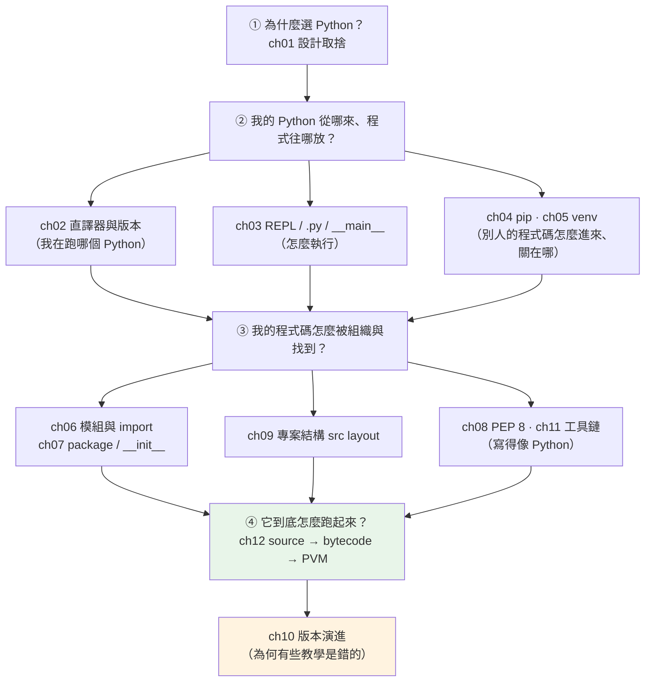

# Part 1 統整：入門全貌

> 把這 12 章串成一張圖——讀完你該能說清楚：我在跑哪個 Python、程式碼從哪裡被找到、以及它究竟怎麼被執行。

## 🗺️ 知識地圖（這 12 章怎麼串起來）

Part 1 其實在回答**三個層層遞進的問題**：



**一句話串起來**：
你先知道 Python 憑什麼值得學（ch01），接著搞清楚**執行你程式的那個「人」是誰**（ch02 直譯器）、
**怎麼指使他**（ch03 REPL vs `.py`）、**怎麼借別人的工具**（ch04 pip）、
**怎麼不讓工具互相打架**（ch05 venv）。
然後把自己的程式碼**組織成他找得到的樣子**（ch06–07 模組/package、ch09 專案結構），
**寫成他看得懂的樣子**（ch08 PEP 8、ch11 工具鏈）。
最後掀開引擎蓋，看他**到底怎麼把你的字變成動作**（ch12 bytecode → PVM）——
這一章是通往後面所有底層章節的鑰匙。

## ⚡ 速查表（什麼情境用什麼）

| 情境 | 怎麼做 | 章節 |
|------|--------|------|
| 有人問「為什麼選 Python 不選 Go/Java」 | 講設計取捨：可讀性優先、一切皆物件、生態廣；代價是速度與 GIL | [ch01](01-why-python.md) |
| 想知道「我現在跑的是哪個 Python」 | `sys.executable`、`python -V`；Windows 用 `py -0` 列出所有版本 | [ch02](02-install-and-interpreter.md) |
| 快速試一段程式碼 | REPL（`python`）；要留存就寫 `.py` | [ch03](03-repl-and-first-program.md) |
| 想讓檔案「被執行才跑、被 import 不跑」 | `if __name__ == "__main__":` | [ch03](03-repl-and-first-program.md) |
| 安裝套件 | **`python -m pip install X`**（不要只打 `pip`——會裝到別的 Python） | [ch04](04-pip-and-packages.md) |
| 開新專案的第一件事 | 建 venv：`python -m venv .venv` 並啟用 | [ch05](05-venv.md) |
| `ModuleNotFoundError` 找不到自己的模組 | 檢查 `sys.path` 與工作目錄；正解通常是改用 src layout + 可安裝套件 | [ch06](06-modules-and-import.md)、[ch09](09-project-layout.md) |
| 把一個資料夾變成可 import 的套件 | 放 `__init__.py`；套件內用**絕對 import** | [ch07](07-packages-and-init.md) |
| 程式碼風格要統一 | PEP 8；交給 ruff 自動處理，別手動排版 | [ch08](08-pep8-and-style.md)、[ch11](11-editor-and-tooling-setup.md) |
| 建一個「像樣」的專案 | `src/` layout + `pyproject.toml` + `pip install -e .` | [ch09](09-project-layout.md) |
| 網路上的教學跑不動 | 先確認它是不是 Python 2 的（`print` 沒括號就是） | [ch10](10-python2-vs-3.md) |
| 想看程式碼實際被編成什麼 | `dis.dis(func)` | [ch12](12-how-python-runs.md) |

## 🔑 核心心智模型（帶得走的幾句話）

- **「安裝 Python」＝安裝某一個實作**（通常是 CPython）。所以你電腦裡可以有好幾個 Python，
  而**「哪一個」正在跑，決定了 `pip` 裝到哪、`import` 找到誰**——這是新手九成環境問題的根源。
- **venv ＝專案的獨立工具箱**。沒有它，A 專案要 Django 3、B 專案要 Django 5，就會互相打架。
  這不是「進階建議」，是**專業開發的最低門檻**。
- **`import` 不只是「引入」**——它會去 `sys.path` 找、**執行對方一次**、然後把結果**快取**起來。
  理解這三步，`ModuleNotFoundError` 和「為什麼我的 print 在 import 時就跑了」都不再是謎。
- **Python 不是「純直譯」**：它先把原始碼**編譯成 bytecode**，再交給 **PVM（虛擬機）** 逐條執行。
  記住這條管線——[Part 10 CPython 內部](../10-cpython-internals/README.md)整章都建在它上面。

## 🛠️ 小實作：一支「環境自檢報告」

寫一支腳本，把這一 Part 學的東西全用上——它會告訴你：**你在跑哪個 Python、有沒有在 venv 裡、
import 會去哪裡找、以及你的程式碼被編成了什麼**。

```python
# env_report.py —— 用上 Part 1 的東西：直譯器、venv、import 路徑、bytecode
from __future__ import annotations

import dis
import platform
import sys
from pathlib import Path


def interpreter_info() -> dict[str, str]:
    """ch02：我到底在跑哪一個 Python？"""
    return {
        "實作": platform.python_implementation(),   # CPython / PyPy / ...
        "版本": platform.python_version(),
        "執行檔": sys.executable,                   # 「哪一個」python 正在跑
    }


def venv_info() -> str:
    """ch05：我在虛擬環境裡嗎？（venv 會讓 sys.prefix 偏離 base_prefix）"""
    in_venv = sys.prefix != sys.base_prefix
    return f"在 venv 裡（{Path(sys.prefix).name}）" if in_venv else "沒有 venv（用系統 Python）"


def import_paths(n: int = 3) -> list[str]:
    """ch06：import 會依 sys.path 的順序去找模組。"""
    return [path or "（目前工作目錄）" for path in sys.path[:n]]


def add(a: int, b: int) -> int:
    return a + b


def main() -> None:
    print("【ch02 直譯器】")
    for key, value in interpreter_info().items():
        print(f"  {key}: {value}")

    print(f"\n【ch05 虛擬環境】\n  {venv_info()}")

    print("\n【ch06 import 搜尋路徑（前 3 個）】")
    for path in import_paths():
        print(f"  {path}")

    print("\n【ch12 bytecode】add(a, b) 其實被編成這些指令：")
    dis.dis(add)


if __name__ == "__main__":   # ch03：被 import 時，這段不會執行
    main()
```

**預期輸出**（你的路徑與版本會不同）：

```pycon
$ python env_report.py
【ch02 直譯器】
  實作: CPython
  版本: 3.12.10
  執行檔: /path/to/project/.venv/bin/python

【ch05 虛擬環境】
  在 venv 裡（.venv）

【ch06 import 搜尋路徑（前 3 個）】
  （目前工作目錄）
  /usr/lib/python312.zip
  /usr/lib/python3.12

【ch12 bytecode】add(a, b) 其實被編成這些指令：
 29           0 RESUME                   0

 30           2 LOAD_FAST                0 (a)
              4 LOAD_FAST                1 (b)
              6 BINARY_OP                0 (+)
             10 RETURN_VALUE
```

**看懂這份報告，你就掌握了 Part 1 的精髓**：
「執行檔」告訴你 pip 會裝到哪；「在 venv 裡」代表你的專案是隔離的；
「搜尋路徑」解釋了 import 為什麼找得到（或找不到）；
而那四條 bytecode，就是 `a + b` 在 CPython 裡**真正發生的事**。

## ✅ 自測清單（答不出來就回去讀）

- [ ] Python 的兩個核心設計決策是什麼？它換來了什麼、犧牲了什麼？（[ch01](01-why-python.md)）
- [ ] 說得出「Python」和「CPython」的差別嗎？（[ch02](02-install-and-interpreter.md)）
- [ ] 為什麼推薦 `python -m pip install` 而不是直接 `pip install`？（[ch04](04-pip-and-packages.md)）
- [ ] venv 到底隔離了什麼？不用它會出什麼事？（[ch05](05-venv.md)）
- [ ] `import foo` 時，Python 依序做了哪三件事？（[ch06](06-modules-and-import.md)）
- [ ] `if __name__ == "__main__":` 存在的意義是什麼？（[ch03](03-repl-and-first-program.md)）
- [ ] 為什麼推薦 src layout？它防止了什麼問題？（[ch09](09-project-layout.md)）
- [ ] Python 是直譯還是編譯語言？（陷阱題——[ch12](12-how-python-runs.md)）
- [ ] 說得出 source → bytecode → PVM 這條管線每一步在做什麼嗎？（[ch12](12-how-python-runs.md)）

## 🎯 面試速查

| 考點 | 面試官想聽到什麼 |
|------|------------------|
| **Python 是直譯還是編譯語言？** | 「兩者都有。CPython 先把原始碼**編譯成 bytecode**（`.pyc`），再由 **PVM 虛擬機**逐條執行。所以說它是『純直譯』並不精確。」——能講出這條管線就贏過多數人。 |
| **`__name__ == "__main__"` 幹嘛用的？** | 「模組被**直接執行**時 `__name__` 是 `"__main__"`，被 **import** 時則是模組名。用它區隔『腳本進入點』與『可被重用的模組』。」 |
| **venv 解決什麼問題？** | 「專案間的**依賴衝突**與**版本鎖定**。每個專案有自己的 `site-packages`，不污染系統 Python。」 |
| **`import` 的流程？** | 「依 `sys.path` 搜尋 → 找到後**執行整個模組**一次 → 把模組物件**快取進 `sys.modules`**（所以重複 import 不會重跑）。」 |
| **`.pyc` 是什麼？** | 「編譯後的 bytecode 快取，放在 `__pycache__`。目的是**省下重複編譯的時間**，不是為了加密或加速執行。」 |

---

🎉 **恭喜完成 Part 1！** 你已經知道 Python 是什麼、環境怎麼配、程式碼怎麼被找到與執行。
地基打好了，接下來 [Part 2 語言基礎](../02-fundamentals/README.md) 要進入語言本身——
從一個顛覆直覺的觀念開始：**變數不是盒子，是標籤**。

➡️ 下一 Part：[語言基礎 Fundamentals](../02-fundamentals/README.md)

[⬆️ 回 Part 1 索引](README.md)
