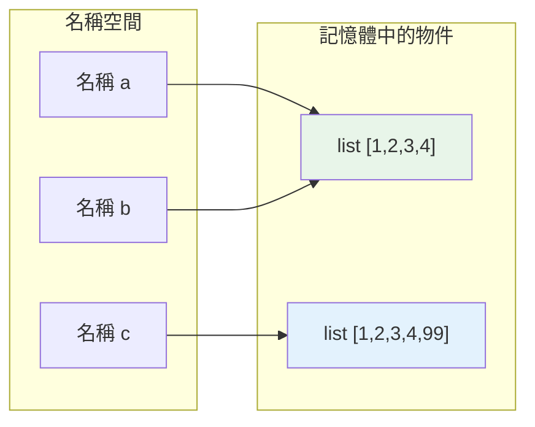

# 動態型別與變數即名稱綁定

> 在 Python 裡，變數不是「裝東西的盒子」，而是「貼在物件上的標籤」。這個心智模型的轉換，是理解 Python 幾乎所有行為（賦值、可變性、參數傳遞）的起點。

## 💡 白話導讀（建議先讀）

先丟掉一個直覺：在很多語言裡，變數是「盒子」——`x = 5` 是把 5 放進盒子 x。

**Python 不是這樣。** Python 的變數是「**便利貼**」：

- `x = 5`：記憶體裡先有一個「5」這個物件，然後把寫著 x 的便利貼**貼上去**。
- `x = "hi"`：把 x 這張便利貼撕下來，改貼到 "hi" 上。（物件 5 沒有變，只是沒人貼它了。）

「盒子 vs 便利貼」的差別，在這一幕現形：

```python
a = [1, 2]
b = a          # 盒子思維：複製了一份？ ✗
               # 便利貼思維：兩張便利貼貼在「同一個」list 上 ✓
b.append(3)
print(a)       # [1, 2, 3] —— a 也「變了」！因為根本是同一個物件
```

如果你曾被「為什麼改 b 卻動到 a」嚇到，這就是答案：**你從來沒有兩個 list，只有一個 list 和兩張便利貼**。

這個心智模型是全 Python 最重要的一個——賦值、函式傳參、可變性、淺深拷貝，之後每一章都建立在「變數是便利貼」上。這章把它一次講透。

## 🔗 前端對照

Python 和 JavaScript 都是**動態型別（dynamically typed）**——變數不用先宣告型別,值帶著型別跑。
但兩者在「型別強弱」上剛好相反:

| | Python | JavaScript |
|---|--------|-----------|
| 動態型別 | ✅ 變數可隨時換型別 | ✅ 同 |
| 強 / 弱型別 | **強型別**:`1 + "1"` → `TypeError` | **弱型別**:`1 + "1"` → `"11"`（自動轉換） |
| 變數模型 | 名稱是貼在物件上的**標籤** | 變數持有值的**參考（reference）**,概念相同 |

一句話:**都不用宣告型別,但 Python 不會偷偷幫你轉型**——JS 的隱式轉換（coercion）在 Python 會直接報錯,
這其實讓 bug 更早現形。

## Why（為什麼）

從 C/Java 轉來的人，腦中的變數模型是「盒子」：`int x = 5` 開一個叫 `x` 的盒子，把 `5` 放進去；`x = 6` 就是把盒子裡的內容換成 `6`。這個模型在 Python 裡是**錯的**，而且會讓你在遇到「兩個變數怎麼一起變了？」「函式怎麼改到我的 list？」時完全摸不著頭緒。

Python 用的是完全不同的模型——**名稱綁定（name binding）**。把這個模型建立起來，後面的可變性、`is` vs `==`、參數傳遞、閉包，全都會變得理所當然。這是整個 Part 2 最重要的一章。

## Theory（理論：名稱是標籤，不是盒子）

Python 的核心事實（呼應[一切皆物件](../10-cpython-internals/01-everything-is-object.md)）：

> **值（物件）存在於記憶體中；變數只是「綁定到某個物件」的名稱**——便利貼，不是盒子。

當你寫 `x = 5`：

1. Python 先在記憶體建立一個 `int` 物件 `5`。
2. 再讓名稱 `x` **指向（綁定到）** 這個物件——把便利貼貼上去。

`x` 本身不「裝著」5。更精確的說法不是「x 的值是 5」，而是「x 這個名字目前綁定到物件 5」。

關鍵推論：**同一個物件可以有多張便利貼**。
`a = b = [1, 2]` 讓 `a` 和 `b` 是同一個 list 的兩個名字——**不是兩份拷貝**。透過任何一個名字修改，另一個名字看到的當然也變了（因為根本是同一個東西）。

## Specification（規範：型別屬於物件，不屬於名稱）

Python 是**動態型別（dynamically typed）**：

- **型別是物件的屬性，不是名稱的屬性。** `5` 這個物件是 `int`，`"hi"` 這個物件是 `str`；而名稱 `x` 沒有型別，它今天可以綁 int、明天綁 str。
- 因此同一個名稱可以先後綁定不同型別的物件，完全合法：

```python
x = 5          # x 綁到 int 物件
x = "hello"    # x 改綁到 str 物件（合法！）
x = [1, 2, 3]  # x 再改綁到 list 物件
```

- 但 Python 同時是**強型別（strongly typed）**：物件的型別一旦確定就嚴格，不會自動亂轉（`"1" + 1` 會 `TypeError`，見 [為什麼是 Python](../01-getting-started/01-why-python.md)）。

**動態 vs 靜態**講的是「名稱能不能換綁不同型別」（Python：能）；**強 vs 弱**講的是「物件間運算會不會自動轉型」（Python：不會）。兩者獨立，別混為一談。

## Implementation（用 `id()` 看綁定的真相）

`id(obj)` 回傳物件的身分（在 CPython 是記憶體位址）。用它可以「看見」名稱綁定：

```pycon
>>> x = 5
>>> id(x)
140234567890123
>>> y = x            # y 綁到「同一個」物件，不是拷貝
>>> id(y) == id(x)
True
>>> y is x           # is 比較身分：是不是同一個物件
True
```

`y = x` 沒有複製任何東西，只是讓 `y` 和 `x` 指向**同一個** `5`。

### 重新賦值 = 換綁，不是修改物件

```pycon
>>> x = 5
>>> id(x)
140234567890123
>>> x = 6            # 不是「把 5 改成 6」，而是建立新物件 6，x 改指向它
>>> id(x)
140234567890155     # 位址變了！
```

`int` 是不可變的（見 [可變 vs 不可變](../03-data-structures/06-mutability.md)）——你無法「把 5 變成 6」，只能讓 `x` 改綁到另一個物件 `6`。原本的 `5` 若沒人再指向它，就會被回收（引用計數，見 [引用計數](../10-cpython-internals/03-reference-counting.md)）。

### 這解釋了「別名（aliasing）」現象

當物件是**可變的**（如 list），多個名稱指向同一物件就會互相影響：

```pycon
>>> a = [1, 2, 3]
>>> b = a            # b 和 a 是同一個 list 的兩個標籤
>>> b.append(4)      # 透過 b 修改「那個物件」
>>> a
[1, 2, 3, 4]         # a 也「變了」——因為根本是同一個物件
>>> a is b
True
```

`a` 沒有被你動過，但它「變了」——因為 `a` 和 `b` 綁的是同一個 list，你透過 `b` 修改了那個共用的物件。這是新手最常見的困惑之一，而名稱綁定模型讓它變得完全合理。

## Code Example（可執行的 Python 範例）

```python
# name_binding.py — 觀察名稱綁定與別名
def demo() -> None:
    # 1. 重新賦值 = 換綁到新物件（不可變型別）
    x = 10
    original_id = id(x)
    x = 20
    print(f"重新賦值後 id 改變: {id(x) != original_id}")  # True

    # 2. 多個名稱綁到同一可變物件 → 別名
    a = [1, 2, 3]
    b = a
    b.append(4)
    print(f"a = {a}")          # [1, 2, 3, 4]，因為 a、b 是同一物件
    print(f"a is b: {a is b}")  # True

    # 3. 想要獨立拷貝，得明確複製
    c = a[:]                    # 切片複製出「新的 list」
    c.append(99)
    print(f"a = {a}")          # a 不受影響
    print(f"a is c: {a is c}")  # False


if __name__ == "__main__":
    demo()
```

**預期輸出**：

```pycon
$ python name_binding.py
重新賦值後 id 改變: True
a = [1, 2, 3, 4]
a is b: True
a = [1, 2, 3, 4]
a is c: False
```

解說：case 1 顯示不可變物件「改值」其實是換綁；case 2 顯示 `b = a` 是別名不是拷貝，改 `b` 就改到 `a`；case 3 顯示要真正獨立必須明確複製（`a[:]` 或 `copy`，見 [淺複製與深複製](../03-data-structures/09-copy-shallow-deep.md)）。

## Diagram（圖解：名稱 → 物件）



> `a` 與 `b` 指向同一物件（別名）；`c` 指向另一個複製出來的物件。

## Best Practice（最佳實踐）

- **用「標籤貼物件」而非「盒子裝值」的模型思考**，賦值、別名、參數傳遞都會變得直覺。
- **要獨立拷貝就明確複製**：`list(x)`、`x[:]`、`copy.copy`、`copy.deepcopy`（見 [淺深複製](../03-data-structures/09-copy-shallow-deep.md)），別假設 `b = a` 會給你新的一份。
- **判斷「是不是同一個物件」用 `is`，判斷「值相不相等」用 `==`**（見 [物件模型](../10-cpython-internals/02-object-model.md)）。
- **函式內修改傳入的可變物件會影響外部**：知道這點才能避免意外副作用（見 [參數](09-parameters-args-kwargs.md)）。
- **善用型別註記**（見 [Part 5](../05-typing/README.md)）：雖然執行期是動態型別，註記能讓工具在編輯期幫你抓型別錯誤。

## Common Mistakes（常見誤解）

- **以為 `b = a` 會複製**：不會，只是多一個標籤。改可變物件時兩者一起變。
- **以為變數有型別**：型別在物件身上；名稱可隨時換綁不同型別。所以「x 是 int」嚴格說是「x 目前綁的物件是 int」。
- **把動態型別當成弱型別**：Python 動態但強型別，不會自動 `"1" + 1`。
- **用 `==` 判斷 None / 單例**：應用 `is`；`==` 比的是值、可被 `__eq__` 覆寫，語意不同（見 [bool、None 與 truthiness](03-booleans-and-none.md)）。
- **驚訝於「我沒動 a，a 怎麼變了」**：因為別的名稱和 a 綁同一個可變物件並修改了它。
- **誤以為 `x = x + 1` 是「原地修改」**：對不可變型別（int/str/tuple）它是「建立新物件再換綁」。

## Interview Notes（面試重點）

- 能清楚說出 **Python 的變數是「名稱綁定到物件」，不是盒子裝值**，並用 `id()` / `is` 佐證。
- 能分辨兩組正交概念：**動態 vs 靜態型別**（名稱可否換綁不同型別）、**強 vs 弱型別**（是否自動轉型）；Python 是**動態 + 強型別**。
- 能解釋**別名（aliasing）**：多個名稱指向同一可變物件時互相影響，以及如何用複製避免。
- 能說明**重新賦值對不可變型別是換綁、對可變型別的原地修改是改同一物件**。
- 知道 `is`（身分）與 `==`（相等）的差別及各自適用場合。

---

➡️ 下一章：[數值型別 int / float / complex](02-numbers.md)

[⬆️ 回 Part 2 索引](README.md)
