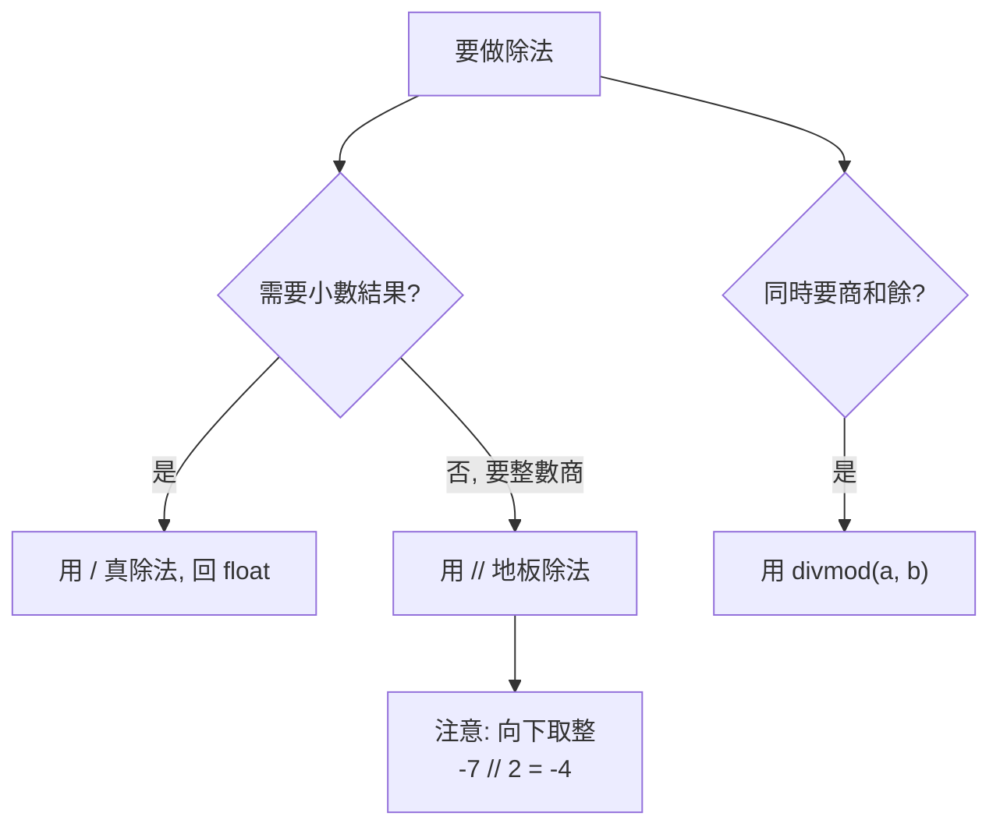

# 數值型別 int / float / complex

> Python 的 `int` 可以無限大、`float` 卻有精度陷阱、`/` 永遠回浮點——這三件事各自解決或製造了不同的問題，值得逐一看清。

## 💡 白話導讀（建議先讀）

Python 的數字有三件反直覺的事，先講明白：

**1. `int` 想多大就多大。**
很多語言的整數像「固定位數的里程表」——超過上限就爆掉（溢位）。
Python 的 `int` 像**可以一直加頁的帳本**：算 2 的 10000 次方？照算不誤，沒有上限。你從此不用擔心整數溢位。

**2. `float` 是一把「只有 64 格的尺」。**
浮點數用固定的 64 位元存小數——格子有限，就註定**有些數字量不準**。
`0.1 + 0.2` 不等於 `0.3`（會多出一點零頭）——這不是 bug，是尺的極限。[第 15 章](15-float-precision-decimal.md)專門講怎麼辦（劇透：算錢用 `Decimal`）。

**3. `/` 永遠給你小數。**
`10 / 2` 的答案是 `5.0` 不是 `5`——除法一律回 float。
要「整數除法」用 `//`（地板除，往小的方向取整）、要餘數用 `%`。

先記住這三件事：**int 無上限、float 有格數、`/` 出小數**——這章其餘是細節展開。

## Why（為什麼）

數字是最基本的資料，但 Python 的數值型別有幾個「與其他語言不同、且會咬人」的特性：整數不會溢位（很爽）、浮點會有誤差（很坑）、除法規則和 C 不同（很容易寫錯）。這些不是冷知識——金額計算用錯型別會算錯錢、整數除法用錯運算子會得到意外結果。這章把三種數值型別與它們的運算規則講清楚。

## Theory（理論：三種內建數值型別）

Python 內建三種數值型別，全都是不可變物件：

| 型別 | 說明 | 字面值範例 |
|------|------|-----------|
| `int` | 整數，**任意精度**（可加頁的帳本，想多大就多大） | `42`、`-7`、`10_000_000` |
| `float` | 浮點數，IEEE 754 雙精度（**64 位元的尺**，有格數限制） | `3.14`、`1.5e3`、`.5` |
| `complex` | 複數 | `3+4j`、`complex(3, 4)` |

三者都是**不可變**的：對數字做運算永遠產生**新物件**（呼應[名稱綁定](01-dynamic-typing.md)——便利貼改貼到新物件上），不會「就地改變」原本的數字。

## Specification（規範：字面值與運算子）

### 數字字面值

```python
x = 1_000_000        # 底線分隔，增加可讀性（等於 1000000）
b = 0b1010           # 二進位 → 10
o = 0o17             # 八進位 → 15
h = 0xFF             # 十六進位 → 255
f = 1.5e3            # 科學記號 → 1500.0
c = 3 + 4j           # 複數
```

### 算術運算子

| 運算子 | 意義 | 範例 | 結果 |
|--------|------|------|------|
| `+ - *` | 加減乘 | `2 * 3` | `6` |
| `/` | **真除法**（永遠回 float） | `7 / 2` | `3.5` |
| `//` | **地板除法**（向下取整） | `7 // 2` | `3` |
| `%` | 取餘數（模） | `7 % 2` | `1` |
| `**` | 次方 | `2 ** 10` | `1024` |
| `divmod(a, b)` | 同時回 `(商, 餘)` | `divmod(7, 2)` | `(3, 1)` |

## Implementation（每個型別的關鍵細節）

### int：任意精度，不會溢位

C/Java 的 `int` 有固定位元數，超過就溢位。Python 的 `int` **想多大就多大**，只受記憶體限制：

```pycon
>>> 2 ** 200
1606938044258990275541962092341162602522202993782792835301376
>>> import sys
>>> 10 ** 100 > sys.maxsize      # 遠超過所謂「最大整數」也沒問題
True
```

`sys.maxsize` 不是「int 的上限」，而是「原生機器字長能容納的大小」（影響某些內部最佳化）；`int` 本身沒有上限。代價是超大整數的運算比機器原生整數慢，但正確性優先。

### float：IEEE 754 與精度陷阱

`float` 是 64 位元二進位浮點數。**有些十進位小數無法用二進位精確表示**，於是出現經典現象：

```pycon
>>> 0.1 + 0.2
0.30000000000000004
>>> 0.1 + 0.2 == 0.3
False
```

這不是 Python 的 bug，是所有用 IEEE 754 的語言共有的（C、Java、JavaScript 皆然）。原因：`0.1` 在二進位是無限循環小數，只能存近似值。**永遠不要用 `==` 比較浮點數**；金額等需要精確的場合改用 `decimal`（見 [浮點誤差、decimal 與 fractions](15-float-precision-decimal.md)）。

比較浮點是否「夠接近」用 `math.isclose`：

```pycon
>>> import math
>>> math.isclose(0.1 + 0.2, 0.3)
True
```

### `/` vs `//`：除法的兩種語意

這是從其他語言轉來最常踩的坑：

```pycon
>>> 7 / 2        # 真除法：無論運算元是否整數，永遠回 float
3.5
>>> 6 / 2        # 即使整除，也是 float
3.0
>>> 7 // 2       # 地板除法：向下取整
3
>>> -7 // 2      # 注意：向「下」取整（往負無窮），不是向零截斷！
-4
```

⚠️ `-7 // 2` 是 `-4` 不是 `-3`——Python 的 `//` 是**向下取整（floor）**，不是「往零截斷」。這和 C 的整數除法不同，是常見錯誤來源。`%` 的符號跟隨除數也源於此：`-7 % 2 == 1`。

### 型別轉換與混合運算

```pycon
>>> 3 + 2.0       # int 遇 float → 結果升為 float
5.0
>>> int(3.9)      # 轉 int：向零截斷（不是四捨五入！）
3
>>> round(3.5)    # round 用「banker's rounding」（四捨六入五成雙）
4
>>> round(2.5)    # 2.5 捨入到最近偶數 → 2（不是 3！）
2
```

`round` 用**銀行家捨入法**（round half to even）以減少統計偏差，所以 `round(2.5) == 2`——又一個容易被誤解的點。

## Code Example（可執行的 Python 範例）

```python
# numbers_demo.py
import math


def safe_float_equal(a: float, b: float) -> bool:
    """正確比較兩個浮點數是否相等。"""
    return math.isclose(a, b)


def demo() -> None:
    # 1. int 任意精度
    print(f"2**128 = {2 ** 128}")

    # 2. 浮點陷阱
    print(f"0.1 + 0.2 = {0.1 + 0.2}")
    print(f"用 == 比較: {0.1 + 0.2 == 0.3}")            # False
    print(f"用 isclose: {safe_float_equal(0.1 + 0.2, 0.3)}")  # True

    # 3. 兩種除法
    print(f"7 / 2  = {7 / 2}")    # 3.5
    print(f"7 // 2 = {7 // 2}")   # 3
    print(f"-7 // 2 = {-7 // 2}")  # -4（向下取整）
    print(f"divmod(7, 2) = {divmod(7, 2)}")  # (3, 1)

    # 4. round 的銀行家捨入
    print(f"round(2.5) = {round(2.5)}, round(3.5) = {round(3.5)}")  # 2, 4


if __name__ == "__main__":
    demo()
```

**預期輸出**：

```pycon
$ python numbers_demo.py
2**128 = 340282366920938463463374607431768211456
0.1 + 0.2 = 0.30000000000000004
用 == 比較: False
用 isclose: True
7 / 2  = 3.5
7 // 2 = 3
-7 // 2 = -4
divmod(7, 2) = (3, 1)
round(2.5) = 2, round(3.5) = 4
```

## Diagram（圖解：除法運算子的選擇）



## Best Practice（最佳實踐）

- **絕不用 `==` 比較 float**，用 `math.isclose`；需要精確運算（金額、財務）用 `decimal.Decimal`（見 [第 15 章](15-float-precision-decimal.md)）。
- **清楚選 `/` 還是 `//`**：要小數用 `/`、要整數商用 `//`，並記得 `//` 是向下取整。
- **大整數放心用**：Python `int` 無溢位問題，不必像 C 擔心 overflow。
- **可讀性用底線分隔**：`1_000_000` 比 `1000000` 好讀。
- **注意 `int()` 是截斷、`round()` 是銀行家捨入**：需要「四捨五入」的商業邏輯時，別假設 `round` 的行為，必要時用 `decimal` 的量化。
- **需要位元運算**（`& | ^ << >>`）時記得只對 `int` 有意義（見 [運算子](05-operators.md)）。

## Common Mistakes（常見誤解）

- **`0.1 + 0.2 == 0.3` 期待 True**：浮點精度問題，得 False。用 `isclose` 或 `decimal`。
- **以為 `7 / 2 == 3`**：那是 Python 2 或 C 的行為；Python 3 的 `/` 回 `3.5`，整數除要用 `//`。
- **`-7 // 2` 期待 `-3`**：`//` 向下取整得 `-4`，不是往零截斷。
- **以為 `round(2.5) == 3`**：銀行家捨入得 `2`。
- **擔心大整數溢位**：Python `int` 任意精度，不會溢位。
- **用 float 存錢**：`0.1` 存不準，金額累加會出錯；用 `Decimal`。
- **`int(3.9)` 期待四捨五入成 4**：`int()` 是截斷，得 `3`。

## Interview Notes（面試重點）

- 說得出 Python `int` 是**任意精度、不溢位**，以及它與 C 固定寬度整數的差異。
- 能解釋**浮點精度問題**（`0.1+0.2 != 0.3`）的根因（IEEE 754 二進位無法精確表示某些十進位小數），並知道正確比較法（`math.isclose`）與精確運算方案（`decimal`）。
- 清楚 **`/`（真除法回 float）vs `//`（地板除法、向下取整）** 的差異，並能答出 `-7 // 2 == -4`。
- 知道 `round` 用**銀行家捨入**、`int()` 是**截斷**。
- 知道混合運算會**向上升型**（int + float → float），以及 `divmod` 同時回商與餘。

---

➡️ 下一章：[bool、None 與 truthiness](03-booleans-and-none.md)

[⬆️ 回 Part 2 索引](README.md)
