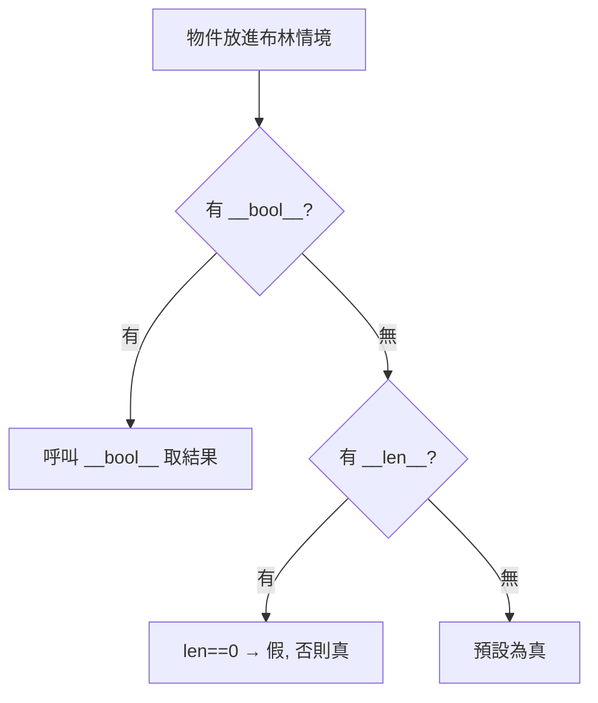

# bool、None 與 truthiness

> `bool` 其實是 `int` 的子類別、`None` 是全域唯一的單例、任何物件都能當條件判斷——這三件事讓 Python 的條件式又簡潔又暗藏陷阱。

## 💡 白話導讀（建議先讀）

這章講 Python 條件判斷的三個「本地習俗」。

**1. 任何東西都能當條件——空的就是假。**

`if items:` 這行在問什麼？它在問 items：「你**算數**嗎？」
Python 的慣例是：**空的、零的、無的，回答「不算」**——空 list、空字串、`0`、`None` 都是「假」；其他幾乎都是「真」。
所以 Pythonic 的寫法是 `if items:` 而不是 `if len(items) > 0:`——直接問本人。這個機制叫 **truthiness**。

**2. `None` 是「查無此物」的官方印章——而且全世界只有一顆。**

表示「沒有值」就用 `None`。因為它是**單例**（整個程式只有這一個 None 物件），判斷時用 `is`：
`if x is None:`（問「是不是就是那顆印章」），不用 `==`。

**3. 冷知識但會考：`bool` 其實是 `int` 的子類別。**

`True` 就是 1、`False` 就是 0——所以 `True + True == 2` 是合法的（而且 `sum(布林list)` 數 True 個數是實用技巧）。

三個習俗記住了，這章的陷阱區（空容器誤判、`== None`、0 被當 False 誤傷）就都有預防針了。

## 🔗 前端對照

`None` 對應前端的 `null` / `undefined`,而「哪些值算 falsy」兩邊有個**會咬人的差異**:

| | Python | JavaScript |
|---|--------|-----------|
| 空值 | 只有一個 `None` | `null` 和 `undefined` 兩個 |
| 判斷空值 | `if x is None:` | `if (x == null)`（同時涵蓋兩者） |
| 空字串 / `0` / `false` | falsy | falsy |
| **空 list `[]` / 空 dict `{}`** | **falsy**（`if not items:` 可判空） | **truthy**（`if ([])` 為真!） |

一句話:最大的坑——**Python 的空 list / dict 是 falsy**,能 `if not items:` 判斷空;
但 JS 的 `[]` / `{}` 是 **truthy**,前端得改用 `arr.length === 0`。這個差異兩個方向都容易踩雷。

## Why（為什麼）

`if` 判斷是程式的骨架，而 Python 讓「什麼算真、什麼算假」有一套自己的規則：你可以寫 `if items:`（而不是 `if len(items) > 0:`），因為空 list 本身就是「假」。這很 Pythonic，但如果不懂背後的 **truthiness（真值性）** 規則，就會寫出 `if x == True:` 這種既囉嗦又可能出錯的程式，或在該用 `is None` 時誤用 `==`。這章講清楚 bool、None 與真值判斷的完整規則。

## Theory（理論：truthiness — 任何物件都有真假）

Python 的核心設計：**任何物件都能放在布林情境（`if`、`while`、`and`/`or`）中判斷真假**，不限於 `True`/`False`。這叫 **truthiness**——「問物件本人：你算數嗎？」

判斷規則：物件預設為「真（truthy）」，**除非**它屬於「假（falsy）」清單（空的、零的、無的）。

背後機制：Python 會呼叫物件的 `__bool__()`（沒有的話退而求其次呼叫 `__len__()`——長度為 0 就是假）來決定。
所以「空容器是假」不是特例硬編，而是容器用 `__len__` 回答了這個問題。

## Specification（規範：falsy 值的完整清單）

以下值在布林情境中為**假（falsy）**，其餘一律為**真（truthy）**：

| 類別 | falsy 值 |
|------|----------|
| 布林 | `False` |
| None | `None` |
| 數字零 | `0`、`0.0`、`0j`、`Decimal(0)` |
| 空序列 | `""`、`[]`、`()`、`b""` |
| 空對映/集合 | `{}`、`set()` |
| 自訂物件 | `__bool__()` 回 `False`，或 `__len__()` 回 `0` |

記憶法：**「空的、零的、None、False」為假，其他皆真。**

```pycon
>>> bool(0), bool(""), bool([]), bool({}), bool(None)
(False, False, False, False, False)
>>> bool(1), bool("a"), bool([0]), bool(" ")
(True, True, True, True)
```

注意 `[0]`（含一個元素 `0` 的 list）是**真**——它不是空的；`" "`（一個空格）也是真——它不是空字串。判斷的是「容器空不空」，不是「內容是什麼」。

## Implementation（三個容易被忽略的底層事實）

### 事實一：`bool` 是 `int` 的子類別

`True` 和 `False` 其實就是 `1` 和 `0`：

```pycon
>>> isinstance(True, int)
True
>>> True == 1, False == 0
(True, True)
>>> True + True         # 可當數字運算！
2
>>> sum([True, False, True, True])   # 常用來計數
3
```

這代表 `sum(條件 for x in xs)` 可以直接數出「有幾個為真」——一個 Pythonic 的計數技巧。但也提醒：`bool` 能參與算術，別不小心把布林拿去做數值運算而不自知。

### 事實二：`None` 是全域唯一的單例

`None` 代表「沒有值 / 空」，整個程式中**只有一個** `None` 物件，所有 `None` 都指向它：

```pycon
>>> a = None
>>> b = None
>>> a is b            # 永遠同一個物件
True
>>> id(None) == id(a)
True
```

正因為它是唯一單例，判斷「是不是 None」要用 **`is None`**（比較身分），而不是 `== None`（比較值）。`is` 更快、更明確、且不會被物件覆寫 `__eq__` 誤導。

### 事實三：`and` / `or` 回傳的是「運算元」，不是布林

Python 的 `and`/`or` 採**短路求值（short-circuit）**，且回傳的是**其中一個運算元本身**，不是 `True`/`False`：

```pycon
>>> 3 and 5          # 3 為真 → 回傳後者 5
5
>>> 0 and 5          # 0 為假 → 短路，回傳 0
0
>>> "" or "default"  # "" 為假 → 回傳後者 "default"
'default'
>>> "hi" or "default"  # "hi" 為真 → 短路，回傳 "hi"
'hi'
```

規則：`a and b`——a 為假就回 a，否則回 b；`a or b`——a 為真就回 a，否則回 b。這讓 `x = user_input or "default"`（給預設值）成為慣用法。但要小心：若合法值本身可能是 falsy（如 `0`、`""`），這個技巧會誤判（見常見錯誤）。

## Code Example（可執行的 Python 範例）

```python
# truthiness_demo.py
def describe(value: object) -> str:
    """用 truthiness 判斷並描述一個值。"""
    return "truthy（真）" if value else "falsy（假）"


def count_truthy(items: list[object]) -> int:
    """用 bool 是 int 子類別的特性計數。"""
    return sum(bool(x) for x in items)


def demo() -> None:
    # 1. 各種值的真假
    for v in [0, 1, "", "a", [], [0], None, {}]:
        print(f"{v!r:>6} → {describe(v)}")

    # 2. bool 當數字
    print(f"\n非空元素數量: {count_truthy([0, 1, '', 'x', None, [1]])}")  # 3

    # 3. or 給預設值
    name = "" or "匿名"
    print(f"name = {name!r}")   # '匿名'

    # 4. is None vs == None
    x = None
    print(f"x is None: {x is None}")


if __name__ == "__main__":
    demo()
```

**預期輸出**：

```pycon
$ python truthiness_demo.py
     0 → falsy（假）
     1 → truthy（真）
    '' → falsy（假）
   'a' → truthy（真）
    [] → falsy（假）
   [0] → truthy（真）
  None → falsy（假）
    {} → falsy（假）

非空元素數量: 3
name = '匿名'
x is None: True
```

`[0]` 是 truthy（非空）、`count_truthy` 數出 3 個真值（`1`、`'x'`、`[1]`）——印證 bool 可當數字加總。

## Diagram（圖解：一個值如何被判斷真假）



## Best Practice（最佳實踐）

- **判空直接用 truthiness**：`if not items:`、`if items:`，別寫 `if len(items) == 0:` 或 `if items != []:`。
- **判 None 一律用 `is None` / `is not None`**：明確、快、不被 `__eq__` 影響。
- **判布林旗標直接用**：`if flag:`，別寫 `if flag == True:`。
- **給預設值用 `or`，但確認合法值不會是 falsy**：`port = cfg or 8080` 在 `cfg == 0` 時會誤用預設；這種情況改用 `cfg if cfg is not None else 8080`。
- **需要計數時善用 `sum(bool(...))` 或 `sum(條件 for ...)`**：簡潔的 Pythonic 計數。
- **自訂類別要能判空時，實作 `__bool__` 或 `__len__`**，讓它能自然用於 `if`。

## Common Mistakes（常見誤解）

- **`if x == True:` / `if x == None:`**：前者囉嗦且遇到 truthy 非 True 值會出錯，後者該用 `is None`。
- **用 `or` 給預設值卻忽略 falsy 合法值**：`count = n or 10` 在 `n == 0`（合法）時錯給 10。改 `n if n is not None else 10`。
- **以為 `[0]`、`" "`、`"0"` 是假**：它們都非空 → 真。falsy 判的是「空/零」，`"0"` 是有內容的字串（真！）。
- **以為 `and`/`or` 一定回 `True`/`False`**：它們回運算元本身，`3 and 5` 是 `5`。
- **忘了 `bool` 是 `int`**：`True + True == 2`；把布林誤傳進數值運算而不自知。
- **`None`、`True`、`False` 被當普通變數重新賦值**：在 Python 3 它們是關鍵字/常數，不能賦值（`True = 1` 是 SyntaxError），但別用相近名稱混淆。

## Interview Notes（面試重點）

- 背得出 **falsy 值清單**：`False`、`None`、`0/0.0/0j`、空字串/序列/dict/set、`__bool__`或`__len__`為零的物件；其餘皆真。
- 知道 **`bool` 是 `int` 的子類別**，`True==1`、`False==0`，可參與算術與計數。
- 知道 **`None` 是全域單例**，故判斷用 **`is None`** 而非 `==`（並能說出 `is` 比 `==` 好的理由：身分比較、快、不被 `__eq__` 覆寫）。
- 能解釋 **`and`/`or` 的短路求值且回傳運算元本身**，以及 `x or default` 慣用法的陷阱（falsy 合法值）。
- 能寫出 Pythonic 的判空（`if not items:`）與計數（`sum(bool(x) for x in xs)`）。

---

➡️ 下一章：[字串 str 與 f-string](04-strings.md)

[⬆️ 回 Part 2 索引](README.md)
