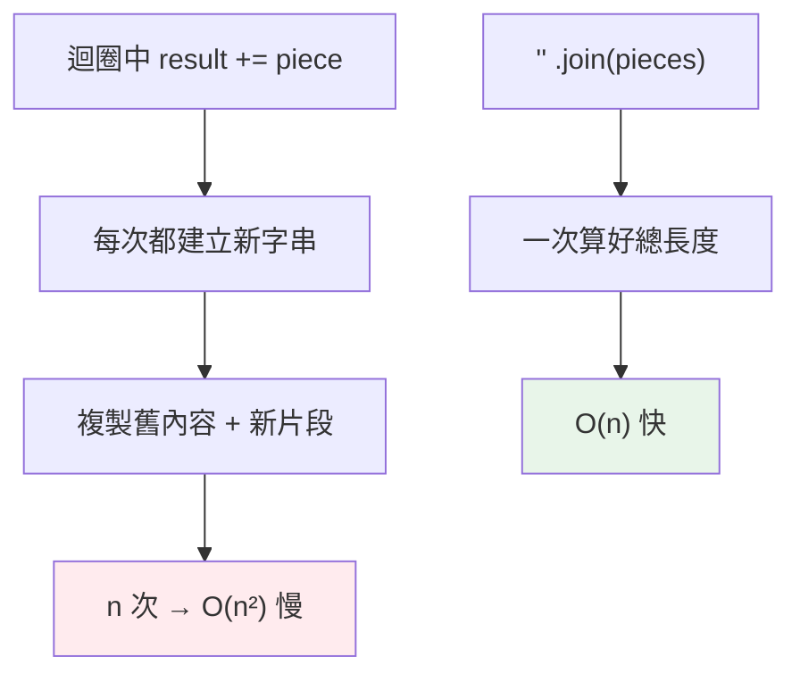

# 字串 str 與 f-string

> 字串是不可變的 Unicode 序列，這一個事實決定了它的所有行為：方法都回傳新字串、`+=` 在迴圈裡是效能陷阱、而 f-string 是現代格式化的唯一正解。

## Why（為什麼）

字串是最常用的資料型別，幾乎每支程式都在處理文字。但 Python 的字串有兩個關鍵特性常被忽略，導致 bug 或效能問題：它是**不可變的**（所以「修改字串」其實都在造新字串），它是 **Unicode**（所以文字與位元組要分清）。搞懂這些，加上掌握 f-string 這個現代格式化利器，你處理文字才會又對又快。

## Theory（理論：不可變的 Unicode 序列）

Python 的 `str` 有三個本質：

1. **不可變（immutable）**：字串一旦建立就不能改內容。所有「修改」方法（`upper`、`replace`…）都**回傳新字串**，原字串不動。
2. **Unicode 文字**：`str` 存的是文字（字元），不是位元組。位元組是獨立的 `bytes` 型別（見 [Python 2 vs 3](../01-getting-started/10-python2-vs-3.md)）。
3. **序列（sequence）**：字串是字元的有序序列，支援索引、切片、迭代、`len`（見 [切片](../03-data-structures/03-slicing.md)）。

「不可變」是理解字串行為的鑰匙：因為不可變，`s.upper()` 不會改 `s`；因為不可變，在迴圈裡 `s += x` 每次都造新字串，是效能陷阱。

## Specification（規範：字串的建立與常用操作）

### 字串字面值

```python
a = 'single'
b = "double"              # 單雙引號等價
c = """多行
字串"""                    # 三引號可跨行
d = "換行\t定位\\反斜線"    # 跳脫字元
e = r"C:\path\no\escape"  # raw string：反斜線不跳脫（正規表達式常用）
f = "拼接" "會自動相黏"      # 相鄰字面值自動連接
```

### 常用方法（皆回傳新字串或新物件）

```python
s = "  Hello, World  "
s.strip()            # 'Hello, World'（去頭尾空白）
s.lower()            # '  hello, world  '
s.replace("l", "L")  # '  HeLLo, WorLd  '
s.split(",")         # ['  Hello', ' World  ']
"-".join(["a", "b"]) # 'a-b'
s.startswith("  H")  # True
"42".isdigit()       # True
s.find("World")      # 索引（找不到回 -1）
```

## Implementation（不可變的後果 + f-string）

### 後果一：方法回傳新字串，原字串不變

```pycon
>>> s = "hello"
>>> s.upper()
'HELLO'
>>> s              # 原字串沒變！
'hello'
>>> s = s.upper()  # 要「改」得重新綁定
>>> s
'HELLO'
```

新手常寫 `s.upper()` 卻期待 `s` 變了——不會，你得 `s = s.upper()`。

### 後果二：迴圈裡 `+=` 是效能陷阱

因為不可變，`result += piece` 每次都建立一個全新的字串並複製舊內容，迴圈裡就變成 O(n²)：

```python
# ❌ 效能陷阱：每次 += 都造新字串
result = ""
for word in words:
    result += word        # O(n²)

# ✅ 正解：收集後一次 join
result = "".join(words)   # O(n)
```

`str.join` 是連接大量字串的正確方式（也更 Pythonic）。

### f-string（格式化字串字面值，PEP 498，3.6+）

現代 Python 格式化文字的**首選**——在字串前加 `f`，用 `{}` 內嵌運算式：

```pycon
>>> name, age = "Alice", 30
>>> f"{name} is {age} years old"
'Alice is 30 years old'
>>> f"{name.upper()} in 5 years: {age + 5}"   # 可放任何運算式
'ALICE in 5 years: 35'
```

**格式規格（format spec）** 放在 `:` 之後，控制對齊、寬度、精度、進位：

```pycon
>>> pi = 3.14159
>>> f"{pi:.2f}"        # 小數 2 位
'3.14'
>>> f"{42:05d}"        # 補零到 5 位
'00042'
>>> f"{1234567:,}"     # 千分位
'1,234,567'
>>> f"{0.85:.1%}"      # 百分比
'85.0%'
>>> f"{'hi':>10}"      # 右對齊寬度 10
'        hi'
>>> f"{255:#x}"        # 十六進位
'0xff'
```

**除錯神器 `=`（3.8+）**：自動印出「運算式 = 值」：

```pycon
>>> x = 42
>>> f"{x=}"
'x=42'
>>> f"{x * 2=}"
'x * 2=84'
```

### 舊格式化方式（了解即可）

```python
"%s is %d" % (name, age)          # % 格式化（舊，C 風格）
"{} is {}".format(name, age)      # str.format（次舊）
f"{name} is {age}"                # f-string（現代首選）
```

三者能力接近，但 f-string 最短、最快、最好讀——新程式一律用它。

## Code Example（可執行的 Python 範例）

```python
# strings_demo.py
def build_report(items: list[tuple[str, float]]) -> str:
    """用 join + f-string 產生對齊的報表。"""
    lines = [f"{name:<10} {price:>8.2f}" for name, price in items]
    return "\n".join(lines)


def demo() -> None:
    # 1. 不可變：方法回傳新字串
    s = "hello"
    upper = s.upper()
    print(f"原字串不變: {s!r}, 新字串: {upper!r}")

    # 2. join 連接（勝過 += ）
    words = ["Python", "is", "great"]
    print(" ".join(words))

    # 3. f-string 格式化報表
    report = build_report([("Apple", 35.0), ("Banana", 8.5)])
    print(report)

    # 4. f-string 除錯語法
    total = 35.0 + 8.5
    print(f"{total=}")


if __name__ == "__main__":
    demo()
```

**預期輸出**：

```pycon
$ python strings_demo.py
原字串不變: 'hello', 新字串: 'HELLO'
Python is great
Apple         35.00
Banana         8.50
total=43.5
```

## Diagram（圖解：字串不可變 → 為何用 join）



## Best Practice（最佳實踐）

- **格式化一律用 f-string**：最短、最快、可讀；除錯用 `f"{x=}"`。
- **連接大量字串用 `"".join(...)`**，別在迴圈裡 `+=`。
- **記得字串方法回傳新字串**：要「改」就重新賦值 `s = s.strip()`。
- **正規表達式、Windows 路徑用 raw string** `r"..."`，免得被反斜線跳脫咬到（見 [re](../11-stdlib/05-re.md)、[pathlib](../11-stdlib/02-pathlib.md)）。
- **文字與位元組分清**：處理檔案/網路時明確 `encode()`/`decode()`，別混用 `str` 與 `bytes`。
- **多行文字用三引號**，但注意縮排會被納入內容（必要時用 `textwrap.dedent`）。

## Common Mistakes（常見誤解）

- **以為 `s.upper()` 會改 `s`**：字串不可變，方法回傳新字串，要 `s = s.upper()`。
- **迴圈裡用 `+=` 拼字串**：O(n²) 效能陷阱，用 `join`。
- **忘了 raw string 導致正規表達式/路徑出錯**：`"\n"` 被當換行；用 `r"\n"`。
- **混用 `str` 與 `bytes`**：`"a" + b"b"` 會 `TypeError`（見 [Python 2 vs 3](../01-getting-started/10-python2-vs-3.md)）。
- **還在用 `%` 或 `.format`**：能力被 f-string 取代，新程式無必要。
- **f-string 忘了前綴 `f`**：`"{x}"` 只是字面字串 `{x}`，不會替換。
- **以為索引字串會回字元型別**：Python 沒有 char 型別，`s[0]` 是長度 1 的 `str`。

## Interview Notes（面試重點）

- 說得出 **`str` 是不可變的 Unicode 序列**，並能推導其後果：方法回傳新字串、迴圈 `+=` 是 O(n²)、用 `join` 連接。
- 知道**格式化首選 f-string**，並能寫出格式規格（`:.2f`、`:05d`、`:,`、`:>10`、`:%`）與除錯語法 `f"{x=}"`。
- 能區分 **`str`（文字）與 `bytes`（位元組）**，知道要明確 `encode`/`decode`。
- 知道 **raw string** 的用途（跳脫反斜線）。
- 能比較 `%` / `.format` / f-string 並說明為何 f-string 是現代首選。

---

➡️ 下一章：[運算子與運算順序](05-operators.md)

[⬆️ 回 Part 2 索引](README.md)
