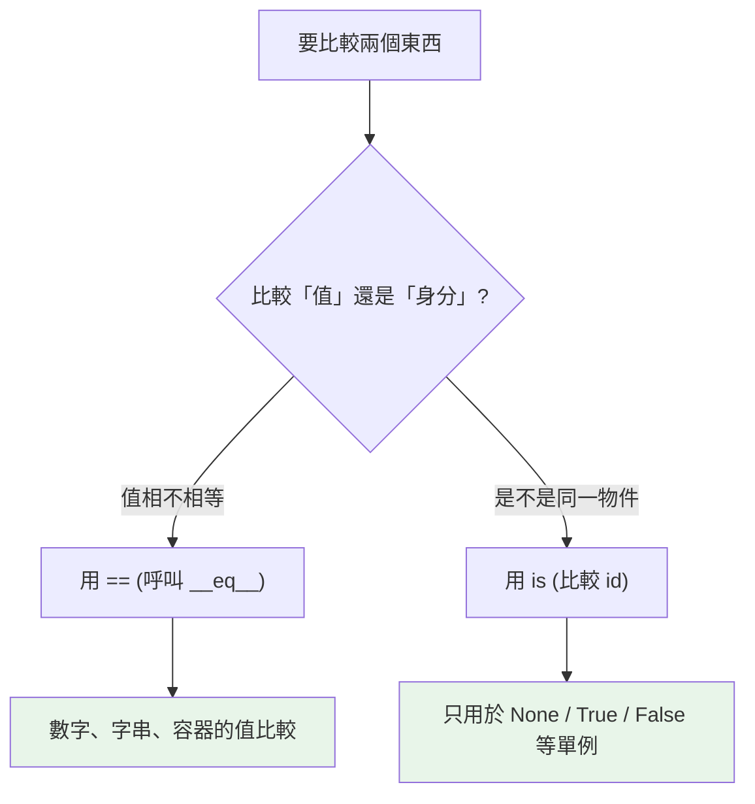

# 運算子與運算順序

> 運算子在 Python 裡不是語法魔法，而是對應到物件的方法呼叫；而 `is` vs `==`、鏈式比較、`and/or` 的短路，是最容易寫錯的幾個點。

## 💡 白話導讀（建議先讀）

先揭一個底：Python 裡**沒有內建在語言裡的「加法」**。

`3 + 5` 其實是 Python 轉頭問 3：「你的 `__add__(5)` 怎麼算？」
（[Part 4 講過的插座](../04-oop/08-dunder-methods.md)——`+` 是插頭，`__add__` 是插座。）

這解釋了為什麼同一個 `+` 千變萬化：int 拿它做加法、str 拿它做拼接、list 拿它做串接——**行為由物件自己定義**。

這章另外三個高頻陷阱，先打預防針：

**1. `is` vs `==`：「同一個人」vs「長得一樣」。**
`==` 問「內容相等嗎」（雙胞胎會說是）；`is` 問「是同一個物件嗎」（同一張便利貼貼的那個）。
規則背起來：**判 None 用 `is`，其他一律用 `==`**。

**2. 鏈式比較是真的。**
`18 <= age < 65` 在 Python 是合法且正確的（數學課的寫法直接能用）——別的語言這樣寫會出鬼。

**3. `and`/`or` 會「短路」而且回傳的不是 True/False。**
問到能定案就不再問（`False and 爆炸()` 不會爆炸）；而且回傳的是**最後看的那個值本身**——`name = 輸入 or "預設值"` 這個慣用法就是這麼來的。

## Why（為什麼）

運算子看似簡單，但幾個細節反覆咬人：`is` 和 `==` 到底差在哪、`a < b < c` 能不能連寫、`2 ** 3 ** 2` 先算哪邊、`and`/`or` 為什麼能拿來給預設值。更深一層，Python 的運算子其實是**方法呼叫的語法糖**（`a + b` 等於 `a.__add__(b)`），理解這點就打通了往後的運算子多載（見 [魔術方法](../04-oop/08-dunder-methods.md)）。

## Theory（理論：運算子是方法呼叫的語法糖）

Python 沒有「內建於語言的加法」——`+` 只是呼叫物件 `__add__` 方法的簡寫：

```pycon
>>> 3 + 5
8
>>> (3).__add__(5)     # 等價
8
>>> "a" + "b"          # str 的 __add__ 是連接
'ab'
>>> [1] + [2]          # list 的 __add__ 是串接
[1, 2]
```

同一個 `+`，對 int 是加法、對 str 是連接、對 list 是串接——因為它們各自實作了不同的 `__add__`。

這就是「一切皆物件」的威力所在：**連運算子行為都由物件自己定義**（見[一切皆物件](../10-cpython-internals/01-everything-is-object.md)、[dunder 協定](../04-oop/08-dunder-methods.md)——插頭與插座）。

## Specification（規範：運算子分類與優先順序）

### 運算子分類

| 類別 | 運算子 |
|------|--------|
| 算術 | `+ - * / // % ** @`（`@` 是矩陣乘） |
| 比較 | `< <= > >= == !=` |
| 身分 | `is`、`is not` |
| 成員 | `in`、`not in` |
| 邏輯 | `and`、`or`、`not` |
| 位元 | `& | ^ ~ << >>` |
| 賦值 | `= += -= *= ...`（增量賦值） |

### 優先順序（高 → 低，摘要）

```text
**                        （次方，右結合！）
* / // % @
+ -
<< >>                     （位元位移）
&  →  ^  →  |             （位元 and/xor/or）
比較 / is / in            （所有比較同級）
not
and
or
```

重點：`**` 是**右結合**（`2 ** 3 ** 2 == 2 ** 9 == 512`）；算術優先於位元；比較優先於 `not`/`and`/`or`。不確定時**加括號**，別考記憶力。

## Implementation（幾個關鍵行為）

### `is` vs `==`：身分 vs 相等

這是最常考、最常錯的一組：

- **`==`** 比較**值是否相等**，會呼叫 `__eq__`，可被覆寫。
- **`is`** 比較**是否為同一個物件**（`id` 相同），不可被覆寫。

```pycon
>>> a = [1, 2, 3]
>>> b = [1, 2, 3]
>>> a == b          # 值相等
True
>>> a is b          # 但不是同一個物件
False
>>> c = a
>>> a is c          # c 和 a 是同一物件（別名）
True
```

**規則**：比較值用 `==`；判斷「是不是同一個物件 / 是不是那個單例」用 `is`。**`is` 只該用在 `None`、`True`、`False` 這類單例**（`x is None`）。

⚠️ 別用 `is` 比較數字或字串的「值」：`x is 256` 有時 True 有時 False，因為那依賴 CPython 的小整數快取（interning，見 [interning](../10-cpython-internals/09-interning.md)）——這是實作細節，不可依賴。比值永遠用 `==`。

### 鏈式比較（chained comparison）

Python 允許把比較連寫，語意符合數學直覺：

```pycon
>>> x = 5
>>> 1 < x < 10           # 等價於 (1 < x) and (x < 10)
True
>>> a = b = c = 1
>>> a == b == c
True
```

`1 < x < 10` 中間的 `x` 只求值一次，且是 `and` 連接——比 `1 < x and x < 10` 更簡潔且不重複求值。

### `and`/`or` 短路與 `not`

如 [truthiness 章](03-booleans-and-none.md) 所述，`and`/`or` 短路且回傳運算元本身；`not` 則永遠回 `True`/`False`：

```pycon
>>> not 0, not "", not [1]
(True, True, False)
>>> 5 and 0 or "fallback"    # (5 and 0)=0 → 0 or "fallback" = "fallback"
'fallback'
```

### 增量賦值 `+=` 對可變/不可變的差異

`a += b` 對不可變型別是「造新物件再換綁」，對可變型別可能是「原地修改」：

```pycon
>>> x = 1
>>> x += 1          # 造新 int 2，x 換綁（原 1 不變）
>>> nums = [1, 2]
>>> nums += [3]     # list 原地延伸（等同 nums.extend([3])）
>>> nums
[1, 2, 3]
```

這個差異在別名情境下會有微妙後果（見 [可變 vs 不可變](../03-data-structures/06-mutability.md)）。

## Code Example（可執行的 Python 範例）

```python
# operators_demo.py
def demo() -> None:
    # 1. 運算子即方法
    print(f"3 + 5 = {(3).__add__(5)}")     # 8

    # 2. is vs ==
    a = [1, 2, 3]
    b = [1, 2, 3]
    print(f"a == b: {a == b}, a is b: {a is b}")  # True, False

    # 3. 鏈式比較
    score = 85
    print(f"80 <= score < 90: {80 <= score < 90}")  # True

    # 4. ** 右結合
    print(f"2 ** 3 ** 2 = {2 ** 3 ** 2}")  # 512（= 2**9）

    # 5. += 對 list 是原地修改
    nums = [1, 2]
    alias = nums
    nums += [3]
    print(f"alias 也變了: {alias}")  # [1, 2, 3]（同一物件）


if __name__ == "__main__":
    demo()
```

**預期輸出**：

```pycon
$ python operators_demo.py
3 + 5 = 8
a == b: True, a is b: False
80 <= score < 90: True
2 ** 3 ** 2 = 512
alias 也變了: [1, 2, 3]
```

## Diagram（圖解：is vs ==）



## Best Practice（最佳實踐）

- **比值用 `==`，判單例用 `is`**：`x is None` 對、`x is 256` 錯（依賴 interning）。
- **善用鏈式比較**：`0 <= i < len(xs)` 比 `0 <= i and i < len(xs)` 清楚。
- **優先順序沒把握就加括號**：可讀性 > 省括號，尤其位元運算與比較混用時。
- **記得 `**` 右結合**：`2**3**2` 是 `512` 不是 `64`。
- **知道 `+=` 對可變型別可能原地修改**：別名情境下會牽動其他名稱。
- **邏輯運算回傳運算元本身**：`x or default` 好用，但小心 falsy 合法值（見 [truthiness](03-booleans-and-none.md)）。

## Common Mistakes（常見誤解）

- **用 `is` 比較值**：`x is 1000`、`s is "abc"` 結果不可靠（interning 實作細節）。比值用 `==`。
- **以為 `2 ** 3 ** 2 == 64`**：`**` 右結合，先算 `3**2=9` 再 `2**9=512`。
- **`a < b < c` 誤解為 `(a < b) < c`**：Python 是鏈式比較 `(a<b) and (b<c)`，和多數語言不同。
- **位元 `&`/`|` 與比較混用不加括號**：`x & 1 == 0` 其實是 `x & (1 == 0)`（`==` 優先於 `&`！）——經典陷阱，務必加括號寫 `(x & 1) == 0`。
- **以為 `not a == b` 等於 `a != b`**：實際上 `not (a == b)` 才等於 `a != b`；`not a == b` 因優先順序也是 `not (a==b)`，但別依賴記憶，加括號。
- **忘了 `and`/`or` 回運算元不是布林**。

## Interview Notes（面試重點）

- 能說出**運算子是方法呼叫的語法糖**（`a + b` → `a.__add__(b)`），連結到運算子多載。
- **`is` vs `==` 必考**：身分 vs 值、`is` 不可覆寫、只用於單例（`None`）、不可用 `is` 比數字/字串值（interning 是實作細節）。
- 知道 **鏈式比較** `1 < x < 10` 的語意（`and` 連接、中間只求值一次）。
- 知道 **`**` 右結合**、比較優先於邏輯、**位元運算優先順序低於比較**（`x & 1 == 0` 的陷阱）。
- 知道 **`+=` 對不可變是換綁、對可變可能原地修改**。

---

➡️ 下一章：[流程控制 if / for / while](06-control-flow.md)

[⬆️ 回 Part 2 索引](README.md)
