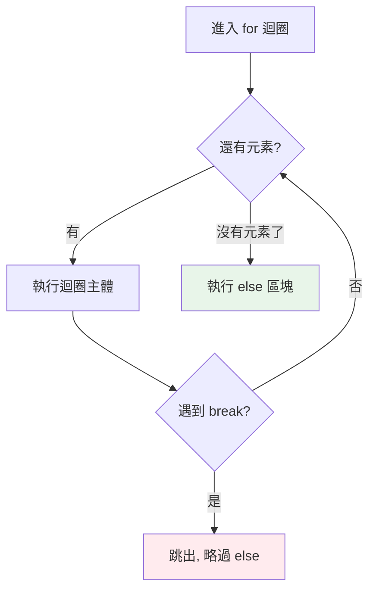

# 流程控制 if / for / while

> Python 的流程控制有兩個別的語言少見的設計：`for` 是「遍歷可迭代物件」而非計數迴圈，以及 `for/while` 竟然可以帶 `else`——搞懂它們，迴圈才寫得 Pythonic。

## 💡 白話導讀（建議先讀）

Python 的 `if`/`while` 和別的語言大同小異，但 `for` 有一個根本的不同，先校正：

**Python 的 `for` 不是「數數」，是「逐一取出」。**

別的語言的 for 是計數器（i 從 0 數到 9）；Python 的 for 是**從籃子裡逐一拿東西**：

```python
for item in ["蘋果", "香蕉", "橘子"]:   # 直接拿到東西本身
    print(item)                          # 不是拿到 0、1、2
```

`range(10)` 呢？它只是一種「裝著 0~9 的籃子」——`for i in range(10)` 依然是「從籃子逐一取出」，不是特殊語法。

校正之後，你就懂為什麼 `for i in range(len(xs))` 再用 `xs[i]` 取值是「外國口音」——籃子裡的東西直接拿就好，繞去拿編號再換東西是多此一舉。（真需要編號＋東西？用 `enumerate`。）

第二個少見設計：**迴圈可以接 `else`**。

`for...else` 的 else 讀作「**沒有中途 break 的話**」——最典型的用途是搜尋：找到就 break，`else` 區塊就是「整圈找完都沒找到」的處理。名字取得爛（跟 if 的 else 無關），但用對地方很優雅。

## Why（為什麼）

流程控制是程式的骨架。多數語言的 `for` 是「計數器從 0 跑到 n」，但 Python 的 `for` 根本不是這樣——它是**遍歷（iterate）** 一個序列或任何可迭代物件。用 C 的心態寫 Python 的 `for`（`for i in range(len(xs)): xs[i]`）不但囉嗦，還錯過了語言的設計意圖。這章講清楚三種流程控制、`break`/`continue`、以及冷門但實用的 `for...else`。

## Theory（理論：for 是遍歷，不是計數）

Python 的 `for` 語意是：**依序取出「可迭代物件（iterable）」的每個元素**——從籃子裡逐一拿東西。

背後是迭代器協定（見 [iterable 與 iterator](../07-iterators-generators/01-iterable-iterator.md)）：任何能被 `for` 遍歷的東西（list、str、dict、range、生成器⋯⋯）都是可迭代物件。

```python
for item in [10, 20, 30]:   # 直接拿到元素，不是索引
    print(item)             # 10, 20, 30
```

`range(n)` 只是「產生 0..n-1 的可迭代物件」的**一種籃子**；`for` 本身跟「計數」無關。

理解這點，就不會再寫 `for i in range(len(xs))` 繞圈取元素——元素直接拿，要索引配元素用 `enumerate(xs)`。

## Specification（規範：三種流程控制語法）

### if / elif / else

```python
if score >= 90:
    grade = "A"
elif score >= 60:      # 可有 0 到多個 elif
    grade = "B"
else:                  # else 可省略
    grade = "F"

# 條件運算式（三元）：value_if_true if condition else value_if_false
grade = "pass" if score >= 60 else "fail"
```

Python **沒有** `switch`（3.10 後有更強的 `match`，見 [結構化模式比對](07-match-statement.md)）。

### while

```python
while condition:       # 條件為真就重複
    do_something()
else:                  # 迴圈「正常結束」（非 break）時執行
    cleanup()
```

### for

```python
for item in iterable:
    process(item)
else:                  # 迴圈跑完（沒被 break）時執行
    on_complete()
```

### break / continue

```python
for x in items:
    if x < 0:
        continue       # 跳過本次，進下一輪
    if x > 100:
        break          # 直接終止整個迴圈
    handle(x)
```

## Implementation（Pythonic 迴圈與 for...else）

### 需要索引？用 `enumerate`，別用 `range(len(...))`

```python
# ❌ 非 Pythonic
for i in range(len(names)):
    print(i, names[i])

# ✅ Pythonic
for i, name in enumerate(names):
    print(i, name)

# 可指定起始索引
for i, name in enumerate(names, start=1):
    print(i, name)
```

### 同時遍歷多個序列？用 `zip`

```python
for name, score in zip(names, scores):
    print(f"{name}: {score}")
```

`zip` 以**最短的**序列為準（多的忽略）；要嚴格等長可用 `zip(a, b, strict=True)`（3.10+，長度不符會報錯）。

### `for...else` / `while...else`：迴圈的「沒有中途 break」分支

這是 Python 獨特且常被誤解的語法。**`else` 區塊在「迴圈正常跑完、沒有被 `break` 中斷」時執行**；一旦 `break`，`else` 就被跳過。典型用途是「搜尋，找到就 break、找不到才做某事」：

```python
def find_prime_factor(n: int) -> int | None:
    for i in range(2, n):
        if n % i == 0:
            return i          # 找到因數
    else:
        return None           # 迴圈跑完都沒找到（沒 break）→ 是質數
```

更清楚的例子：

```python
for item in items:
    if item == target:
        print("找到了")
        break
else:
    print("整個跑完都沒找到")   # 只有「沒 break」才會執行
```

把 `else` 讀成 **「no break」** 就對了。它避免了「另設一個 `found` 旗標變數」的囉嗦寫法。

### 條件運算式（三元）

```python
# 別用醜陋的 (cond and a) or b（有 falsy 陷阱）
x = a if cond else b        # 清楚、正確
```

## Code Example（可執行的 Python 範例）

```python
# control_flow_demo.py
def classify(score: int) -> str:
    """用 if/elif 分級。"""
    if score >= 90:
        return "A"
    elif score >= 80:
        return "B"
    elif score >= 60:
        return "C"
    return "F"


def first_even(numbers: list[int]) -> int | None:
    """用 for...else 找第一個偶數，找不到回 None。"""
    for n in numbers:
        if n % 2 == 0:
            return n
    else:
        return None   # 沒 break（此處沒找到）


def demo() -> None:
    # enumerate + zip
    names = ["Alice", "Bob", "Cara"]
    scores = [95, 82, 58]
    for i, (name, score) in enumerate(zip(names, scores), start=1):
        print(f"{i}. {name}: {score} → {classify(score)}")

    # for...else
    print(f"first_even([1,3,5]) = {first_even([1, 3, 5])}")
    print(f"first_even([1,4,5]) = {first_even([1, 4, 5])}")


if __name__ == "__main__":
    demo()
```

**預期輸出**：

```pycon
$ python control_flow_demo.py
1. Alice: 95 → A
2. Bob: 82 → B
3. Cara: 58 → F
first_even([1,3,5]) = None
first_even([1,4,5]) = 4
```

## Diagram（圖解：for...else 的執行流程）



## Best Practice（最佳實踐）

- **`for` 直接遍歷元素**：需要索引用 `enumerate`、要平行遍歷用 `zip`，別 `range(len(...))`。
- **用 `for...else` 表達「搜尋失敗」邏輯**：比額外設 `found` 旗標乾淨；但團隊不熟時加註解。
- **簡單二選一用條件運算式** `a if cond else b`，別用 `and/or` 的 hack。
- **`while True:` + `break`** 是處理「先做一次再判斷」或無明確終止條件迴圈的正規寫法。
- **避免在遍歷 list 時修改它**：會漏掉元素或出錯；改遍歷副本 `for x in items[:]` 或建立新 list。
- **深巢狀時考慮提早 return / continue**（guard clause）來壓平縮排。

## Common Mistakes（常見誤解）

- **用 `range(len(xs))` 取元素**：非 Pythonic，用 `enumerate`。
- **誤解 `for...else` 的 `else`**：它不是「迴圈沒跑」時執行，而是**「沒被 break」時執行**（迴圈正常跑完，含空迴圈的情況）。
- **遍歷時修改被遍歷的 list**：`for x in xs: xs.remove(...)` 會跳過元素。遍歷副本或用推導式重建。
- **`zip` 長度不等默默截斷**：預期等長時用 `strict=True`（3.10+）以在不符時報錯。
- **想找 `switch`**：Python 沒有；用 `if/elif` 或 `match`（見 [match](07-match-statement.md)）。
- **無窮迴圈忘了更新條件**：`while` 條件內的變數若沒在迴圈裡改變，會卡死。

## Interview Notes（面試重點）

- 說得出 **Python 的 `for` 是遍歷可迭代物件**（背後是迭代器協定），不是計數迴圈。
- 能寫出 Pythonic 迴圈：`enumerate`（取索引）、`zip`（平行遍歷，及 `strict=True`）。
- **`for...else` / `while...else` 是常見考點**：能正確說出「`else` 在迴圈未被 `break` 中斷而正常結束時執行」，並舉出搜尋場景的用途。
- 知道 Python **沒有 `switch`**，用 `if/elif` 或 `match`。
- 知道 **遍歷中修改容器的陷阱** 與解法。
- 知道條件運算式 `a if cond else b` 是三元運算的正解。

---

➡️ 下一章：[結構化模式比對 match](07-match-statement.md)

[⬆️ 回 Part 2 索引](README.md)
