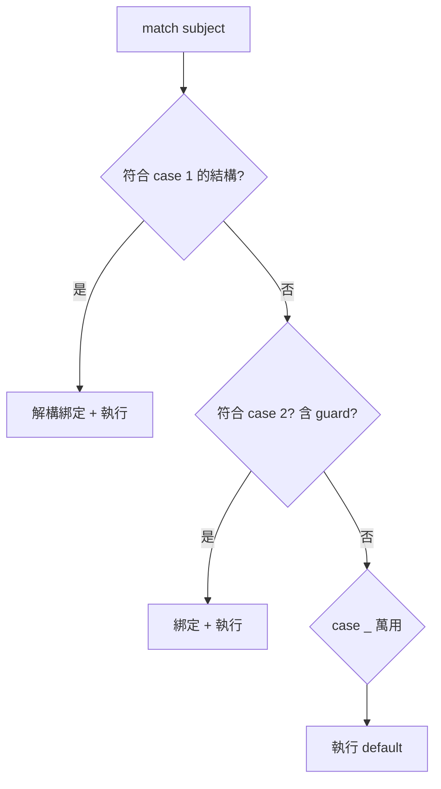

# 結構化模式比對 match

> `match` 不是 C 的 `switch`——它比對的是「結構」，能解構序列、對映與物件，一邊比對一邊把內部值抓出來綁定。這是 Python 3.10 帶來最大的語法特性。

## 💡 白話導讀（建議先讀）

看到 `match`，直覺會想到 C/Java 的 `switch`——先把這個直覺放下，它們是不同的東西。

`switch` 像**對號碼牌**：值等於 1 走這、等於 2 走那。
`match` 像**海關查驗行李的「形狀」**：

- 「兩件式的包裹？」——是序列而且有兩個元素，走這條道。
- 「有 action 標籤的箱子？」——是含特定 key 的 dict，走那條道。
- 而且查驗的**同時順手把內容物取出來**：「兩件式包裹」比對成功時，兩件東西已經各自放進變數了（這叫解構）。

一個畫面看懂：

```python
match point:
    case (0, 0):        print("原點")           # 形狀是 (0,0)
    case (x, 0):        print(f"在 x 軸 {x}")   # 兩元素且第二個是 0 → 第一個抓進 x
    case (x, y):        print(f"({x}, {y})")    # 任意兩元素 → 都抓出來
```

第二條 case 做了三件事：確認是兩元素序列、確認第二個是 0、把第一個綁定到 `x`——**分流＋檢查＋取值,一行完成**。這就是 match 的價值。

適用時機也先講：處理「形狀多變的資料」（JSON 事件、指令、AST）時它大放異彩;只是「值等於幾就做什麼」,老實用 if/elif 就好。

## 🎯 什麼時候會用到

`match` 不是「更炫的 `if`」——它在**「依結構拆解」**時才真正勝出。該用它的訊號:

- **依資料的「形狀」分支**:處理 JSON/dict、AST、事件物件——
  `case {"type": "click", "x": x}` 一次比對型別、鍵、還順手把值綁到變數。
- **依型別 + 內容分派**:`case Circle(radius=r)`、`case [a, b]`、`case (0, y)`——
  比一長串 `isinstance` 再手動索引取值乾淨太多。
- **列舉固定的幾種情況**:語意像其他語言的 switch,但更強(有解構、守衛 `if`、萬用 `_`)。

**什麼時候「別」用**:單純的值相等、二三個分支(`if x == 1: ...`)——用 `if/elif` 或 dict 派發更輕。
`match` 的價值在「解構」,**沒有結構要拆時它是殺雞用牛刀**。

一句話:**要「拆開一個結構、依它的形狀決定怎麼做」→ `match`;只是比相等 → `if/elif` 或 dict。**

## Why（為什麼）

處理「依資料的形狀分流」的邏輯時（例如解析一個可能長成好幾種樣子的 JSON、處理不同型別的事件），用一連串 `if isinstance(...) and ...：` 會又長又難讀。Python 3.10 引入 **結構化模式比對（structural pattern matching，PEP 634）**，讓你用宣告式的方式描述「資料應該長什麼樣」，並在比對成功時**同時把內部的值解構綁定到變數**。用對地方，它能把一大塊條件判斷變得清晰。

## Theory（理論：比對「結構」而非「值」）

`switch` 比的是「這個值等於哪個常數」（對號碼牌）；`match` 比的是「**這個資料符合哪種結構模式**」（查驗形狀）。

模式的三種能力：

- 比對**形狀**：是不是有兩個元素的序列？是不是有某些 key 的 dict？
- 比對成功的同時**解構並綁定**：把內部的值直接抓進變數。
- 加上 **guard 條件**（`if`）：形狀對了還能再篩一次。

一句話：`match` = **條件分流 + 解構賦值 + 型別檢查**，三合一。

## Specification（規範：模式的種類）

```text
match subject:
    case pattern1:
        ...
    case pattern2 if guard:      # 帶 guard 條件
        ...
    case _:                      # 萬用模式（等同 default）
        ...
```

主要模式類型：

| 模式 | 範例 | 說明 |
|------|------|------|
| 字面值 | `case 200:` | 比對相等的常數 |
| 捕捉 | `case x:` | 綁定任意值到 `x`（總是成功） |
| 萬用 | `case _:` | 匹配任何東西但不綁定 |
| 序列 | `case [a, b]:` | 比對兩元素序列，解構到 a、b |
| 星號 | `case [first, *rest]:` | 抓頭 + 其餘 |
| 對映 | `case {"type": t}:` | 比對含某 key 的 dict |
| 類別 | `case Point(x=0, y=y):` | 比對物件型別與屬性 |
| 或 | `case 1 | 2 | 3:` | 多選一 |
| 綁定 | `case [Point(), *_] as pts:` | 用 `as` 把整體綁定 |

## Implementation（幾個關鍵行為與陷阱）

### 序列與對映解構

```python
def handle(command: list) -> str:
    match command:
        case ["move", x, y]:              # 三元素、首個為 "move"
            return f"移動到 ({x}, {y})"
        case ["quit"]:
            return "離開"
        case ["load", *files]:            # 抓其餘為 list
            return f"載入 {len(files)} 個檔案"
        case _:
            return "未知指令"
```

`match` 一邊確認「是不是 `["move", _, _]` 這個形狀」，一邊把後兩個元素綁定到 `x`、`y`——這是它比 `if/elif` 強的核心。

### 陷阱：捕捉模式 vs 字面值——大小寫與 `.` 的規則

這是 `match` 最容易錯的地方。**單獨的名稱（如 `case status:`）是「捕捉」，會綁定任何值、永遠成功**，不是「比對名為 status 的變數的值」：

```python
FORBIDDEN = 403

match code:
    case FORBIDDEN:      # ❌ 陷阱！這不是比對 403
        ...
```

上面的 `FORBIDDEN` 會被當成**捕捉模式**，匹配任何 `code` 並把它綁到名為 `FORBIDDEN` 的新變數——不是你以為的「比對常數 403」。

要比對具名常數，必須用**帶點的名稱**（dotted name，如 `HTTPStatus.FORBIDDEN`）或直接寫字面值：

```text
from http import HTTPStatus

match code:
    case HTTPStatus.FORBIDDEN:   # ✅ 帶點 → 當成值比對
        return "禁止"
    case 200:                    # ✅ 字面值
        return "OK"
    case _:
        return "其他"
```

記住：**裸名稱 = 捕捉（綁定）；帶點名稱或字面值 = 值比對。**

### 類別模式：比對型別與屬性

```python
from dataclasses import dataclass

@dataclass
class Point:
    x: int
    y: int

def describe(p: Point) -> str:
    match p:
        case Point(x=0, y=0):
            return "原點"
        case Point(x=0, y=y):        # x 必須是 0，y 綁定
            return f"在 y 軸，y={y}"
        case Point(x=x, y=0):
            return f"在 x 軸，x={x}"
        case Point():                # 任何 Point
            return "一般點"
```

### guard 與 or 模式

```text
match value:
    case int(n) if n < 0:        # 是 int 且為負
        return "負整數"
    case 0 | "" | None:          # or 模式：多種 falsy
        return "空值"
```

## Code Example（可執行的 Python 範例）

```python
# match_demo.py
from dataclasses import dataclass


@dataclass
class Circle:
    radius: float


@dataclass
class Rectangle:
    width: float
    height: float


def area(shape: object) -> float:
    """用類別模式依形狀計算面積。"""
    match shape:
        case Circle(radius=r):
            return 3.14159 * r * r
        case Rectangle(width=w, height=h):
            return w * h
        case _:
            raise ValueError("未知形狀")


def parse_command(cmd: list[str]) -> str:
    match cmd:
        case ["go", direction]:
            return f"往 {direction}"
        case ["take", *items]:
            return f"拿取 {', '.join(items)}"
        case _:
            return "無法辨識"


def demo() -> None:
    print(f"圓面積: {area(Circle(radius=2)):.2f}")       # 12.57
    print(f"矩形面積: {area(Rectangle(width=3, height=4))}")  # 12
    print(parse_command(["go", "north"]))
    print(parse_command(["take", "sword", "shield"]))


if __name__ == "__main__":
    demo()
```

**預期輸出**：

```pycon
$ python match_demo.py
圓面積: 12.57
矩形面積: 12
往 north
拿取 sword, shield
```

## Diagram（圖解：match 的比對流程）



## Best Practice（最佳實踐）

- **用在「依結構分流」的場景**：解析巢狀資料、處理多型事件、狀態機——比一長串 `isinstance` 清楚。
- **比對常數用字面值或帶點名稱**（`HTTPStatus.OK`），**絕不用裸名稱**（會變成捕捉）。
- **加 `case _:` 收尾**：明確處理未匹配情況，避免默默什麼都不做。
- **簡單的相等分流不必用 match**：兩三個 `if/elif` 更輕；`match` 的價值在「結構 + 解構」。
- **搭配 `dataclass`**：類別模式配 dataclass 非常自然（見 [dataclass](../04-oop/09-dataclass.md)）。
- **需要 3.10+**：確認目標 Python 版本支援。

## Common Mistakes（常見誤解）

- **把裸名稱當成值比對**：`case FORBIDDEN:` 是捕捉、永遠成功並遮蔽後續 case——最經典的坑。用帶點名稱或字面值。
- **以為 `match` 是 `switch`**：它比的是結構不是相等；別只拿來做常數分流（雖然也能）。
- **`case _` 忘了寫**：沒有萬用分支且都不匹配時，`match` 什麼都不做（不報錯），可能遺漏處理。
- **序列模式會匹配到非預期型別**：`case [a, b]` 會匹配 list 與 tuple 等序列，但**不匹配 str**（Python 刻意排除 str/bytes，避免把字串當字元序列誤匹配）。
- **case 順序錯**：較寬鬆的模式（如捕捉）放前面會遮蔽後面更精確的 case，順序要由specific → general。
- **在低於 3.10 的環境用**：語法錯誤。

## Interview Notes（面試重點）

- 能說出 `match` 是 **結構化模式比對**（3.10 / PEP 634），比對「結構」並在成功時**解構綁定**，不是 `switch`。
- 講得出主要模式：字面值、捕捉、序列 `[a, *rest]`、對映 `{"k": v}`、類別 `Point(x=0)`、or `|`、guard `if`、`as`。
- **必答陷阱**：裸名稱是**捕捉（綁定並永遠成功）**，比對具名常數要用**帶點名稱或字面值**。
- 知道序列模式**不匹配 str/bytes**（刻意設計）。
- 知道 `case _` 是萬用分支、case 順序需 specific → general。

---

➡️ 下一章：[函式定義與呼叫](08-functions.md)

[⬆️ 回 Part 2 索引](README.md)
