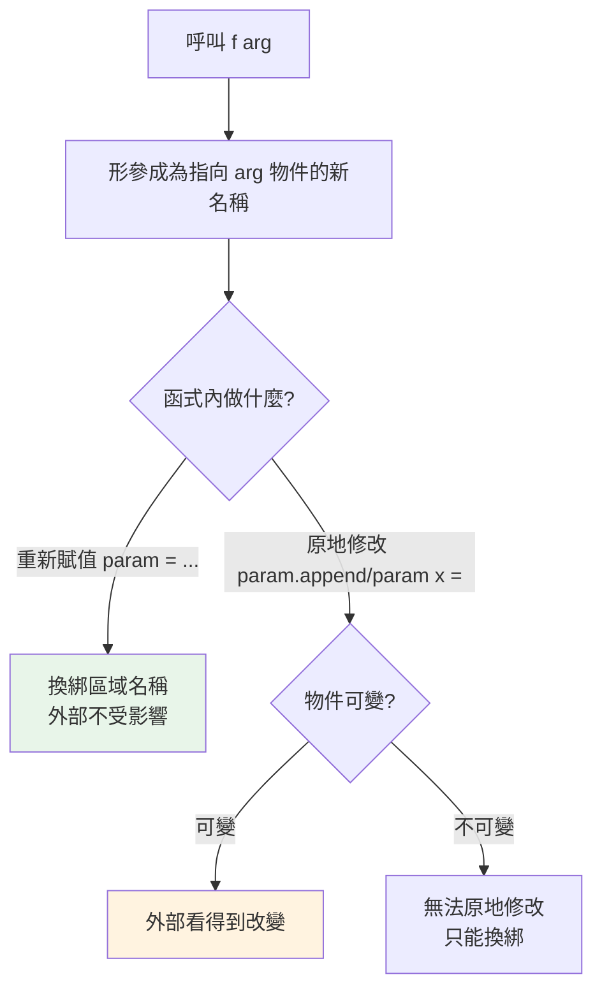

# 函式定義與呼叫

> 函式在 Python 裡是「一等公民物件」——可以被賦值、傳遞、回傳；而它「傳的是物件參照」的呼叫語意，是理解「函式會不會改到我的資料」的關鍵。

## Why（為什麼）

函式是組織程式、避免重複的基本單位。但 Python 的函式有兩個超越「一段可重用程式碼」的特性，值得一開始就建立正確認知：其一，函式本身就是**物件**，能像資料一樣傳來傳去（這是裝飾器、回呼、函數式風格的基礎）；其二，Python 的參數傳遞方式常被誤解為「傳值」或「傳參照」，其實兩者都不完全對。搞懂這兩點，你才不會在「函式改到外部 list」時一頭霧水。

## Theory（理論：函式是一等公民物件）

在 Python，`def` 建立的函式是一個**物件**，和 int、str 一樣可以：

- 綁定到變數：`f = my_func`
- 當參數傳給別的函式：`sorted(xs, key=my_func)`
- 當回傳值：`def outer(): return inner`
- 存進容器：`handlers = {"a": func_a, "b": func_b}`

```pycon
>>> def greet(name):
...     return f"Hi {name}"
>>> f = greet          # 不加括號 = 指向函式物件本身
>>> f("Alice")
'Hi Alice'
>>> type(greet)
<class 'function'>
```

這種「函式可被當作值操作」的性質稱為**一等公民（first-class）**，是 [裝飾器](../08-functional-decorators/03-decorator-basics.md) 與 [高階函式](../08-functional-decorators/02-higher-order-functions.md) 的地基。

## Specification（規範：函式的組成）

```python
def function_name(param1, param2, /, param3, *, param4) -> ReturnType:
    """docstring：說明這個函式做什麼。"""
    # 函式主體
    return result
```

- `def`：定義函式的關鍵字。
- **參數**：可有位置參數、預設值、`*args`、`**kwargs` 等（詳見 [參數](09-parameters-args-kwargs.md)）。
- `-> ReturnType`：**回傳型別註記**（可選，見 [Part 5](../05-typing/README.md)）。
- **docstring**：緊接定義的字串，供 `help()` 與工具讀取（PEP 257）。
- `return`：回傳值；**沒有 `return` 或裸 `return` 時，函式回傳 `None`**。

## Implementation（呼叫語意與回傳）

### 參數傳遞：傳的是「物件參照」（call by object reference）

Python 既不是傳統的「傳值」也不是「傳參照」，而是 **傳物件參照 / 傳共享（pass by object reference / call by sharing）**。理解它只需回到 [名稱綁定](01-dynamic-typing.md)：**呼叫時，形式參數變成「指向傳入物件的新名稱」**。

後果取決於物件**可不可變**：

```python
def try_modify(n: int, lst: list) -> None:
    n += 1              # int 不可變 → n 換綁到新物件，不影響外部
    lst.append(99)      # list 可變 → 原地修改「同一個物件」，外部看得到

x = 10
data = [1, 2]
try_modify(x, data)
# x 仍是 10（不可變，函式內換綁不影響外部）
# data 變成 [1, 2, 99]（可變，函式改的是同一個物件）
```

- 傳**不可變**物件（int、str、tuple）：函式內「重新賦值」只是換綁區域名稱，外部不受影響——**看起來像傳值**。
- 傳**可變**物件（list、dict、set）：函式內對它**原地修改**會反映到外部——**看起來像傳參照**。

關鍵：不是型別決定「傳值或傳參照」，而是**你在函式內做的是「換綁」還是「原地修改」**。

### 重新賦值 vs 原地修改

```python
def rebind(lst):
    lst = [9, 9, 9]     # 換綁區域名稱 → 外部不變

def mutate(lst):
    lst[:] = [9, 9, 9]  # 原地修改內容 → 外部會變

data = [1, 2, 3]
rebind(data)    # data 仍是 [1, 2, 3]
mutate(data)    # data 變成 [9, 9, 9]
```

### 回傳值：沒 return 就是 None，多值回傳其實是 tuple

```pycon
>>> def no_return():
...     pass
>>> print(no_return())
None
>>> def min_max(xs):
...     return min(xs), max(xs)     # 逗號 → 打包成 tuple
>>> min_max([3, 1, 2])
(1, 3)
>>> lo, hi = min_max([3, 1, 2])    # 解構賦值
```

Python 的「多回傳值」本質是回傳一個 tuple，呼叫端再解構——並非真的多個回傳值。

### docstring 與 help

```pycon
>>> def area(r):
...     """回傳半徑為 r 的圓面積。"""
...     return 3.14159 * r * r
>>> area.__doc__
'回傳半徑為 r 的圓面積。'
>>> help(area)     # REPL 中顯示文件
```

## Code Example（可執行的 Python 範例）

```python
# functions_demo.py
def apply(func, value):
    """一等公民：把函式當參數傳入並呼叫。"""
    return func(value)


def stats(numbers: list[float]) -> tuple[float, float, float]:
    """回傳 (最小, 最大, 平均)——多值回傳其實是 tuple。"""
    return min(numbers), max(numbers), sum(numbers) / len(numbers)


def add_item(target: list, item: object) -> None:
    """示範：可變物件的原地修改會影響外部。"""
    target.append(item)


def demo() -> None:
    # 1. 函式當值傳遞
    print(apply(str.upper, "hello"))   # HELLO
    print(apply(len, [1, 2, 3]))       # 3

    # 2. 多值回傳 + 解構
    lo, hi, avg = stats([4, 8, 15, 16])
    print(f"min={lo}, max={hi}, avg={avg}")

    # 3. 可變參數被原地修改
    data = [1, 2]
    add_item(data, 3)
    print(f"data 被改了: {data}")       # [1, 2, 3]


if __name__ == "__main__":
    demo()
```

**預期輸出**：

```pycon
$ python functions_demo.py
HELLO
3
min=4, max=16, avg=10.75
data 被改了: [1, 2, 3]
```

## Diagram（圖解：參數傳遞的後果）



## Best Practice（最佳實踐）

- **函式要短、單一職責、名字說明作用**：一個函式做一件事，好命名勝過註解。
- **一律寫 docstring**（公開函式）與**型別註記**：讓 `help()`、IDE、mypy 都能幫你。
- **明確 `return`**：需要回值就 return；純副作用的函式回 `None` 即可，別混用。
- **謹慎修改傳入的可變參數**：若非刻意，別在函式內改動呼叫者的 list/dict；需要就先複製，或回傳新物件（見 [參數](09-parameters-args-kwargs.md) 的可變預設值陷阱）。
- **善用函式一等公民特性**：把行為當參數傳（`key=`、回呼），是 Pythonic 且靈活的做法。
- **多值回傳用 tuple + 解構**，或資料多時用 `dataclass` / `NamedTuple` 讓回傳有名字。

## Common Mistakes（常見誤解）

- **把 Python 說成「純傳值」或「純傳參照」**：都不精確；是**傳物件參照**，後果看「換綁 vs 原地修改」與「物件可不可變」。
- **函式內 `param = new_value` 期待影響外部**：那是換綁區域名稱，外部不變；要改內容用原地操作（`param[:] = ...`、`param.append`）。
- **忘了沒 `return` 回傳 `None`**：`result = my_func()` 卻拿到 `None`，因為函式忘了 return。
- **呼叫函式時漏掉或多寫括號**：`f`（函式物件）vs `f()`（呼叫）；把 `f` 當回呼傳時**不要**加括號。
- **可變預設參數陷阱**：`def f(x=[])` 的預設 list 會在多次呼叫間共用（詳見 [參數](09-parameters-args-kwargs.md)）。
- **用可變物件當「多回傳值」的容器卻意外共用**。

## Interview Notes（面試重點）

- 說得出**函式是一等公民物件**（可賦值、傳遞、回傳、存容器），並知道這是裝飾器/高階函式的基礎。
- **參數傳遞語意必考**：Python 是 **call by object reference（傳共享）**，能用「不可變→換綁不影響外部、可變→原地修改影響外部」解釋，並區分**重新賦值 vs 原地修改**。
- 知道**無 `return` 回傳 `None`**、**多回傳值本質是 tuple + 解構**。
- 知道 docstring（PEP 257）與型別註記的用途。
- 能舉出「函式改到外部可變物件」的例子與避免方式（複製 / 回傳新物件）。

---

➡️ 下一章：[參數、預設值、*args / **kwargs](09-parameters-args-kwargs.md)

[⬆️ 回 Part 2 索引](README.md)
