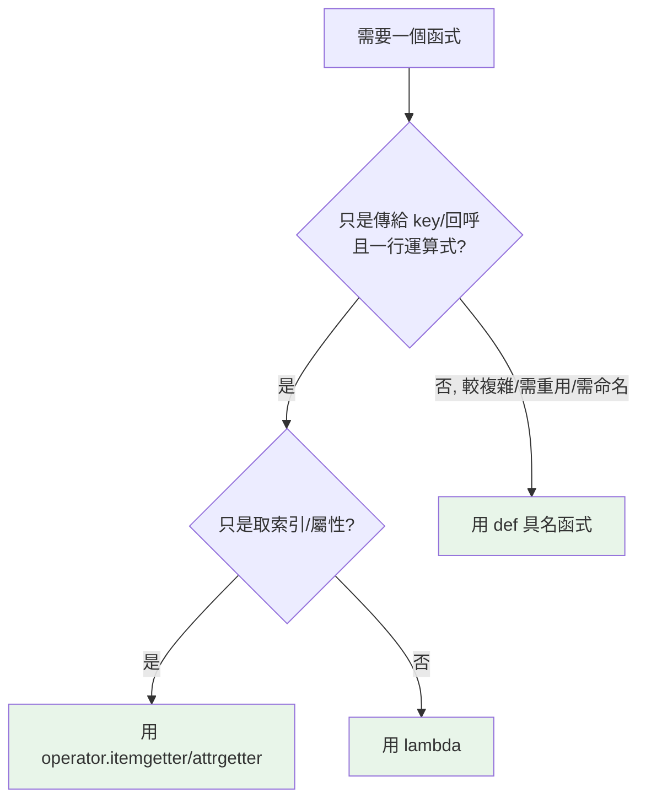

# lambda 與匿名函式

> lambda 是「一個運算式就能寫完的小函式」，用在 `sorted`、`map` 這類需要「臨時傳個行為」的場合最合適；但只要它長到需要換行或命名，就該改回 `def`。

## Why（為什麼）

有時你只需要一個「用完即丟」的小函式——例如告訴 `sorted` 要「依哪個欄位排序」。為此特地 `def` 一個具名函式再傳進去，顯得囉嗦。`lambda` 讓你在需要的地方**就地寫一個匿名的小函式**。但它也常被濫用，寫出難讀的一行怪物。這章講清楚 lambda 的定位、能力邊界，以及「什麼時候該用、什麼時候不該用」。

## Theory（理論：lambda 就是運算式版的函式）

`lambda` 和 `def` 建立的都是**函式物件**，沒有本質區別——差別只在語法與限制：

- `def` 建立**具名**函式，主體可以是**多行敘述**。
- `lambda` 建立**匿名**函式，主體只能是**單一運算式**，該運算式的值就是回傳值（不用寫 `return`）。

```pycon
>>> square = lambda x: x * x    # 等價於 def square(x): return x*x
>>> square(5)
25
>>> type(square)
<class 'function'>              # 就是個函式物件
```

「匿名」是指它不需要名字就能存在（可直接當引數傳）；上面把它綁到 `square` 只是示範，實務上真要命名就該用 `def`（見最佳實踐）。

## Specification（規範：語法）

```python
lambda 參數列: 運算式
```

- 參數列：和一般函式一樣可有多個、可有預設值、可用 `*args`/`**kwargs`。
- 冒號後：**唯一一個運算式**，其結果即回傳值。
- **不能包含**：敘述（`return`、`for` 迴圈、`if/else` 敘述、賦值、`raise`…）。

```python
add = lambda a, b: a + b
const = lambda: 42                      # 無參數
with_default = lambda x, n=2: x ** n
# 條件「運算式」可以（因為它是運算式，不是 if 敘述）
sign = lambda x: "正" if x > 0 else "非正"
```

## Implementation（何時用 lambda：當「行為參數」）

lambda 的主場是**把一個簡短行為當引數傳給高階函式**。最常見的是 `sorted`/`min`/`max` 的 `key`：

```pycon
>>> people = [("Alice", 30), ("Bob", 25), ("Cara", 35)]
>>> sorted(people, key=lambda p: p[1])       # 依年齡（索引 1）排序
[('Bob', 25), ('Alice', 30), ('Cara', 35)]
>>> max(people, key=lambda p: p[1])          # 年齡最大者
('Cara', 35)
>>> words = ["banana", "kiwi", "apple"]
>>> sorted(words, key=lambda w: len(w))      # 依長度排序
['kiwi', 'apple', 'banana']
```

也常搭配 `map`/`filter`（雖然推導式通常更 Pythonic，見下）：

```pycon
>>> list(map(lambda x: x * 2, [1, 2, 3]))
[2, 4, 6]
>>> list(filter(lambda x: x % 2 == 0, range(10)))
[0, 2, 4, 6, 8]
```

### lambda vs 推導式：`map`/`filter` 場合優先推導式

需要「轉換 + 篩選」時，推導式（見 [推導式](13-comprehensions.md)）通常比 `map`/`filter` + lambda 更好讀：

```python
# lambda + map/filter
list(map(lambda x: x * 2, filter(lambda x: x % 2 == 0, nums)))

# ✅ 推導式（更 Pythonic）
[x * 2 for x in nums if x % 2 == 0]
```

**lambda 真正不可取代的場合是 `key=`**——那裡需要傳一個「函式」，推導式幫不上忙。

### 用 `operator` 取代簡單 lambda

若 lambda 只是取索引、取屬性、做基本運算，標準庫的 `operator` 更快也更清楚（見 [排序](../03-data-structures/11-sorting.md)）：

```python
from operator import itemgetter, attrgetter

sorted(people, key=itemgetter(1))          # 取代 lambda p: p[1]
sorted(objs, key=attrgetter("age"))        # 取代 lambda o: o.age
```

### lambda 也有可變預設 / 閉包陷阱

lambda 在迴圈中捕捉變數時，和一般閉包一樣會遇到「捕捉的是變數而非當下值」的問題（詳見 [閉包](12-closures.md)）：

```pycon
>>> funcs = [lambda: i for i in range(3)]
>>> [f() for f in funcs]
[2, 2, 2]                     # 都印 2！不是 0,1,2
>>> funcs = [lambda i=i: i for i in range(3)]   # 用預設值「凍結」當下的 i
>>> [f() for f in funcs]
[0, 1, 2]
```

## Code Example（可執行的 Python 範例）

```python
# lambda_demo.py
from operator import itemgetter


def demo() -> None:
    products = [
        {"name": "Book", "price": 120},
        {"name": "Pen", "price": 15},
        {"name": "Bag", "price": 300},
    ]

    # 1. lambda 當 sort key
    by_price = sorted(products, key=lambda p: p["price"])
    print("依價格:", [p["name"] for p in by_price])

    # 2. 等價但更清楚：operator.itemgetter
    by_price2 = sorted(products, key=itemgetter("price"))
    print("同上:", [p["name"] for p in by_price2])

    # 3. max/min with key
    cheapest = min(products, key=lambda p: p["price"])
    print("最便宜:", cheapest["name"])

    # 4. 迴圈捕捉陷阱與修正
    bad = [lambda: i for i in range(3)]
    good = [lambda i=i: i for i in range(3)]
    print("陷阱:", [f() for f in bad])    # [2, 2, 2]
    print("修正:", [f() for f in good])   # [0, 1, 2]


if __name__ == "__main__":
    demo()
```

**預期輸出**：

```pycon
$ python lambda_demo.py
依價格: ['Pen', 'Book', 'Bag']
同上: ['Pen', 'Book', 'Bag']
最便宜: Pen
陷阱: [2, 2, 2]
修正: [0, 1, 2]
```

## Diagram（圖解：該用 lambda 還是 def）



## Best Practice（最佳實踐）

- **lambda 只用於簡短的「行為參數」**：`sorted(..., key=lambda x: ...)`、回呼、`max`/`min` 的 key。
- **需要命名、重用、或多行，就用 `def`**：PEP 8 明確建議「不要把 lambda 綁到變數名」（`f = lambda: ...`），那時直接 `def f(): ...`。
- **能用 `operator` 就用它**：`itemgetter`/`attrgetter` 比等效 lambda 更快、更清楚。
- **`map`/`filter` + lambda 常可改推導式**：後者通常更 Pythonic、更好讀。
- **迴圈中的 lambda 注意閉包捕捉**：需要凍結當下值時用預設參數 `lambda x=x: ...`（見 [閉包](12-closures.md)）。

## Common Mistakes（常見誤解）

- **把 lambda 綁到變數名當一般函式用**：`square = lambda x: x*x` 違反 PEP 8，也讓 traceback 顯示 `<lambda>` 難除錯；用 `def`。
- **想在 lambda 裡塞敘述**：lambda 只能是單一運算式，不能有 `return`、迴圈、賦值（海象 `:=` 除外，見 [海象運算子](14-walrus-operator.md)）、`try` 等。
- **迴圈建立 lambda 的捕捉陷阱**：`[lambda: i for i in range(3)]` 全回 2；用預設參數凍結。
- **為了炫技寫超長 lambda**：可讀性崩壞；複雜邏輯用 `def`。
- **用 `map`/`filter` + lambda 取代明明更清楚的推導式**。

## Interview Notes（面試重點）

- 說得出 **lambda 與 def 都建立函式物件**，差別是 lambda 匿名、主體限**單一運算式**、無 `return`。
- 知道 lambda 的主場是**當高階函式的行為參數**（尤其 `sorted`/`max`/`min` 的 `key=`）。
- 知道 **PEP 8 建議不要把 lambda 綁到名稱**（該用 `def`），以及 `operator.itemgetter/attrgetter` 常是更好的替代。
- 能說出 **`map`/`filter` + lambda 常可用推導式取代**，且推導式較 Pythonic。
- 知道 **lambda 在迴圈中的閉包捕捉陷阱** 與用預設參數修正。

---

➡️ 下一章：[作用域與 LEGB 規則](11-scope-legb.md)

[⬆️ 回 Part 2 索引](README.md)
