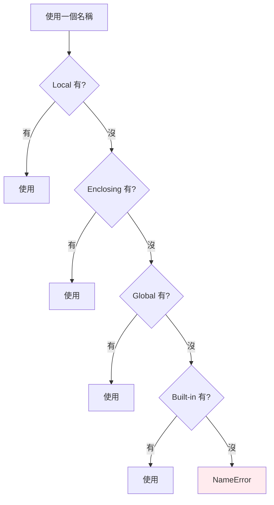

# 作用域與 LEGB 規則

> 當你用一個名稱時，Python 依 Local → Enclosing → Global → Built-in 的順序去找它；而 `global` / `nonlocal` 是你「打破」這個查找、明確指定要改哪一層的工具。

## Why（為什麼）

「這個變數是哪裡來的？」「我在函式裡改了它，為什麼外面沒變？」「為什麼 `UnboundLocalError`？」——這些都是作用域問題。Python 用一套叫 **LEGB** 的規則決定「一個名稱去哪裡找它綁定的物件」。理解它，你就能預測任何名稱的來源、避免意外遮蔽（shadowing），也能正確使用 `global`/`nonlocal`。這章也是理解 [閉包](12-closures.md) 的前置知識。

## Theory（理論：LEGB 查找順序）

當程式用到一個名稱（讀取它），Python 依序在四個作用域裡尋找，找到就停：

```text
L  Local      — 當前函式內部
E  Enclosing  — 外層（包住它的）函式
G  Global     — 模組層級（整個 .py 檔的頂層）
B  Built-in   — 內建名稱（print、len、range… 永遠可用）
```

**L → E → G → B**，由內而外。第一個找到該名稱的作用域勝出；四層都找不到就 `NameError`。

```python
x = "global"                 # G

def outer():
    x = "enclosing"          # E（對 inner 而言）
    def inner():
        x = "local"          # L
        print(x)             # 找到 L 就停 → "local"
    inner()
```

## Specification（規範：讀取 vs 賦值的關鍵差異）

LEGB 是**讀取**名稱的規則。但**賦值**有個關鍵規則：

> **在函式內對一個名稱賦值，Python 預設把它當成「該函式的區域變數（Local）」**——除非你用 `global` 或 `nonlocal` 明確聲明。

這解釋了大多數作用域困惑。兩個聲明關鍵字：

| 關鍵字 | 作用 |
|--------|------|
| `global name` | 宣告 `name` 指向 **Global（模組層級）**，函式內的賦值會改到全域 |
| `nonlocal name` | 宣告 `name` 指向 **Enclosing（最近的外層函式）**，用於巢狀函式修改外層變數 |

## Implementation（三個必懂的行為）

### 行為一：函式內「讀」全域可以，「改」就需要 `global`

```python
count = 0

def read_it():
    print(count)         # ✅ 讀：LEGB 找到 G 的 count

def try_change():
    count = count + 1    # ❌ UnboundLocalError！
```

`try_change` 為何出錯？因為函式內有 `count = ...` 的賦值，Python 就把 `count` 整個當成**區域變數**；於是 `count + 1` 用到的是「尚未賦值的區域 count」→ `UnboundLocalError`。這是新手最困惑的錯誤之一。

正解——明確聲明要改全域：

```python
count = 0

def increment():
    global count
    count += 1           # ✅ 現在改的是全域 count
```

### 行為二：`nonlocal` 改外層函式的變數

巢狀函式想修改**外層函式**（非全域）的變數，用 `nonlocal`：

```python
def make_counter():
    n = 0
    def step():
        nonlocal n       # 指向 make_counter 的 n
        n += 1
        return n
    return step

c = make_counter()
print(c(), c(), c())     # 1 2 3
```

沒有 `nonlocal` 的話，`n += 1` 會把 `n` 當 `step` 的區域變數而 `UnboundLocalError`。這正是 [閉包](12-closures.md) 保持狀態的機制。

### 行為三：遮蔽（shadowing）內建名稱

因為 B 在最外層，你可以（不小心）用區域/全域名稱遮蔽內建名稱：

```python
list = [1, 2, 3]        # 遮蔽了內建的 list！
# list("abc")          # 之後想用內建 list → TypeError: 'list' object is not callable
```

把變數命名為 `list`、`dict`、`str`、`id`、`type`、`sum` 等，會遮蔽同名內建函式，導致後續詭異錯誤。避免用內建名稱當變數名。

## Code Example（可執行的 Python 範例）

```python
# scope_demo.py
message = "全域"                    # G


def demo_legb() -> None:
    message = "外層"                # E（對 inner 而言）

    def inner() -> None:
        message = "區域"            # L
        print(f"inner 看到: {message}")   # 區域

    inner()
    print(f"outer 看到: {message}")       # 外層（inner 的賦值不影響這層）


# global 示範
counter = 0


def increment() -> None:
    global counter
    counter += 1


# nonlocal 示範
def make_accumulator():
    total = 0

    def add(x: int) -> int:
        nonlocal total
        total += x
        return total

    return add


def demo() -> None:
    demo_legb()
    print(f"全域 message 仍是: {message}")   # 全域

    increment()
    increment()
    print(f"counter = {counter}")            # 2

    acc = make_accumulator()
    print(f"累加: {acc(10)}, {acc(5)}")      # 10, 15


if __name__ == "__main__":
    demo()
```

**預期輸出**：

```pycon
$ python scope_demo.py
inner 看到: 區域
outer 看到: 外層
全域 message 仍是: 全域
counter = 2
累加: 10, 15
```

## Diagram（圖解：LEGB 查找順序）



## Best Practice（最佳實踐）

- **盡量少用 `global`**：全域可變狀態讓程式難測、難推理。優先用參數傳入、回傳值、或把狀態包進類別/閉包。
- **`nonlocal` 用於閉包的正當狀態保持**（如計數器、快取），是合理用途。
- **函式要讀全域常數沒問題**（`MAX_SIZE`），要「改」才需 `global`——而「需要改全域」通常是設計信號，考慮重構。
- **別用內建名稱當變數**：`list`、`dict`、`id`、`sum`、`type`、`input` 等，避免遮蔽。ruff 的 `A`（flake8-builtins）規則可偵測。
- **理解 `UnboundLocalError` 的成因**：函式內有賦值 → 該名稱全程被當區域 → 賦值前讀取就爆。
- **避免深巢狀函式導致的作用域混亂**：層次太深時考慮拆分或用類別。

## Common Mistakes（常見誤解）

- **`UnboundLocalError`**：函式內對某名稱賦值使它變區域變數，但在賦值前就讀它。加 `global`/`nonlocal`，或改變寫法。
- **以為函式內 `x = ...` 會改到全域 `x`**：不會，它建立區域 `x`；要改全域需 `global`。
- **把 `global`/`nonlocal` 搞混**：`global` 指模組層級、`nonlocal` 指最近外層函式；`nonlocal` 找不到外層綁定會 SyntaxError。
- **遮蔽內建名稱**：`str = "x"` 後就不能用內建 `str()`。
- **以為 for 迴圈 / if 會建立新作用域**：Python 只有**函式、類別、模組、推導式**建立作用域；`for`/`if`/`while` **不會**，迴圈變數在迴圈結束後仍存在。
- **推導式的作用域**：推導式有自己的作用域（3.x），內部變數不外洩（見 [推導式](13-comprehensions.md)）。

## Interview Notes（面試重點）

- 背得出 **LEGB**：Local → Enclosing → Global → Built-in，並知道這是**名稱查找（讀取）** 的順序。
- 能解釋**賦值使名稱變區域**的規則，以及由此產生的 **`UnboundLocalError`**。
- 清楚 **`global`（改模組層級）vs `nonlocal`（改最近外層函式）** 的差異與各自用途。
- 知道**哪些結構建立作用域**：函式、類別、模組、推導式；`for`/`if`/`while` 不建立作用域。
- 知道遮蔽內建名稱的風險，以及 `nonlocal` 在閉包中保持狀態的角色（連結 [閉包](12-closures.md)）。

---

➡️ 下一章：[閉包 closure](12-closures.md)

[⬆️ 回 Part 2 索引](README.md)
