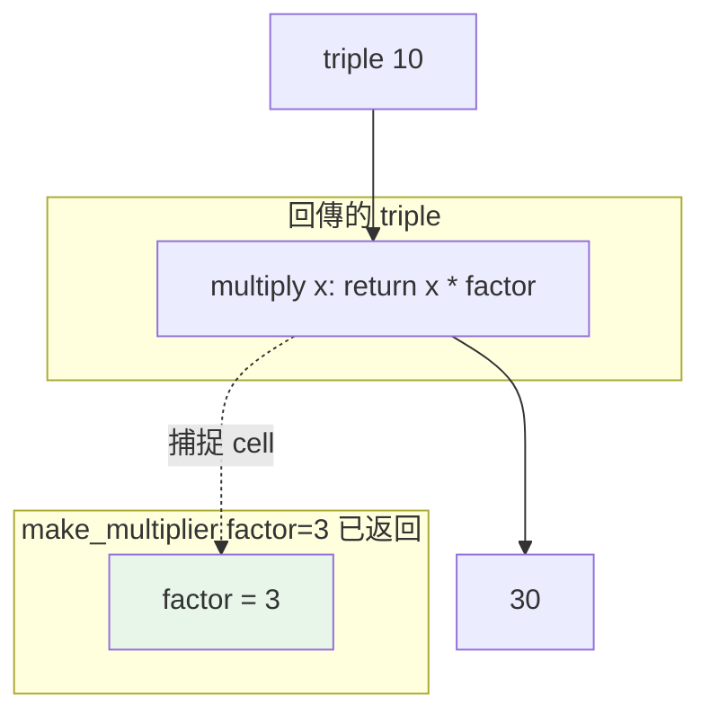

# 閉包 closure

> 閉包是「一個函式 + 它記住的外層變數」。它讓函式能攜帶狀態、產生客製化的函式，也是裝飾器運作的核心機制。

## 💡 白話導讀（建議先讀）

想像一家手搖店派外送員出門。

出發前，店長把「這一單的配方」塞進外送員的背包。
之後**就算店打烊了**，外送員在路上還是知道配方——因為他**隨身帶著**。

閉包就是這樣的「帶著記憶出門的函式」：

```python
def make_multiplier(factor):     # 店（外層函式）
    def multiply(x):             # 外送員（內層函式）
        return x * factor        # 他用到店裡的 factor
    return multiply              # 派他出門

triple = make_multiplier(3)      # 這位外送員背包裡裝著「3」
print(triple(10))                # 30 —— 店早就打烊了，他還記得
```

`make_multiplier(3)` 執行完就結束了（照理它的區域變數該消失）——但 `triple` 依然記得 `factor = 3`。
**內層函式把它用到的外層變數「打包帶走」了**——這就是閉包（closure）。

它解決什麼？「**做出一個記得某些設定的函式**」：乘 3 的函式、累加器、計數器⋯⋯不用寫類別，一個工廠函式搞定。

先打一針預防：想讓外送員**修改**背包裡的東西（如計數器 +1），要先聲明 `nonlocal`（[上一章](11-scope-legb.md)講過的「我要改的是客廳那個」）——不聲明就變成在自己房間新開變數。

最重要的是：**下一個 Part 的裝飾器，整個就是建立在閉包上**——這章是它的地基。

## 🎯 什麼時候會用到

閉包(記得外層變數的函式)在這些時候登場,你其實常用到:

- **裝飾器**:裝飾器幾乎都是閉包——內層函式記住被包的原函式
  (見 [裝飾器](../08-functional-decorators/03-decorator-basics.md))。
- **工廠函式**:用參數「客製」出一個函式再回傳——`make_multiplier(3)` 回一個「乘以 3」的函式。
- **帶狀態的回呼**:回呼需要記住一點上下文(哪個按鈕、哪個使用者)時,閉包把狀態包進去。
- **取代「只有一個方法 + 一點狀態」的小類別**:與其為了存一個變數寫一整個 class,一個閉包更輕。

**什麼時候改用類別**:狀態多、方法多、要繼承——這時閉包會變難讀,class 更合適。

一句話:**要「一個帶著少量記憶的函式」→ 閉包;帶著大量狀態與多個操作 → 類別。**

## 🔗 前端對照

Closure（閉包）在 Python 和 JavaScript **幾乎是同一個東西**——函式記得它出生時身邊的變數,帶著走。
如果你在前端寫過 closure,這章的心智模型可以直接搬過來。差別只在**改寫外層變數**的語法:

| | Python | JavaScript |
|---|--------|-----------|
| 讀取外層變數 | 直接用 | 直接用 |
| **重新賦值**外層變數 | 需要 `nonlocal x` 宣告 | 直接 `x = ...`（不需宣告） |
| 迴圈變數陷阱 | 有（late binding,常用預設參數解） | 有（`var` 有、`let` 沒有） |

一句話:**概念一模一樣**,只是 Python 要改外層變數得先 `nonlocal`（呼應它「賦值即建立區域變數」的規則）。

## Why（為什麼）

有時你想要「一個記得某些設定的函式」——例如產生一個「乘以 3 的函式」、一個「累加器」、一個「限速器」。這些都需要函式能**記住它被建立時的環境**。閉包正是這個能力：內層函式即使在外層函式已經結束後，仍能存取外層的變數。它是 [裝飾器](../08-functional-decorators/03-decorator-basics.md)、回呼、函數式風格的基礎，也是面試常考題。

## Theory（理論：什麼構成閉包）

**閉包（closure）** 成立的三個條件——「派出帶記憶的外送員」的三要素：

1. 有**巢狀函式**（函式裡定義函式）——店裡有外送員。
2. 內層函式**引用了外層函式的變數**（enclosing scope，見 [LEGB](11-scope-legb.md)）——外送員用到店裡的配方。
3. 外層函式**回傳內層函式**——派他出門。

三者成立時，內層函式就「捕捉（capture）」了它用到的外層變數，**打包帶走**——即使外層函式已經執行完畢、區域變數照理該消失，被捕捉的變數依然存活。

```python
def make_multiplier(factor):     # 外層
    def multiply(x):             # 內層
        return x * factor        # 引用外層的 factor
    return multiply              # 回傳內層

triple = make_multiplier(3)      # triple「記住」了 factor=3
print(triple(10))                # 30
```

`make_multiplier(3)` 早已返回，但 `triple` 仍記得 `factor` 是 3——這就是閉包。

## Specification（規範：閉包的內部結構）

被捕捉的變數存在函式的 `__closure__` 屬性裡（每個是一個 cell 物件），可查看：

```pycon
>>> def outer():
...     x = 42
...     def inner():
...         return x
...     return inner
>>> f = outer()
>>> f.__closure__               # 有捕捉的 cell
(<cell at 0x...: int object at 0x...>,)
>>> f.__closure__[0].cell_contents
42
>>> f.__code__.co_freevars      # 捕捉了哪些自由變數
('x',)
```

`co_freevars` 列出「自由變數（free variable）」——即在函式內使用、但不是它區域變數的名稱。這正是被閉包捕捉的東西。

## Implementation（捕捉的是「變數」不是「值」+ 修改狀態）

### 關鍵：閉包捕捉的是變數的參照，不是當下的值

這是閉包最重要也最容易錯的一點。閉包捕捉的是**變數本身（cell）**，不是「建立當下的值快照」。所以如果那個變數之後改變，閉包看到的也會變——這導致經典的**迴圈閉包陷阱**：

```python
# ❌ 陷阱
def make_funcs():
    funcs = []
    for i in range(3):
        funcs.append(lambda: i)    # 都捕捉「同一個變數 i」
    return funcs

fs = make_funcs()
print([f() for f in fs])           # [2, 2, 2] ← 全是 2！
```

為什麼全是 2？因為三個 lambda 捕捉的是**同一個變數 `i`**，而迴圈結束時 `i` 的值是 2。等到呼叫 `f()` 時，它們去讀 `i`，讀到的都是最終值 2。

**修正法一：用預設參數「凍結」當下的值**（預設值在定義時求值，見 [參數](09-parameters-args-kwargs.md)）：

```python
funcs.append(lambda i=i: i)        # 每個 lambda 有自己的預設 i
# → [0, 1, 2]
```

**修正法二：用工廠函式製造獨立作用域**：

```python
def make_func(i):
    return lambda: i               # 每次呼叫有獨立的 i
funcs = [make_func(i) for i in range(3)]
# → [0, 1, 2]
```

### 用 `nonlocal` 讓閉包保持可變狀態

閉包不只能讀外層變數，配合 `nonlocal`（見 [LEGB](11-scope-legb.md)）還能**修改**它，實現「有記憶的函式」：

```python
def make_counter():
    count = 0
    def increment():
        nonlocal count             # 沒有它會 UnboundLocalError
        count += 1
        return count
    return increment

c = make_counter()
print(c(), c(), c())               # 1 2 3（狀態被保存在閉包裡）
```

`count` 活在閉包裡，跨呼叫保持——這是不用類別就能保存狀態的輕量做法。

### 閉包 vs 類別：兩種保存狀態的方式

閉包和「有 `__init__` 存狀態的類別」能做類似的事。簡單的狀態/單一方法用閉包更輕；狀態多、方法多、需要繼承時用類別（見 [Part 4](../04-oop/README.md)）。

## Code Example（可執行的 Python 範例）

```python
# closures_demo.py
from collections.abc import Callable


def make_multiplier(factor: int) -> Callable[[int], int]:
    """回傳一個「乘以 factor」的函式（閉包捕捉 factor）。"""
    def multiply(x: int) -> int:
        return x * factor
    return multiply


def make_counter() -> Callable[[], int]:
    """用 nonlocal 保持狀態的計數器。"""
    count = 0

    def increment() -> int:
        nonlocal count
        count += 1
        return count

    return increment


def demo() -> None:
    # 1. 客製化函式
    double = make_multiplier(2)
    triple = make_multiplier(3)
    print(f"double(10)={double(10)}, triple(10)={triple(10)}")  # 20, 30

    # 2. 有狀態的計數器
    counter = make_counter()
    print(f"計數: {counter()}, {counter()}, {counter()}")        # 1 2 3

    # 3. 迴圈捕捉陷阱與修正
    bad = [lambda: i for i in range(3)]
    good = [lambda i=i: i for i in range(3)]
    print(f"陷阱: {[f() for f in bad]}")     # [2, 2, 2]
    print(f"修正: {[f() for f in good]}")    # [0, 1, 2]


if __name__ == "__main__":
    demo()
```

**預期輸出**：

```pycon
$ python closures_demo.py
double(10)=20, triple(10)=30
計數: 1, 2, 3
陷阱: [2, 2, 2]
修正: [0, 1, 2]
```

## Diagram（圖解：閉包捕捉外層變數）



## Best Practice（最佳實踐）

- **用閉包做輕量的「函式工廠」與狀態保持**：計數器、記憶化、客製化回呼，比開一個類別更精簡。
- **迴圈中建立函式要凍結變數**：用預設參數 `lambda x=x:` 或工廠函式，避免全部捕捉到最終值。
- **修改閉包變數用 `nonlocal`**；只讀則不需要。
- **狀態複雜時改用類別**：多個狀態欄位、多個方法、需要繼承/多型時，類別更清楚。
- **裝飾器就是閉包的應用**：理解閉包後再學 [裝飾器](../08-functional-decorators/03-decorator-basics.md) 會非常順。
- **注意記憶體**：閉包會讓被捕捉的物件持續存活（引用計數不歸零），大型物件被閉包長期持有要留意（見 [weakref](../10-cpython-internals/10-weakref.md)）。

## Common Mistakes（常見誤解）

- **迴圈閉包陷阱**：`[lambda: i for i in range(3)]` 全回 2，因捕捉的是變數 `i` 非當下值。用預設參數或工廠修正。
- **以為閉包快照了「值」**：它捕捉的是**變數（cell）**，之後變數改變閉包也看到新值。
- **忘了 `nonlocal` 導致 `UnboundLocalError`**：閉包內對捕捉變數賦值（`count += 1`）需 `nonlocal`。
- **把閉包和全域變數混用**：想保存狀態卻用了 `global`，污染全域；閉包/類別更乾淨。
- **不知道閉包會延長物件壽命**：造成非預期的記憶體滯留。
- **過度用閉包做複雜狀態機**：可讀性下降，該用類別。

## Interview Notes（面試重點）

- 能定義閉包：**巢狀函式 + 引用外層變數 + 回傳內層**，並說明「外層函式返回後，被捕捉的變數仍存活」。
- **迴圈閉包陷阱是高頻考題**：能解釋「捕捉的是變數不是值、迴圈結束後變數是最終值」，並寫出兩種修正（預設參數、工廠函式）。
- 知道用 **`nonlocal`** 讓閉包保持可變狀態（計數器範例）。
- 能說出閉包的內部（`__closure__`、cell、`co_freevars`）。
- 能比較**閉包 vs 類別**保存狀態的取捨，並知道**裝飾器建立在閉包之上**。

---

➡️ 下一章：[推導式 comprehension](13-comprehensions.md)

[⬆️ 回 Part 2 索引](README.md)
