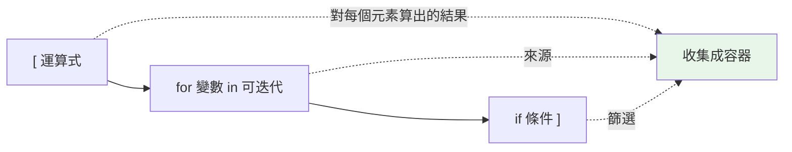

# 推導式 comprehension

> 推導式是「用一行運算式建立容器」的 Pythonic 招牌——它比 `for` + `append` 更快、更清楚，但寫太複雜就會反過來變成災難。

## 💡 白話導讀（建議先讀）

做一份「0 到 4 的平方」清單，兩種說法：

**命令式**——一步步教廚房怎麼做：

```python
squares = []
for x in range(5):
    squares.append(x * x)
```

**推導式**——直接描述你要的成品：

```python
squares = [x * x for x in range(5)]
```

讀法有訣竅，**從 for 讀起再回頭**：「對 range(5) 裡的每個 x（for 部分），我要 x*x（開頭的運算式）」。
加篩選就在尾巴：`[x*x for x in range(5) if x % 2 == 0]`——「⋯⋯其中只要偶數的」。

為什麼推薦？三個理由：**更短、更快（比 append 迴圈快）、意圖一眼可見**（「我在建一個清單」開頭就知道）。

同一招有四種容器版本：`[...]` 建 list、`{k: v ...}` 建 dict、`{...}` 建 set、`(...)` 是[惰性的生成器](../07-iterators-generators/04-generator-expression.md)。

唯一的警告：**推導式是宣告「結果」的工具，不是炫技場**。
巢狀兩層以上、或塞了複雜邏輯──寧可退回普通 for 迴圈。一行寫完但沒人看得懂，是負分。

## Why（為什麼）

「建立一個新的 list/dict/set，內容由某個序列轉換或篩選而來」是極高頻的需求。用傳統的「先建空容器、迴圈、append」要三四行；推導式一行就完成，而且**更快**（省去反覆的方法查找與呼叫）、更貼近「我想要什麼」的宣告式表達。這是最能代表 Pythonic 風格的語法之一，面試與日常都會大量用到。這章講清楚四種推導式、它們的效能與可讀性邊界，以及和生成器表達式的關鍵差異。

## Theory（理論：宣告「結果長什麼樣」）

推導式把「怎麼一步步建」變成「**結果是什麼**」的宣告式描述。基本結構：

```text
[ 運算式 for 變數 in 可迭代物件 if 條件 ]
   ↑輸出     ↑迭代                ↑篩選(可選)
```

讀法（從 for 讀起再回頭）：「對可迭代物件裡每個（通過條件的）變數，算出運算式，收集成 list」。

對應的命令式寫法：

```python
# 推導式
squares = [x * x for x in range(5)]

# 等價的命令式
squares = []
for x in range(5):
    squares.append(x * x)
```

兩者結果相同，但推導式更短、更快、且「意圖」一眼可見——開頭的 `[` 就宣告了「我在建一個 list」。

## Specification（規範：四種推導式）

| 種類 | 語法 | 產生 |
|------|------|------|
| list | `[x for x in it]` | `list` |
| set | `{x for x in it}` | `set`（自動去重） |
| dict | `{k: v for k, v in it}` | `dict` |
| generator | `(x for x in it)` | **生成器**（惰性，非 list！） |

```python
[x * 2 for x in range(5)]                    # [0, 2, 4, 6, 8]
{x % 3 for x in range(10)}                   # {0, 1, 2}
{w: len(w) for w in ["hi", "hello"]}         # {'hi': 2, 'hello': 5}
(x * 2 for x in range(5))                     # <generator object ...>（惰性）
```

⚠️ `{}` 是空 **dict** 不是空 set；`{x for x in ...}` 才是 set 推導式。

## Implementation（篩選、巢狀、與陷阱）

### 加條件：`if` 篩選 vs 條件運算式

**在 `for` 後的 `if` 是篩選**（決定「要不要這個元素」）：

```python
evens = [x for x in range(10) if x % 2 == 0]        # [0, 2, 4, 6, 8]
```

**在運算式位置的 `if/else` 是轉換**（決定「輸出什麼」，必須有 else）：

```python
labels = ["偶" if x % 2 == 0 else "奇" for x in range(4)]   # ['偶','奇','偶','奇']
```

兩者可並用：

```python
[x * 2 for x in range(10) if x % 2 == 0]            # 先篩選再轉換
```

記法：**篩選的 `if` 在尾巴、且沒有 else；轉換的 `if/else` 在頭、必有 else。**

### 巢狀推導式：順序照「由外而內的 for」

多層 `for` 的順序和寫巢狀迴圈一致（左到右 = 外到內）：

```python
# 攤平二維 list
matrix = [[1, 2], [3, 4], [5, 6]]
flat = [x for row in matrix for x in row]           # [1, 2, 3, 4, 5, 6]
# 等價於：
# for row in matrix:
#     for x in row:
#         flat.append(x)
```

超過兩層通常就該改回明確的迴圈——可讀性優先。

### 推導式有自己的作用域（不外洩）

Python 3 的推導式在**獨立作用域**執行，迴圈變數不會洩漏到外面（這點和 Python 2 不同，也和一般 `for` 迴圈不同）：

```pycon
>>> [i for i in range(5)]
[0, 1, 2, 3, 4]
>>> i
Traceback (most recent call last):
NameError: name 'i' is not defined     # i 沒有外洩！
```

### 關鍵差異：list 推導式 vs 生成器表達式

`[...]` 立刻建出**整個 list**（佔記憶體）；`(...)` 建的是**生成器**，惰性求值、一次產一個、不佔記憶體（見 [生成器表達式](../07-iterators-generators/04-generator-expression.md)）：

```python
sum([x * x for x in range(10_000_000)])    # 先建千萬元素 list，佔大量記憶體
sum(x * x for x in range(10_000_000))      # 生成器，逐一產生，幾乎不佔記憶體
```

處理大量資料、或結果只需遍歷一次（如餵給 `sum`/`any`/`max`）時，**用生成器表達式**更省記憶體。函式呼叫時可省略多餘括號：`sum(x for x in it)`。

## Code Example（可執行的 Python 範例）

```python
# comprehensions_demo.py
def demo() -> None:
    # 1. list：篩選 + 轉換
    squares_of_evens = [x * x for x in range(10) if x % 2 == 0]
    print(f"偶數平方: {squares_of_evens}")           # [0, 4, 16, 36, 64]

    # 2. 轉換用的 if/else（在運算式位置）
    parity = ["偶" if x % 2 == 0 else "奇" for x in range(5)]
    print(f"奇偶: {parity}")

    # 3. dict 推導式：反轉一個 dict
    prices = {"apple": 35, "banana": 10}
    inverted = {v: k for k, v in prices.items()}
    print(f"反轉: {inverted}")

    # 4. set 推導式：去重
    words = ["hi", "HI", "hello"]
    lengths = {len(w) for w in words}
    print(f"長度集合: {lengths}")                     # {2, 5}

    # 5. 巢狀：攤平
    matrix = [[1, 2], [3, 4]]
    flat = [x for row in matrix for x in row]
    print(f"攤平: {flat}")

    # 6. 生成器表達式省記憶體
    total = sum(x * x for x in range(1000))
    print(f"平方和: {total}")


if __name__ == "__main__":
    demo()
```

**預期輸出**：

```pycon
$ python comprehensions_demo.py
偶數平方: [0, 4, 16, 36, 64]
奇偶: ['偶', '奇', '偶', '奇', '偶']
反轉: {35: 'apple', 10: 'banana'}
長度集合: {2, 5}
攤平: [1, 2, 3, 4]
平方和: 332833500
```

## Diagram（圖解：推導式的組成）



## Best Practice（最佳實踐）

- **簡單的「轉換 / 篩選」用推導式**：比 `for`+`append` 更快更清楚，是 Pythonic 首選。
- **複雜邏輯回歸明確迴圈**：多層巢狀、含副作用、需要 try/except 時，推導式會變難讀——用 `for`。
- **大資料或只遍歷一次用生成器表達式** `(...)`：省記憶體；`sum`/`any`/`all`/`max`/`join` 等場合尤佳。
- **別為了副作用用推導式**：`[print(x) for x in xs]` 是反模式（建了個沒用的 list）；純副作用用 `for`。
- **善用 dict/set 推導式**：反轉 dict、去重、建索引都很自然。
- **一行別塞太多條件**：可讀性 > 炫技；看不懂就拆開。

## Common Mistakes（常見誤解）

- **`{}` 當空 set**：它是空 dict；空 set 用 `set()`。
- **混淆兩種 `if`**：篩選的 `if` 在尾、無 else；轉換的 `if/else` 在頭、必有 else。放錯位置會 SyntaxError 或語意錯。
- **以為 `(x for x in it)` 是 tuple**：它是**生成器**，不是 tuple；要 tuple 用 `tuple(...)`。
- **用推導式做純副作用**：`[f(x) for x in xs]` 只為呼叫 `f`，浪費記憶體且不 Pythonic，用 `for`。
- **巢狀推導式順序寫反**：`[x for x in row for row in matrix]` 會 NameError；順序是由外到內。
- **對超大序列用 list 推導式**：一次建出佔滿記憶體，改用生成器表達式。
- **期待迴圈變數外洩**：推導式作用域獨立，`i` 不會留在外面。

## Interview Notes（面試重點）

- 能寫出四種推導式（list/set/dict/generator）並說出各自產生的型別，特別是 **`(...)` 是生成器不是 tuple**。
- 能區分**篩選 `if`（尾、無 else）與轉換 `if/else`（頭、有 else）**。
- 說得出**推導式比 `for`+`append` 快**的原因（省去重複的屬性查找與 `append` 呼叫、由直譯器最佳化）。
- **list 推導式 vs 生成器表達式**：前者立即佔記憶體、後者惰性省記憶體，能說出何時該用哪個。
- 知道**推導式有獨立作用域**、迴圈變數不外洩，以及巢狀推導式的 for 順序。

---

➡️ 下一章：[海象運算子 := (assignment expression)](14-walrus-operator.md)

[⬆️ 回 Part 2 索引](README.md)
