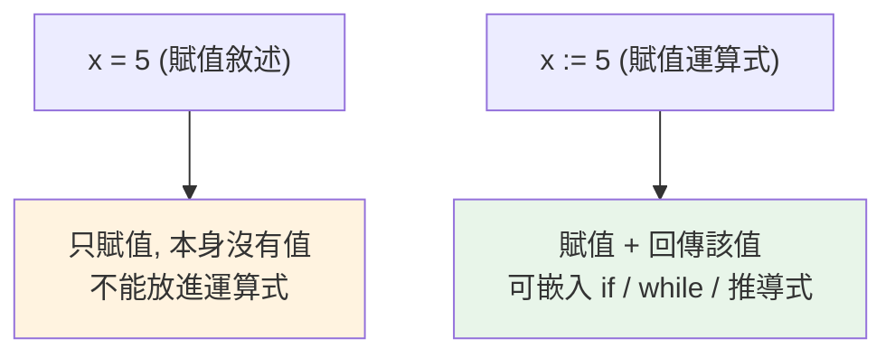

# 海象運算子 := (assignment expression)

> `:=` 讓你「一邊賦值、一邊把值用掉」——在 while 條件、推導式、if 判斷裡消除重複計算。但它是把雙面刃，用錯地方反而更難讀。

## Why（為什麼）

有些場景你會同時想「算一個值」、「把它存起來之後用」、「並在當下的條件裡用它」。傳統寫法得把賦值和判斷拆成兩步，或重複計算兩次。Python 3.8 引入**海象運算子 `:=`（assignment expression，賦值運算式，PEP 572）**，讓賦值能出現在運算式裡，一步到位。名字來自 `:=` 長得像海象的眼睛和牙齒 🦭。它不是必需品，但用在對的地方能讓程式更簡潔、避免重複。

## Theory（理論：賦值敘述 vs 賦值運算式）

Python 一直嚴格區分兩件事：

- **賦值敘述（statement）**：`x = 5`。是「敘述」，本身**沒有值**，不能放進運算式裡（`if (x = f()):` 在 Python 是語法錯誤——這其實是刻意防止 `=`/`==` 打錯的設計）。
- **賦值運算式（expression）**：`x := 5`。用 `:=`，它**既賦值、又回傳被賦的值**，所以可以嵌在運算式中。

```pycon
>>> (n := 10)        # 賦值給 n，同時整個運算式的值是 10
10
>>> n
10
```

一句話：`:=` = 「賦值 + 順便把值交出去用」。

## Specification（規範：語法與限制）

```python
name := expression
```

- 把 `expression` 的值綁定到 `name`，**整個 `:=` 運算式的值就是該值**。
- 常需用括號包起來（尤其在 `if`/`while` 條件或和其他運算子並用時），以免語意含糊。
- **不能在模組頂層當獨立敘述**：`x := 5` 直接寫會 SyntaxError；要就寫 `(x := 5)` 或直接用 `x = 5`。
- 綁定的名稱屬於**包含它的作用域**（在推導式裡用 `:=` 綁的變數會洩漏到外層——這是它與推導式迴圈變數的重要差異，見下）。

## Implementation（三大實用場景）

### 場景一：while 迴圈讀取，消除重複

經典的「讀到 sentinel 才停」迴圈，傳統寫法要把讀取寫兩次（迴圈前、迴圈尾）：

```python
# ❌ 傳統：重複的 read 呼叫
chunk = file.read(1024)
while chunk:
    process(chunk)
    chunk = file.read(1024)      # 重複！

# ✅ 海象：一處讀取
while chunk := file.read(1024):
    process(chunk)
```

`chunk := file.read(1024)` 每輪讀取、賦值、並把值交給 `while` 判斷真假——讀取只寫一次。

### 場景二：if 判斷同時保留結果

當你要「算一次、判斷它、成立時又要用它」：

```python
# ❌ 傳統：要嘛算兩次，要嘛多一行
if len(data) > 10:
    print(f"太長了：{len(data)}")      # len 算了兩次

# ✅ 海象
if (n := len(data)) > 10:
    print(f"太長了：{n}")              # 只算一次，n 留著用
```

搭配正規表達式尤其實用：

```python
import re
if (m := re.search(r"\d+", text)) is not None:
    print(f"找到數字：{m.group()}")     # m 在 if 成立時可直接用
```

### 場景三：推導式中避免重複計算

推導式裡若「篩選」和「輸出」都要用同一個昂貴計算的結果，`:=` 可只算一次：

```python
# ❌ f(x) 算了兩次（篩選一次、輸出一次）
results = [f(x) for x in data if f(x) > 0]

# ✅ 只算一次
results = [y for x in data if (y := f(x)) > 0]
```

⚠️ 注意：這裡 `y` 會**洩漏到推導式外層作用域**（和一般推導式迴圈變數不外洩相反，見 [推導式](13-comprehensions.md)）——這是 `:=` 的刻意設計，但也可能造成意外。

## Code Example（可執行的 Python 範例）

```python
# walrus_demo.py
import re


def read_chunks(text: str, size: int) -> list[str]:
    """用海象運算子分塊讀取。"""
    chunks = []
    pos = 0

    def next_chunk() -> str:
        nonlocal pos
        piece = text[pos : pos + size]
        pos += size
        return piece

    while chunk := next_chunk():        # 讀到空字串（falsy）就停
        chunks.append(chunk)
    return chunks


def demo() -> None:
    # 1. while + 海象
    print(read_chunks("abcdefg", 3))         # ['abc', 'def', 'g']

    # 2. if + 海象保留結果
    data = [1, 2, 3, 4, 5]
    if (total := sum(data)) > 10:
        print(f"總和 {total} 超過門檻")        # 只算一次 sum

    # 3. 正規表達式
    if (m := re.search(r"\d+", "訂單 #12345")) is not None:
        print(f"訂單編號: {m.group()}")

    # 4. 推導式中避免重複計算
    def expensive(x: int) -> int:
        return x * x - 4

    kept = [y for x in range(5) if (y := expensive(x)) > 0]
    print(f"保留: {kept}")                    # [5, 12]（x=3,4）


if __name__ == "__main__":
    demo()
```

**預期輸出**：

```pycon
$ python walrus_demo.py
['abc', 'def', 'g']
總和 15 超過門檻
訂單編號: 12345
保留: [5, 12]
```

## Diagram（圖解：= 敘述 vs := 運算式）



## Best Practice（最佳實踐）

- **用在能真正消除重複或多餘一行的地方**：while 讀取迴圈、if + 保留結果、推導式避免重算——這些是它的主場。
- **加括號讓語意清楚**：`if (n := f()) > 0:` 比 `if n := f() > 0:` 不易誤讀（後者因優先順序其實是 `n := (f() > 0)`）。
- **別為了「少一行」硬用**：如果拆成普通賦值 + 判斷更清楚，就別用 `:=`。可讀性優先。
- **注意推導式中 `:=` 綁定會洩漏到外層**：這點與一般推導式變數不同，別依賴或誤用。
- **需要 3.8+**：確認目標版本。

## Common Mistakes（常見誤解）

- **在頂層寫 `x := 5`**：SyntaxError。獨立賦值用 `x = 5`；`:=` 是給「運算式情境」用的。
- **優先順序誤解**：`n := f() > 0` 是 `n := (f() > 0)`（把布林賦給 n），多半不是你要的；要 `(n := f()) > 0`。
- **濫用導致難讀**：把好幾個 `:=` 塞進一個複雜運算式，比拆開還難懂。
- **忘了推導式中 `:=` 變數會外洩**：`[y for x in xs if (y := f(x))]` 之後 `y` 仍存在，可能覆蓋外層同名變數。
- **和 `==` 混淆**：`:=` 是賦值運算式、`==` 是相等比較、`=` 是賦值敘述，三者別搞混。

## Interview Notes（面試重點）

- 能說出 `:=` 是 **assignment expression（賦值運算式，3.8 / PEP 572）**：**賦值的同時回傳該值**，可嵌入運算式；而 `=` 是敘述、沒有值。
- 知道為何 Python 原本禁止在 `if` 裡用 `=`（防 `=`/`==` 誤植），`:=` 是刻意用不同符號補上這能力。
- 舉得出主要場景：**while 讀取迴圈去重複、if + 保留計算結果（含 regex）、推導式避免重算**。
- 知道**優先順序需加括號**、**推導式中 `:=` 綁定會洩漏到外層作用域**。
- 有分寸：知道它是可讀性的雙面刃，不該濫用。

---

➡️ 下一章：[浮點誤差、decimal 與 fractions](15-float-precision-decimal.md)

[⬆️ 回 Part 2 索引](README.md)
