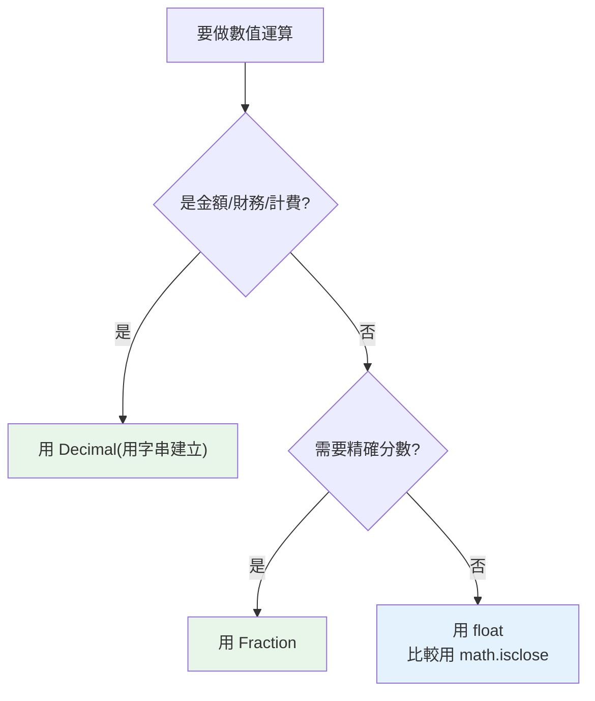

# 浮點誤差、decimal 與 fractions

> `0.1 + 0.2 != 0.3` 不是 Python 的錯，是二進位浮點的本質。搞懂它，並知道何時該改用 `Decimal`（金額）或 `Fraction`（精確分數），是每個工程師的基本功。

## 💡 白話導讀（建議先讀）

先看這個嚇新手的畫面：

```pycon
>>> 0.1 + 0.2
0.30000000000000004
```

**這不是 Python 的 bug。** 用一個你早就懂的事實解釋：

十進位寫不完 1/3——`0.3333⋯⋯` 無限循環，你只能在某處砍斷、存個近似值。

二進位也有它寫不完的數，而 **0.1 恰好就是**：二進位的 0.1 是 `0.00011001100110011⋯⋯` 無限循環。
電腦的 float 只有 64 格（[第 2 章](02-numbers.md)那把尺），只能存「最接近 0.1 的近似值」。
兩個近似值相加，零頭就露出來了。**所有語言都一樣**（C、Java、JS 通通如此）——這是二進位的數學，不是誰的錯。

實務上記三條就夠：

1. **比較浮點數不要用 `==`**——用 `math.isclose(a, b)`（問「夠近嗎」而不是「一模一樣嗎」）。
2. **算錢一律用 `Decimal`**——十進位計算機，`Decimal("0.1") + Decimal("0.2")` 就是精確的 `0.3`。注意要**用字串建立**（`Decimal(0.1)` 等於把誤差抱進來）。
3. 需要精確分數（1/3 就是 1/3）用 `Fraction`。

一句話：**日常計算 float 夠用,錢和帳務交給 Decimal。**

## Why（為什麼）

「用 `float` 存金額」是新手最常犯、後果最嚴重的錯誤之一——累加幾筆帳目就會出現 `0.30000000000000004` 這種鬼值，對帳對不平。這不是 bug，而是所有使用 IEEE 754 的語言（C、Java、JavaScript…）共有的物理限制。理解浮點為何不精確、以及 Python 提供的精確替代方案（`decimal`、`fractions`），能讓你在金融、計費、科學計算等場合做出正確選擇。這也是面試高頻題。

## Theory（理論：為什麼二進位存不下 0.1）

`float` 是 **IEEE 754 雙精度（64 位元）** 二進位浮點數。問題出在**進位制轉換**：

就像十進位無法精確表示 `1/3`（0.3333⋯⋯無限循環），**二進位也無法精確表示某些十進位小數**——`0.1` 在二進位是 `0.0001100110011⋯⋯`（無限循環），電腦只能存一個**最接近的近似值**。

```pycon
>>> 0.1 + 0.2
0.30000000000000004
>>> format(0.1, ".20f")        # 看 0.1 真正存的值
'0.10000000000000000555'
```

`0.1` 存進去的那一刻就帶著微小誤差；兩個近似值相加，誤差浮現。
**這與語言無關**——是二進位浮點的數學本質，C/Java/JS 全都如此。

## Specification（規範：三種精確度取捨）

| 型別 | 精確度 | 速度 | 適用 |
|------|--------|------|------|
| `float` | 近似（二進位） | 最快 | 科學計算、繪圖、一般數值 |
| `decimal.Decimal` | 十進位精確 | 較慢 | **金額、財務、計費** |
| `fractions.Fraction` | 有理數完全精確 | 慢 | 需要精確分數運算 |

核心原則：**需要「十進位精確」（尤其錢）用 `Decimal`；需要「分數精確」用 `Fraction`；其餘用 `float`。**

## Implementation（正確比較 + 兩個精確型別）

### float 的正確比較：`math.isclose`，不要用 `==`

```pycon
>>> 0.1 + 0.2 == 0.3
False
>>> import math
>>> math.isclose(0.1 + 0.2, 0.3)
True
```

`math.isclose(a, b)` 判斷兩數是否「足夠接近」（可設定相對/絕對容差 `rel_tol`/`abs_tol`）。**任何 float 比較都該用它**，別用 `==`。

### decimal.Decimal：十進位精確運算

`Decimal` 以十進位儲存，**沒有** `0.1` 的近似問題：

```pycon
>>> from decimal import Decimal
>>> Decimal("0.1") + Decimal("0.2")
Decimal('0.3')
>>> Decimal("0.1") + Decimal("0.2") == Decimal("0.3")
True
```

🔑 **關鍵：一定用「字串」建立 `Decimal`，不要用 float**：

```pycon
>>> Decimal(0.1)              # ❌ 從 float 建 → 把 float 的誤差也帶進來
Decimal('0.1000000000000000055511151231257827021181583404541015625')
>>> Decimal("0.1")           # ✅ 從字串建 → 精確
Decimal('0.1')
```

`Decimal` 還能控制精度與捨入規則（財務常需明確的捨入）：

```pycon
>>> from decimal import Decimal, ROUND_HALF_UP
>>> price = Decimal("19.99")
>>> tax = price * Decimal("0.05")
>>> tax.quantize(Decimal("0.01"), rounding=ROUND_HALF_UP)   # 量化到分，四捨五入
Decimal('1.00')
```

`quantize` + 明確的 `rounding` 是財務計算避免爭議的標準做法（注意 `float` 的 `round` 用銀行家捨入，見 [數值型別](02-numbers.md)）。

### fractions.Fraction：有理數完全精確

需要精確分數運算（無任何浮點/捨入誤差）用 `Fraction`：

```pycon
>>> from fractions import Fraction
>>> Fraction(1, 3) + Fraction(1, 3) + Fraction(1, 3)
Fraction(1, 1)               # 精確等於 1，不是 0.999...
>>> Fraction("0.1") + Fraction("0.2")
Fraction(3, 10)
>>> float(Fraction(3, 10))   # 需要時再轉回 float
0.3
```

## Code Example（可執行的 Python 範例）

```python
# precision_demo.py
import math
from decimal import ROUND_HALF_UP, Decimal
from fractions import Fraction


def float_trap() -> bool:
    """展示浮點陷阱。"""
    return 0.1 + 0.2 == 0.3          # False


def money_total(prices: list[str]) -> Decimal:
    """用 Decimal 精確加總金額（以字串輸入避免誤差）。"""
    return sum((Decimal(p) for p in prices), start=Decimal("0"))


def with_tax(price: str, rate: str) -> Decimal:
    """含稅並量化到分，四捨五入。"""
    total = Decimal(price) * (Decimal("1") + Decimal(rate))
    return total.quantize(Decimal("0.01"), rounding=ROUND_HALF_UP)


def demo() -> None:
    # 1. 浮點陷阱與正確比較
    print(f"0.1 + 0.2 == 0.3 ? {float_trap()}")                 # False
    print(f"math.isclose ? {math.isclose(0.1 + 0.2, 0.3)}")     # True

    # 2. Decimal 精確金額
    total = money_total(["19.99", "5.01", "0.50"])
    print(f"金額總和: {total}")                                 # 25.50

    # 3. 含稅量化
    print(f"含稅價: {with_tax('19.99', '0.05')}")               # 20.99

    # 4. Fraction 精確分數
    third_sum = Fraction(1, 3) + Fraction(1, 3) + Fraction(1, 3)
    print(f"1/3 * 3 = {third_sum}")                             # 1


if __name__ == "__main__":
    demo()
```

**預期輸出**：

```pycon
$ python precision_demo.py
0.1 + 0.2 == 0.3 ? False
math.isclose ? True
金額總和: 25.50
含稅價: 20.99
1/3 * 3 = 1
```

## Diagram（圖解：該用哪種數值型別）



## Best Practice（最佳實踐）

- **金額一律用 `Decimal`**，且**用字串建立**（`Decimal("0.1")`），別用 float 建。財務捨入用 `quantize` + 明確 `rounding`。
- **float 比較永遠用 `math.isclose`**，不要 `==`。
- **需要精確分數用 `Fraction`**；最後要輸出/繪圖時再 `float(...)`。
- **顯示 float 用格式化控制位數**：`f"{x:.2f}"`，別直接印出滿是尾數的原始值。
- **資料庫存金額用整數（分）或 DECIMAL 欄位**，避免存成浮點；讀出後用 `Decimal` 運算。
- **科學計算 / numpy 場合仍用 float**：那裡在意速度與向量化，且已知並接受浮點特性（見 [Part 17](../17-data-science/README.md)）。

## Common Mistakes（常見誤解）

- **用 float 存錢**：累加/相乘後對不平帳。用 `Decimal`。
- **`Decimal(0.1)` 用 float 建立**：把 float 誤差帶進來，等於白用；要 `Decimal("0.1")`。
- **用 `==` 比較 float**：幾乎必錯，用 `math.isclose`。
- **以為 `0.1+0.2 != 0.3` 是 Python bug**：是 IEEE 754 的本質，所有相同底層的語言皆然。
- **忘了指定財務捨入規則**：不同 `rounding` 結果不同；財務要明確用 `ROUND_HALF_UP` 等並 `quantize`。
- **混用 `Decimal` 與 `float` 運算**：`Decimal("1") + 0.1` 會 TypeError（刻意禁止，避免誤差滲入）；要嘛全 Decimal，要嘛明確轉換。
- **對 `Fraction` 的效能無感**：它精確但慢，別在效能熱點大量用。

## Interview Notes（面試重點）

- 能解釋 **`0.1 + 0.2 != 0.3` 的根因**：IEEE 754 二進位無法精確表示某些十進位小數，是所有浮點語言共通，不是 Python bug。
- 知道**正確比較 float 用 `math.isclose`**。
- 知道**金額用 `Decimal`**，且**必須用字串建立**（用 float 建會帶入誤差），並知道 `quantize` + 明確 `rounding` 的財務捨入。
- 知道 **`Fraction`** 提供完全精確的有理數運算。
- 能說出三者取捨：`float`（快、近似）、`Decimal`（十進位精確、財務）、`Fraction`（分數精確）。
- 加分：知道 `Decimal` 與 `float` 不能直接混算（TypeError），以及資料庫存金額的正確做法。

---

➡️ 下一章：[字元編碼與 bytes/str](16-encoding-bytes.md)

[⬆️ 回 Part 2 索引](README.md)
