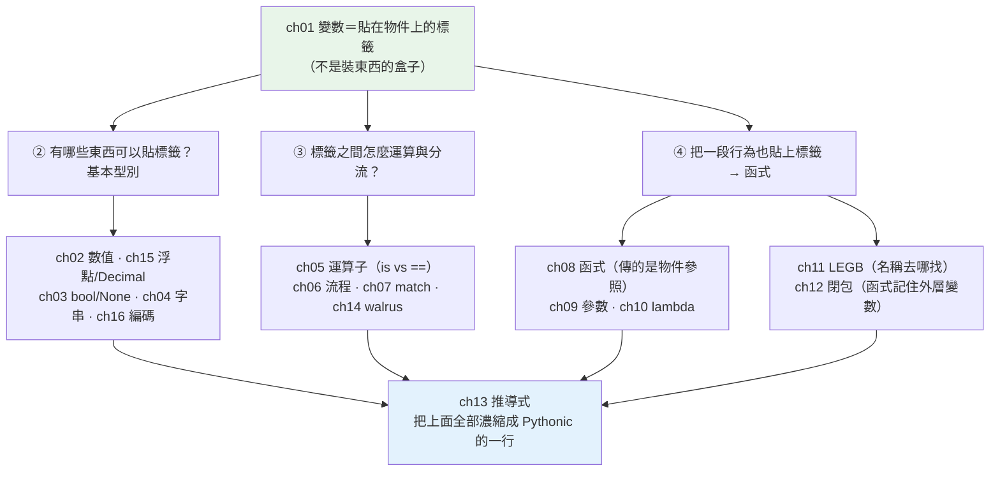

# Part 2 統整：語言基礎全貌

> 把這 16 章串成一張圖——它們其實都在講**同一件事**：Python 裡的「變數」不是盒子，是標籤。

## 🗺️ 知識地圖（這 16 章怎麼串起來）

Part 2 看似瑣碎（型別、運算子、迴圈、函式……），但**有一個核心觀念貫穿全部**——
[ch01 的「變數是標籤」](01-dynamic-typing.md)。它一旦立住，後面十五章的「怪行為」全部變成理所當然：



**一句話串起來**：
先把「**變數是標籤、值是物件**」這個心智模型建好（ch01）——
於是你懂了為什麼 `a is b` 和 `a == b` 是兩回事（ch05）、
為什麼把 list 傳進函式「會被改到」（ch08）、
為什麼可變的預設值是地雷（ch09）、
為什麼閉包抓到的是**變數本身**而不是當下的值（ch12）。

型別章（ch02–04、15、16）在講「**能貼標籤的東西有哪些脾氣**」——
`int` 無限大、`float` 有精度陷阱、`str` 不可變、`bytes` 和 `str` 是兩種東西。

流程與函式章（ch05–12）在講「**怎麼指揮這些標籤**」。
最後 ch13 推導式把這一切濃縮成 Python 的招牌寫法。

## ⚡ 速查表（什麼情境用什麼）

| 情境 | 怎麼做 | 章節 |
|------|--------|------|
| 要「整除」而不是小數 | `//`（`/` **永遠回 `float`**，即使整除）；取餘數 `%` | [ch02](02-numbers.md) |
| 處理超大整數（階乘、雜湊、密碼學） | 直接算——**Python 的 `int` 沒有上限**，不會溢位 | [ch02](02-numbers.md) |
| 判斷「是不是同一個物件」 | `is`（**只用於 `None`／單例**）；比較值一律用 `==` | [ch05](05-operators.md) |
| 想讓函式收任意多參數 | `*args`（位置）／`**kwargs`（關鍵字）；強制關鍵字用 `*` 分隔 | [ch09](09-parameters-args-kwargs.md) |
| 檢查是不是 `None` | `if x is None:`（**不要寫 `if x == None`**） | [ch03](03-booleans-and-none.md) |
| 判斷空值／空容器 | `if not items:`（善用 truthiness，別寫 `len(items) == 0`） | [ch03](03-booleans-and-none.md) |
| 算錢、要求精確 | **`Decimal`**（絕不用 `float`） | [ch15](15-float-precision-decimal.md) |
| 比較浮點數 | `math.isclose(a, b)`，不要用 `==` | [ch15](15-float-precision-decimal.md) |
| 組字串 | **f-string**；迴圈裡累積用 `"".join(parts)`，不要 `+=` | [ch04](04-strings.md) |
| 函式參數的預設值想給空 list/dict | 預設寫 `None`，進函式再建（**絕不寫 `= []`**） | [ch09](09-parameters-args-kwargs.md) |
| 依「資料的結構」分流 | `match`（要解構才划算；純比相等用 `if/elif`） | [ch07](07-match-statement.md) |
| 想邊算邊判斷、避免重算 | 海象 `:=`（節制使用） | [ch14](14-walrus-operator.md) |
| 從一個序列造出另一個序列 | 推導式 `[f(x) for x in xs if cond]` | [ch13](13-comprehensions.md) |
| 臨時傳一個小行為進去 | `lambda`（`sorted(key=...)`）；長了就改用 `def` | [ch10](10-lambda.md) |
| 在內層函式改到外層變數 | `nonlocal`（外層函式）／`global`（模組層，盡量別用） | [ch11](11-scope-legb.md) |
| 讀檔出現 `UnicodeDecodeError` | 明確指定 `encoding="utf-8"`；分清 `str`（文字）與 `bytes`（位元組） | [ch16](16-encoding-bytes.md) |

## 🔑 核心心智模型（帶得走的幾句話）

- **變數是標籤，不是盒子。** `a = b` 不是「複製一份給 a」，而是「**再貼一張標籤到同一個物件上**」。
  這一句解釋了 Part 2 大半的「怪事」，也是 [Part 3 可變性](../03-data-structures/06-mutability.md)
  與 [Part 10 引用計數](../10-cpython-internals/03-reference-counting.md)的地基。
- **函式傳的是「物件的參照」。** 所以傳進去的 list**改得到**（它是同一個物件），
  但重新賦值 `x = [...]` **改不到**（那只是把函式內的標籤撕下來貼到別處）。
- **「預設值只在定義函式時算一次」。** 所以 `def f(bucket=[])` 的那個 list **整個程式共用一份**——
  這是 Python 最惡名昭彰的陷阱。
- **`float` 是二進位小數，天生無法精確表示 0.1。** 不是 Python 的 bug，是 IEEE 754 的本質。
  **金額一律 `Decimal`。**
- **`str` 是文字，`bytes` 是位元組。** 兩者之間靠**編碼（encode）／解碼（decode）** 轉換，
  搞混就是 `UnicodeDecodeError`。

## 🛠️ 小實作：Part 2 的四大經典陷阱，一次看懂

這支腳本把本 Part 最容易踩的四個坑各示範一次——**每一個坑，都是「變數是標籤」這個模型的直接推論**。

```python
# fundamentals_traps.py —— Part 2 的四大經典陷阱
from __future__ import annotations

from decimal import Decimal


# 陷阱 1（ch01 標籤 + ch09 參數）：可變的預設值「只建立一次」，全程式共用
def bad_append(item: str, bucket: list[str] = []) -> list[str]:  # noqa: B006
    bucket.append(item)
    return bucket


def good_append(item: str, bucket: list[str] | None = None) -> list[str]:
    if bucket is None:          # 每次呼叫才建新的
        bucket = []
    bucket.append(item)
    return bucket


# 陷阱 2（ch05）：is 比「同一個物件」，== 比「值」
def is_vs_eq() -> tuple[bool, bool]:
    a = [1, 2]
    b = [1, 2]                  # 值一樣，但是「另一個」物件
    return a == b, a is b


# 陷阱 3（ch02 / ch15）：二進位浮點無法精確表示 0.1
def float_trap() -> tuple[bool, bool]:
    return (
        0.1 + 0.2 == 0.3,
        Decimal("0.1") + Decimal("0.2") == Decimal("0.3"),
    )


# 陷阱 4（ch11 LEGB + ch12 閉包）：閉包抓的是「變數」，不是當下的值
def late_binding() -> list[int]:
    funcs = [lambda: i for i in range(3)]      # 三個 lambda 抓到同一個 i
    return [f() for f in funcs]


def early_binding() -> list[int]:
    funcs = [lambda i=i: i for i in range(3)]  # 用預設值把「當下的值」凍起來
    return [f() for f in funcs]


def demo() -> None:
    print("【陷阱1 可變預設值】ch01 標籤 + ch09 參數")
    print(f"  bad_append  兩次: {bad_append('a')} → {bad_append('b')}   ← 竟然累積了！")
    print(f"  good_append 兩次: {good_append('a')} → {good_append('b')}")

    eq, same = is_vs_eq()
    print("\n【陷阱2 is vs ==】ch05 運算子")
    print(f"  a == b → {eq}（值相同）    a is b → {same}（不是同一個物件）")

    f_eq, d_eq = float_trap()
    print("\n【陷阱3 浮點誤差】ch02 / ch15")
    print(f"  0.1 + 0.2 == 0.3 → {f_eq}")
    print(f"  Decimal 版       → {d_eq}   ← 金額一律用 Decimal")

    print("\n【陷阱4 閉包遲綁定】ch11 LEGB + ch12 閉包")
    print(f"  [lambda: i for i in range(3)] → {late_binding()}   ← 全是 2！")
    print(f"  用預設值把當下的值凍住        → {early_binding()}")


if __name__ == "__main__":
    demo()
```

**預期輸出**：

```pycon
$ python fundamentals_traps.py
【陷阱1 可變預設值】ch01 標籤 + ch09 參數
  bad_append  兩次: ['a'] → ['a', 'b']   ← 竟然累積了！
  good_append 兩次: ['a'] → ['b']

【陷阱2 is vs ==】ch05 運算子
  a == b → True（值相同）    a is b → False（不是同一個物件）

【陷阱3 浮點誤差】ch02 / ch15
  0.1 + 0.2 == 0.3 → False
  Decimal 版       → True   ← 金額一律用 Decimal

【陷阱4 閉包遲綁定】ch11 LEGB + ch12 閉包
  [lambda: i for i in range(3)] → [2, 2, 2]   ← 全是 2！
  用預設值把當下的值凍住        → [0, 1, 2]
```

**四個坑，同一個病根**：

- 陷阱 1：預設值那個 list 是**一個物件**，被所有呼叫**共用同一張標籤**。
- 陷阱 2：`a` 和 `b` 是**兩張標籤貼在兩個物件**上——值一樣，但不是同一個。
- 陷阱 4：三個 lambda 貼的是**同一張標籤 `i`**；等它們被呼叫時，`i` 早就跑到 2 了。

（陷阱 3 是浮點的本質，與標籤無關——但它同樣是「**你以為的**和**實際的**不一樣」。）

## ✅ 自測清單（答不出來就回去讀）

- [ ] 「變數是標籤不是盒子」具體代表什麼？舉一個會出錯的例子。（[ch01](01-dynamic-typing.md)）
- [ ] `5 / 2` 和 `5 // 2` 分別回傳什麼型別、什麼值？Python 的 `int` 有上限嗎？（[ch02](02-numbers.md)）
- [ ] 把一個 list 傳進函式，函式內 `append` 和 `重新賦值` 對外面的影響一樣嗎？為什麼？（[ch08](08-functions.md)）
- [ ] `*args` 和 `**kwargs` 分別收什麼？怎麼強制某參數只能用關鍵字傳？（[ch09](09-parameters-args-kwargs.md)）
- [ ] `is` 和 `==` 差在哪？什麼時候**該**用 `is`？（[ch05](05-operators.md)）
- [ ] 為什麼 `def f(x=[])` 是地雷？正確寫法是什麼？（[ch09](09-parameters-args-kwargs.md)）
- [ ] 為什麼 `0.1 + 0.2 != 0.3`？算錢該用什麼？（[ch15](15-float-precision-decimal.md)）
- [ ] 說得出 LEGB 四個層級嗎？`nonlocal` 和 `global` 差在哪？（[ch11](11-scope-legb.md)）
- [ ] 閉包「遲綁定」是什麼？迴圈裡建 lambda 為什麼會全部一樣？（[ch12](12-closures.md)）
- [ ] `str` 和 `bytes` 差在哪？`UnicodeDecodeError` 為什麼發生？（[ch16](16-encoding-bytes.md)）
- [ ] `for ... else` 的 `else` 什麼時候執行？（[ch06](06-control-flow.md)）
- [ ] `match` 什麼時候比 `if/elif` 好用？（[ch07](07-match-statement.md)）

## 🎯 面試速查

| 考點 | 面試官想聽到什麼 | 章節 |
|------|------------------|------|
| **Python 的參數傳遞是傳值還是傳參照？** | 「都不完全是——是 **call by object reference（傳物件參照）**。傳進去的是**指向同一個物件的標籤**：物件**可變**就改得到（`list.append`），但在函式內**重新賦值**只是換掉區域標籤，外面不受影響。」 | [ch08](08-functions.md) |
| **`is` vs `==`？** | 「`is` 比**身分**（是不是同一個物件，比 `id()`），`==` 比**值**（呼叫 `__eq__`）。實務上 **`is` 只用在 `None`／單例**。註：小整數與短字串會被 interning 快取，所以 `a is b` 有時碰巧為 True——**別依賴它**。」 | [ch05](05-operators.md) |
| **可變預設值陷阱？** | 「預設值在**函式定義時**求值一次，之後**所有呼叫共用同一個物件**。所以 `def f(x=[])` 會累積。正解：預設 `None`，進函式再建。」 | [ch09](09-parameters-args-kwargs.md) |
| **`0.1 + 0.2 != 0.3` 為什麼？** | 「二進位浮點（IEEE 754）無法精確表示十進位的 0.1。**不是 Python 的 bug**。要精確就用 `Decimal`（金額），比較浮點用 `math.isclose`。」 | [ch15](15-float-precision-decimal.md) |
| **閉包遲綁定？** | 「閉包捕獲的是**變數本身**，不是當下的值。迴圈裡建的函式，全部指向同一個變數，執行時才去讀——所以拿到的是最後的值。解法：用預設參數 `lambda i=i: i` 把當下的值凍住。」 | [ch12](12-closures.md) |
| **推導式 vs `for` + `append`？** | 「推導式**更快**（迴圈在 C 層、省去反覆的 `append` 方法查找）也更清楚。但**巢狀超過兩層或帶複雜條件就該拆回 for**——可讀性優先。」 | [ch13](13-comprehensions.md) |
| **字串為什麼不可變？迴圈裡 `+=` 有什麼問題？** | 「`str` 不可變，所以每次 `+=` 都**建一個新字串、整條重抄**——迴圈裡累積是 O(n²)。正解是收集進 list 再 `"".join(parts)`。不可變也換來了 **hashable**（能當 dict 的 key）與執行緒安全。」 | [ch04](04-strings.md) |
| **`str` 和 `bytes` 差在哪？** | 「`str` 是**文字**（Unicode 字元序列），`bytes` 是**位元組**。兩者靠 `encode()`／`decode()` 轉換。從檔案／網路讀到的都是 `bytes`，**要明確指定編碼**才能變成 `str`——搞混就是 `UnicodeDecodeError`。」 | [ch16](16-encoding-bytes.md) |

---

🎉 **恭喜完成 Part 2！** 你已經掌握 Python 的語言核心——
而且你手上有了那把萬能鑰匙：**變數是標籤，不是盒子**。

接下來 [Part 3 資料結構](../03-data-structures/README.md) 會把這把鑰匙用到極致：
`list` / `dict` / `set` 的底層模型、可變性、hashable——
你會發現它們的所有行為，依然是「標籤與物件」這個故事的延伸。

➡️ 下一 Part：[資料結構 Data Structures](../03-data-structures/README.md)

[⬆️ 回 Part 2 索引](README.md)
