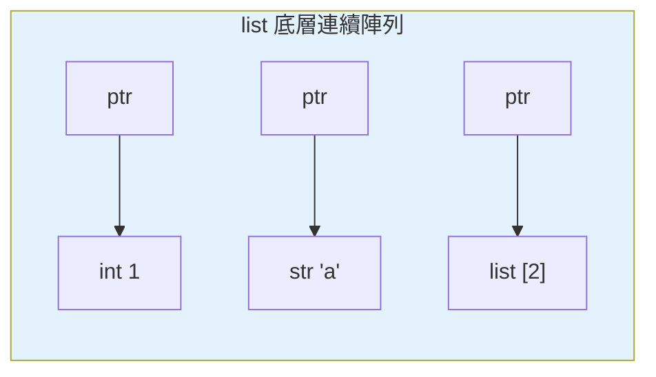

# list 列表

> list 是 Python 最常用的容器——一個可變、有序、可放任何型別的動態陣列。理解它「底層是連續指標陣列」，就能解釋為何尾端操作快、頭部操作慢。

## Why（為什麼）

幾乎每支 Python 程式都用 list。但「會用 `append`」和「知道每個操作的代價」是兩回事：為什麼 `append` 快而 `insert(0, x)` 慢？為什麼 `x in list` 是 O(n)？為什麼 `list * 3` 有時會出事？搞懂 list 的底層模型與各操作的時間複雜度，你才能寫出正確又有效率的程式，也能在面試時答出「該用 list 還是別的結構」。

## Theory（理論：動態陣列 of 指標）

CPython 的 list 底層是一個**連續的陣列，存的是「指向物件的指標」**（不是物件本身）。這帶來幾個本質：

- **有序**：元素依插入順序排列，有明確索引。
- **可變（mutable）**：能原地新增、刪除、修改（見 [可變 vs 不可變](06-mutability.md)）。
- **異質**：因為存的是指標，元素可以是任何型別、混合存放（`[1, "a", [2]]`）。
- **動態**：容量會自動成長。CPython 採**over-allocation（預留額外空間）**，所以連續 `append` 平均是 O(1)（攤銷），偶爾觸發擴容才需複製整個底層陣列。

因為是「連續陣列」，**按索引存取是 O(1)**（直接算位址）；但**在頭部/中間插入或刪除是 O(n)**（後面元素都要搬移）。

## Specification（規範：建立與常用操作）

```python
# 建立
a = [1, 2, 3]
b = list("abc")              # ['a', 'b', 'c']
c = [0] * 5                  # [0, 0, 0, 0, 0]
d = [x * x for x in range(5)]  # 推導式

# 存取 / 修改
a[0]         # 1（O(1)）
a[-1]        # 3（負索引從尾算）
a[0] = 99    # 原地修改

# 新增
a.append(4)          # 尾端加一個 → O(1) 攤銷
a.extend([5, 6])     # 尾端加多個（等同 a += [5, 6]）
a.insert(0, -1)      # 指定位置插入 → O(n)

# 刪除
a.remove(99)         # 刪「第一個值等於 99」的元素 → O(n)
a.pop()              # 刪並回傳尾端 → O(1)
a.pop(0)             # 刪並回傳指定索引 → O(n)
del a[1]             # 刪指定索引
a.clear()            # 清空
```

### 常見操作與時間複雜度

| 操作 | 複雜度 | 說明 |
|------|--------|------|
| `a[i]`、`a[i] = x` | O(1) | 索引存取 |
| `a.append(x)`、`a.pop()` | O(1) 攤銷 | 尾端操作 |
| `a.insert(0, x)`、`a.pop(0)` | O(n) | 頭部/中間，需搬移 |
| `x in a`、`a.index(x)` | O(n) | 線性搜尋 |
| `len(a)` | O(1) | 長度有快取 |
| `a.sort()` | O(n log n) | 原地排序 |

## Implementation（三個關鍵行為）

### `append` vs `extend`：加「一個」還是「多個」

```pycon
>>> a = [1, 2]
>>> a.append([3, 4])     # 把 [3,4] 當「一個元素」加入
>>> a
[1, 2, [3, 4]]
>>> b = [1, 2]
>>> b.extend([3, 4])     # 把 [3,4] 的每個元素加入
>>> b
[1, 2, 3, 4]
```

`append(x)` 加入一個元素；`extend(iterable)` 逐一加入可迭代物件的元素（等同 `+=`）。搞混會得到巢狀 list。

### `list * n` 的別名陷阱（重要）

`[x] * n` 對**不可變**元素沒問題，但對**可變**元素（如巢狀 list）是災難——它複製的是**同一個物件的參照 n 次**：

```pycon
>>> grid = [[0] * 3] * 3      # ❌ 三個 row 是「同一個 list」！
>>> grid[0][0] = 1
>>> grid
[[1, 0, 0], [1, 0, 0], [1, 0, 0]]   # 三行一起變了！
```

因為外層的 `* 3` 只是把「同一個內層 list 的參照」重複三次（呼應 [名稱綁定](../02-fundamentals/01-dynamic-typing.md) 的別名）。正解用推導式，每次建立新的內層 list：

```pycon
>>> grid = [[0] * 3 for _ in range(3)]   # ✅ 三個獨立的 row
>>> grid[0][0] = 1
>>> grid
[[1, 0, 0], [0, 0, 0], [0, 0, 0]]
```

### 遍歷時修改 list 的陷阱

在 `for x in a:` 中刪除 `a` 的元素會導致跳過或錯亂（索引位移）。改遍歷副本或建立新 list：

```python
# ❌ 邊遍歷邊刪 → 會漏掉元素
for x in items:
    if should_remove(x):
        items.remove(x)

# ✅ 用推導式重建（Pythonic）
items = [x for x in items if not should_remove(x)]
```

## Code Example（可執行的 Python 範例）

```python
# list_demo.py
def build_matrix(rows: int, cols: int) -> list[list[int]]:
    """正確建立獨立的二維 list（避免別名陷阱）。"""
    return [[0] * cols for _ in range(rows)]


def remove_negatives(numbers: list[int]) -> list[int]:
    """用推導式安全過濾（不邊遍歷邊刪）。"""
    return [n for n in numbers if n >= 0]


def demo() -> None:
    # 1. append vs extend
    a = [1, 2]
    a.append([3, 4])
    b = [1, 2]
    b.extend([3, 4])
    print(f"append: {a}")     # [1, 2, [3, 4]]
    print(f"extend: {b}")     # [1, 2, 3, 4]

    # 2. 別名陷阱 vs 正解
    bad = [[0] * 2] * 2
    bad[0][0] = 1
    good = build_matrix(2, 2)
    good[0][0] = 1
    print(f"別名陷阱: {bad}")   # [[1, 0], [1, 0]]
    print(f"正解:     {good}")  # [[1, 0], [0, 0]]

    # 3. 安全過濾
    print(f"過濾: {remove_negatives([1, -2, 3, -4])}")  # [1, 3]


if __name__ == "__main__":
    demo()
```

**預期輸出**：

```pycon
$ python list_demo.py
append: [1, 2, [3, 4]]
extend: [1, 2, 3, 4]
別名陷阱: [[1, 0], [1, 0]]
正解:     [[1, 0], [0, 0]]
過濾: [1, 3]
```

## Diagram（圖解：list 是指標陣列）



> list 存的是指向物件的指標，所以能混放不同型別；按索引找 ptr 是 O(1)。

## Best Practice（最佳實踐）

- **尾端操作用 `append`/`pop()`**（O(1)）；**需要頻繁在頭部進出**改用 `collections.deque`（兩端 O(1)，見 [collections](08-collections-module.md)）。
- **建立二維結構用推導式** `[[0]*c for _ in range(r)]`，別用 `[[0]*c]*r`（別名陷阱）。
- **過濾/轉換用推導式**，別邊遍歷邊改原 list。
- **頻繁檢查「是否存在」改用 set**（O(1) vs list 的 O(n)，見 [set](05-set-frozenset.md)）。
- **`append` 加單一元素、`extend`/`+=` 加多個**，別搞混。
- **排序用 `sort()`（原地）或 `sorted()`（回新 list）**，依需求選（見 [排序](11-sorting.md)）。

## Common Mistakes（常見誤解）

- **`[[0]*c]*r` 別名陷阱**：所有 row 是同一物件，改一個全變。用推導式。
- **`append` 一個 list 期待展平**：`a.append([1,2])` 是巢狀；要展平用 `extend`。
- **邊遍歷邊刪**：索引位移導致跳過元素；用推導式重建或遍歷副本 `items[:]`。
- **用 `x in big_list` 做頻繁查找**：O(n)，資料量大時很慢；用 set/dict。
- **用 `list.insert(0, x)` / `pop(0)` 當佇列**：O(n)；用 `deque`。
- **以為 `list * n` 深複製**：它複製參照，可變元素會共用。

## Interview Notes（面試重點）

- 說得出 list 底層是**動態陣列（連續的物件指標）**，並能推導複雜度：索引 O(1)、尾端 append/pop O(1) 攤銷、頭部/中間插刪 O(n)、`in`/`index` O(n)。
- 知道 **over-allocation** 讓連續 append 攤銷 O(1)。
- **`[[0]*c]*r` 別名陷阱是常見考題**：能解釋成因（重複同一參照）與正解（推導式）。
- 能區分 **`append` vs `extend`**。
- 知道**頭部頻繁進出該用 `deque`**、**頻繁成員檢查該用 set**。
- 知道**遍歷時修改容器的陷阱**與 Pythonic 解法。

---

➡️ 下一章：[tuple 元組](02-tuple.md)

[⬆️ 回 Part 3 索引](README.md)
