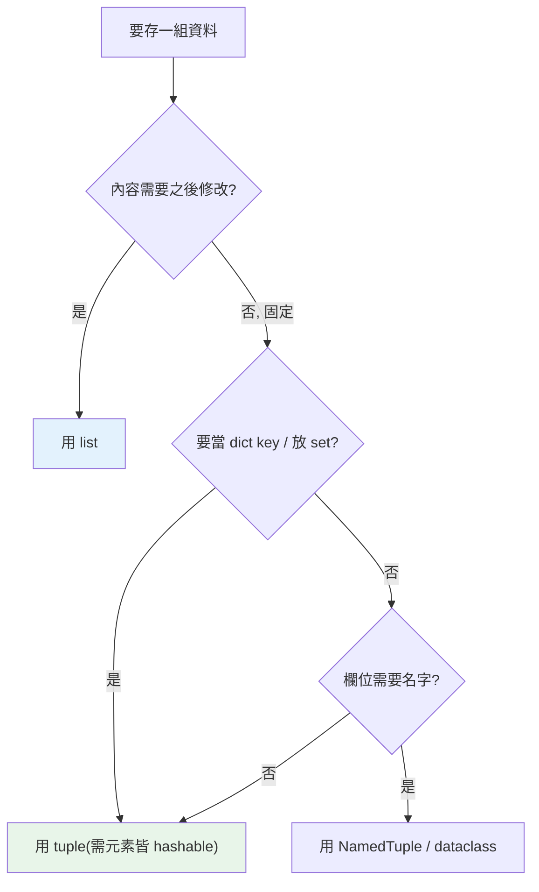

# tuple 元組

> tuple 是不可變的 list——但它的價值不只「不能改」：它能當 dict 的 key、能被 hash、語意上代表「一筆固定結構的紀錄」，且解構賦值讓 Python 程式格外簡潔。

## Why（為什麼）

初學者常問：「有了 list 為什麼還要 tuple？只是不能改的 list 嗎？」其實 tuple 承擔了 list 做不到的角色：因為不可變，它是 **hashable** 的，能當 dict 的 key、放進 set；它語意上表達「這是一組固定、有意義的欄位」（像座標 `(x, y)`、資料庫的一列）；而 tuple 解構（unpacking）是 Python 最愛用的語法糖之一。搞懂 tuple 與 list 的分工，程式會更清楚也更安全。

## Theory（理論：不可變的有序序列）

tuple 和 list 一樣是**有序序列**，差別只有一個核心：**tuple 不可變（immutable）**。一旦建立，不能新增、刪除、替換元素。

不可變帶來三個衍生特性：

1. **可 hash**（若元素皆可 hash）→ 能當 dict key、放進 set（見 [hashable](07-hashable.md)）。list 不行。
2. **語意上表示「固定結構的紀錄」**：慣例上 list 放「同質、數量可變的集合」，tuple 放「異質、位置有意義的欄位」（如 `(name, age, email)`）。
3. **稍微更省記憶體、可作為常數**：不可變讓它更輕、更安全共享。

## Specification（規範：建立與陷阱）

```python
t = (1, 2, 3)
t = 1, 2, 3            # 括號可省略！是「逗號」造就 tuple，不是括號
empty = ()             # 空 tuple
single = (42,)         # ⚠️ 單元素必須有逗號！(42) 只是加括號的 int
single = 42,           # 也可

# 存取（和 list 一樣，但不能賦值）
t[0]                   # 1
# t[0] = 9             # ❌ TypeError: 'tuple' object does not support item assignment

# 常用
len(t)                 # 3
t.count(1)             # 計數
t.index(2)             # 找索引
1 in t                 # 成員判斷
```

## Implementation（解構、單元素陷阱、「不可變」的細節）

### 逗號才是重點，不是括號

tuple 由**逗號**構成，括號只是為了清楚或分組：

```pycon
>>> x = 1, 2, 3
>>> type(x)
<class 'tuple'>
>>> single = (42)        # 沒有逗號 → 只是括號括起來的 int！
>>> type(single)
<class 'int'>
>>> single = (42,)       # 有逗號 → 才是單元素 tuple
>>> type(single)
<class 'tuple'>
```

單元素 tuple 忘了逗號是經典 bug。

### 解構賦值（unpacking）——Python 招牌

tuple 讓「一次賦值多個變數」變得優雅：

```pycon
>>> point = (3, 4)
>>> x, y = point          # 解構
>>> a, b = b, a           # 交換（右側先打包成 tuple，再解構）
>>> first, *rest = [1, 2, 3, 4]   # 星號吸收其餘（rest 是 list）
>>> first, rest
(1, [2, 3, 4])
>>> a, (b, c) = 1, (2, 3)  # 巢狀解構
```

函式「多回傳值」本質也是回傳 tuple 再解構（見 [函式](../02-fundamentals/08-functions.md)）。

### 「不可變」是指 tuple 本身，不是它裝的東西

tuple 不可變指「不能換掉它綁的元素」，但**若元素本身是可變物件（如 list），那個 list 仍可被改**：

```pycon
>>> t = (1, [2, 3])
>>> t[1].append(4)        # 改的是 tuple 裡那個 list 的內容
>>> t
(1, [2, 3, 4])            # tuple「變了」！
>>> t[1] = [9]            # 但不能換掉元素本身
TypeError: 'tuple' object does not support item assignment
```

這也連帶影響 hashability：含可變元素的 tuple **不可 hash**（見 [hashable](07-hashable.md)），不能當 dict key。

### tuple vs list 的選擇

| 場景 | 選擇 |
|------|------|
| 同質、數量會變的集合 | list |
| 異質、位置有意義的固定紀錄 | tuple |
| 要當 dict key / 放 set | tuple（list 不行） |
| 要當函式多回傳值 | tuple |
| 需要具名欄位 | `NamedTuple` / `dataclass`（見 [collections](08-collections-module.md)、[dataclass](../04-oop/09-dataclass.md)） |

## Code Example（可執行的 Python 範例）

```python
# tuple_demo.py
def minmax(numbers: list[int]) -> tuple[int, int]:
    """回傳 (最小, 最大)——多回傳值即 tuple。"""
    return min(numbers), max(numbers)


def demo() -> None:
    # 1. 逗號造就 tuple、單元素陷阱
    single_wrong = (42)
    single_right = (42,)
    print(f"(42) 型別: {type(single_wrong).__name__}")    # int
    print(f"(42,) 型別: {type(single_right).__name__}")   # tuple

    # 2. 解構賦值
    lo, hi = minmax([5, 1, 9, 3])
    print(f"min={lo}, max={hi}")

    # 3. 星號解構
    first, *middle, last = [1, 2, 3, 4, 5]
    print(f"first={first}, middle={middle}, last={last}")

    # 4. tuple 當 dict key（list 不行）
    grid: dict[tuple[int, int], str] = {(0, 0): "起點", (1, 1): "終點"}
    print(f"grid[(0,0)] = {grid[(0, 0)]}")

    # 5. 交換
    a, b = 1, 2
    a, b = b, a
    print(f"交換後: a={a}, b={b}")


if __name__ == "__main__":
    demo()
```

**預期輸出**：

```pycon
$ python tuple_demo.py
(42) 型別: int
(42,) 型別: tuple
min=1, max=9
first=1, middle=[2, 3, 4], last=5
grid[(0,0)] = 起點
交換後: a=2, b=1
```

## Diagram（圖解：tuple vs list 的分工）



## Best Practice（最佳實踐）

- **固定結構的紀錄用 tuple**（座標、RGB、一列資料），表達「這組欄位不該變」的意圖。
- **需要當 dict key 或放進 set 用 tuple**（前提：元素皆 hashable）。
- **善用解構賦值**：`x, y = point`、`a, b = b, a`、`first, *rest = seq`，比索引取值清楚。
- **欄位有語意時升級為 `NamedTuple` 或 `dataclass`**：`p.x` 比 `p[0]` 好讀太多。
- **單元素 tuple 記得逗號** `(x,)`。
- **回傳多值用 tuple**，呼叫端解構接收。

## Common Mistakes（常見誤解）

- **單元素 tuple 忘了逗號**：`(42)` 是 int 不是 tuple；要 `(42,)`。
- **以為 tuple 完全不可變**：tuple 本身不可變，但裡面的可變元素（list）仍能被改內容。
- **把含 list 的 tuple 當 dict key**：不可 hash → `TypeError`（見 [hashable](07-hashable.md)）。
- **該用具名結構卻硬記索引**：`data[3]` 是什麼？用 `NamedTuple`/`dataclass` 給名字。
- **以為 tuple 一定比 list 快很多**：差距通常不大；選 tuple 的主因是**語意與不可變性**，不是效能。
- **解構時數量不符**：`a, b = (1, 2, 3)` 會 `ValueError`；用 `*` 吸收多餘。

## Interview Notes（面試重點）

- 說得出 tuple 與 list 的核心差異（**不可變**）與衍生特性：**可 hash → 能當 dict key/放 set**、語意表達固定紀錄、稍省記憶體。
- 知道 **逗號才構成 tuple**、**單元素需逗號** `(x,)`。
- 能流暢使用**解構賦值**（含 `*` 星號、巢狀、交換），並知道多回傳值本質是 tuple。
- **「tuple 不可變但可含可變元素」是常見陷阱題**：能解釋 `t[1].append(...)` 為何可行，以及它為何導致該 tuple 不可 hash。
- 知道何時升級到 `NamedTuple` / `dataclass`。

---

➡️ 下一章：[切片 slicing](03-slicing.md)

[⬆️ 回 Part 3 索引](README.md)
