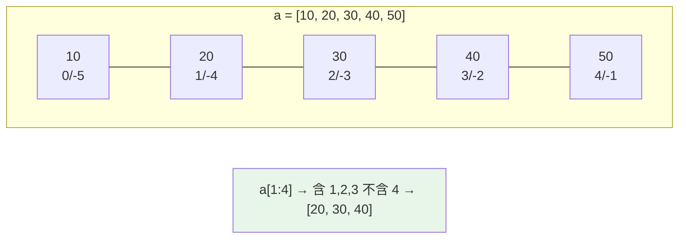

# 切片 slicing

> `seq[start:stop:step]` 是 Python 最強大的序列操作語法——半開區間、負索引、負步長、切片賦值，一次搞懂就能寫出簡潔又不出錯的序列處理。

## Why（為什麼）

切片幾乎出現在每個處理序列的地方：取子串、反轉、每隔幾個取一個、複製 list、批次替換。但它有幾個容易搞錯的規則：`stop` 是**不包含**的、負索引怎麼算、`[::-1]` 為什麼能反轉、切片是複製還是參照。把這些一次弄清楚，處理序列時就不必反覆試錯。

## Theory（理論：半開區間 + 三參數）

切片取的是序列的一段，語法是 `seq[start:stop:step]`，核心規則：

- **半開區間 `[start, stop)`**：包含 `start`、**不包含 `stop`**。所以 `a[2:5]` 取索引 2、3、4，共 `5 - 2 = 3` 個元素。
- **三個參數都可省略**：省略時用預設（start=0、stop=長度、step=1）。
- **不會越界報錯**：`a[2:999]` 不會出錯，超過的部分自動截到結尾——這和單一索引 `a[999]`（會 IndexError）不同。

「半開區間」的好處：`a[:i] + a[i:] == a`（在 i 處剛好切開不重不漏），且長度直接是 `stop - start`。

## Specification（規範：各種切片寫法）

```python
a = [0, 1, 2, 3, 4, 5, 6, 7, 8, 9]

a[2:5]      # [2, 3, 4]        start 到 stop-1
a[:3]       # [0, 1, 2]        從頭
a[7:]       # [7, 8, 9]        到尾
a[:]        # 全部（複製一份！）
a[::2]      # [0, 2, 4, 6, 8]  每隔一個（step=2）
a[1::2]     # [1, 3, 5, 7, 9]  奇數位
a[::-1]     # [9,...,0]        反轉（step=-1）
a[-3:]      # [7, 8, 9]        最後三個（負索引）
a[-3:-1]    # [7, 8]           負的 start/stop
a[5:2:-1]   # [5, 4, 3]        負步長：從高往低
```

## Implementation（負索引、負步長、切片賦值）

### 負索引：從尾端算

`-1` 是最後一個、`-2` 倒數第二，依此類推：

```pycon
>>> a = [10, 20, 30, 40, 50]
>>> a[-1]        # 50
>>> a[-2:]       # [40, 50]（最後兩個）
>>> a[:-2]       # [10, 20, 30]（去掉最後兩個）
```

`a[:-n]` 是「去掉尾端 n 個」的慣用法。

### 負步長：反向取

`step` 為負時，切片**從後往前**走。此時 `start` 應大於 `stop`：

```pycon
>>> a = [0, 1, 2, 3, 4, 5]
>>> a[::-1]       # [5, 4, 3, 2, 1, 0]  反轉整個
>>> a[4:1:-1]     # [4, 3, 2]  從索引 4 往回到 2（不含 1）
>>> s = "hello"
>>> s[::-1]       # 'olleh'  字串反轉的慣用法
```

反轉用 `[::-1]` 是 Python 最常見的慣用法之一。

### 切片是「淺複製」

對 list 取切片會產生**新的 list**（淺複製，見 [淺深複製](09-copy-shallow-deep.md)）：

```pycon
>>> a = [1, 2, 3]
>>> b = a[:]         # 複製出新 list
>>> b is a
False
>>> b.append(4)      # 改 b 不影響 a
>>> a
[1, 2, 3]
```

`a[:]` 是複製 list 的慣用法之一（但只淺複製一層；巢狀可變元素仍共用）。

### 切片賦值：原地替換一段（僅 list）

可變序列（list）支援對切片**賦值**，原地替換一整段——甚至長度可不同：

```pycon
>>> a = [1, 2, 3, 4, 5]
>>> a[1:4] = [20, 30]    # 用 2 個元素替換原本 3 個
>>> a
[1, 20, 30, 5]
>>> a[:] = [9, 9]        # 原地清空並填入（保留同一物件！）
>>> a
[9, 9]
>>> a[::2] = [0, 0]      # 擴充切片賦值需長度相符
>>> a
[0, 9, 0]
```

`a[:] = [...]` 與 `a = [...]` 不同：前者**原地修改同一物件**（影響所有別名），後者換綁新物件。

## Code Example（可執行的 Python 範例）

```python
# slicing_demo.py
def is_palindrome(s: str) -> bool:
    """用切片反轉判斷回文。"""
    cleaned = s.lower().replace(" ", "")
    return cleaned == cleaned[::-1]


def chunks(seq: list[int], size: int) -> list[list[int]]:
    """用切片把序列分塊。"""
    return [seq[i : i + size] for i in range(0, len(seq), size)]


def demo() -> None:
    a = list(range(10))

    # 1. 基本切片（半開區間）
    print(f"a[2:5] = {a[2:5]}")        # [2, 3, 4]
    print(f"a[::2] = {a[::2]}")        # [0, 2, 4, 6, 8]
    print(f"a[::-1] = {a[::-1]}")      # 反轉

    # 2. 負索引
    print(f"a[-3:] = {a[-3:]}")        # [7, 8, 9]
    print(f"a[:-3] = {a[:-3]}")        # 去掉尾三個

    # 3. 回文
    print(f"回文 'racecar': {is_palindrome('racecar')}")  # True

    # 4. 分塊
    print(f"分塊: {chunks(list(range(7)), 3)}")  # [[0,1,2],[3,4,5],[6]]

    # 5. 切片賦值（原地）
    b = [1, 2, 3, 4, 5]
    b[1:4] = [20, 30]
    print(f"切片賦值: {b}")            # [1, 20, 30, 5]


if __name__ == "__main__":
    demo()
```

**預期輸出**：

```pycon
$ python slicing_demo.py
a[2:5] = [2, 3, 4]
a[::2] = [0, 2, 4, 6, 8]
a[::-1] = [9, 8, 7, 6, 5, 4, 3, 2, 1, 0]
a[-3:] = [7, 8, 9]
a[:-3] = [0, 1, 2, 3, 4, 5, 6]
回文 'racecar': True
分塊: [[0, 1, 2], [3, 4, 5], [6]]
切片賦值: [1, 20, 30, 5]
```

## Diagram（圖解：半開區間與索引）



## Best Practice（最佳實踐）

- **反轉用 `[::-1]`**、**複製 list 用 `a[:]`（或 `list(a)`）**——都是慣用法。
- **記住半開區間**：`a[i:j]` 有 `j - i` 個元素、不含 `j`；`a[:i] + a[i:] == a`。
- **去頭去尾用負索引**：`a[1:]`（去頭）、`a[:-1]`（去尾）、`a[:-n]`（去尾 n 個）。
- **原地替換一段用切片賦值**：`a[i:j] = new`；想原地整批替換用 `a[:] = new`（保留物件、影響別名）。
- **切片不會越界**：可安心 `a[:1000]`；但單索引 `a[1000]` 會 IndexError。
- **大量切片複製注意成本**：切片是 O(k) 複製；只需檢視不需複製時，考慮 `itertools.islice` 或索引。

## Common Mistakes（常見誤解）

- **以為 `stop` 包含在內**：`a[0:3]` 不含索引 3；長度是 `3 - 0 = 3`。
- **負步長時 start/stop 寫反**：`a[2:5:-1]` 得空 list（方向不對）；反向要 `a[5:2:-1]` 或直接 `a[::-1]`。
- **混淆 `a[:] = x` 與 `a = x`**：前者原地改同一物件（影響別名），後者換綁新物件。
- **以為切片是深複製**：只淺複製一層，巢狀可變元素仍共用（見 [淺深複製](09-copy-shallow-deep.md)）。
- **對 tuple/str 做切片賦值**：它們不可變，`t[1:2] = ...` 會 TypeError；切片賦值只限 list。
- **用切片複製超大 list 只為讀取**：浪費記憶體，改用索引或 `islice`。

## Interview Notes（面試重點）

- 說得出 `seq[start:stop:step]` 的完整語意：**半開區間（含 start 不含 stop）**、負索引、負步長、可省略參數、**不越界**。
- 知道 **`[::-1]` 反轉**、**`a[:]` 淺複製** 的慣用法及原理。
- 能區分 **切片賦值 `a[i:j]=x`（原地）**、**`a[:]=x`（原地整批、影響別名）** 與 **`a=x`（換綁）**。
- 知道切片產生**新物件（淺複製）**，且是 O(k) 成本。
- 知道切片賦值只適用可變序列（list），tuple/str 不行。

---

➡️ 下一章：[dict 字典](04-dict.md)

[⬆️ 回 Part 3 索引](README.md)
