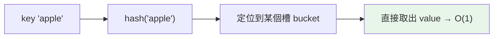

# dict 字典

> dict 是 Python 的核心——雜湊表帶來平均 O(1) 的存取、3.7 起保證保留插入順序、且物件屬性、關鍵字參數、命名空間底層都是 dict。它值得你徹底搞懂。

## Why（為什麼）

dict 不只是「鍵值對容器」，它是 Python 執行機制的基石：物件的屬性存在 `__dict__`（一個 dict）、模組的全域名稱、函式的 `**kwargs`——全都是 dict。日常上，dict 提供平均 O(1) 的查找，是計數、分組、快取、建索引的首選。但要用得好，得懂：key 的限制（必須 hashable）、如何安全取值（`get`/`setdefault`/`defaultdict`）、以及 3.7 之後「保留順序」這個重要保證。

## Theory（理論：雜湊表）

dict 底層是**雜湊表（hash table）**。存 `d[key] = value` 時：

1. 對 key 呼叫 `hash(key)` 算出雜湊值。
2. 用雜湊值決定該放進底層陣列的哪個槽（bucket）。
3. 查找時同樣算 hash 直接定位——因此**平均 O(1)**（不用逐一比對）。

這解釋了兩件事：

- **key 必須是 hashable**（可算 hash 且不可變，見 [hashable](07-hashable.md)）：`int`/`str`/`tuple` 可以，`list`/`dict`/`set` 不行。
- **查找/插入/刪除平均 O(1)**，遠快於 list 的 O(n) 線性搜尋。

從 **Python 3.7 起，dict 保證保留插入順序**（3.6 是實作細節，3.7 寫入語言規範）。所以遍歷 dict 的順序 = 插入順序。

## Specification（規範：建立與操作）

```python
# 建立
d = {"a": 1, "b": 2}
d = dict(a=1, b=2)                 # 關鍵字
d = dict([("a", 1), ("b", 2)])     # 鍵值對序列
d = {k: v for k, v in pairs}       # 推導式
d = dict.fromkeys(["a", "b"], 0)   # {'a': 0, 'b': 0}

# 存取 / 修改
d["a"]              # 1（key 不存在 → KeyError）
d.get("z")          # None（不存在回 None，不報錯）
d.get("z", 0)       # 0（可指定預設）
d["c"] = 3          # 新增或更新
d.setdefault("d", []).append(1)   # 不存在才設預設，並回傳該值

# 刪除
del d["a"]
d.pop("b")          # 刪並回傳（可給預設避免 KeyError）
d.popitem()         # 刪並回傳最後插入的一對（LIFO）

# 遍歷
d.keys()            # 鍵視圖
d.values()          # 值視圖
d.items()           # (鍵, 值) 視圖
for k, v in d.items(): ...

# 合併
d1 | d2             # 合併成新 dict（3.9+）
d1 |= d2            # 原地更新（3.9+）
d1.update(d2)       # 原地更新
```

## Implementation（安全取值 + 視圖 + 合併）

### `[]` vs `get` vs `setdefault` vs `defaultdict`

存取不存在的 key，`[]` 會 `KeyError`；有幾種安全做法：

```python
# 1. get：只讀，給預設值
count = d.get(key, 0)

# 2. setdefault：讀且「若不存在就寫入預設」
d.setdefault(key, []).append(item)

# 3. defaultdict：自動為缺失 key 建立預設（見 collections）
from collections import defaultdict
groups = defaultdict(list)
groups[key].append(item)      # key 不存在時自動建 []
```

**計數/分組**是 dict 最常見用途，慣用 `defaultdict` 或 `Counter`（見 [collections](08-collections-module.md)）：

```python
# 計數
from collections import Counter
counts = Counter(words)       # 一行搞定

# 分組
groups = defaultdict(list)
for item in items:
    groups[item.category].append(item)
```

### keys/values/items 是「動態視圖」

`d.keys()`、`d.values()`、`d.items()` 回傳的是**視圖物件（view）**，不是 list——它會**隨 dict 變動而變動**，且不佔額外記憶體：

```pycon
>>> d = {"a": 1}
>>> keys = d.keys()
>>> d["b"] = 2
>>> keys                    # 視圖反映了新增
dict_keys(['a', 'b'])
>>> list(keys)              # 要 list 需明確轉換
['a', 'b']
```

⚠️ **遍歷 dict 時不能改變它的大小**（新增/刪除 key），會 `RuntimeError: dictionary changed size during iteration`。要改就遍歷 `list(d.keys())` 的快照。

### 合併（3.9+ 的 `|`）

```pycon
>>> a = {"x": 1, "y": 2}
>>> b = {"y": 20, "z": 3}
>>> a | b                   # 新 dict，右邊覆蓋左邊
{'x': 1, 'y': 20, 'z': 3}
>>> a |= b                  # 原地更新 a
```

## Code Example（可執行的 Python 範例）

```python
# dict_demo.py
from collections import Counter, defaultdict


def word_count(text: str) -> dict[str, int]:
    """用 Counter 計數。"""
    return dict(Counter(text.lower().split()))


def group_by_length(words: list[str]) -> dict[int, list[str]]:
    """用 defaultdict 分組。"""
    groups: defaultdict[int, list[str]] = defaultdict(list)
    for w in words:
        groups[len(w)].append(w)
    return dict(groups)


def demo() -> None:
    # 1. 安全取值
    d = {"a": 1}
    print(f"get 不存在: {d.get('z', '無')}")     # 無

    # 2. 計數
    print(f"計數: {word_count('the cat the dog the')}")

    # 3. 分組
    print(f"分組: {group_by_length(['hi', 'ok', 'hello', 'world', 'a'])}")

    # 4. 保留插入順序（3.7+）
    ordered = {}
    for k in ["z", "a", "m"]:
        ordered[k] = 1
    print(f"順序: {list(ordered)}")               # ['z', 'a', 'm']

    # 5. 合併
    print(f"合併: {{'x': 1} | {'x': 9, 'y': 2}}")  # {'x': 9, 'y': 2}


if __name__ == "__main__":
    demo()
```

**預期輸出**：

```pycon
$ python dict_demo.py
get 不存在: 無
計數: {'the': 3, 'cat': 1, 'dog': 1}
分組: {2: ['hi', 'ok'], 5: ['hello', 'world'], 1: ['a']}
順序: ['z', 'a', 'm']
合併: {'x': 9, 'y': 2}
```

## Diagram（圖解：雜湊表查找）



## Best Practice（最佳實踐）

- **安全取值用 `get`（只讀）/ `setdefault`（讀寫）**，避免 `KeyError`；計數用 `Counter`、分組用 `defaultdict`。
- **需要 O(1) 的成員檢查或映射就用 dict/set**，別用 list 線性搜尋。
- **遍歷時要改動 dict，先對 keys 取快照** `list(d.keys())`。
- **key 用不可變且 hashable 的型別**：str、int、tuple（元素也需 hashable）。
- **合併用 `|`（新 dict）或 `|=`/`update`（原地）**（3.9+）。
- **依賴插入順序沒問題**（3.7+ 保證）；需要「LRU / 排序」等特殊順序時看 `OrderedDict` 的 move_to_end 或 `sorted`。

## Common Mistakes（常見誤解）

- **用 `d[key]` 存取可能不存在的 key**：`KeyError`；只讀用 `d.get(key, default)`。
- **用 list/dict 當 key**：不可 hash → `TypeError`；用 tuple（且元素皆 hashable）。
- **遍歷時新增/刪除 key**：`RuntimeError`；遍歷快照 `list(d)`。
- **以為 `keys()`/`items()` 是 list**：是動態視圖，需要 list 要 `list(...)`；且不能索引 `d.keys()[0]`。
- **以為 dict 無序**：3.7+ 保證保留插入順序，別再說「dict 是無序的」。
- **用迴圈手動計數/分組**：改用 `Counter` / `defaultdict` 更短更清楚。
- **`setdefault` 每次都建預設物件**：`d.setdefault(k, expensive())` 即使 k 存在也會先算 `expensive()`；此時 `defaultdict` 更好。

## Interview Notes（面試重點）

- 說得出 dict 底層是**雜湊表**，查找/插入/刪除**平均 O(1)**，並知道 **key 必須 hashable** 的原因。
- 知道 **3.7 起保證保留插入順序**（3.6 為實作細節），能講清楚這個時間點。
- 能對比 **`[]` / `get` / `setdefault` / `defaultdict` / `Counter`** 的適用場景（尤其計數、分組）。
- 知道 **keys/values/items 是動態視圖**、遍歷中改大小會 `RuntimeError`。
- 知道 dict 是 Python 的核心（物件屬性 `__dict__`、`**kwargs`、命名空間皆是 dict）。
- 加分：`|`/`|=` 合併（3.9+）、`setdefault` 會預先求值預設物件的陷阱。

---

➡️ 下一章：[set 與 frozenset](05-set-frozenset.md)

[⬆️ 回 Part 3 索引](README.md)
