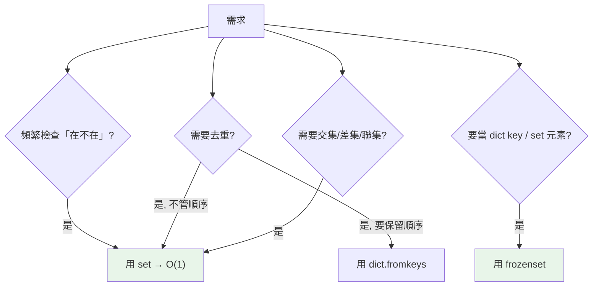

# set 與 frozenset

> set 是「只有 key 的 dict」——用雜湊表換來 O(1) 的成員檢查與去重，還支援數學集合運算。frozenset 則是它不可變、可 hash 的版本。

## Why（為什麼）

當你要「快速判斷某元素在不在集合裡」「去除重複」「求兩組資料的交集/差集」，set 是正確工具。用 list 做這些事（`x in list` 是 O(n)、去重要寫迴圈）又慢又囉嗦。set 用雜湊表把成員檢查降到平均 O(1)，並內建集合運算。這章講清楚 set 的能力、限制（元素須 hashable、無序）、以及何時用 frozenset。

## Theory（理論：只有 key 的雜湊表）

set 底層和 dict 一樣是**雜湊表**，只是「只存 key、不存 value」。因此：

- **成員檢查 `x in s` 平均 O(1)**（算 hash 直接定位），對比 list 的 O(n)。
- **自動去重**：相同元素只會有一份。
- **元素必須 hashable**（可算 hash、不可變）：int/str/tuple 可以，list/dict/set 不行（見 [hashable](07-hashable.md)）。
- **無序**：set **不保證任何順序**（不像 dict 從 3.7 保留插入順序）；別依賴 set 的遍歷順序。

**frozenset** 是 set 的不可變版本：建立後不能增刪，因此它自己**可 hash**，能當 dict key 或放進另一個 set。

## Specification（規範：建立與運算）

```python
# 建立
s = {1, 2, 3}
s = set([1, 2, 2, 3])       # {1, 2, 3}（去重）
s = {x % 3 for x in range(10)}   # 推導式
empty = set()               # ⚠️ 空 set 用 set()，{} 是空 dict！
fs = frozenset([1, 2, 3])   # 不可變版本

# 增刪（僅 set，frozenset 不行）
s.add(4)
s.discard(4)                # 不存在也不報錯
s.remove(4)                 # 不存在會 KeyError
s.pop()                     # 移除並回傳任意元素

# 成員檢查
2 in s                      # O(1)
```

### 集合運算

| 運算 | 運算子 | 方法 | 意義 |
|------|--------|------|------|
| 聯集 | `a | b` | `a.union(b)` | 兩者所有元素 |
| 交集 | `a & b` | `a.intersection(b)` | 共同元素 |
| 差集 | `a - b` | `a.difference(b)` | 在 a 不在 b |
| 對稱差 | `a ^ b` | `a.symmetric_difference(b)` | 只在其一 |
| 子集 | `a <= b` | `a.issubset(b)` | a 是否被 b 包含 |
| 超集 | `a >= b` | `a.issuperset(b)` | a 是否包含 b |

```pycon
>>> a = {1, 2, 3}
>>> b = {2, 3, 4}
>>> a | b, a & b, a - b, a ^ b
({1, 2, 3, 4}, {2, 3}, {1}, {1, 4})
```

## Implementation（去重、成員檢查、運算子 vs 方法）

### 去重的慣用法

```pycon
>>> nums = [1, 2, 2, 3, 3, 3]
>>> list(set(nums))          # 去重（但順序不保證！）
[1, 2, 3]
>>> # 要「去重且保留順序」用 dict.fromkeys
>>> list(dict.fromkeys(nums))
[1, 2, 3]
```

`set` 去重會打亂順序；**要保留插入順序用 `dict.fromkeys`**（利用 dict 的順序保證，見 [dict](04-dict.md)）。

### 成員檢查：set vs list 的巨大差異

```python
# ❌ list：O(n)，資料量大時很慢
valid_ids = [1, 2, 3, ..., 1_000_000]
if user_id in valid_ids:          # 最壞掃一百萬次
    ...

# ✅ set：O(1)
valid_ids = {1, 2, 3, ..., 1_000_000}
if user_id in valid_ids:          # 一次雜湊定位
    ...
```

「需要頻繁檢查存在性」是選 set 最重要的信號。

### 運算子 vs 方法的細微差別

`a | b` 這類**運算子要求兩邊都是 set**；而 `a.union(b)` 這類**方法接受任何可迭代物件**：

```pycon
>>> {1, 2}.union([2, 3, 4])     # 方法：可傳 list
{1, 2, 3, 4}
>>> {1, 2} | [2, 3]             # 運算子：TypeError
TypeError: unsupported operand type(s) for |: 'set' and 'list'
```

### frozenset：可 hash 的集合

因為不可變，frozenset 能當 dict key 或 set 的元素——普通 set 不行：

```pycon
>>> routes = {frozenset(["A", "B"]): 100}   # 用無序的一對城市當 key
>>> routes[frozenset(["B", "A"])]           # 順序無關，都找得到
100
>>> s = {frozenset([1, 2]), frozenset([3])} # set of sets 需 frozenset
```

## Code Example（可執行的 Python 範例）

```python
# set_demo.py
def dedupe_keep_order(items: list[int]) -> list[int]:
    """去重且保留順序（set 不保證順序，故用 dict.fromkeys）。"""
    return list(dict.fromkeys(items))


def common_tags(a: set[str], b: set[str]) -> set[str]:
    """兩篇文章的共同標籤。"""
    return a & b


def demo() -> None:
    # 1. 去重
    print(f"set 去重: {sorted(set([3, 1, 2, 2, 3]))}")     # [1, 2, 3]
    print(f"保序去重: {dedupe_keep_order([3, 1, 2, 2, 3])}")  # [3, 1, 2]

    # 2. 集合運算
    a = {"python", "go", "rust"}
    b = {"go", "java", "rust"}
    print(f"交集: {sorted(a & b)}")        # ['go', 'rust']
    print(f"差集 a-b: {sorted(a - b)}")    # ['python']
    print(f"對稱差: {sorted(a ^ b)}")      # ['java', 'python']

    # 3. 成員檢查
    allowed = {200, 201, 204}
    print(f"200 允許: {200 in allowed}")   # True

    # 4. frozenset 當 dict key
    distances = {frozenset(["A", "B"]): 100}
    print(f"B-A 距離: {distances[frozenset(['B', 'A'])]}")  # 100


if __name__ == "__main__":
    demo()
```

**預期輸出**：

```pycon
$ python set_demo.py
set 去重: [1, 2, 3]
保序去重: [3, 1, 2]
交集: ['go', 'rust']
差集 a-b: ['python']
對稱差: ['java', 'python']
200 允許: True
B-A 距離: 100
```

## Diagram（圖解：何時用 set）



## Best Practice（最佳實踐）

- **成員檢查、去重、集合運算用 set**：比 list 快得多也更清楚。
- **去重要保留順序用 `dict.fromkeys(seq)`**（set 不保證順序）。
- **空 set 用 `set()`**，別用 `{}`（那是空 dict）。
- **不確定另一邊是不是 set 時用方法**（`a.union(b)` 接受任何 iterable），要嚴格 set 才用運算子。
- **需要把集合當 key 或放進 set 用 frozenset**。
- **別依賴 set 的遍歷順序**；需要有序結果就 `sorted(s)`。

## Common Mistakes（常見誤解）

- **`{}` 當空 set**：它是空 dict；空 set 用 `set()`。
- **以為 `list(set(x))` 保留順序**：不保證；要保序用 `dict.fromkeys`。
- **把 list/dict 放進 set 或當 set 元素**：不可 hash → `TypeError`；用 tuple/frozenset。
- **`a | [1,2]`（運算子配非 set）**：TypeError；用 `a.union([1,2])`。
- **依賴 set 遍歷順序做輸出**：順序不定；需要固定順序用 `sorted`。
- **`remove` 不存在的元素**：`KeyError`；不確定用 `discard`。

## Interview Notes（面試重點）

- 說得出 set 底層是**雜湊表（只有 key）**，成員檢查/去重**平均 O(1)**，元素須 **hashable**、且**無序**。
- 能對比 **set vs list 的成員檢查**（O(1) vs O(n)），知道大量查找該用 set。
- 知道 **去重保序用 `dict.fromkeys`**，因為 set 不保證順序（而 dict 3.7+ 保證）。
- 熟練集合運算 `| & - ^` 及子集/超集，並知道**運算子需兩邊皆 set、方法接受任意 iterable**。
- 知道 **frozenset 不可變、可 hash**，能當 dict key / set 元素。
- 知道空 set 是 `set()` 不是 `{}`。

---

➡️ 下一章：[可變 vs 不可變](06-mutability.md)

[⬆️ 回 Part 3 索引](README.md)
