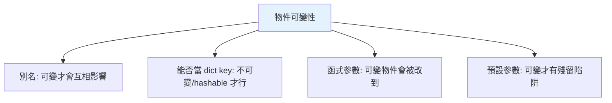

# 可變 vs 不可變

> 可不可變不是冷知識，它決定了：能不能當 dict key、函式會不會改到你的資料、`+=` 是原地還是換綁、預設參數會不會出事。這是貫穿 Python 的一條主線。

## Why（為什麼）

前面幾章反覆提到「因為它可變 / 不可變，所以…」——別名陷阱、tuple 能當 key、可變預設參數、字串方法回傳新物件。這些看似無關的現象，其實都出自同一個根本屬性：**物件可不可變**。這章把這條主線集中講清楚，讓你能一眼判斷任何操作的後果，不再被「我沒動它怎麼變了」困惑。

## Theory（理論：可變性是物件的屬性）

**可變性（mutability）是「物件」的屬性，不是「變數」的屬性**（呼應 [名稱綁定](../02-fundamentals/01-dynamic-typing.md)）：

- **不可變（immutable）**：建立後內容不能改。任何「修改」都是**建立新物件**。
- **可變（mutable）**：可以原地（in-place）改變內容，物件的 `id` 不變。

| 不可變 | 可變 |
|--------|------|
| `int`、`float`、`bool`、`complex` | `list` |
| `str` | `dict` |
| `tuple` | `set` |
| `frozenset` | `bytearray` |
| `bytes` | 大多數自訂類別的實例 |

判斷法：問「這個操作是**改了同一個物件**，還是**做了一個新物件並換綁**？」

## Specification（規範：原地修改 vs 重新賦值）

```python
# 可變：原地修改，id 不變
a = [1, 2]
before = id(a)
a.append(3)          # 原地改
assert id(a) == before   # 同一個物件

# 不可變：無法原地改，只能換綁到新物件
s = "hi"
before = id(s)
s = s + "!"          # 建立新字串，s 換綁
assert id(s) != before   # 不同物件

# int 也是不可變
n = 5
before = id(n)
n += 1               # 建立新 int 6，換綁
assert id(n) != before
```

## Implementation（可變性造成的四大現象）

可變性統一解釋了前面章節的四個經典現象：

### 現象一：別名（aliasing）—— 只發生在可變物件

```pycon
>>> a = [1, 2]; b = a       # 兩個名稱指同一 list
>>> b.append(3)
>>> a
[1, 2, 3]                   # a 也變了（可變 + 別名）

>>> x = 5; y = x            # 指同一 int
>>> y += 1                  # 換綁 y 到新 int，不影響 x
>>> x
5                           # x 不受影響（不可變）
```

不可變物件即使有別名也「安全」——因為沒人能原地改它。

### 現象二：能否當 dict key / 放 set —— 只有不可變（hashable）可以

```pycon
>>> {(1, 2): "ok"}          # tuple 不可變 → 可當 key
>>> {[1, 2]: "no"}          # list 可變 → TypeError: unhashable type: 'list'
```

可變物件一般不可 hash（見 [hashable](07-hashable.md)），因為內容會變、hash 也會變，破壞雜湊表的前提。

### 現象三：函式參數 —— 可變物件會被改到

```python
def add_one(lst):
    lst.append(1)       # 原地改 → 外部看得到

def add_one_num(n):
    n += 1              # 換綁區域名稱 → 外部不變
```

傳可變物件進函式，函式內的原地修改會影響呼叫者（見 [函式](../02-fundamentals/08-functions.md)）。

### 現象四：可變預設參數陷阱

```python
def f(x=[]):            # 預設 list 只建一次，跨呼叫共用（可變才出事）
    x.append(1)
    return x
```

正是因為 list 可變且被共用，才會殘留狀態（見 [參數](../02-fundamentals/09-parameters-args-kwargs.md)）。若預設是不可變的 `None`/`0`/`""` 就沒問題。

### `+=` 對可變/不可變的關鍵差異

```pycon
>>> t = ([1, 2],)           # tuple（不可變）裝一個 list（可變）
>>> t[0] += [3]             # 詭異：既成功「又」報錯！
TypeError: 'tuple' object does not support item assignment
>>> t
([1, 2, 3],)                # 但 list 確實被 extend 了！
```

這個經典陷阱：`t[0] += [3]` 先對 list 原地 extend（成功），再嘗試把結果賦回 `t[0]`（tuple 不允許 → 報錯）。結果是「改了、又報錯」。教訓：別在不可變容器裡混用可變元素做 `+=`。

## Code Example（可執行的 Python 範例）

```python
# mutability_demo.py
def demonstrate_aliasing() -> tuple[list[int], int]:
    """可變別名 vs 不可變。回傳 (被影響的 list, 不受影響的 int)。"""
    lst = [1, 2]
    alias = lst
    alias.append(3)          # 影響 lst

    x = 5
    y = x
    y += 1                   # 不影響 x
    return lst, x


def is_mutable(obj: object) -> bool:
    """透過 hash 判斷是否（大致）不可變：可 hash 通常代表不可變。"""
    try:
        hash(obj)
        return False         # 可 hash → 視為不可變
    except TypeError:
        return True          # 不可 hash → 可變


def demo() -> None:
    lst, x = demonstrate_aliasing()
    print(f"list 被別名改動: {lst}")   # [1, 2, 3]
    print(f"int 不受影響: {x}")        # 5

    for obj in [42, "hi", (1, 2), [1, 2], {1: 2}]:
        kind = "可變" if is_mutable(obj) else "不可變"
        print(f"{obj!r:>10} → {kind}")


if __name__ == "__main__":
    demo()
```

**預期輸出**：

```pycon
$ python mutability_demo.py
list 被別名改動: [1, 2, 3]
int 不受影響: 5
        42 → 不可變
      'hi' → 不可變
    (1, 2) → 不可變
    [1, 2] → 可變
    {1: 2} → 可變
```

## Diagram（圖解：可變性決定四大行為）



## Best Practice（最佳實踐）

- **一眼判斷操作後果**：問「這是原地改同一物件，還是換綁新物件？」——可變才有別名/副作用問題。
- **需要當 key / 放 set / 安全共享 → 用不可變型別**（tuple、frozenset、str）。
- **函式不想改到呼叫者的資料 → 先複製** 或回傳新物件（見 [淺深複製](09-copy-shallow-deep.md)）。
- **可變預設參數用 `None` 哨兵**。
- **避免在不可變容器裡放可變元素又對其 `+=`**（`tuple` 裡的 list）。
- **想要「不可變的自訂物件」**：用 `@dataclass(frozen=True)` 或 `NamedTuple`（見 [dataclass](../04-oop/09-dataclass.md)）。

## Common Mistakes（常見誤解）

- **以為「可變性」是變數的性質**：它是**物件**的性質；同一變數可先綁不可變、再綁可變物件。
- **驚訝於別名互相影響**：可變物件被多個名稱共用時，改一個全變。
- **把可變物件當 dict key**：`TypeError: unhashable`。
- **函式意外改到傳入的 list/dict**：沒複製就原地改。
- **`t[0] += [x]`（tuple 裡的 list）**：改成功卻又報錯的經典陷阱。
- **以為 `s += "x"`（str）是原地修改**：字串不可變，是換綁新物件；迴圈裡是 O(n²)（見 [字串](../02-fundamentals/04-strings.md)）。

## Interview Notes（面試重點）

- 能列出**常見不可變**（int/float/bool/str/tuple/frozenset/bytes）與**可變**（list/dict/set/bytearray）型別。
- 說得出可變性是**物件的屬性**，並用它**統一解釋**：別名、能否當 key、函式副作用、可變預設參數。
- 能區分**原地修改（id 不變）vs 重新賦值（換綁新物件）**。
- 能解釋 **`t[0] += [x]` 在 tuple 裡對 list 的「改成功又報錯」** 陷阱。
- 知道不可變 → 可安全共享、（通常）可 hash；連結到 [hashable](07-hashable.md)。

---

➡️ 下一章：[hashable 與 __hash__](07-hashable.md)

[⬆️ 回 Part 3 索引](README.md)
