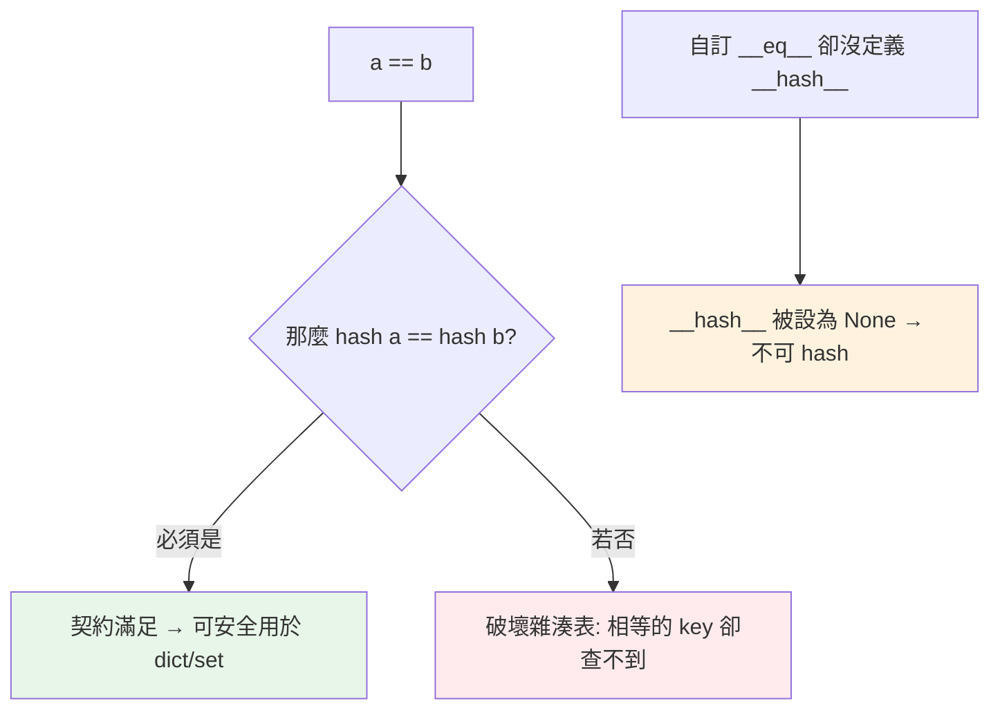

# hashable 與 __hash__

> 「能不能當 dict key / 放進 set」取決於一件事：這個物件 hashable 嗎？而 hashable 的背後，是 `__hash__` 與 `__eq__` 必須遵守的一條契約。

## Why（為什麼）

`{[1,2]: "x"}` 為什麼報 `unhashable type`？自訂類別的物件放進 set 為什麼會出現「兩個看起來一樣的物件被當成不同」？這些都關乎 **hashable（可雜湊）** 這個概念，以及 `__hash__` 和 `__eq__` 之間的契約。搞懂它，你才能正確地把自訂物件當 dict key、放進 set，也能理解 dict/set 為何要求 key/元素可 hash。

## Theory（理論：什麼是 hashable）

一個物件是 **hashable** 的，若它滿足兩個條件：

1. 有 `__hash__()` 方法，能回傳一個整數 hash 值，且這個值在物件**生命週期內不變**。
2. 有 `__eq__()` 方法，能和其他物件比較相等。

dict 和 set 用雜湊表儲存（見 [dict](04-dict.md)），需要對 key/元素算 hash 來定位——所以 **key/元素必須 hashable**。

**可 hash 與不可變高度相關**：如果一個物件的內容會變，它的 hash 也會變，就會在雜湊表裡「迷路」（放進去時算一個槽、內容變了之後算另一個槽，再也找不到）。所以 Python **預設讓可變的內建型別不可 hash**：

```pycon
>>> hash("abc"), hash((1, 2)), hash(42)     # 不可變 → 可 hash
(..., ..., 42)
>>> hash([1, 2])                            # 可變 → 不可 hash
TypeError: unhashable type: 'list'
>>> hash({1, 2}), hash({1: 2})              # set/dict 也不可 hash
TypeError: unhashable type: 'set'
```

## Specification（規範：hash / eq 契約）

`__hash__` 與 `__eq__` 必須遵守一條**契約**：

> **若 `a == b`，則必須 `hash(a) == hash(b)`。**

反過來不必成立（hash 相同的兩個物件可以不相等，這叫**雜湊碰撞**，雜湊表能處理）。但「相等卻 hash 不同」會直接破壞 dict/set——你用一個相等的 key 卻查不到值。

推論規則（Python 自動處理）：

| 你在類別裡定義了 | Python 對 `__hash__` 的處理 |
|------------------|------------------------------|
| 什麼都沒定義 | 用預設（基於 `id`），可 hash |
| 只定義 `__eq__` | **`__hash__` 被設為 None → 物件變不可 hash！** |
| 同時定義 `__eq__` 和 `__hash__` | 依你的定義，可 hash |

**關鍵陷阱**：一旦你自訂 `__eq__`，Python 就把 `__hash__` 設成 `None`（因為預設的 id-based hash 可能違反契約），你的物件就不能放進 set/dict 了——除非你也定義 `__hash__`。

## Implementation（自訂類別的正確做法）

### 手動實作 `__eq__` + `__hash__`

```python
class Point:
    def __init__(self, x: int, y: int) -> None:
        self.x = x
        self.y = y

    def __eq__(self, other: object) -> bool:
        if not isinstance(other, Point):
            return NotImplemented
        return (self.x, self.y) == (other.x, other.y)

    def __hash__(self) -> int:
        return hash((self.x, self.y))    # 用「決定相等的欄位」組成 tuple 來 hash
```

慣用法：**`__hash__` 用「決定相等性的那些欄位」組成 tuple 再 hash**，`__eq__` 也比較同一組 tuple——兩者一致，契約自然滿足。

```pycon
>>> a, b = Point(1, 2), Point(1, 2)
>>> a == b, hash(a) == hash(b)
(True, True)
>>> {a, b}                    # 視為同一個 → set 只留一個
{<Point ...>}
```

### 讓 dataclass 自動處理

手寫容易出錯，`@dataclass` 可自動產生正確的 `__eq__` 與 `__hash__`（見 [dataclass](../04-oop/09-dataclass.md)）：

```python
from dataclasses import dataclass

@dataclass(frozen=True)      # frozen=True → 不可變 + 自動 __hash__
class Point:
    x: int
    y: int

# 這樣 Point(1, 2) 就能當 dict key、放進 set，且 (1,2)==(1,2)
```

`@dataclass(frozen=True)` 讓實例不可變並自動實作 `__hash__`；`@dataclass`（非 frozen）預設 `eq=True, frozen=False` 時 `__hash__` 為 None（不可 hash），要 hash 就用 frozen。

### 為什麼可變物件不可 hash：破壞雜湊表的例子

假設 list 可 hash 且 hash 隨內容變：

```text
d = {}
key = [1, 2]
d[key] = "v"        # 用 hash([1,2]) 決定放哪個槽
key.append(3)       # 內容變了，hash([1,2,3]) 指向另一個槽
d[key]              # 去新槽找 → 找不到！雜湊表壞了
```

正是為了避免這種「key 內容變化導致失聯」，Python 禁止可變物件當 key。

## Code Example（可執行的 Python 範例）

```python
# hashable_demo.py
from dataclasses import dataclass


@dataclass(frozen=True)
class Color:
    r: int
    g: int
    b: int


def is_hashable(obj: object) -> bool:
    try:
        hash(obj)
        return True
    except TypeError:
        return False


def demo() -> None:
    # 1. 內建型別的可 hash 性
    for obj in [42, "hi", (1, 2), [1, 2], {1, 2}, frozenset([1, 2])]:
        print(f"{obj!r:>15} → hashable: {is_hashable(obj)}")

    # 2. frozen dataclass 可當 key、可去重
    red1 = Color(255, 0, 0)
    red2 = Color(255, 0, 0)
    print(f"\nred1 == red2: {red1 == red2}")             # True
    print(f"hash 相同: {hash(red1) == hash(red2)}")       # True
    palette = {red1, red2, Color(0, 255, 0)}
    print(f"去重後顏色數: {len(palette)}")                # 2

    # 3. 當 dict key
    names = {Color(255, 0, 0): "紅", Color(0, 255, 0): "綠"}
    print(f"查 red2 對應: {names[red2]}")                 # 紅


if __name__ == "__main__":
    demo()
```

**預期輸出**：

```pycon
$ python hashable_demo.py
             42 → hashable: True
           'hi' → hashable: True
         (1, 2) → hashable: True
         [1, 2] → hashable: False
         {1, 2} → hashable: False
frozenset({1, 2}) → hashable: True

red1 == red2: True
hash 相同: True
去重後顏色數: 2
查 red2 對應: 紅
```

## Diagram（圖解：hash/eq 契約）



## Best Practice（最佳實踐）

- **需要當 key / 放 set 的自訂類別，用 `@dataclass(frozen=True)`** 自動獲得正確的 `__eq__`/`__hash__`。
- **手寫時遵守契約**：`__hash__` 與 `__eq__` 基於**同一組欄位**；`__hash__` 用 `hash((field1, field2, ...))`。
- **hashable 的物件其「決定相等的欄位」應不可變**：否則放進 set 後又改欄位會失聯。
- **key / 元素優先用不可變內建型別**：str、int、tuple、frozenset。
- **只想比較相等、不需 hash 時**：可只定義 `__eq__`，但要意識到物件因此變不可 hash。
- **需要可變又想放 set**：改放它的不可變快照（如 tuple / frozenset 版本）。

## Common Mistakes（常見誤解）

- **把 list/dict/set 當 key**：`unhashable type` 錯誤；用 tuple/frozenset。
- **自訂 `__eq__` 忘了 `__hash__`**：物件變不可 hash，放進 set/dict 時 `TypeError`。
- **違反契約**：`__eq__` 用某些欄位、`__hash__` 用另一組（或忘了同步），導致 set/dict 行為錯亂（相等物件查不到、或去重失效）。
- **對可變物件計算 hash 後又改它**：即使勉強可 hash，內容一變就在雜湊表裡失聯。
- **以為 hash 相同就是相等**：hash 碰撞允許存在；相等由 `__eq__` 最終決定。
- **用非 frozen 的 dataclass 當 key**：預設不可 hash（`__hash__` 為 None），要 `frozen=True`。

## Interview Notes（面試重點）

- 能定義 **hashable**：有穩定的 `__hash__` + 有 `__eq__`；dict/set 的 key/元素必須 hashable。
- 說得出**契約**：`a == b ⟹ hash(a) == hash(b)`（反之不必），以及違反的後果。
- **「自訂 `__eq__` 會使 `__hash__` 變 None」是高頻考題**：能解釋原因與補救（同時定義 `__hash__` 或用 `@dataclass(frozen=True)`）。
- 能說出**為何可變物件不可 hash**（內容變→hash 變→雜湊表失聯）。
- 知道正確實作慣例：`__hash__` 用決定相等的欄位組 tuple 來 hash。

---

➡️ 下一章：[collections 模組](08-collections-module.md)

[⬆️ 回 Part 3 索引](README.md)
