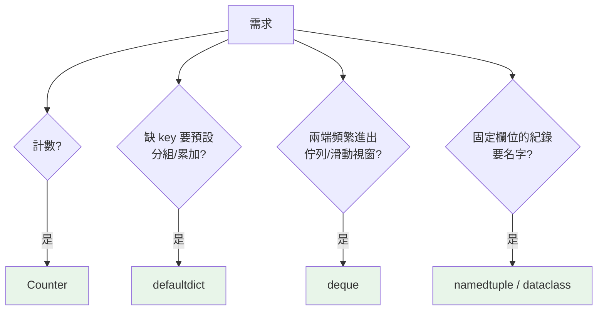

# collections 模組

> 標準庫的 `collections` 提供了幾個「比內建型別更適合特定工作」的容器：計數用 Counter、分組用 defaultdict、雙端佇列用 deque、具名紀錄用 namedtuple——會用它們，程式短一半。

## Why（為什麼）

很多時候你會用內建 dict/list 硬做某件事：寫迴圈計數、`setdefault` 分組、`list.pop(0)` 當佇列（O(n) 陷阱）、用 `t[0]/t[1]` 記不住欄位。`collections` 針對這些場景提供了現成、更快、更清楚的工具。它們是 Python 工程師的日常配備，面試也常考「你會用哪個」。

## Theory（理論：專用容器補內建型別的不足）

`collections` 的核心成員各補一個內建型別的短板：

| 工具 | 補足什麼 | 一句話 |
|------|----------|--------|
| `Counter` | dict 手動計數的囉嗦 | 計數專用 dict |
| `defaultdict` | dict 缺 key 要先建的麻煩 | 缺 key 自動給預設 |
| `deque` | list 頭部進出 O(n) | 兩端 O(1) 的雙端佇列 |
| `namedtuple` | tuple 只能用索引取 | 有欄位名的 tuple |
| `OrderedDict` | (3.7 前)dict 無序 | 有序 dict + move_to_end |
| `ChainMap` | 多個 dict 疊加查找 | 串起多層 dict |

## Specification（規範：各工具速覽）

```python
from collections import Counter, defaultdict, deque, namedtuple, OrderedDict, ChainMap

# Counter：計數
c = Counter("aabbbc")           # Counter({'b': 3, 'a': 2, 'c': 1})
c.most_common(2)                # [('b', 3), ('a', 2)]

# defaultdict：缺 key 自動建預設
dd = defaultdict(list)
dd["x"].append(1)               # 不需先 dd["x"] = []

# deque：雙端佇列
dq = deque([1, 2, 3])
dq.appendleft(0)                # 左端加 → O(1)
dq.popleft()                    # 左端取 → O(1)
dq = deque(maxlen=3)            # 有界 deque（滿了自動擠掉舊的）

# namedtuple：具名 tuple
Point = namedtuple("Point", ["x", "y"])
p = Point(3, 4)
p.x, p.y                        # 用名字取

# ChainMap：多層查找（如 預設值 <- 使用者設定）
cfg = ChainMap(user_config, defaults)
```

## Implementation（重點工具詳解）

### Counter：計數與統計

`Counter` 是專為計數設計的 dict 子類別，缺失 key 回 0（不報錯），並提供 `most_common`：

```pycon
>>> from collections import Counter
>>> votes = Counter(["a", "b", "a", "c", "a", "b"])
>>> votes
Counter({'a': 3, 'b': 2, 'c': 1})
>>> votes["a"]          # 3
>>> votes["z"]          # 0（缺失回 0，不報 KeyError）
>>> votes.most_common(2)
[('a', 3), ('b', 2)]
>>> Counter("aab") + Counter("abc")   # 可相加合併
Counter({'a': 3, 'b': 2, 'c': 1})
```

### defaultdict：自動預設值

`defaultdict(factory)` 在存取不存在的 key 時，自動用 `factory()` 建立預設值：

```pycon
>>> from collections import defaultdict
>>> groups = defaultdict(list)
>>> for word in ["apple", "banana", "avocado"]:
...     groups[word[0]].append(word)     # 缺 key 自動建 []
>>> dict(groups)
{'a': ['apple', 'avocado'], 'b': ['banana']}
>>> counts = defaultdict(int)            # int() → 0，適合計數
>>> counts["x"] += 1                     # 不需先初始化
```

`defaultdict(list)` 分組、`defaultdict(int)` 計數是兩大慣用法。它比 `setdefault` 更清楚，且不會每次都建預設物件（見 [dict](04-dict.md)）。

### deque：兩端都 O(1) 的佇列

list 的 `pop(0)`/`insert(0, x)` 是 O(n)。需要**佇列（FIFO）** 或**兩端頻繁進出**時用 `deque`：

```pycon
>>> from collections import deque
>>> dq = deque([1, 2, 3])
>>> dq.appendleft(0)     # O(1)（list 的 insert(0,x) 是 O(n)）
>>> dq.popleft()         # O(1)（list 的 pop(0) 是 O(n)）
0
>>> recent = deque(maxlen=3)   # 有界：適合「最近 N 筆」
>>> for i in range(5): recent.append(i)
>>> recent
deque([2, 3, 4], maxlen=3)     # 自動擠掉最舊的
```

`deque` 是 BFS、滑動視窗、生產者消費者佇列的標準工具。

### namedtuple：輕量具名紀錄

給 tuple 的欄位名字，讓 `p.x` 取代難懂的 `p[0]`，同時保留 tuple 的不可變與可 hash：

```pycon
>>> from collections import namedtuple
>>> Point = namedtuple("Point", ["x", "y"])
>>> p = Point(3, 4)
>>> p.x, p[0]           # 名字或索引都行
(3, 3)
>>> p._replace(x=10)    # 回傳「換了 x 的新」namedtuple（不可變）
Point(x=10, y=4)
```

需要更多功能（型別註記、預設值、方法）時升級到 `typing.NamedTuple` 或 `@dataclass`（見 [dataclass](../04-oop/09-dataclass.md)）。

## Code Example（可執行的 Python 範例）

```python
# collections_demo.py
from collections import Counter, defaultdict, deque, namedtuple


def top_words(text: str, n: int) -> list[tuple[str, int]]:
    return Counter(text.lower().split()).most_common(n)


def group_by_first_letter(words: list[str]) -> dict[str, list[str]]:
    groups: defaultdict[str, list[str]] = defaultdict(list)
    for w in words:
        groups[w[0]].append(w)
    return dict(groups)


def sliding_window_max_len(stream: list[int], k: int) -> deque[int]:
    """保留最近 k 筆。"""
    window: deque[int] = deque(maxlen=k)
    for x in stream:
        window.append(x)
    return window


Point = namedtuple("Point", ["x", "y"])


def demo() -> None:
    print(f"詞頻: {top_words('a b a c a b', 2)}")            # [('a',3),('b',2)]
    print(f"分組: {group_by_first_letter(['ant', 'bee', 'axe'])}")
    print(f"最近3筆: {list(sliding_window_max_len(list(range(6)), 3))}")  # [3,4,5]
    p = Point(3, 4)
    print(f"具名: p.x={p.x}, p.y={p.y}, 換x後={p._replace(x=9)}")


if __name__ == "__main__":
    demo()
```

**預期輸出**：

```pycon
$ python collections_demo.py
詞頻: [('a', 3), ('b', 2)]
分組: {'a': ['ant', 'axe'], 'b': ['bee']}
最近3筆: [3, 4, 5]
具名: p.x=3, p.y=4, 換x後=Point(x=9, y=4)
```

## Diagram（圖解：該用哪個 collections 工具）



## Best Practice（最佳實踐）

- **計數用 `Counter`、分組/累加用 `defaultdict`**：別再手寫 `if key not in d` 的迴圈。
- **佇列、兩端操作、滑動視窗用 `deque`**：`maxlen` 對「最近 N 筆」極方便；別用 list 的 `pop(0)`。
- **固定欄位的輕量紀錄用 `namedtuple`**；需要型別/預設/方法就用 `@dataclass` 或 `typing.NamedTuple`。
- **多層設定查找用 `ChainMap`**（如「使用者設定覆蓋預設」）。
- **3.7+ 一般 dict 已保序**，`OrderedDict` 現多用於需要 `move_to_end`（如手刻 LRU）的場合。
- **`Counter` 的算術**（相加、相減、`&`、`|`）處理多重集合很方便。

## Common Mistakes（常見誤解）

- **用 list 當佇列 `pop(0)`**：O(n)；用 `deque.popleft()`（O(1)）。
- **手寫計數/分組迴圈**：`Counter`/`defaultdict` 更短更快。
- **`defaultdict` 意外新增 key**：光是「讀取」不存在的 key 也會建立它（觸發 factory）；若只想查詢不想新增，用普通 dict 的 `get`。
- **`namedtuple` 想改欄位**：它不可變；用 `_replace` 產生新的，或改用 dataclass。
- **以為需要 `OrderedDict` 才有序**：3.7+ 一般 dict 就保序，除非要 `move_to_end` 等特有功能。
- **`Counter` 減法出現負數/0**：`Counter` 相減可能保留 0 或負值，需要「只留正數」用 `+Counter()` 或 `c.total()` 等技巧。

## Interview Notes（面試重點）

- 說得出各工具的定位：**Counter（計數）、defaultdict（缺 key 自動預設，分組/計數）、deque（兩端 O(1)）、namedtuple（具名 tuple）**。
- 知道 **list 頭部操作 O(n) → 佇列該用 deque**（BFS、滑動視窗、`maxlen`）。
- 能對比 **`defaultdict` vs `dict.setdefault` vs `Counter`** 在計數/分組的取捨。
- 知道 **`defaultdict` 讀取缺失 key 會建立它** 的副作用。
- 知道 **namedtuple 不可變、`_replace` 產生新物件**，以及何時升級到 dataclass。
- 加分：`ChainMap` 多層查找、`Counter` 的多重集合算術、`OrderedDict` 在 3.7+ 的定位。

---

➡️ 下一章：[淺複製與深複製](09-copy-shallow-deep.md)

[⬆️ 回 Part 3 索引](README.md)
