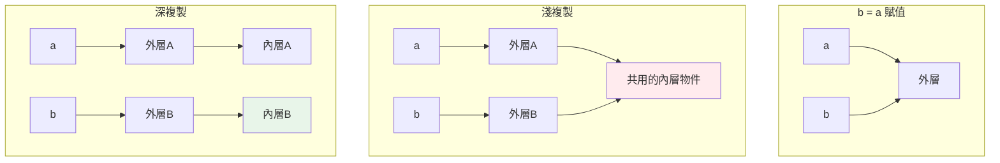

# 淺複製與深複製

> 「我複製了一份，怎麼改副本也改到原本？」——因為淺複製只複製最外層容器，內層的可變物件仍然共用。搞懂淺/深複製的界線，才能安全地複製巢狀資料。

## Why（為什麼）

複製資料是常見需求：想改一份而不動原本、想給函式一份獨立的資料。但 Python 的複製有兩個層次，混淆它們會製造難查的 bug——你以為複製了，改副本卻改到了原本的內層資料。這章釐清賦值、淺複製、深複製三者的差別，以及各自該用在哪。這是 [可變性](06-mutability.md) 與 [名稱綁定](../02-fundamentals/01-dynamic-typing.md) 的實戰延伸。

## Theory（理論：三個層次）

處理「複製」時，有三種層次，差別在**複製到多深**：

1. **賦值 `b = a`**：完全不複製，只是多一個名稱指向**同一物件**（別名）。改任一個都影響彼此。
2. **淺複製（shallow copy）**：建立一個**新的外層容器**，但裡面的元素仍是**原元素的參照**（共用內層物件）。
3. **深複製（deep copy）**：遞迴複製**所有層次**，副本與原本完全獨立，內層也不共用。

對「一層」的資料，淺複製就夠獨立；但對**巢狀**（list of list、dict of list）資料，淺複製的內層仍共用，改內層會互相影響——這時才需要深複製。

## Specification（規範：各種複製方式）

```python
import copy

a = [[1, 2], [3, 4]]

# 1. 賦值（別名，不複製）
b = a                    # b is a → True

# 2. 淺複製（外層新、內層共用）
b = a.copy()             # list 的 copy 方法
b = a[:]                 # 切片
b = list(a)              # 建構子
b = copy.copy(a)         # copy 模組

# 3. 深複製（完全獨立）
b = copy.deepcopy(a)
```

dict 也有 `.copy()`（淺）；深複製一律用 `copy.deepcopy`。

## Implementation（淺 vs 深的實際差異）

### 淺複製：外層獨立、內層共用

```pycon
>>> import copy
>>> a = [[1, 2], [3, 4]]
>>> b = a.copy()          # 淺複製
>>> b is a
False                     # 外層是新的 list
>>> b[0] is a[0]
True                      # 但內層是「同一個」list！
>>> b.append([5, 6])      # 改外層 → 不影響 a
>>> a
[[1, 2], [3, 4]]
>>> b[0].append(99)       # 改內層 → 影響 a！
>>> a
[[1, 2, 99], [3, 4]]      # a 的內層也變了
```

淺複製對「外層操作」（append、替換整個元素）安全，但對「修改共用的內層物件」不安全。

### 深複製：完全獨立

```pycon
>>> a = [[1, 2], [3, 4]]
>>> b = copy.deepcopy(a)
>>> b[0] is a[0]
False                     # 內層也是新的
>>> b[0].append(99)       # 改內層
>>> a
[[1, 2], [3, 4]]          # a 完全不受影響
```

`deepcopy` 遞迴複製每一層，還能正確處理**循環參照**（a 裡有指向 a 自己的元素）而不會無限遞迴。代價是較慢、較耗記憶體。

### 為什麼一層資料淺複製就夠

```pycon
>>> a = [1, 2, 3]         # 元素是不可變的 int
>>> b = a.copy()
>>> b[0] = 99             # 「替換」元素 → 只動 b 的外層
>>> a
[1, 2, 3]                 # a 不受影響
```

元素不可變時，你只能「替換」不能「原地改內層」，所以淺複製就等效於完全獨立。**淺/深的差別只在「元素本身是可變物件」時才浮現。**

## Code Example（可執行的 Python 範例）

```python
# copy_demo.py
import copy


def shallow_vs_deep() -> tuple[list, list]:
    """回傳 (淺複製後被影響的原本, 深複製後不受影響的原本)。"""
    original1 = [[1, 2], [3, 4]]
    shallow = original1.copy()
    shallow[0].append(99)        # 改內層 → 影響 original1

    original2 = [[1, 2], [3, 4]]
    deep = copy.deepcopy(original2)
    deep[0].append(99)           # 改內層 → 不影響 original2

    return original1, original2


def safe_modify(data: dict[str, list[int]]) -> dict[str, list[int]]:
    """深複製後修改，保證不動到呼叫者的資料。"""
    result = copy.deepcopy(data)
    for key in result:
        result[key].append(0)
    return result


def demo() -> None:
    aff, unaff = shallow_vs_deep()
    print(f"淺複製後原本被影響: {aff}")      # [[1, 2, 99], [3, 4]]
    print(f"深複製後原本不變:   {unaff}")    # [[1, 2], [3, 4]]

    src = {"a": [1], "b": [2]}
    out = safe_modify(src)
    print(f"呼叫者資料不變: {src}")          # {'a': [1], 'b': [2]}
    print(f"回傳的新資料:   {out}")          # {'a': [1, 0], 'b': [2, 0]}


if __name__ == "__main__":
    demo()
```

**預期輸出**：

```pycon
$ python copy_demo.py
淺複製後原本被影響: [[1, 2, 99], [3, 4]]
深複製後原本不變:   [[1, 2], [3, 4]]
呼叫者資料不變: {'a': [1], 'b': [2]}
回傳的新資料:   {'a': [1, 0], 'b': [2, 0]}
```

## Diagram（圖解：三種層次）



## Best Practice（最佳實踐）

- **一層（元素不可變）的資料，淺複製即可**：`a.copy()`、`a[:]`、`list(a)`、`dict(d)`。
- **巢狀且會修改內層 → 用 `copy.deepcopy`**：確保完全獨立。
- **函式不想動到呼叫者的可變資料**：進來先複製（淺或深視巢狀程度），或回傳新物件。
- **能用不可變結構就用**：tuple、frozenset、`@dataclass(frozen=True)` 從根本避免「被改到」的問題，也就不太需要複製。
- **`deepcopy` 有成本**：大型/深層結構較慢，非必要別濫用；只需獨立最外層時用淺複製。
- **自訂類別可實作 `__copy__` / `__deepcopy__`** 控制複製行為（進階）。

## Common Mistakes（常見誤解）

- **以為 `b = a` 是複製**：那是別名，`b is a`；改任一個都互相影響。
- **淺複製巢狀資料後改內層**：內層共用，原本也被改（最常見的複製 bug）。
- **對巢狀資料用 `a[:]` / `.copy()` 期待完全獨立**：只獨立外層；要深複製用 `deepcopy`。
- **濫用 `deepcopy`**：對只需獨立一層的資料用 deepcopy，浪費效能。
- **忘了 dict/set 裡的可變 value 也會共用**：`d.copy()` 是淺的，value 若是 list 仍共用。
- **deepcopy 自訂物件出意外**：若物件持有外部資源（檔案、連線），deepcopy 可能不合語意；需自訂 `__deepcopy__`。

## Interview Notes（面試重點）

- 能區分**賦值（別名）、淺複製、深複製**三個層次，並說出各自「複製到多深」。
- 說得出**淺複製 = 新外層 + 共用內層**，並知道對巢狀可變資料改內層會互相影響。
- 知道 **`copy.deepcopy` 遞迴複製、能處理循環參照、但較慢**。
- 能解釋**為何一層（不可變元素）淺複製就等效獨立**（只能替換不能改內層）。
- 知道多種淺複製寫法（`.copy()`、`[:]`、`list()`、`copy.copy`）與深複製（`copy.deepcopy`）。
- 連結到用**不可變結構**從根本避免複製需求。

---

➡️ 下一章：[常用內建函式](10-builtin-functions.md)

[⬆️ 回 Part 3 索引](README.md)
