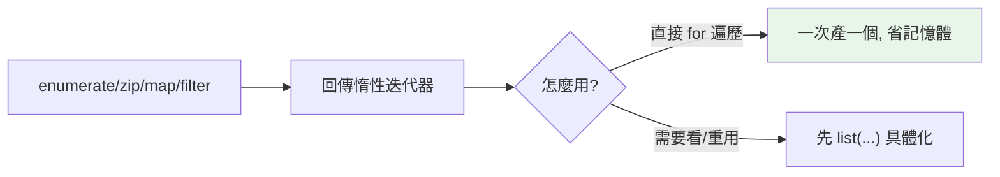

# 常用內建函式

> `enumerate`、`zip`、`map`、`filter`、`any`、`all`、`sum`、`sorted`、`reversed`——這些不用 import 的內建函式，是寫出簡潔 Pythonic 程式的關鍵詞彙。多數還是惰性的，順手就省了記憶體。

## 💡 白話導讀（建議先讀）

這章是一批「不用 import、隨手可得」的內建函式。它們住在 [LEGB 的最外層](../02-fundamentals/11-scope-legb.md)——巷口便利商店，永遠營業。

先給幾個立即提升程式碼品質的替換：

```python
for i, item in enumerate(items):      # 要索引又要元素 → enumerate（別再 range(len())）
for name, score in zip(names, scores): # 兩條序列並排走 → zip（像拉拉鍊）
if any(x > 10 for x in nums):          # 「有沒有任何一個…」→ any
if all(x > 0 for x in nums):           # 「是不是每一個都…」→ all
```

這章有一個貫穿的重要概念：**惰性（lazy）**。

`enumerate`、`zip`、`map`、`filter`、`range` 這些函式回傳的**不是算好的清單**，而是一張「**點餐券**」——
拿到時什麼都還沒做，**你迭代到哪、它才現做到哪**。

好處：不佔記憶體（一百萬筆也不怕）、甚至能處理無限序列。
兩個代價要記牢：

1. **點餐券用過一次就作廢**——迭代完就空了，想再看一遍得重新拿券。
2. **想直接看內容要先兌現**——`print(map(...))` 印出來是券不是菜，要 `list(...)` 才看到結果。

「惰性」這個概念之後在[生成器](../07-iterators-generators/README.md)會全面展開,這裡先混個臉熟。

## Why（為什麼）

Python 有一組「隨手可用、不用 import」的內建函式（builtins），它們封裝了最常見的序列操作。用好它們，很多迴圈就消失了——`for i in range(len(x))` 變 `enumerate`、手動累加變 `sum`、手寫「是否全部符合」變 `all`。不知道它們的存在，就會重造輪子、寫出冗長又易錯的程式。這章整理最常用的一批，並點出惰性求值這個容易忽略的特性。

## Theory（理論：內建函式與惰性）

**內建函式（built-in functions）** 位於 LEGB 的 B 層（見[作用域](../02-fundamentals/11-scope-legb.md)）——巷口便利商店，永遠可用、不需 import。

貫穿多數序列內建的關鍵特性：**惰性求值（lazy evaluation）**。

`enumerate`、`zip`、`map`、`filter`、`reversed`、`range` 都不立刻算出全部結果，而是回傳一個**迭代器**（那張「點餐券」），一次產一個（見 [iterable 與 iterator](../07-iterators-generators/01-iterable-iterator.md)）。

- **好處**：省記憶體、可處理無限序列。
- **代價**：**只能遍歷一次**（券用過作廢）；要看內容得先 `list(...)`（兌現）。

## Specification（規範：常用內建速覽）

| 函式 | 作用 | 惰性? |
|------|------|:----:|
| `len(x)` | 長度 | — |
| `range(a, b, s)` | 產生整數序列 | ✅ |
| `enumerate(it, start)` | 邊遍歷邊給索引 | ✅ |
| `zip(a, b, ...)` | 平行遍歷多序列 | ✅ |
| `map(f, it)` | 對每個元素套用 f | ✅ |
| `filter(f, it)` | 保留 f 為真的元素 | ✅ |
| `sorted(it, key, reverse)` | 排序（回新 list） | ❌ |
| `reversed(seq)` | 反向迭代器 | ✅ |
| `sum(it, start)` | 加總 | — |
| `min/max(it, key, default)` | 最小/大值 | — |
| `any(it)` / `all(it)` | 是否有任一/全部為真 | 短路 |
| `zip`, `abs`, `round`, `sorted`... | 其他常用 | — |

## Implementation（重點函式與慣用法）

### enumerate / zip：取代 range(len(...))

```pycon
>>> names = ["Alice", "Bob"]
>>> for i, name in enumerate(names, start=1):
...     print(i, name)             # 1 Alice / 2 Bob
>>> scores = [90, 85]
>>> for name, score in zip(names, scores):
...     print(name, score)
>>> dict(zip(names, scores))       # 用 zip 建 dict
{'Alice': 90, 'Bob': 85}
```

`zip` 以最短序列為準；`zip(a, b, strict=True)`（3.10+）在長度不符時報錯。`zip(*matrix)` 還能「轉置」二維資料。

### any / all：短路的存在/全稱判斷

```pycon
>>> nums = [2, 4, 6]
>>> all(x % 2 == 0 for x in nums)      # 全部為偶？→ True
True
>>> any(x > 5 for x in nums)           # 有任何 > 5？→ True
True
>>> all([])                            # 空 → True（vacuous truth）
True
>>> any([])                            # 空 → False
False
```

配生成器表達式（見 [推導式](../02-fundamentals/13-comprehensions.md)）是驗證資料的慣用法，且**短路**（`any` 遇到第一個真就停、`all` 遇到第一個假就停）。注意空序列的邊界：`all([])` 是 True、`any([])` 是 False。

### map / filter vs 推導式

```pycon
>>> list(map(str.upper, ["a", "b"]))         # ['A', 'B']
>>> list(filter(None, [0, 1, "", "x"]))      # filter(None,...) 過濾 falsy → [1, 'x']
```

多數情況**推導式比 `map`/`filter` + lambda 更 Pythonic**；但 `map(func, it)` 傳「現成具名函式」時很簡潔。記得它們惰性，要 `list()` 才看得到。

### sum / min / max：聚合

```pycon
>>> sum([1, 2, 3])                     # 6
>>> sum([[1], [2]], start=[])          # 展平（但用 itertools.chain 更好）→ [1, 2]
>>> max(["apple", "kiwi"], key=len)    # 'apple'（用 key）
>>> min([], default=0)                 # 空序列給預設，避免 ValueError → 0
```

`min`/`max` 的 `key`（見 [排序](11-sorting.md)）與 `default`（空序列時的回傳）很實用。`sum` 別拿來連接字串（用 `join`）。

### sorted / reversed

```pycon
>>> sorted([3, 1, 2])                  # [1, 2, 3]（回新 list，不改原本）
>>> sorted(words, key=len, reverse=True)
>>> list(reversed([1, 2, 3]))          # [3, 2, 1]（回迭代器）
```

`sorted` 回**新 list**、`list.sort()` 原地排序；詳見 [排序](11-sorting.md)。

## Code Example（可執行的 Python 範例）

```python
# builtins_demo.py
def demo() -> None:
    names = ["Alice", "Bob", "Cara"]
    scores = [90, 85, 78]

    # 1. enumerate
    for rank, name in enumerate(sorted(names), start=1):
        print(f"{rank}. {name}")

    # 2. zip 建 dict + 找最高分
    table = dict(zip(names, scores))
    top = max(table, key=table.get)       # key 用 dict.get 取值比較
    print(f"最高分: {top} ({table[top]})")

    # 3. any / all
    print(f"全部及格: {all(s >= 60 for s in scores)}")   # True
    print(f"有滿分: {any(s == 100 for s in scores)}")    # False

    # 4. sum / min with default
    print(f"總分: {sum(scores)}, 空的最小值: {min([], default=-1)}")

    # 5. zip 轉置
    matrix = [[1, 2, 3], [4, 5, 6]]
    print(f"轉置: {[list(col) for col in zip(*matrix)]}")


if __name__ == "__main__":
    demo()
```

**預期輸出**：

```pycon
$ python builtins_demo.py
1. Alice
2. Bob
3. Cara
最高分: Alice (90)
全部及格: True
有滿分: False
總分: 253, 空的最小值: -1
轉置: [[1, 4], [2, 5], [3, 6]]
```

## Diagram（圖解：惰性內建的使用）



## Best Practice（最佳實踐）

- **取索引用 `enumerate`、平行遍歷用 `zip`**，別 `range(len(...))`。
- **驗證資料用 `any`/`all` + 生成器**：短路、簡潔；注意空序列邊界（`all([])==True`）。
- **`min`/`max`/`sorted` 善用 `key=`**（見 [排序](11-sorting.md)）；`min`/`max` 對可能為空的序列用 `default=`。
- **記得惰性內建只能遍歷一次**：要重用或檢視就 `list(...)`。
- **`sum` 別接字串**（用 `"".join`）、**展平別用 `sum(lists, [])`**（O(n²)，用 `itertools.chain`）。
- **推導式常比 `map`/`filter`+lambda 清楚**；但傳現成函式時 `map(func, it)` 也很好。

## Common Mistakes（常見誤解）

- **忘了 `map`/`filter`/`zip`/`enumerate` 是惰性迭代器**：直接 `print` 看到 `<map object>`；要 `list()`。
- **重複遍歷惰性迭代器**：第二次是空的（已耗盡）。
- **`zip` 長度不等默默截斷**：預期等長用 `strict=True`。
- **`all([])` / `any([])` 邊界**：分別是 True / False，容易誤判。
- **`sum` 連接字串**：`sum(strings, "")` 會 TypeError（且慢）；用 `join`。
- **`max`/`min` 對空序列**：`ValueError`；給 `default=`。
- **`filter(None, it)`** 的意思是「過濾掉 falsy」，不是不過濾——容易誤讀。

## Interview Notes（面試重點）

- 熟練 **enumerate / zip / any / all / sum / min / max / sorted / reversed / map / filter** 的用途與慣用法。
- 知道多數序列內建是**惰性迭代器**（只遍歷一次、要 `list()` 具體化、省記憶體）。
- 知道 **`any`/`all` 短路** 與**空序列邊界**（`all([])=True`、`any([])=False`）。
- 會用 **`key=`**（`max`/`min`/`sorted`）與 **`default=`**（`max`/`min` 空序列）。
- 知道 **`zip(*matrix)` 轉置**、`dict(zip(keys, values))` 建 dict 等技巧。
- 知道**推導式 vs map/filter** 的取捨，以及 `sum` 不該接字串。

---

➡️ 下一章：[排序 sorted / key / operator](11-sorting.md)

[⬆️ 回 Part 3 索引](README.md)
