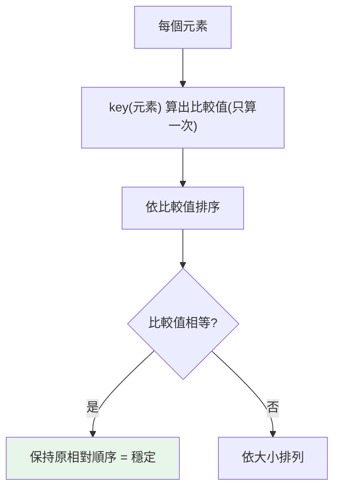

# 排序 sorted / key / operator

> `sorted` 與 `list.sort` 的差別、`key` 函式怎麼用、多鍵排序與穩定排序——排序看似簡單，但這些細節決定你能不能一行寫出正確的複雜排序。

## 💡 白話導讀（建議先讀）

排序的 API 只有兩個，先分清楚：

- **`sorted(xs)`**：回傳**排好的新 list**，原資料不動。（適用任何可迭代物件）
- **`xs.sort()`**：**原地**把 list 排好，回傳 `None`——所以 `xs = xs.sort()` 是經典自殺（xs 變成 None）。

真正的主角是 **`key` 參數**——它回答「**照什麼排**」：

```python
sorted(words, key=len)                    # 照長度排
sorted(users, key=lambda u: u["age"])     # 照年齡排
```

`key` 的運作方式像**比賽評分**：不直接比選手本人,而是先給每人算一個分數（對每個元素呼叫一次 key）,照分數排名——選手本身不變。

兩個進階但常用的事實：

1. **Python 的排序是「穩定」的**：分數相同的人,**保持原本的先後**。
   這帶來一招:要「先照 A 排、A 相同再照 B 排」?可以**先照 B 排一次、再照 A 排一次**——穩定性保證 B 的順序在 A 相同時被保留。（更常用的一招:key 回傳 tuple `key=lambda u: (u["dept"], u["age"])`,一次搞定多鍵。）
2. **反向**用 `reverse=True`,別自己把 key 加負號扭曲。

底層演算法叫 **Timsort**（Python 發明、後來 Java 也採用）,對「部分已排序」的真實資料特別快——知道名字即可。

## 🔗 前端對照

排序是前端最經典的坑之一,對照 Python 你會鬆一口氣:

| | Python | JavaScript |
|---|--------|-----------|
| 排數字 | `sorted([1, 2, 10])` → `[1, 2, 10]` ✅ | `[1, 2, 10].sort()` → **`[1, 10, 2]`** ❌ |
| 預設怎麼比 | 按**值**比較 | 把元素**轉字串**按字典序比 |
| 自訂鍵 | `sorted(xs, key=len)` | `xs.sort((a, b) => a - b)` |
| 反序 | `sorted(xs, reverse=True)` | `xs.sort(...).reverse()` |
| 原地 vs 回新的 | `list.sort()` 原地、`sorted()` 回新的 | `sort()` **原地**（會改到原陣列） |

一句話:JS 的 `.sort()` 預設**把數字當字串排**（`[1, 10, 2]` 那個著名的坑）;**Python 的 `sorted` 按值排,沒這問題**。
另外 Python 用 `key=`（每個元素只算一次鍵）,比 JS 的兩兩比較函式更直覺、也更快。

## Why（為什麼）

排序無所不在：依分數排學生、依日期排訂單、依多個欄位排序。Python 的排序工具很強大，但要用好得懂幾個關鍵：`sorted`（回新 list）vs `sort`（原地）、`key`（怎麼決定比較依據）、**穩定排序**（相等元素保持原順序，這讓多鍵排序變簡單）、以及 `operator` 模組能取代大量 lambda。搞懂這些，複雜排序也能一行搞定，面試也常考。

## Theory（理論：Timsort、穩定、key 轉換）

Python 的排序用 **Timsort**——混合合併排序與插入排序的演算法，最壞 O(n log n)，對「部分已排序」的資料特別快。兩個關鍵性質：

1. **穩定（stable）**：值相等的元素，排序後**保持原本的相對順序**。
   這是「多鍵排序能靠連續排序實現」的基礎（先排次要鍵、再排主要鍵）。

2. **key 轉換**（比賽評分模型）：排序時對每個元素呼叫 `key(元素)` 得到「比較用的分數」，照分數排——原元素不變。
   CPython 對每個元素**只算一次 key**（decorate-sort-undecorate），所以 key 即使稍貴也不會被重複呼叫。

## Specification（規範：sorted / sort / 參數）

```text
# sorted：回傳「新的已排序 list」，原序列不變；接受任何 iterable
sorted(iterable, *, key=None, reverse=False)

# list.sort：原地排序 list，回傳 None；只有 list 有
list.sort(*, key=None, reverse=False)
```

```python
sorted([3, 1, 2])                       # [1, 2, 3]（新 list）
sorted([3, 1, 2], reverse=True)         # [3, 2, 1]
sorted(words, key=len)                  # 依長度
sorted(people, key=lambda p: p.age)     # 依屬性

nums = [3, 1, 2]
nums.sort()                             # 原地，nums 變 [1,2,3]
result = nums.sort()                    # ⚠️ result 是 None！
```

⚠️ `list.sort()` 回傳 `None`（原地操作的慣例）——`x = mylist.sort()` 會讓 x 變 None，是常見錯誤。

## Implementation（key、多鍵、operator、穩定排序）

### key：把「怎麼比」抽出來

`key` 函式把每個元素轉成用來比較的值：

```pycon
>>> words = ["banana", "kiwi", "apple"]
>>> sorted(words, key=len)              # 依長度
['kiwi', 'apple', 'banana']
>>> sorted(words, key=str.lower)        # 不分大小寫
>>> data = [("Bob", 25), ("Alice", 30)]
>>> sorted(data, key=lambda t: t[1])    # 依第二欄（年齡）
[('Bob', 25), ('Alice', 30)]
```

### operator：比 lambda 更快更清楚

取索引/屬性當 key 時，`operator.itemgetter` / `attrgetter` 比 lambda 更好（也稍快）：

```pycon
>>> from operator import itemgetter, attrgetter
>>> sorted(data, key=itemgetter(1))            # 取代 lambda t: t[1]
>>> sorted(data, key=itemgetter(1, 0))         # 多鍵：先第 1 欄，再第 0 欄
>>> sorted(people, key=attrgetter("age"))      # 取代 lambda p: p.age
>>> sorted(people, key=attrgetter("dept", "age"))  # 多屬性
```

`itemgetter(1, 0)` 一次取多個欄位組成 tuple 當 key——這就是**多鍵排序**。

### 多鍵排序：兩種做法

**做法一：key 回傳 tuple**（一次到位，tuple 逐欄比較）：

```pycon
>>> # 先依部門升序，再依年齡「降序」
>>> sorted(people, key=lambda p: (p.dept, -p.age))   # 數值可用負號反向
```

**做法二：利用穩定排序，分次排**（適合欄位方向不同、或無法用負號時）：

```pycon
>>> # 想「部門升序、名字降序」：先排次要鍵，再排主要鍵
>>> data.sort(key=attrgetter("name"), reverse=True)  # 次要：名字降
>>> data.sort(key=attrgetter("dept"))                # 主要：部門升
>>> # 因為排序穩定，第二次排序時同部門者維持上一輪的名字降序
```

**穩定性讓「分次排序」正確**：後排的主鍵決定大方向，相等時保留前一輪（次鍵）的順序。這是穩定排序最實用的價值。

### sorted vs sort 的選擇

| | `sorted(x)` | `x.sort()` |
|--|-------------|------------|
| 回傳 | 新 list | None（原地） |
| 原序列 | 不變 | 被改變 |
| 適用 | 任何 iterable | 只有 list |
| 何時用 | 要保留原本、或輸入非 list | 確定要就地改、省記憶體 |

## Code Example（可執行的 Python 範例）

```python
# sorting_demo.py
from dataclasses import dataclass
from operator import attrgetter, itemgetter


@dataclass
class Employee:
    name: str
    dept: str
    age: int


def demo() -> None:
    # 1. key + operator
    data = [("Bob", 25), ("Alice", 30), ("Cara", 25)]
    print("依年齡:", sorted(data, key=itemgetter(1)))

    # 2. 多鍵：先年齡升、同齡再名字升（tuple key）
    print("多鍵:", sorted(data, key=lambda t: (t[1], t[0])))

    # 3. 穩定排序 + 分次排（部門升、同部門年齡降）
    emps = [
        Employee("Alice", "eng", 30),
        Employee("Bob", "eng", 25),
        Employee("Cara", "sales", 28),
    ]
    emps.sort(key=attrgetter("age"), reverse=True)   # 次要鍵先
    emps.sort(key=attrgetter("dept"))                # 主要鍵後
    print("分次排:", [(e.name, e.dept, e.age) for e in emps])

    # 4. sort 回傳 None 的陷阱
    nums = [3, 1, 2]
    result = nums.sort()
    print(f"sort() 回傳: {result}, nums 已就地排序: {nums}")


if __name__ == "__main__":
    demo()
```

**預期輸出**：

```pycon
$ python sorting_demo.py
依年齡: [('Bob', 25), ('Cara', 25), ('Alice', 30)]
多鍵: [('Bob', 25), ('Cara', 25), ('Alice', 30)]
分次排: [('Alice', 'eng', 30), ('Bob', 'eng', 25), ('Cara', 'sales', 28)]
sort() 回傳: None, nums 已就地排序: [1, 2, 3]
```

## Diagram（圖解：key 轉換與穩定排序）



## Best Practice（最佳實踐）

- **要保留原序列或輸入非 list → `sorted`；要就地省記憶體 → `list.sort`**。記得 `sort()` 回 None。
- **用 `key=` 表達比較依據**；取索引/屬性優先用 `operator.itemgetter`/`attrgetter`（比 lambda 快且清楚）。
- **多鍵排序**：同方向用 tuple key `key=lambda x: (a, b)`；數值反向可用負號 `-x`；方向混合或不可負時，利用**穩定排序分次排**（先次要鍵、後主要鍵）。
- **不可比較的型別別混排**：`sorted([1, "a"])` 會 TypeError；必要時用 key 統一。
- **大量資料排序前先想清楚 key**：key 只算一次，昂貴 key 可接受，但別在 key 裡做副作用。
- **只要 top-k 不需全排序**：用 `heapq.nlargest`/`nsmallest`（見 [heapq](12-heapq-bisect.md)）更省。

## Common Mistakes（常見誤解）

- **`x = mylist.sort()`**：`sort` 原地、回 None，x 變 None。要新 list 用 `sorted`。
- **以為 `sorted` 會改原本**：不會，它回新 list；改原本用 `.sort()`。
- **多鍵方向混合硬塞一個 tuple**：升降混合時 tuple 不夠（除非數值可加負號）；用穩定排序分次排。
- **忘了排序穩定**：以致不知道能靠分次排實現複雜多鍵。
- **混合不可比較型別排序**：`TypeError: '<' not supported`；用 key 轉成可比較的值。
- **在 key 裡做昂貴或有副作用的事**：key 對每元素呼叫一次，副作用會累積；保持 key 純函式。
- **`reverse=True` 與負號 key 混淆**：兩者都能反向，但同時用會互相抵消。

## Interview Notes（面試重點）

- 說得出 **`sorted`（回新 list、任何 iterable）vs `list.sort`（原地、回 None、僅 list）** 的差異。
- 知道 Python 排序是 **Timsort、O(n log n)、穩定**，並能說明**穩定排序如何支撐「分次排序」實現多鍵**。
- 會用 **`key=`** 及 **`operator.itemgetter`/`attrgetter`**（比 lambda 好），並能寫 **tuple key 多鍵排序**與**負號反向**。
- 知道 **`sort()` 回 None** 的陷阱、混合型別排序會 TypeError。
- 知道 **只要 top-k 用 `heapq.nlargest`** 比全排序省（連結 [heapq](12-heapq-bisect.md)）。

---

➡️ 下一章：[heapq 與 bisect](12-heapq-bisect.md)

[⬆️ 回 Part 3 索引](README.md)
