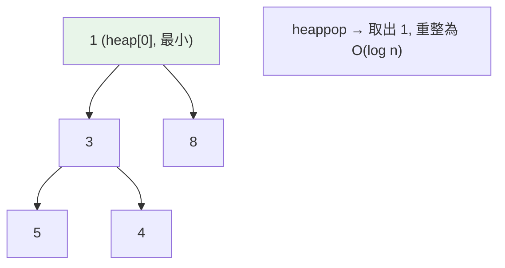

# heapq 與 bisect

> 當你需要「一直拿最小值」或「在已排序序列裡快速找位置」，別每次都 `sort()`——`heapq` 給你 O(log n) 的優先佇列，`bisect` 給你 O(log n) 的二分搜尋。這兩個是面試白板題的常客。

## 💡 白話導讀（建議先讀）

兩個「別每次都重新 sort」的工具，各對應一種日常需求。

**需求一：我要一直拿「目前最小的」。**（任務排程、找前 K 大、合併多路資料）

笨方法：每次都 `sort()` 再取第一個——每次 O(n log n)。
**`heapq`（堆積）** 的做法像**醫院檢傷分類**：病患不用全體排成一列,只維持一個鬆散的規則「**最緊急的永遠站在門口**」。
門口那位是誰,隨時看得到（`heap[0]`,O(1)）;叫走門口的、或新病患進來,只要局部調整隊形（O(log n)）——**不用全場重排**。

```python
heapq.heappush(heap, item)   # 進來一位
heapq.heappop(heap)          # 叫走最小的
heapq.nlargest(3, nums)      # 順帶：前 3 大，一行
```

**需求二：在「已排好」的序列裡快速找位置。**

笨方法：從頭掃到尾 O(n)。
**`bisect`（二分搜尋）** 像**查紙本字典**：翻中間、比一下、丟掉一半、再翻中間——千萬筆資料 20 次就定位（O(log n)）。
`bisect.bisect(sorted_list, x)` 告訴你「x 該插在哪」;`insort` 直接幫你插進去、維持有序。

兩個前提務必記住：`bisect` **只對已排序的序列**有效（無序資料上用它=拿到錯誤答案不報錯）;`heapq` 的 list 順序看起來亂是正常的——它只保證「最小在 heap[0]」,不保證全體有序。

## Why（為什麼）

兩個常見需求，用「每次都重排」解決會很慢：

1. **反覆取出最小（或最大）值**——例如任務排程、Dijkstra、合併多個已排序串流。每次 `min()` 是 O(n)、每次 `sort()` 是 O(n log n)。
2. **在一個已排序的 list 裡找「該插在哪」或「有幾個比 x 小」**——線性搜尋 O(n)。

`heapq`（堆積/優先佇列）與 `bisect`（二分搜尋）用對數時間解決這些，是標準庫裡 CP/面試最實用的兩個模組。

## Theory（理論：heap 與二分搜尋）

**heapq — 二元最小堆積（min-heap）**：用 list 表示的完全二元樹，永遠滿足「父節點 ≤ 子節點」——檢傷分類的「最緊急者在門口」。

- **最小值永遠在 `heap[0]`**：O(1) 查看。
- 插入（push）與彈出最小（pop）：**O(log n)**——只做局部調整，不全場重排。
- Python 的 `heapq` 是 **min-heap**（最小值先出）。

**bisect — 二分搜尋**：在**已排序**的序列上，用二分法找「x 應該插入的位置」——查字典式的對半翻，O(log n)。可用來維持有序、計數、範圍查詢。

關鍵前提：

- `bisect` 要求序列**已排序**（無序資料上會靜默給錯答案）。
- `heapq` 自己維持堆積性質（list 整體看起來無序是正常的）。

## Specification（規範：兩模組的 API）

```python
import heapq

heapq.heapify(lst)              # 原地把 list 變成 heap → O(n)
heapq.heappush(heap, item)      # 推入 → O(log n)
heapq.heappop(heap)             # 彈出「最小」→ O(log n)
heapq.heappushpop(heap, item)   # 先 push 再 pop（更快）
heap[0]                         # 查看最小值（不彈出）→ O(1)
heapq.nlargest(k, it, key=...)  # 最大的 k 個
heapq.nsmallest(k, it, key=...) # 最小的 k 個

import bisect

bisect.bisect_left(a, x)        # x 應插入的最左位置（= 有幾個 < x）
bisect.bisect_right(a, x)       # 最右位置（= 有幾個 <= x）
bisect.insort(a, x)             # 插入並保持有序 → O(n)（搜尋 O(log n)，插入 O(n)）
```

## Implementation（優先佇列、top-k、二分應用）

### heapq：優先佇列

```pycon
>>> import heapq
>>> h = []
>>> for x in [5, 1, 8, 3]:
...     heapq.heappush(h, x)
>>> h[0]                 # 最小值 O(1)
1
>>> heapq.heappop(h)     # 彈出最小
1
>>> heapq.heappop(h)
3
```

**要 max-heap？** Python 只有 min-heap，取負號模擬：`heappush(h, -x)`、彈出後再取負。或用帶優先度的 tuple。

**帶優先度的元素**用 tuple `(priority, item)`，heap 依第一欄比較：

```pycon
>>> tasks = []
>>> heapq.heappush(tasks, (2, "寫報告"))
>>> heapq.heappush(tasks, (1, "修 bug"))     # 優先度 1 最急
>>> heapq.heappop(tasks)
(1, '修 bug')
```

⚠️ 若優先度相同，heap 會比較 tuple 的**下一欄**；若那欄不可比較（如自訂物件）會 TypeError。慣用法是加一個遞增序號當第二欄打破平手：`(priority, count, item)`。

### top-k：nlargest / nsmallest 勝過全排序

只要「最大/最小的 k 個」時，`heapq.nlargest(k, ...)` 是 **O(n log k)**，比 `sorted(...)[:k]` 的 O(n log n) 省（k 遠小於 n 時）：

```pycon
>>> import heapq
>>> nums = [5, 1, 8, 3, 9, 2]
>>> heapq.nlargest(3, nums)          # [9, 8, 5]
>>> heapq.nsmallest(2, nums)         # [1, 2]
>>> heapq.nlargest(2, people, key=lambda p: p.score)   # 支援 key
```

### bisect：二分搜尋與應用

```pycon
>>> import bisect
>>> a = [1, 3, 3, 5, 7]
>>> bisect.bisect_left(a, 3)     # 3 的最左插入點 = 有幾個 < 3 → 1
1
>>> bisect.bisect_right(a, 3)    # 最右 = 有幾個 <= 3 → 3
3
>>> bisect.insort(a, 4)          # 插入並保持有序
>>> a
[1, 3, 3, 4, 5, 7]
```

**成績轉等第**是經典應用——用 bisect 在門檻表上定位：

```python
def grade(score: int) -> str:
    breakpoints = [60, 70, 80, 90]      # 已排序門檻
    grades = "FDCBA"
    i = bisect.bisect_right(breakpoints, score)
    return grades[i]
# grade(85) → 'B'（85 落在 80~89）
```

`bisect_left` vs `bisect_right` 的差別在「相等元素」該算左邊還右邊——`bisect_left(a, x)` = 「有幾個嚴格小於 x」，`bisect_right(a, x)` = 「有幾個小於等於 x」。

## Code Example（可執行的 Python 範例）

```python
# heapq_bisect_demo.py
import bisect
import heapq


def k_largest(nums: list[int], k: int) -> list[int]:
    """用 heapq 取最大的 k 個。"""
    return heapq.nlargest(k, nums)


def merge_sorted(*lists: list[int]) -> list[int]:
    """用 heapq.merge 合併多個已排序序列。"""
    return list(heapq.merge(*lists))


def grade(score: int) -> str:
    """用 bisect 把分數轉等第。"""
    breakpoints = [60, 70, 80, 90]
    grades = "FDCBA"
    return grades[bisect.bisect_right(breakpoints, score)]


def count_less_than(sorted_a: list[int], x: int) -> int:
    """已排序序列中有幾個 < x。"""
    return bisect.bisect_left(sorted_a, x)


def demo() -> None:
    print(f"top-3: {k_largest([5, 1, 8, 3, 9, 2], 3)}")       # [9, 8, 5]
    print(f"合併: {merge_sorted([1, 4], [2, 3], [0, 5])}")     # [0,1,2,3,4,5]
    print(f"等第: {[grade(s) for s in [55, 72, 88, 95]]}")     # ['F','C','B','A']
    print(f"<5 的個數: {count_less_than([1, 3, 5, 7], 5)}")     # 2

    # 優先佇列（含打破平手的序號）
    pq: list[tuple[int, int, str]] = []
    for i, (prio, name) in enumerate([(2, "報告"), (1, "修bug"), (1, "回信")]):
        heapq.heappush(pq, (prio, i, name))
    order = [heapq.heappop(pq)[2] for _ in range(len(pq))]
    print(f"處理順序: {order}")                                # ['修bug','回信','報告']


if __name__ == "__main__":
    demo()
```

**預期輸出**：

```pycon
$ python heapq_bisect_demo.py
top-3: [9, 8, 5]
合併: [0, 1, 2, 3, 4, 5]
等第: ['F', 'C', 'B', 'A']
<5 的個數: 2
處理順序: ['修bug', '回信', '報告']
```

## Diagram（圖解：min-heap 結構）



## Best Practice（最佳實踐）

- **反覆取最小/最大 → 用 heap**（優先佇列、排程、Dijkstra）；別每次 `min()` 或 `sort()`。
- **只要 top-k → `heapq.nlargest/nsmallest`**（O(n log k)），勝過 `sorted(...)[:k]`。
- **合併多個已排序來源 → `heapq.merge`**（惰性、省記憶體）。
- **max-heap 用取負號**或 tuple 優先度；**優先度可能相同時加序號打破平手**，避免比較到不可比的元素。
- **在已排序序列查位置/計數/分級 → `bisect`**；`bisect_left`（< x 的數量）vs `bisect_right`（≤ x）要分清。
- **注意 `insort` 是 O(n)**：搜尋 O(log n) 但插入要搬移；大量插入頻繁時考慮其他結構。

## Common Mistakes（常見誤解）

- **以為 Python 有 max-heap**：只有 min-heap；用負號或 tuple 模擬。
- **heap 元素優先度相同導致 TypeError**：heap 去比下一欄，若是不可比較物件會爆；加序號 `(prio, seq, item)`。
- **對未排序序列用 bisect**：結果無意義；bisect 前提是**已排序**。
- **`bisect_left` / `bisect_right` 混用**：處理「相等元素」邊界時算錯；記住 left=嚴格小於的數量、right=小於等於的數量。
- **用 `sorted(...)[:k]` 取 top-k**：資料大而 k 小時浪費；用 `nlargest`。
- **直接 index heap 找第 2 小**：heap 只保證 `heap[0]` 最小，其餘不是排序的；要有序得逐一 pop。
- **`insort` 當成 O(log n)**：搜尋是，插入是 O(n)。

## Interview Notes（面試重點）

- 說得出 **heapq 是 min-heap**：`heap[0]` 最小 O(1)、push/pop O(log n)、`heapify` O(n)；**max-heap 用負號/ tuple 模擬**。
- 知道 **優先佇列** 用 `(priority, tiebreaker, item)`，並解釋為何要序號打破平手。
- 知道 **top-k 用 `nlargest`/`nsmallest`（O(n log k)）** 勝過全排序，`heapq.merge` 合併有序串流。
- 說得出 **bisect 需已排序**、`bisect_left`（<x 個數）vs `bisect_right`（≤x 個數），並舉分級/計數應用。
- 知道 **`insort` 插入是 O(n)**。
- 這兩個模組是 Dijkstra、Top-K、合併 K 個有序串列、範圍計數等白板題的標準工具。

---

你已掌握 Python 的內建資料結構：list/tuple/dict/set 的用法與底層、切片、可變性與 hashable 這條主線、collections 專用容器、複製的層次、以及排序、heapq/bisect。
接下來 [Part 4 物件導向](../04-oop/README.md) 將深入 class、繼承、MRO 與 Python 的物件模型。


➡️ 下一章：[Part 3 統整：資料結構全貌](13-summary.md)

[⬆️ 回 Part 3 索引](README.md)
