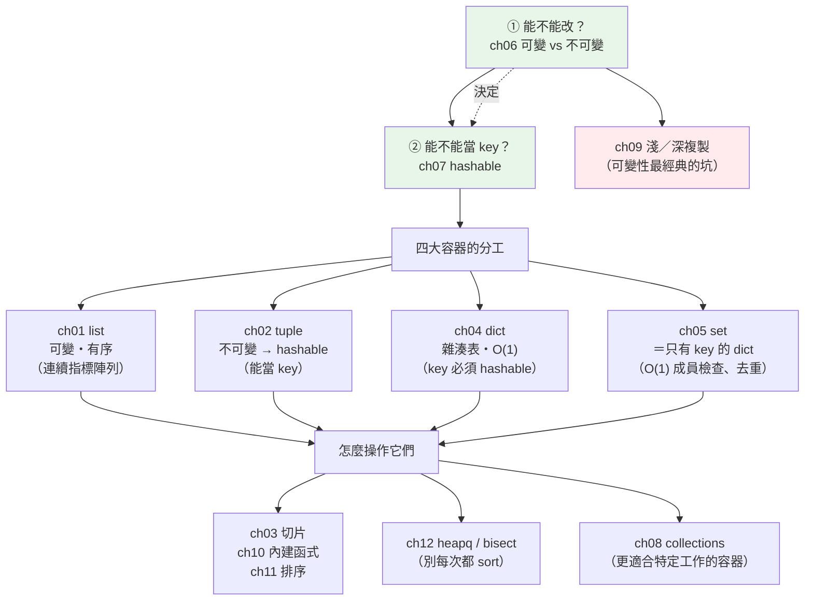

# Part 3 統整：資料結構全貌

> 把這 12 章串成一張圖——四個容器、兩個問題：**「能不能改？」** 和 **「能不能當 key？」**

## 🗺️ 知識地圖（這 12 章怎麼串起來）

Part 3 看起來是「介紹四個容器」，但真正的主線只有**兩個問題**——
而 [ch06 可變性](06-mutability.md) 自己就說了：**這是貫穿 Python 的一條主線**。



**一句話串起來**：

**「能不能改」（ch06）決定了「能不能當 key」（ch07）**——
因為 dict 用**雜湊值**定位，而**會變的東西算出來的雜湊值也會變**，
放進去就再也找不到了。所以 Python 乾脆規定：**可變的物件不可 hash**。

這一條規則，直接推導出四大容器的分工：
`list` 可變（所以不能當 key）、`tuple` 不可變（所以可以）、
`dict` 的 key 必須 hashable、`set` 就是「只有 key 的 dict」。

而「可變」帶來的最經典災難，就是 [ch09 淺複製](09-copy-shallow-deep.md)——
「我明明複製了一份，怎麼改副本也改到原本？」

其餘章節（ch03 切片、ch10 內建函式、ch11 排序、ch12 heapq/bisect、ch08 collections）
是**操作這些容器的工具箱**。

## ⚡ 速查表（什麼情境用什麼）

| 情境 | 用什麼 | 章節 |
|------|--------|------|
| 一串會變動的資料 | `list` | [ch01](01-list.md) |
| 一筆固定結構的紀錄（座標、資料庫的一列） | `tuple`（順便獲得 hashable） | [ch02](02-tuple.md) |
| **反覆檢查「在不在裡面」** | **`set`**（O(1)）——**別用 `list`**（O(n)） | [ch05](05-set-frozenset.md) |
| 去重（不在乎順序） | `set(items)`；要保留順序用 `dict.fromkeys(items)` | [ch05](05-set-frozenset.md)、[ch04](04-dict.md) |
| key → value 的對應 | `dict`（平均 O(1)，3.7+ 保證插入順序） | [ch04](04-dict.md) |
| 計數（哪個字出現最多次） | `collections.Counter` | [ch08](08-collections-module.md) |
| 分組（把資料依 key 分堆） | `collections.defaultdict(list)` | [ch08](08-collections-module.md) |
| 兩端都要進出（佇列、滑動視窗） | `collections.deque`（兩端 O(1)；`list.pop(0)` 是 O(n)） | [ch08](08-collections-module.md) |
| 取序列的一段／反轉／隔一個取 | 切片 `seq[a:b:step]`；反轉 `seq[::-1]` | [ch03](03-slicing.md) |
| 依多個條件排序 | `sorted(xs, key=lambda x: (x.a, -x.b))`（tuple 多鍵） | [ch11](11-sorting.md) |
| 要索引又要元素 | `enumerate(xs)`（**別寫 `range(len(xs))`**） | [ch10](10-builtin-functions.md) |
| 兩條序列並排走 | `zip(a, b)` | [ch10](10-builtin-functions.md) |
| **一直要拿「目前最小的」** | `heapq`（O(log n)）——**別每次 `sort()`** | [ch12](12-heapq-bisect.md) |
| 取前 K 大／小 | `heapq.nlargest(k, xs)`（勝過 `sorted(xs)[:k]`） | [ch12](12-heapq-bisect.md) |
| 在**已排序**序列裡找插入點 | `bisect`（二分搜尋 O(log n)） | [ch12](12-heapq-bisect.md) |
| 複製巢狀資料（list of list） | **`copy.deepcopy`**——淺複製會共用內層！ | [ch09](09-copy-shallow-deep.md) |

## 🔑 核心心智模型（帶得走的幾句話）

- **「可變 → 不可 hash」是一條因果鏈，不是兩條無關的規定。**
  dict 靠雜湊值定位；東西一變，雜湊值就變，原本放進去的位置就找不到了。
  所以 Python 直接禁止：**可變物件不可 hash，也就不能當 dict 的 key／放進 set**。
- **`set` 和 `dict` 是同一個東西的兩張臉**——都是雜湊表。
  `set` 就是「只留 key、不要 value 的 dict」。這解釋了為什麼它們的成員檢查都是 O(1)、
  為什麼元素都必須 hashable。
- **`list` 是「連續的指標陣列」。** 所以尾端 `append`/`pop` 快（O(1)），
  但**頭部插入／刪除要搬動全部元素**（O(n)）——需要雙端進出就用 `deque`。
- **淺複製只複製「最外層那個殼」。** 內層的可變物件**還是同一個**。
  `copy.copy` 給你新殼、舊內容；`copy.deepcopy` 才是連內容一起複製。
- **`in` 的成本天差地遠**：`list` 是逐一掃描（O(n)），`set`/`dict` 是雜湊查找（O(1)）。
  **迴圈裡要反覆查成員，先轉成 `set`**——這是最高 CP 值的一行優化
  （同一個道理在 [Part 15 索引](../15-database/21-indexing.md) 又會出現）。

## 🛠️ 小實作：一條主線走完 Part 3

這支腳本沿著**可變性 → hashable → 複製 → 效能**這條主線，把 Part 3 的核心一次串起來。

```python
# data_structures_demo.py —— Part 3 的主線：可變性 → hashable → 複製 → 效能
from __future__ import annotations

import copy
import time


def hashable_rule() -> tuple[str, str]:
    """ch06 可變性 → ch07 hashable：會變的東西不能當 key。"""
    ok = {("台北", "信義區"): 1}          # tuple 不可變 → hashable → 能當 key
    try:
        {["台北", "信義區"]: 1}           # list 可變 → unhashable → 直接 TypeError
    except TypeError as exc:
        return str(next(iter(ok))), str(exc)
    return "", ""


def shallow_vs_deep() -> tuple[list[int], list[int]]:
    """ch09：淺複製只複製最外層的殼，內層仍然共用同一個物件。"""
    original = [[1, 2], [3, 4]]
    shallow = copy.copy(original)      # 新的外殼，內層還是同一批 list
    deep = copy.deepcopy(original)     # 連內層也複製
    original[0].append(99)             # 改「原本」的內層
    return shallow[0], deep[0]


def membership_speed(n: int = 100_000) -> tuple[float, float]:
    """ch01 list（線性掃描）vs ch05 set（雜湊查找）。"""
    data = list(range(n))
    data_set = set(data)
    target = n - 1                     # 最壞情況：藏在最後一個

    start = time.perf_counter()
    _ = target in data                 # O(n)：從頭掃到尾
    list_time = time.perf_counter() - start

    start = time.perf_counter()
    _ = target in data_set             # O(1)：算一次雜湊就到
    set_time = time.perf_counter() - start
    return list_time, set_time


def multi_key_sort() -> list[tuple[str, int]]:
    """ch11：多鍵排序——先依部門（升冪），再依年齡（降冪）。"""
    people = [("工程", 30), ("業務", 25), ("工程", 25), ("業務", 35)]
    return sorted(people, key=lambda person: (person[0], -person[1]))


def demo() -> None:
    key, err = hashable_rule()
    print("【ch06 可變性 → ch07 hashable】")
    print(f"  tuple 當 key: {key}  ✅")
    print(f"  list  當 key: TypeError: {err}")

    shallow, deep = shallow_vs_deep()
    print("\n【ch09 淺複製 vs 深複製】改了原本的內層 list 之後：")
    print(f"  淺複製看到: {shallow}   ← 被改到了！（內層共用同一個物件）")
    print(f"  深複製看到: {deep}       ← 不受影響")

    list_time, set_time = membership_speed()
    print("\n【ch01 list vs ch05 set】在 10 萬筆裡找「最後一個」：")
    print(f"  list 的 in: {list_time * 1e6:8.1f} µs  （逐一掃描 O(n)）")
    print(f"  set  的 in: {set_time * 1e6:8.1f} µs  （雜湊查找 O(1)）")

    print("\n【ch11 多鍵排序】先依部門，再依年齡降冪：")
    print(f"  {multi_key_sort()}")


if __name__ == "__main__":
    demo()
```

**預期輸出**（時間依機器而異，但**量級差距**會很穩定）：

```pycon
$ python data_structures_demo.py
【ch06 可變性 → ch07 hashable】
  tuple 當 key: ('台北', '信義區')  ✅
  list  當 key: TypeError: unhashable type: 'list'

【ch09 淺複製 vs 深複製】改了原本的內層 list 之後：
  淺複製看到: [1, 2, 99]   ← 被改到了！（內層共用同一個物件）
  深複製看到: [1, 2]       ← 不受影響

【ch01 list vs ch05 set】在 10 萬筆裡找「最後一個」：
  list 的 in:    447.2 µs  （逐一掃描 O(n)）
  set  的 in:      0.9 µs  （雜湊查找 O(1)）

【ch11 多鍵排序】先依部門，再依年齡降冪：
  [('工程', 30), ('工程', 25), ('業務', 35), ('業務', 25)]
```

**四個輸出，一條主線**：

- `list` 不能當 key，**因為它可變**——這不是為難你，是雜湊表的物理限制。
- 淺複製「被改到」，**也是因為內層那個 list 可變**且被共用。
- `set` 快了數百倍，**因為它是雜湊表**——而能進雜湊表的前提，正是 hashable。
- 多鍵排序用 **tuple** 當 key（`(部門, -年齡)`）——tuple 天生可比較，正好派上用場。

## ✅ 自測清單（答不出來就回去讀）

- [ ] 為什麼 `list` 不能當 dict 的 key，`tuple` 卻可以？（[ch06](06-mutability.md)、[ch07](07-hashable.md)）
- [ ] hashable 的物件必須同時遵守 `__hash__` 和 `__eq__` 的什麼契約？（[ch07](07-hashable.md)）
- [ ] `set` 和 `dict` 在底層是什麼關係？（[ch05](05-set-frozenset.md)、[ch04](04-dict.md)）
- [ ] `list.append` 是 O(1)，那 `list.insert(0, x)` 是多少？為什麼？（[ch01](01-list.md)）
- [ ] `copy.copy` 和 `copy.deepcopy` 差在哪？什麼時候一定要用 deepcopy？（[ch09](09-copy-shallow-deep.md)）
- [ ] `seq[::-1]` 在做什麼？`seq[1:5]` 包含 index 5 嗎？（[ch03](03-slicing.md)）
- [ ] 要排序「先依 A 升冪、再依 B 降冪」，`key` 怎麼寫？（[ch11](11-sorting.md)）
- [ ] 什麼時候該用 `deque` 而不是 `list`？（[ch08](08-collections-module.md)）
- [ ] 要一直取出「目前最小值」，為什麼不該每次都 `sort()`？（[ch12](12-heapq-bisect.md)）
- [ ] `enumerate` 和 `zip` 各解決什麼問題？（[ch10](10-builtin-functions.md)）

## 🎯 面試速查

| 考點 | 面試官想聽到什麼 | 章節 |
|------|------------------|------|
| **`list` vs `tuple` 差在哪？** | 「`list` 可變、`tuple` 不可變。但重點不只是『不能改』——**不可變帶來 hashable**，所以 tuple 能當 dict 的 key、能放進 set。語意上 tuple 代表『一筆固定結構的紀錄』。」 | [ch02](02-tuple.md) |
| **為什麼 `list` 不能當 dict 的 key？** | 「dict 靠**雜湊值**定位。`list` 可變，改了之後雜湊值就變，原本存放的位置就再也找不到了——所以 Python 規定**可變物件不可 hash**。這是一條因果鏈，不是任意規定。」 | [ch07](07-hashable.md) |
| **dict 的底層？時間複雜度？** | 「**雜湊表**。平均 O(1) 的查找／插入／刪除，最壞 O(n)（大量雜湊碰撞）。3.7 起**保證保留插入順序**（3.6 是實作細節）。」 | [ch04](04-dict.md) |
| **`in` 對 list 和 set 的差別？** | 「`list` 是**逐一比對** O(n)；`set`／`dict` 是**雜湊查找** O(1)。所以迴圈裡反覆查成員，**先把 list 轉成 set**——這是最常見也最有效的一行優化。」 | [ch05](05-set-frozenset.md) |
| **淺複製 vs 深複製？** | 「淺複製只建**新的外層容器**，內層元素**仍是同一批物件**——所以改內層會同時影響兩邊。深複製會遞迴複製所有層。巢狀可變資料一定要 `deepcopy`。」 | [ch09](09-copy-shallow-deep.md) |
| **`sort()` vs `sorted()`？** | 「`list.sort()` **原地排序、回傳 `None`**，只有 list 有；`sorted()` **回傳新的 list**，接受任何 iterable。兩者都是**穩定排序**（相同 key 保持原順序）——這正是能做多鍵排序的基礎。」 | [ch11](11-sorting.md) |
| **要取前 K 大，怎麼做最有效率？** | 「`heapq.nlargest(k, xs)`——**O(n log k)**，勝過 `sorted(xs)[:k]` 的 O(n log n)。因為它只維護一個大小為 k 的堆積，不必把全部排好。」 | [ch12](12-heapq-bisect.md) |

---

🎉 **恭喜完成 Part 3！** 你已經掌握 Python 的四大容器——
更重要的是，你握住了那條主線：**「能不能改」決定了「能不能當 key」**。

接下來 [Part 4 物件導向](../04-oop/README.md) 要問一個新問題：
**如果一切皆物件，那「物件」本身是怎麼被造出來的？**
你會看到 `__hash__`、`__eq__` 這些在本 Part 出現過的魔術方法，
其實是 Python 物件模型的冰山一角。

➡️ 下一 Part：[物件導向 OOP](../04-oop/README.md)

[⬆️ 回 Part 3 索引](README.md)
